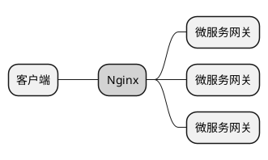

# 3.分布式微服务架构设计(二)

## 3.7 微服务网关

网关在任何系统架构中都是一个很重要的组件，它位于客户端与服务端之间，可以将其想象成一道闸门，所有的客户端请求都要从此门经过。因此，网关就具有很大的权利，可以对这些请求进行各种限制。例如，控制访问流量、身份验证、日志记录、负载分流等。

网关与Nginx、LVS等负载软件有类似之处，但是本质却不相同。下面对网关的原理、功能、架构方式进行详细讲解。

### 3.7.1 网关的原理

微服务本身是一个网状调用结构，节点众多，但是每个服务都有对外(互联网)服务和对内(内网)服务的接口，如何将对外服务的接口开放出去呢?首先可以想到的就是把需要开放的服务部署到外网访问。

微服务的网关服务也属于一个微服务，只是它并不处理具体的业务逻辑，而是只负责反向代理其他微服务，网关和其他所有微服务一样都注册到注册中心上，所以它能感知到其他微服务的变化，并且支持客户端负载均衡。

Spring Cloud微服务中主要使用Zuul和Spring Cloud Gateway两种网关， Zuul为第一代网关，Spring Cloud Gateway为第二代网关。

### 3.7.2 网关的功能

网关具有接口限流、负载、缓存、加解密、请求和应答、日志记录、交易 统计分析、安全认证等非业务功能。同时，网关具有路由能力，可以根据路由规则选择服务的转发路径，十分灵活，这也是Nginx、LVS等软件无法做到的，它们只能起到缓存、限流、反向代理的部分作用。网关的8个功能详细说明如下。

- 身份验证和安全:识别每个资源的身份验证要求，并拒绝不满足身份认证的请求，提高系统的安全性，可以与认证中心、JWT、SSO等技术联合使用。

- 洞察和监测:网关可以获取到详细的请求和应答数据，以及响应时长等情况，因此可以更好地洞察服务状态，监测服务异常。

- 动态路由:可以根据需要将请求动态路由到不同的后端集群上，可以定制不同的路由规则。例如，某个服务10点到20点之间可以访问，其他时间关闭。

- 压力测试:可以利用网关调节客户端请求的数量，并逐渐增加后端集群的流量进行压力测试，以衡量服务性能。

- 服务限流:可以根据不同类型的请求，如按照目标服务、用户、IP地址等作为Key，进行流量分配，删除或拒绝超出限制的请求。详细的限流技术可参见2.1.11小节。

- 负载分配:网关可以根据负载策略进行客户端负载，将请求转发到不同的后端服务上。

- 静态资源代理:可以直接将静态资源放置在网关服务中，加快静态资源的访问速度，减轻后端服务的压力，同时可以对静态资源进行相应的权限控制。

- 多区域弹性:当有多个数据中心时，可以根据需要通过网关将请求发送至不同的区域中。

### 3.7.3 微服务网关与Nginx对比

微服务网关与Nginx存在部分功能重合，Nginx也可以作为网关使用，同样具有反向代理、负载均衡、访问限流、静态资源代理等能力，两者都可以进行编程以增强基本功能(Nginx可以使用Lua脚本进行编程)。但是，两者又存在很多的区别，应用场景也有所不同，主要总结为以下5点。

- 两者的负载方式不同，Nginx为服务端负载，微服务网关为客户端负载。

- 当增加或减少服务节点，变动IP地址或端口时，微服务网关不需要做出任何代码调整，因为这些信息可以从注册中心获取，而Nginx需要修改配置文件并重新加载。

- Nginx的应用场景更广，主要侧重点为反向代理、动静分离、负载均衡，可以在单体架构、集群架构、SOA架构、微服务架构中使用，而微服务网关只能在微服务架构中使用，因为网关要借助注册中心的能力。

- 虽然Nginx可以借助Lua脚本进行扩展，但是微服务网关可以进行更加深度的自定义开发。

- Nginx可以在四层和七层网络上进行负载，而微服务网关只能在七层网络上进行负载。

在微服务架构中，Nginx和微服务网关可以同时使用，形成多级负载架构，如下图所示。

Nginx对微服务网关进行反向代理，使微服务网关可以水平扩展。还可以在Nginx之前增加VIP、硬负载、LVS、HAProxy形成更为复杂的多级负载架构，用来支撑更高的并发请求。多级负载架构设计可参见`2.1.3`小节。

Nginx除了可以与微服务网关联合使用，还可以反向代理注册中心、配置中心服务，提高系统的可用性。

### 3.7.4 正确的网关架构

推荐的网关架构：为外网客户端调用设立单独的外网网关，为内网客户端调用设立单独的内网网关。形成内外网隔离架构，外网网关只提供能够暴露到互联网上的接口，内网网关只提供能够在内网调用的接口。

这样做的好处有以下两点。

**(1)安全性更高**:暴露在外网的接口比较容易受到各种不法攻击，如果将内网的接口也暴露到互联网上是十分危险的。因此，外网网关要严格区分所代理的接口是否能够开放到互联网上。

**(2)隔离性更好**:如果内外网共用同一个网关就会产生相互影响，外网请求量过大就会影响内网的服务调用，反之亦然。如果网关出现故障就会同时影响内外网服务，而两个网关可以对故障进行有效的隔离。

## 3.8 配置中心

微服务代表更细粒度的拆分，各个服务都有自己的配置文件(如Spring Boot的yml或properties文件)，这些配置文件需要在项目启动时加载，或者在程序的运行过程中被加载。一旦文件发生变化，就代表着所有的微服务都需要重启，不能够动态地修改参数值。如果是传统的烟囱式架构或粗粒度SOA架构，重启还是可以接受的，但是对于庞大的微服务架构，节点数量众多，重启就会十分麻烦。因此，微服务架构将所有的配置抽象为一个服务，称为配置中心。

配置中心也是一个微服务，与其他服务一样在启动时会发送注册请求到注册中心。其他微服务与配置中心建立连接，在启动或运行时从配置中心拉取配置文件信息，放置在内存中。

配置中心多环境支持架构：服务A、B启动时分别加载不同的配置文件(服务A加载A-dev.yml开发环境文件，服务B加载B-prod.yml生产环境文件)。 配置中心支持多环境配置文件，例如，可以将开发、生产、测试 配置文件放在配置中心中管理，在程序启动时指定激活哪个环境，则自动拉取该环境的文件。

配置中心主要带来如下3点好处。

**(1)集中管理**:通过这种方式可以实现所有的配置文件集中管理，当修改配置后能够实时生效，不需要再到每个微服务中逐一修改，再逐一发布。还可以很方便地对配置文件进行版本控制。

**(2)配置安全**:能够增强系统配置的安全性。例如，将数据库用户名、密码都放在程序的配置文件中，所有人都可以使用，而放置在配置中心中，通过权限管理，只有管理员才可以查看和修改。

**(3)动态调整**:可以动态调整系统参数并实时生效，如随时开启和关闭日志等。

主流的配置中心组件有Nacos、Spring Cloud Config、Consul、Apollo、 XDiamond、Qconf、Disconf等。其中Nacos和Consul已经将注册中心与配置中心合并为同一个服务，这也是一种发展趋势。

### 3.9 微服务监控

微服务架构引入的一个首要问题就是运维问题，由于服务节点众多，怎样才能监控所有微服务节点的运行状况成为一个难题，开发或运维人员不可能再按照传统的方式登录到每个服务器去观察问题。

通过注册中心可以感知到整个微服务的所有节点，只要每个微服务都提供相应的监控接口即可。例如，Spring Boot Actuator提供了大量的监控端点 (接口)，可以针对内存、CPU、环境变量、GC、线程等进行全方位的监控。

在Spring Boot 1.x项目下访问/env接口，在Spring Boot 2.x项目下访问 `actuatorenv` 接口，就可以查询项目的各种环境信息，包括系统环境变量、项目配置文件、默认参数、系统属性、系统端口配置等内容，

Spring Boot Actuator的监控端点主要分为以下三大类。
- 应用配置类:获取应用程序中加载的应用配置、环境变量、自动化配置报告等与Spring Boot应用密切相关的配置类信息。

- 度量指标类:获取应用程序运行过程中用于监控的度量指标，如内存信息、线程池信息、HTTP请求统计、GC垃圾收集等。

- 操作控制类:提供了对应用的关闭、修改日志级别等操作类功能。

如果使用Spring Cloud微服务体系，则可以使用Spring Boot Admin作为 监控工具，只需要接入注册中心，就可以对整个微服务集群进行监控，无任何侵入性，部署和使用都十分方便(2.x版本支持中文)。可以针对每个微服务的内存、线程、GC、CPU、JVM、环境信息、配置信息等进行全方位的监控。

**设计思考:监控系统设计的核心是什么?**

监控系统一般采用推模式(Push Model)、拉模式(Pull Model)或混合模式(Mix Model)。

监控系统推模式架构：由监控系统提供服务接口，各个系统采用定时异步的方式向监控系统主动上报自己的运行状况，包括自己的磁盘、 内存、CPU、I/O、GC、线程等各方面情况。监控系统收到之后会进行记录、整理、分析，最后以图表、仪表盘等形式展现出来。

监控系统拉模式架构：与推模式正好相反，由各服务节点提供接口，由监控系统采用定时异步的方式主动调用各系统的监控接口，获取各节点的运行状况，与Spring Boot Admin和Spring Boot Actuator的组合模式相同。

混合模式就是同时采用推模式和拉模式的组合。

## 3.10 分布式链路追踪

分布式服务的典型特点是调用关系复杂，用户发起的一次请求可能经过一系列相关的服务调用才能完成整个业务，具体的调用链路是什么，每个微服务处理的时间有多长，哪个链路快，哪个链路慢，哪个服务节点是业务瓶颈，这些很难去分析和判断。因此，微服务需要一个重要的能力就是链路追踪能力。

**设计思考:链路监控的核心设计是什么?**

TraceID链式传递设计，对于任何需要追踪整体链路的业务，都需要设计一个唯一的TraceID，采用逐级传递，逐级记录的方式。一般TraceID要放在整个交易报文的头部，或者HTTP的Header中。

不只是在远程调用过程中，在本地程序调用过程中也可以采用这种记录方式，从而形成一个调用树结构，每个节点的耗时都可以一目了然。

每个方法、每个服务的调用过程都可以构建成一棵调用链路树，每个方法或服务都是树上的一个节点，如图3-42所示，都可以分配一个SpanID (S01,S02,...,S06)作为方法或服务的标识(代表一个运行区间)，以 ParentSpanID代表该父方法或服务(调用者)。

## 3.11 大型互联网微服务架构

大型互联网系统架构必须支持高可用、高伸缩、高并发、安全性的特性。

- 四层负载:使用CDN、硬负载、Nginx集群、网关集群组成四层负载架构，有效保证超高并发和海量请求可以进来。CDN保证静态资源的加载速度，同时不让过多的流量涌入占用大量带宽资源;硬负载将流量负载到Nginx集群;Nginx集群将请求继续负载分发给网关集群;网关集群将请求继续负载分发给上游服务。

- 限流降级:在系统承压巨大的情况下可以在Nginx和网关层进行服务限流和API降级、熔断，保证系统的可用性，避免出现雪崩现象。

- Nginx负载:可以在Nginx前面再部署LVS或HAProxy增加一层负载，进一步提升请求接入能力，也可以将Nginx替换为LVS或HAProxy。

- 网关集群:网关可以使用Zuul或Spring Cloud Gateway搭建集群，Spring Cloud Gateway的性能更高，网关层可以通过Hystrix、Sentinel做限 流、熔断、服务降级。

- 注册中心:可以使用Nacos、Consul、Eureka、Zookeeper等软件搭建，保证高可用。

- 配置中心:可以使用Spring Cloud Config组件配合Git或SVN搭建，也可以使用Nacos、Consul等软件搭建。

- 监控系统:可以使用Spring Boot Admin搭建监控服务，由于没有访问压力，因此也可以部署单节点。

- 链路分析、交易采样:可以使用SkyWalking、Zipkin、Pinpoint等软件搭建。

- 日志收集:可以使用Elastic Stack搭建，包含Filebeat、Kafka、Logstash、Elasticsearch、Kibana等，可参见6.8节。

- 微服务节点:每个微服务都按照一定的领域进行拆分，每个微服务都对应自己独立的关系型数据库。

- 数据库:数据库要提前预估数据量，做好分库分表设计。以关系型数据库为主，以MongoDB、Redis、Elastic、HBase等数据库为辅。

也可以换个角度来理解一下微服务的分层架构，微服务架构从上到下可以 分为客户层、负载层、网关层、业务层、中间件层。

- 客户层:Web、iOS、安卓、小程序等各种客户端，以互联网方式访 问微服务。

- 负载层:利用F5等硬负载设备，HAProxy、Nginx等软负载设备，DNS 域名解析等对海量的互联网请求进行多级负载和静态资源缓存。

- 网关层:对客户端请求进行限流、降级、安全控制、日志记录、加解密、反向代理、交易路由、交易负载等一系列处理。

- 业务层:负责具体系统业务的处理、外联服务的接入，以及微服务的治理。

- 中间件层:提供数据库、消息队列、缓存、文件存储等一系列存储和消息服务。

- 服务治理区:如图3-44所示，服务治理区包含了微服务架构的重要支撑服务，如注册中心、配置中心、服务监控、链路追踪、日志收集等，网关层和业务层都要与服务治理区紧密连接。

- 外联服务区:如图3-44所示，外联服务区主要指系统所对接的支付宝、微信等第三方服务，与当前微服务系统存在相互的调用关系。

## 3.12 微服务改造的六大原则

很多企业一开始并没有使用微服务架构，而是需要从传统架构演变到微服务架构，在进行微服务改造的过程中要遵循六大原则。

### 1. 不要为了使用微服务而使用

有些公司不考虑实际的业务场景和用户规模，一律采用微服务架构开发，目的只有一个，就是让自己的系统看起来高端而已。对于一些中小企业的内部管理系统，用户数量较少，业务也不复杂，变化极少，这时采用单体架构可能是一种更加简单高效的做法。

### 2. 不要妄想完美架构，要用进化的眼光看架构

要清楚地认识到不存在完美的设计和架构，很多人在系统设计初期就希望考虑到所有问题，把系统设计得极其庞大、复杂，尽量地去除所有的耦合，导致前期开发投入巨大。但是，随着业务的发展，发现业务量根本没那 么大，或者架构依然要进行很多的改造。淘宝网早期也是单体架构，一个WAR包支持所有服务，经过十来年的不断演进才形成了分布式微服务架构，好的架构是不断迭代、升级、改造出来的，而不是一蹴而就建造出来的。

### 3. 微服务拆分没有绝对的标准

把每个接口作为一个微服务，或者把10个接口作为一个微服务，或者按照代码量拆分，多少行代码拆分为一个微服务。在笔者看来这种做法是不妥的，应该按照业务高内聚、低耦合的原则，先按照领域进行划分，再按照业务量进行划分。例如，一个电商系统可以拆分为用户、产品、库存、支付几个微服务，如果业务量较大，则可以继续拆分，如支付服务可以继续拆分为集团支付、个人支付、对公支付、对私支付、单笔支付、批量支付等微服务。

### 4. 不要忽略非功能设计

例如，交易统计、埋点分析、日志收集、链路追踪等，由于这些设计并不会影响业务的正常流转，所以经常被忽略。随着业务复杂性不断升高，微服务数量不断上升，交易链路变得越来越复杂。当要排查一些问题时，我们就会变得十分被动和痛苦。例如，淘宝的一次下单交易，涉及两百多个微服务的相互协作，如果没有完整的链路跟踪、日志记录、交易分析的工具，则是不可想象的。一次交易涉及五六个服务协作，开发人员就很难记忆了，更何况这种交易很多，完全靠人脑和文档记忆是不现实的。

### 5. 环境网络隔离、权限隔离

使用微服务的好处是只要服务注册到注册中心上，就可以被其他服务感知到，就可以提供服务。如果因为误操作导致把测试环境的微服务注册到了生产的注册中心上，就会导致生产数据落地测试环境，后果十分严重，相反生产环境注册到测试环境，也需要隔离。

### 6. 重视容器化持续集成和部署

一旦大面积应用微服务架构就会面临服务节点快速增加，依赖关系复杂的问题。进行系统发布时就不单单只是一个WAR包的问题了，而是需要考虑先发布哪个节点，后发布哪个节点，如何进行自动化编译、打包、测试、发 布，因此容器化持续集成和部署就变得至关重要。
