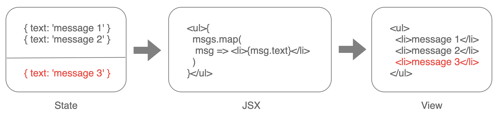
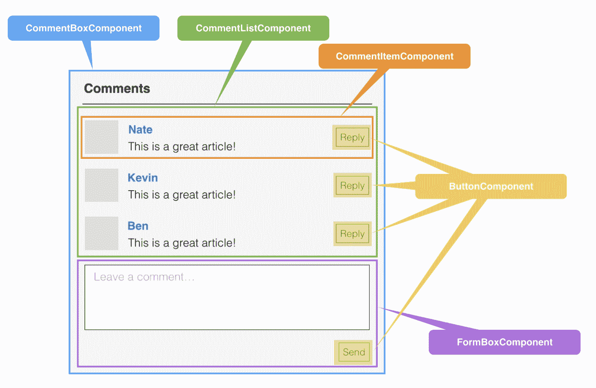
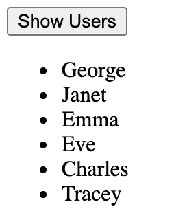

# React 的颠覆式创新

React 的中文含义是“反应”或“响应”，它描述了 React 这样一个前端框架的核心原理：**当数据发生变化时，UI 能够自动把变化反映出来**。这在 React 当时出现的背景之下，可以说是**一个颠覆式的创新**。

在 2013 年 React 出现之时，主流的开发 UI 的方式仍然是基于浏览器 DOM 的 API，去精细地控制 DOM 节点的创建、修改和删除。为了保证 UI 上的一致性，我们需要非常小心地处理因各种数据的变化而导致的 UI 的变化。

在 React 之前，我们需要调用 DOM 的 API 来修改 DOM 树的结构，从而改变 UI 的展现。而在有了 React 之后，我们只需要在业务状态和 UI 状态之间建立一个绑定的关系就行了。绑定完成后，我们就不需要再关心怎么去精细控制 UI 的变化，因为 React 会在数据发生变化时，帮助我们完成 UI 的变化。



我们可以通过 JSX 语法，用声明式的方式来描述数据和 UI 之间的关系，那么数据在发生变化时，UI 也会自动发生变化。这样的话，无论是收到一条还是多条消息，React 都会自动完成 UI 的展现，我们也就不再需要去关心怎么产生变化的细节。那么基于同一个数据，比如我们需要在通知栏里显示消息的数量，那么显示消息数量的组件，只需要绑定到消息的长度上，它也会自动更新，这样很容易就保证 UI 上的一致性了。

---

# 理解 React 的基本概念

React 本身其实是一个非常简单的框架，要理解它的用法，无外乎就是理解下面三个概念：组件、状态和 JSX。

## 使用组件的方式描述 UI

在 React 中，所有的 UI 都是通过**组件**去描述和组织的。可以认为，React 中所有的元素都是组件，具体而言分为两种。

1. 内置组件。内置组件其实就是**映射到 HTML 节点的组件**，例如 div、input、table 等等，作为一种约定，它们都是小写字母。
2. 自定义组件。自定义组件其实就是**自己创建的组件**，使用时必须以大写字母开头，例如 TopicList、TopicDetail。

和 DOM 的节点定义类似，React 组件是以**树状结构**组织到一起的，一个 React 的应用通常只有一个根组件。此外，在实际开发时，我们会把 UI 划分成不同的组件，然后组织到一起，例如对于下面这样一个评论框的 UI：



我们可以用基于组件的方式去描述：

``` jsx
function CommentBox() {  
  return (  
    <div>  
      <CommentHeader />  
      <CommentList />  
      <CommentForm />  
    </div>  
  );  
}
```

比如说评论框可以分为三个部分，包括头部、评论的列表和一个用于提交新的评论的表单，这样我们就可以把这三个部分分别定义成组件，让我们可以根据实际的场景把复杂的 UI 模块化为独立的组件。这样代码不仅看起来更加直观，而且也更容易维护。

## 使用 state 和 props 管理状态

React 的核心机制是能够在数据发生变化的时候自动重新渲染 UI，这个保存状态的机制就是 state。而 props 就是类似于 Html 标记上属性的概念，是为了在父子组件之间传递状态。在函数组件中，我们可以使用 `useState` 这样一个 `Hook` 来保存状态，那么状态在发生变化时，也会让 UI 自动发生变化。比如下面这段代码，展示了一个简单计数器的实现的例子：

``` jsx
import React from "react";  
  
export default function Counter() {  
  const [count, setCount] = React.useState(0);  
  return (  
    <div>  
      <button onClick={() => setCount(count + 1)}>{count}</button>  
    </div>  
  );  
}
```

可以看到，通过 `useState` 定义这样一个状态，让这个状态来保持计数器的数值，那么在值发生变化时，组件就会自动重新刷新。

接下来要关心的就是组件之间的交互，这正是 `props` 提供的作用。无论是 div、span 这样的内置组件，还是自定义组件，都可以在使用时把接收属性作为参数。而当这个参数发生变化时，组件也就会自动重新渲染。

例如，我们在计数器这个例子中使用一个组件来渲染 count 这个值，要求在值大于 10 的时候显示为红色，否则就为蓝色：

``` jsx
import React from "react";  
  
function CountLabel({ count }) {  
  // 子组件用于显示颜色  
  const color = count > 10 ? "red" : "blue";  
  return <span style={{ color }}>{count}</span>;  
}  
  
export default function Counter() {  
  // 定义了 count 这个 state  
  const [count, setCount] = React.useState(0);  
  
  return (  
    <div>  
      <button onClick={() => setCount(count + 1)}>  
        <CountLabel count={count} />  
      </button>  
    </div>  
  );  
}
```

可以看到，我们定义了一个新的组件 `CountLabel`，在值大于 10 的时候显示红色，否则为蓝色。并且，我们还要在 `Counter` 组件里使用 `CountLabel` 这个子组件，这样的话我们就可以通过 props 把 count 这个值从父组件传递到子组件，那么在 count 发生变化时，CountLabel 也会重新渲染。此外，所有通过属性定义在这个 Tag 上的参数，都会作为一个对象传递给函数组件，这样在函数组件内部就可以使用这些参数了。

## 理解 JSX 语法的本质

如果你之前没有接触过 React，也许会觉得在代码中同时包含 JavaScript 和 HTML 标记的写法很别扭。但这种写法其实正是 React 中的“模板语言”：`JSX`。

注意，这里的“模板语言”是加了引号的，因为从本质上来说，JSX 并不是一个新的模板语言，而可以认为是一个**语法糖**。也就是说，不用 JSX 的写法，其实也是能够写 React 的。这是什么意思呢？我们不妨再看一下上面计数器的例子，如果不用 JSX 应该如何写代码：

``` javascript
React.createElement(  
  "div",  
  null,  
  React.createElement(  
    "button",  
    { onClick: function onClick() {  
        return setCount(count + 1);  
      } },  
    React.createElement(CountLabel, { count: count })  
  )  
);
```

在这段代码中，JSX 的部分我们是用 JavaScript 的方式去实现的，并且用到了 `React.createElement` 这样一个 API，它的作用就是创建一个组件的实例。此外，这个 API 会接收一组参数：

1. 第一个参数表示组件的类型；
2. 第二个参数是传给组件的属性，也就是 props；
3. 第三个以及后续所有的参数则是子组件。

所以呢，通过 createElement 这个 API，我们可以构建出需要的组件树，而 JSX 只是让这种描述变得更加直观和高效。所以我们说 JSX 其实是一种语法糖。理解这一点非常重要，因为它意味着两点：

1. JSX 的表达能力等价于 JavaScript 的表达能力，那么所有我们可能需要的机制，比如循环、条件语句等等，JSX 其实都能灵活表达。
2. JSX 几乎不需要学习，只要你会用 JavaScript，就也会用 JSX。

所以这也是 React 的“模板语言”区别于 Angluar 和 Vue 的地方，JSX 不是一个新的概念，而只是原生 JavaScript 的另一种写法。但是换成这种写法，就会大大降低你上手 React 的难度。

# 实战：在组件中发送请求并显示数据

设想这样一个场景：页面上有一个按钮，点击后，我们可以发起一个请求获取一个用户列表，并要求显示在页面上。在这个过程中，我们需要考虑数据状态，Loading 的状态，以及请求出错的处理。那么可以用下面的代码实现：

``` js
import React from "react";  
  
export default function UserList() {  
  // 使用三个 state 分别保存用户列表，loading 状态和错误状态  
  const [users, setUsers] = React.useState([]);  
  const [loading, setLoading] = React.useState(false);  
  const [error, setError] = React.useState(null);  
  
  // 定义获取用户的回调函数  
  const fetchUsers = async () => {  
    setLoading(true);  
    try {  
      const res = await fetch("https://reqres.in/api/users/");  
      const json = await res.json();  
      // 请求成功后将用户数据放入 state  
      setUsers(json.data);  
    } catch (err) {  
      // 请求失败将错误状态放入 state  
      setError(err);  
    }  
    setLoading(false);  
  };  
  
  return (  
    <div className="user-list">  
      <button onClick={fetchUsers} disabled={loading}>  
        {loading ? "Loading..." : "Show Users"}  
      </button>  
      {error &&   
        <div style={{ color: "red" }}>Failed: {String(error)}</div>
      }  
      <br />  
      <ul>  
        {users.length > 0 &&  
          users.map((user) => {  
            return <li key={user.id}>{user.first_name}</li>;  
          })}  
      </ul>  
    </div>  
  );  
}
```

程序的运行结果如下：



当点击 Show Users 按钮时，会显示 Loading 的文本，并将 button 设为 disabled。请求成功后，则显示获取的用户列表。如果请求失败，则显示一段错误信息的文本。

在 React 组件中，任何一个 state 发生变化时，整个函数组件其实是被完全执行一遍的，而且除了 state，多次的执行之间没有任何关系。所以在考虑这样一个场景的实现时，我们的思考方式就是要首先考虑这个组件有哪些状态（state），这些状态的变化是由什么触发的，从而将整个功能串联起来。

当然，这个例子只是一个最简单的实现，但如果你细究一下，应该还会提出下面的问题：

1. 函数中定义了回调函数 fetchUsers，但函数每次都是全部重新执行，那会不会重复定义很多次呢？
2. 如果另外一个组件可能也需要使用到 Users 这个数据，比如一个下拉框，那么是不是每次都要重复这个发起请求的逻辑呢？

这其实正是后面的课程会解决的问题，我在这里先简单回答下：

1. 是的，这种写法会重复定义很多函数。不过为了避免这样的问题，React 提供了 useCallback 这样一个 Hook 来缓存回调函数，关于这一问题，我在第 4 讲会有详细的讲解。
2. 对于异步请求逻辑的重用，这其实也意味着跨组件状态的重用，我会在第 7 讲利用 Redux 这样一个全局状态管理框架来实现异步逻辑的复用。

# 小结

React 本身其实是一个上手非常简单的 UI 框架，它的核心 API 在这节课我们基本都已经用到了，比如函数组件，JSX，useState，等等。但是 React 本身毕竟只是解决了 UI 的问题，在真正开发时，我们还需要路由、需要状态管理等等，这也正是后续课程中会介绍的。

不过也正是因为 React 本身的这种纯粹和简单，让它的整个生态圈变得非常繁荣。针对每一个具体的问题，可能都存在特定的解决方案。所以在实际使用中，我们需要根据具体的需求，来寻求最合适的方案。
