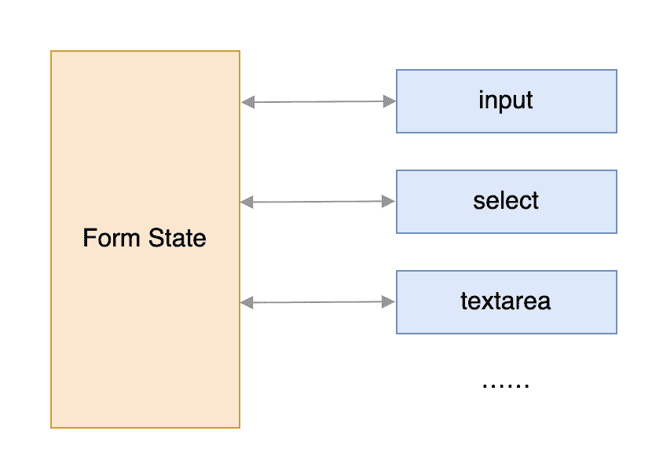

# Form：Hooks 给 Form 处理带来了哪些新变化？

表单作为用户交互最为常见的形式，但在 React 中实现起来却并没有那么容易。甚至可以说，使用表单，是 React 开发中最为困难的一部分。

主要有两方面的原因。一方面，React 都是状态驱动，而表单却是事件驱动，比如点击按钮、输入字符等，都是一个个离散的事件。因此，一般来说我们都需要将这些独立的事件转换成一定的应用程序状态，最终来完成表单的交互。

另一方面，表单元素一般都有自己的内在状态，比如原生的 input 节点就允许用户输入，这就需要我们在元素状态和表单状态之间做同步。

要能够很好地处理这些问题，我们首先需要对**表单的机制**有深入的理解，然后再从 **React Hooks 的角度去思考问题的解决方案**。

所以在今天这节课，我会从这三个方面来讲。

1. 首先，介绍 React 中使用表单的基本原理，帮助你理解受控组件和非受控组件的概念，以及各自的适用场景。
2. 然后看看 Hooks 出现后，给表单处理带来了哪些思路上的新变化。
3. 最后，我们会学习几个常见的开箱即用的 React 表单解决方案，让你在理解实现原理的基础上，可以选择最适合自己的开源方案。

## 在表单中使用 React 组件：受控组件和非受控组件

在第 8 讲，我简单介绍了受控组件和非受控组件的概念。虽然在一般情况下，表单中的元素都是受控组件。也就是说，一个表单组件的状态完全由 React 管控。但是在有的时候，为了避免太多的重复渲染，我们也会选择非受控组件。

所以今天这节课，我们就来看下这两种形式在 React 中分别该怎么实现，并了解它们的优缺点以及适用场景。

首先我们来看下受控组件应该如何使用。下面的例子展示了受控组件的用法：

``` jsx
function MyForm() {  
  const [value, setValue] = useState('');  
  const handleChange = useCallback(evt => {  
    setValue(evt.target.value);  
  }, []);  
  return <input value={value} onChange={handleChange} />;  
}
```

可以看到，输入框的值是由传入的 value 属性决定的。在 onChange 的事件处理函数中，我们设置了 value 这个状态的值，这样输入框就显示了用户的输入。

需要注意的是，React 统一了表单组件的 onChange 事件，这样的话，用户不管输入什么字符，都会触发 onChange 事件。而标准的 input 的 onchange 事件，则只有当输入框失去焦点时才会触发。React 的这种 onChange 的机制，其实让我们对表单组件有了更灵活的控制。

不过，受控组件的这种方式虽然统一了表单元素的处理，有时候却会产生性能问题。因为用户每输入一个字符，React 的状态都会发生变化，那么整个组件就会重新渲染。所以如果表单比较复杂，那么每次都重新渲染，就可能会引起输入的卡顿。在这个时候，我们就可以将一些表单元素使用非受控组件去实现，从而避免性能问题。

所谓**非受控组件**，就是表单元素的值不是由父组件决定的，而是**完全内部的状态**。联系第 8 讲提到的唯一数据源的原则，一般我们就不会再用额外的 state 去保存某个组件的值。而是在需要使用的时候，直接从这个组件获取值。

下面这段代码演示了一个非受控组件应该如何使用：

``` jsx
import { useRef } from "react";  
  
export default function MyForm() {  
  // 定义一个 ref 用于保存 input 节点的引用  
  const inputRef = useRef();  
  const handleSubmit = (evt) => {  
    evt.preventDefault();  
    // 使用的时候直接从 input 节点获取值  
    alert("Name: " + inputRef.current.value);  
  };  
  return (  
    <form onSubmit={handleSubmit}>  
      <label>  
        Name:  
        <input type="text" ref={inputRef} />  
      </label>  
      <input type="submit" value="Submit" />  
    </form>  
  );  
}
```

可以看到，通过非受控组件的方式，input 的输入过程对整个组件状态没有任何影响，自然也就不会导致组件的重新渲染。

不过缺点也是明显的，输入过程因为没有对应的状态变化，因此要动态地根据用户输入做 UI 上的调整就无法做到了。出现这种情况，主要也是因为所有的用户输入都是 input 这个组件的内部状态，没有任何对外的交互。

总结来说，在实际的项目中，我们一般都是用的受控组件，这也是 React 官方推荐的使用方式。不过对于一些个别的场景，比如对性能有极致的要求，那么非受控组件也是一种不错的选择。

## 使用 Hooks 简化表单处理

回顾我们对受控组件的处理，会发现对于每一个表单元素，其实都会遵循下面两个步骤：

1. 设置一个 State 用于绑定到表单元素的 value；
   
2. 监听表单元素的 onChange 事件，将表单值同步到 value 这个 state。

也就是说，我们可以用类似如下的代码来实现对受控组件的处理：

``` jsx
function MyForm() {  
  const [value1, setValue1] = useState();  
  const [value2, setValue2] = useState();  
  // 更多表单元素状态...  
    
  return (  
    <form>  
      <Field1 value={value1} onChange={setValue1} />  
      <Field1 value={value2} onChange={setValue2} />  
      {/*更多表单元素*/}  
    </form>  
  )  
}
```

可以看到，一个表单的整体状态正是有一个个独立表单元素共同组成的。那么下图就展示了这样一个关系，对于每一个表单元素都需要手动的进行 value 和 onChange 属性的绑定：



对于复杂的表单，这样的逻辑显然是比较繁琐的。但正如上图所示，维护表单组件的状态逻辑，核心在于三个部分：

1. 字段的名字；
   
2. 绑定 value 值；
   
3. 处理 onChange 事件。
   

既然对每个表单元素的处理逻辑都是一致的，那我们是不是可以用 Hooks 实现逻辑的重用呢？

答案是肯定的，主要的思想就是在这个 Hook 去维护整个表单的状态，并提供根据名字去取值和设值的方法，从而方便表单在组件中的使用。下面的代码演示了一个基本的实现：

```javascript
import { useState, useCallback } from "react";  

const useForm = (initialValues = {}) => {  
  // 设置整个 form 的状态：values  
  const [values, setValues] = useState(initialValues);  
    
  // 提供一个方法用于设置 form 上的某个字段的值  
  const setFieldValue = useCallback((name, value) => {  
    setValues((values) => ({  
      ...values,  
      [name]: value,  
    }));  
  }, []);  

  // 返回整个 form 的值以及设置值的方法  
  return { values, setFieldValue };  
};
```

有了这样一个简单的 Form，我们就不再需要很繁琐地为每个表单元素单独设置状态了。比如下面的代码就演示了该如何使用这样一个 Hook：

``` jsx
import { useCallback } from "react";  
import useForm from './useForm';  
  
export default () => {  
  // 使用 useForm 得到表单的状态管理逻辑  
  const { values, setFieldValue } = useForm();  
  // 处理表单的提交事件  
  const handleSubmit = useCallback(  
    (evt) => {  
      // 使用 preventDefault() 防止页面被刷新  
      evt.preventDefault();  
      console.log(values);  
    },  
    [values],  
  );  
  return (  
    <form onSubmit={handleSubmit}>  
      <div>  
        <label>Name: </label>  
        <input  
          value={values.name || null}  
          onChange={(evt) => setFieldValue("name", evt.target.value)}  
        />  
      </div>  
  
      <div>  
        <label>Email:</label>  
        <input  
          value={values.email || null}  
          onChange={(evt) => setFieldValue("email", evt.target.value)}  
        />  
      </div>  
      <button type="submit">Submit</button>  
    </form>  
  );  
}; 
```

那么，通过将表单状态管理的逻辑提取出来，使之成为一个通用的 Hook，这样我们就简化了在 React 中使用表单的逻辑。

虽然这看上去只是一个很简单的实现，但是基本上一些开源的表单方案都是基于这么一个核心的原理：**把表单的状态管理单独提取出来，成为一个可重用的 Hook**。这样在表单的实现组件中，我们就只需要更多地去关心 UI 的渲染，而无需关心状态是如何存储和管理的，从而方便表单组件的开发。

## 处理表单验证

当我们基于 Hooks 实现了一个基本的表单状态管理机制之后，现在，我们就要在这个机制的基础之上，再增加**一个表单处理必备的业务逻辑：表单验证**。

在考虑这个验证逻辑如何实现的时候，我们同样也是**遵循状态驱动这个原则**：

1. 首先：如何定义这样的错误状态；
2. 其次：如何去设置这个错误状态。

下面的代码演示了我们如何给已有的 useForm 这个 Hook 增加验证的 API 接口：

``` jsx
// 除了初始值之外，还提供了一个 validators 对象，  
// 用于提供针对某个字段的验证函数  
const useForm = (initialValues = {}, validators) => {  
  const [values, setValues] = useState(initialValues);  
  // 定义了 errors 状态  
  const [errors, setErrors] = useState({});  
  
  const setFieldValue = useCallback(  
    (name, value) => {  
      setValues((values) => ({  
        ...values,  
        [name]: value,  
      }));  
  
      // 如果存在验证函数，则调用验证用户输入  
      if (validators[name]) {  
        const errMsg = validators[name](value);  
        setErrors((errors) => ({  
          ...errors,  
          // 如果返回错误信息，则将其设置到 errors 状态，否则清空错误状态  
          [name]: errMsg || null,  
        }));  
      }  
    },  
    [validators],  
  );  
  // 将 errors 状态也返回给调用者  
  return { values, errors, setFieldValue };  
};
```

那么我们就可以在使用的时候传递下面的 validators 对象给 useForm 这个 Hook：

``` jsx
function MyForm() {  
  // 用 useMemo 缓存 validators 对象  
  const validators = useMemo(() => {  
    return {  
      name: (value) => {  
        // 要求 name 的长度不得小于 2  
        if (value.length < 2) return "Name length should be no less than 2.";  
        return null;  
      },  
      email: (value) => {  
        // 简单的实现一个 email 验证逻辑：必须包含 @ 符号。  
        if (!value.includes("@")) return "Invalid email address";  
        return null;  
      },  
    };  
  }, []);  
  // 从 useForm 的返回值获取 errors 状态  
  const { values, errors, setFieldValue } = useForm({}, validators);  
  // UI 渲染逻辑...  
}
```

这样，我们就将表单验证的逻辑也封装到了通用的 useForm 这个 Hook 中了。

虽然这个 API 只支持通过函数执行进行验证，但是，我们很容易扩展支持更多的类型，比如正则匹配、值范围等等。

总结来说，通过更丰富和更便捷的 API，就可以让验证逻辑的使用更加方便。这个例子完整的可运行代码你也可以通过文末的链接查看，下图显示了实际的执行效果。


## 常用的 React Form 框架

刚才我们介绍了在 React 中实现表单功能的基本原理，并自己动手实现了一个可重用的 Form 的状态管理机制。虽然看上去有点简单，但其实是完全可以在项目使用的。

不过呢，所有项目的表单处理总体来说都是类似的，自己动手实现，虽然可以更精确地满足项目需要，但也意味着有了额外的工作量。事实上，我们完全可以利用一些开源来实现，比如 antd, formik, react hook form 等等。

虽然各个框架 API 风格上有所差异，但是背后的原理都是类似的：**把表单的状态逻辑和 UI 展示逻辑基于 Hooks 进行分离**。

接下来，我就简单介绍三个比较主流的表单框架，让你对它们有一个总体的理解，知道他们的特性和优缺点，从而在做技术选型时可以有所参考。这些框架之间也没有绝对的优劣，你可以按照自己的喜好进行选择。

### Antd Form

在国内，蚂蚁金服的 Ant.Design 可以说是最主流的 React UI 库。作为面向重交互的企业级软件设计的 UI 库，其表单机制自然也非常强大。所以，如果你用 antd 作为 UI 库，那么几乎一定是使用其自带的表单管理功能了。

和其它表单框架的地方不同的地方就在于，antd 不仅实现了表单的状态逻辑管理，还提供了 UI 层的支持，比如表单如何布局，错误信息如何展示，等等。

当然，这也意味着 Antd Form 只能和 Antd 的 UI 库一起使用。Antd Form 最早是基于高阶组件实现状态逻辑的重用，在 Hooks 出现之后，也基于 Hooks 重构了 Form 的实现。项目的地址是：https://ant.design/components/form/。

### Formik

Formik 应该是最早将 React 中的 form 数据逻辑单独提取出来的表单框架，因此它也积累了大量的用户。而且，Formik 出现的时候还没有 Hooks，所以它其实利用的是 render props 设计模式实现了状态逻辑的重用。

典型的 Formik 代码如下：

``` jsx
import { Formik, Form } from 'formik';   
  
// ...  
<Formik  
  initialValues={{ email: '', password: '' }}  
  validate={values => { }}  
  onSubmit={(values, { setSubmitting }) => {}}  
>  
{({  
  values,  
  errors,  
  touched,  
  handleChange,  
  handleBlur,  
  handleSubmit,  
  isSubmitting,  
}) => (  
  <Form></Form>  
)}  
</Formik>
```

可以看到，Formik 将所有的表单状态都，通过 render props 的回调函数传递给了表单的 UI 展现层。这样，你就可以根据这些状态进行 UI 的渲染。当然，在 Hooks 出现之后，Formik 也提供了 Hook 的 API 去实现表单逻辑。

另外一点就是，Formik 只提供了表单状态逻辑的重用，并没有限制使用何种 UI 库，这就意味着 Formik 在提供灵活性的同时，也意味着你要自己管理如何进行 UI 布局以及错误信息的展示。Formik 的项目地址是：https://formik.org/。

### React Hook Form

React Hook Form ，顾名思义，就是在 Hooks 出现之后，完全基于 Hooks 实现的表单状态管理框架。

区别于 antd 和 formik 的一个最大特点是，React Hook Form 是通过非受控组件的方式进行表单元素的管理。正如上文提到，这可以避免很多的表单重新渲染，从而对于复杂的表单组件可以避免性能问题。

此外，和 formik 一样，React Hook Form 也没有绑定到任何 UI 库，所以你同样需要自己处理布局和错误信息的展示。它的项目地址是：https://react-hook-form.com/。
