# AI Agent 技术综述：Architect to A2A


:::info 摘要
`AI Agent`（人工智能体）代表了人工智能从被动响应到主动执行的重要演进。

本文档系统性地介绍了 AI Agent 的核心概念、技术架构和关键组件，并深入探讨了 Agent-to-Agent (A2A) 协议这一前沿技术方向。
帮助大家理解 AI Agent 的工作原理和多智能体系统的协作机制，并能够把握当前 AI 技术发展的关键趋势，为构建复杂的智能系统奠定基础。
:::

## 1. AI Agent 概述

### 1.1 什么是 AI Agent？

**AI Agent（人工智能体）** 是一个能够自主感知环境、进行推理决策、并采取行动以实现特定目标的智能系统。与传统的软件程序不同，AI Agent 具备一定程度的自主性和适应性，能够在复杂、动态的环境中独立工作。

#### 核心特征

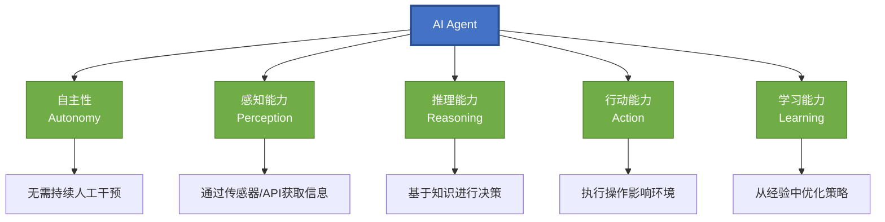

### 1.2 AI Agent 与 LLM 的区别

理解 AI Agent 与大语言模型（LLM）之间的区别至关重要。可以用一个形象的比喻来说明：

- **LLM（大语言模型）**：相当于"大脑" - 负责理解语言、生成回复、进行推理
- **AI Agent**：相当于"大脑 + 眼睛 + 手 + 记忆" - 在 LLM 基础上增加了感知、执行和记忆能力

#### 关键差异对比

| 特性 | LLM | AI Agent |
|------|-----|----------|
| **工作模式** | 被动响应 | 主动执行 |
| **主要功能** | 文本生成 | 任务完成 |
| **工具使用** | 无 | 可调用外部工具和 API |
| **记忆系统** | 仅依赖上下文窗口 | 具备短期和长期记忆 |
| **任务规划** | 单轮对话 | 多步骤任务分解与执行 |
| **环境交互** | 仅文本输入输出 | 可与外部系统实时交互 |

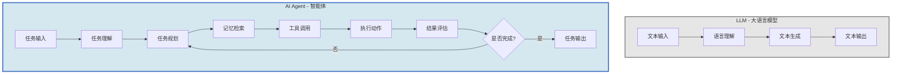

**简而言之**：LLM 是 AI Agent 的"认知引擎"，而 AI Agent 是在 LLM 基础上构建的完整行动系统。

## 2. 核心架构

AI Agent 的架构设计直接决定了其能力边界和应用场景。目前业界公认的架构模型基于认知科学理论，主要由以下四个核心模块组成。这一架构最早由 OpenAI 研究员 **Lilian Weng** 在其影响深远的博客文章中系统性地提出。

### 2.1 架构概览

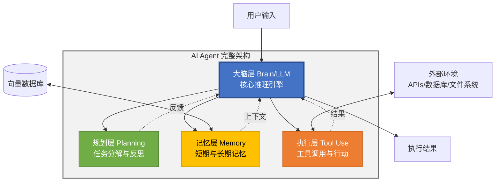

#### 四大核心模块

| 核心模块 | 功能描述 |
|---------|---------|
| **大脑层（Brain/LLM）** | 核心推理引擎，负责理解任务、生成计划、做出决策 |
| **规划层（Planning）** | 将复杂任务分解为可执行的子任务，并进行自我反思和优化 |
| **记忆层（Memory）** | 存储和检索信息，包括短期工作记忆和长期知识库 |
| **执行层（Tool Use）** | 与外部世界交互的接口，包括 API 调用、代码执行等 |

### 2.2 工作流程

一个典型的 AI Agent 执行任务的流程如下：

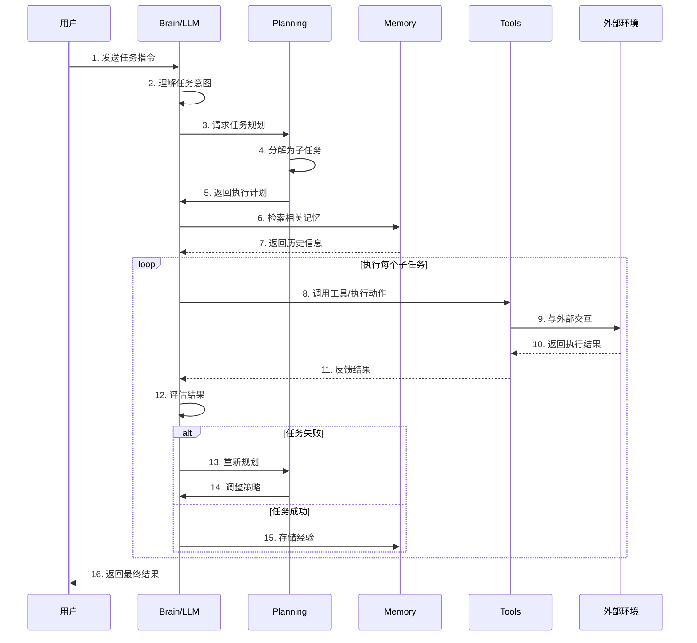

## 3. 核心组件详解

### 3.1 规划模块（Planning）

规划模块是 AI Agent 区别于简单聊天机器人的核心能力之一。它使 Agent 能够处理复杂的、需要多步骤完成的任务。

#### 3.1.1 任务分解（Task Decomposition）

任务分解是将大目标拆解为一系列小步骤的过程。

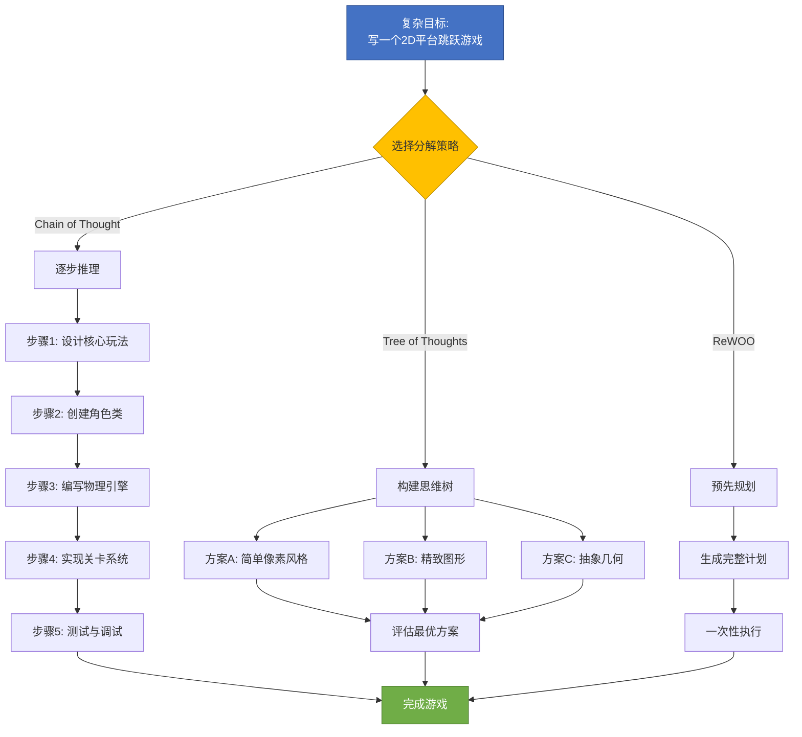

**主要技术**：

- **Chain of Thought (CoT)**：通过提示词引导 LLM 进行逐步推理。例如在提示词中加入"让我们一步一步思考"
- **Tree of Thoughts (ToT)**：构建思维树，探索多个可能的推理路径，最终选择最优方案
- **ReWOO (Reasoning Without Observation)**：预先规划所有步骤，减少执行过程中的反复调用

#### 3.1.2 反思与修正（Reflection）

Agent 执行动作后需要评估结果并自我改进。

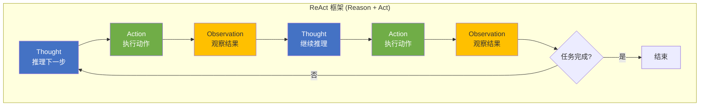

**主流框架**：

- **ReAct (Reason + Act)**：将推理和行动交替进行。Agent 先推理下一步该做什么（Thought），然后执行（Action），观察结果（Observation），再继续推理
- **Reflexion**：Agent 在任务完成后生成自我反思报告，总结成功和失败的经验，并将其存入长期记忆
- **Self-Refine**：迭代式改进输出质量，每次生成后自我评估并提出改进建议

### 3.2 记忆模块（Memory）

记忆系统赋予 Agent 学习能力和上下文连续性。没有记忆的 Agent 无法在多轮对话中保持状态，也无法从历史经验中学习。

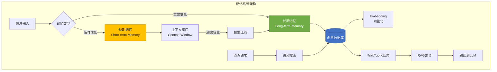

#### 3.2.1 短期记忆（Short-term Memory）

- **实现方式**：利用 LLM 的上下文窗口（Context Window）
- **存储内容**：当前对话历史、临时变量、中间推理步骤
- **限制**：受限于模型的最大 token 数（如 GPT-4 的 128K tokens）
- **管理策略**：当上下文接近上限时，使用摘要技术压缩历史信息

#### 3.2.2 长期记忆（Long-term Memory）

- **实现方式**：外部向量数据库（如 Pinecone、Weaviate、Chroma）
- **存储内容**：历史对话、领域知识、用户偏好、过往经验
- **检索技术**：RAG（检索增强生成）- 将相关历史信息检索出来并注入到当前上下文中
- **应用场景**：个性化助手、企业知识库问答、代码库理解

**技术流程**：

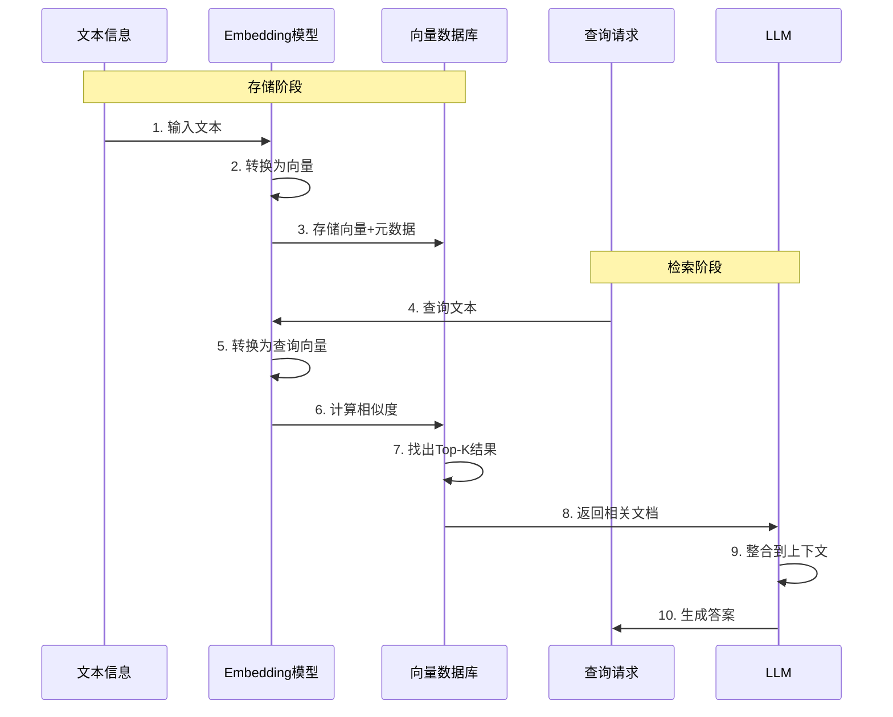

### 3.3 工具使用模块（Tool Use / Action）

工具使用能力是 AI Agent 的关键差异化特征。它使 Agent 能够突破纯文本交互的限制，真正影响外部世界。

#### 3.3.1 工具类型

| 工具类别 | 典型示例 |
|---------|---------|
| **信息检索** | 搜索引擎 API、Wikipedia API、数据库查询 |
| **数据处理** | Python 解释器、数据分析库（Pandas）、Excel 操作 |
| **外部服务** | 邮件发送、日程管理、支付接口 |
| **文件操作** | 读写文件、图像处理、PDF 生成 |
| **通信交互** | Slack/Teams 消息、HTTP 请求、WebSocket |

#### 3.3.2 工作机制

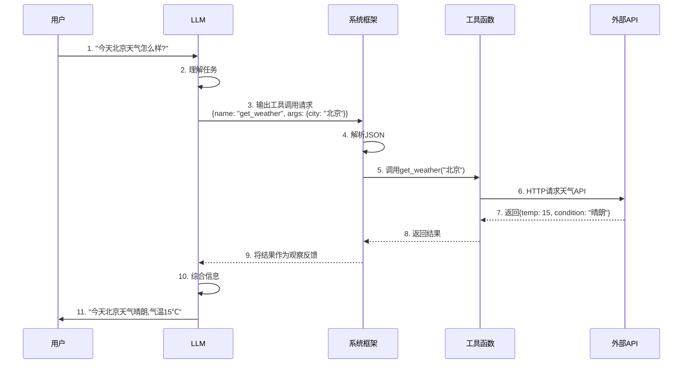

**标准流程**：

1. **工具注册** - 定义工具的名称、描述、参数格式（通常使用 JSON Schema）
2. **LLM 决策** - Agent 根据任务需求，输出结构化的工具调用请求
3. **系统解析** - 框架解析 LLM 的输出，提取工具名称和参数
4. **执行操作** - 调用实际的 Python 函数或 API
5. **结果返回** - 将执行结果反馈给 Agent，供其继续推理

#### 3.3.3 函数调用示例（OpenAI Function Calling）

**步骤 1：定义工具**

```json
{
  "name": "get_weather",
  "description": "获取指定城市的天气信息",
  "parameters": {
    "type": "object",
    "properties": {
      "city": {
        "type": "string",
        "description": "城市名称，如北京、上海"
      }
    },
    "required": ["city"]
  }
}
```

**步骤 2：Agent 决定调用工具**

当用户问"今天北京天气怎么样?"时，LLM 输出：

```json
{
  "name": "get_weather",
  "arguments": {
    "city": "北京"
  }
}
```

**步骤 3：执行并返回结果**

系统调用实际的天气 API，返回：

```json
{
  "temperature": 15,
  "condition": "晴朗",
  "humidity": 45
}
```

Agent 综合这些信息生成最终回复："今天北京天气晴朗，气温 15℃，湿度 45%。"

### 3.4 角色设定模块（Profile/Persona）

角色设定定义了 Agent 的"人格"和专业领域，通常通过 System Prompt 实现。

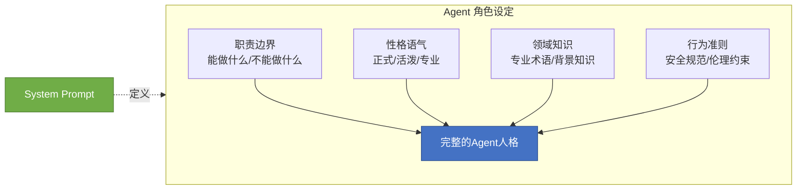

**关键要素**：

- **职责边界**：明确 Agent 能做什么、不能做什么
- **性格语气**：正式/活泼、简洁/详细
- **领域知识**：专业术语、背景知识
- **行为准则**：安全规范、伦理约束

**示例 - 法律顾问 Agent**：

```
你是一位专业的法律顾问 AI，具备以下特点：
- 职责：为用户提供法律条文解释和合规建议
- 边界：不提供具体诉讼策略，不替代真人律师
- 语气：严谨、中立、易懂
- 知识：熟悉民法、商法、知识产权法
- 行为：遇到复杂案件时建议咨询专业律师
```

## 4. Agent-to-Agent (A2A) 协议

随着 AI Agent 技术的成熟，单体 Agent 正在向多智能体系统（Multi-Agent Systems, MAS）演进。A2A 协议是实现 Agent 间互操作和协作的关键技术基础设施。

### 4.1 为什么需要 A2A？

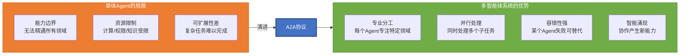

#### 单体 Agent 的局限性

- **能力边界**：单个 Agent 无法精通所有领域
- **资源限制**：计算资源、访问权限、专业知识的限制
- **可扩展性**：复杂任务需要多个专业 Agent 协作完成

#### 多智能体系统的优势

- **专业分工**：每个 Agent 专注于特定领域，如法律、医疗、编程
- **并行处理**：多个 Agent 同时工作，提高效率
- **容错性**：某个 Agent 失败时，其他 Agent 可以接管
- **创新涌现**：Agent 间的交互可能产生单体 Agent 无法实现的智能行为

### 4.2 A2A 协议核心要素

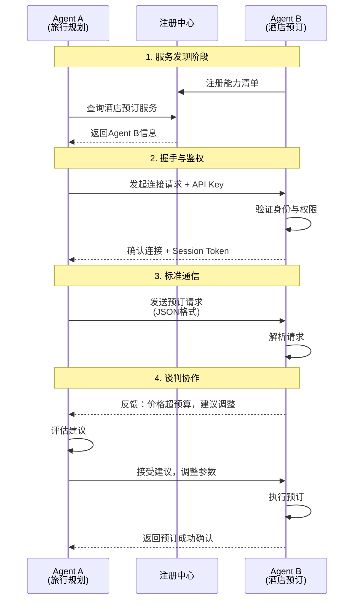

一个成熟的 A2A 交互协议通常包含以下关键组件：

#### 4.2.1 服务发现（Discovery）

Agent A 如何知道 Agent B 的存在及其能力？这需要一个服务发现机制。

**实现方式**：

- **中心化注册表**：类似"黄页"，所有 Agent 向中心服务器注册自己的能力清单（Manifest）
- **去中心化广播**：Agent 在网络中广播自己的能力，其他 Agent 监听并记录
- **P2P 发现**：Agent 之间点对点传播信息，类似 BitTorrent 的种子发现

**能力清单（Manifest）示例**：

```json
{
  "agent_id": "legal-advisor-001",
  "name": "法律顾问 Agent",
  "capabilities": [
    "合同审查",
    "法律条文解释",
    "合规性分析"
  ],
  "supported_protocols": ["A2A-v1.0"],
  "endpoint": "https://api.example.com/legal-agent",
  "authentication": "api_key",
  "rate_limit": "100 requests/hour"
}
```

#### 4.2.2 握手与鉴权（Handshake & Authentication）

确保通信双方是可信的，并建立安全连接。

- **身份验证**：使用 API Key、OAuth、JWT 等机制
- **权限控制**：确认 Agent A 是否有权限调用 Agent B 的特定功能
- **加密通道**：使用 TLS/SSL 保证数据传输安全

#### 4.2.3 标准通信格式（Standardized Messaging）

Agent 之间需要使用统一的消息格式来交换信息。

**双层通信模型**：

- **自然语言层**：Agent 之间使用自然语言（英语/中文）进行语义沟通，这使得不同模型（如 GPT-4 与 Claude）也能相互理解
- **结构化层**：使用 JSON 或 Protocol Buffers 包裹，确保解析准确性

**标准消息格式示例**：

```json
{
  "protocol_version": "A2A-v1.0",
  "sender": "travel-agent-001",
  "receiver": "booking-agent-002",
  "message_id": "msg-12345",
  "timestamp": "2026-02-11T10:30:00Z",
  "intent": "request",
  "content": {
    "task": "预订酒店",
    "parameters": {
      "city": "上海",
      "check_in": "2026-03-15",
      "check_out": "2026-03-17",
      "budget": 500
    }
  },
  "natural_language": "请帮我在上海预订一家酒店，3月15日入住，3月17日退房，预算500元/晚。"
}
```

#### 4.2.4 谈判与协作（Negotiation）

Agent 之间并非简单的命令-执行关系，而是可以进行协商。

**典型场景**：

- **拒绝请求**：Agent B 没有权限或能力完成任务
- **要求澄清**：参数不明确，需要更多信息
- **协商条件**：同意执行，但需要调整参数（如价格、时间）
- **转发请求**：Agent B 将任务转给更合适的 Agent C

**对话示例**：

```
Travel Agent → Booking Agent: "帮我订一家上海的酒店，预算 500 元/晚"

Booking Agent → Travel Agent: "500 元在黄浦区找不到合适的，但可以在浦东找到性价比高的选项，是否接受?"

Travel Agent → Booking Agent: "可以，请提供浦东区域的选项。"
```

### 4.3 A2A 拓扑结构

多智能体系统可以采用不同的组织结构，每种结构适用于不同场景。

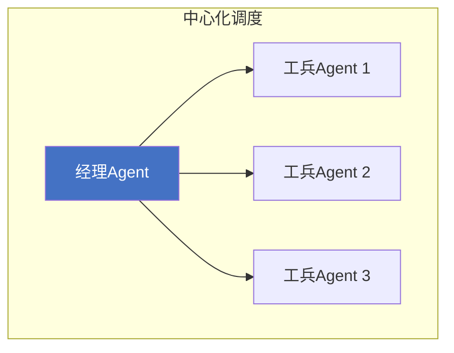

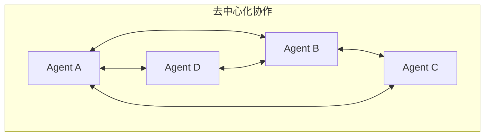

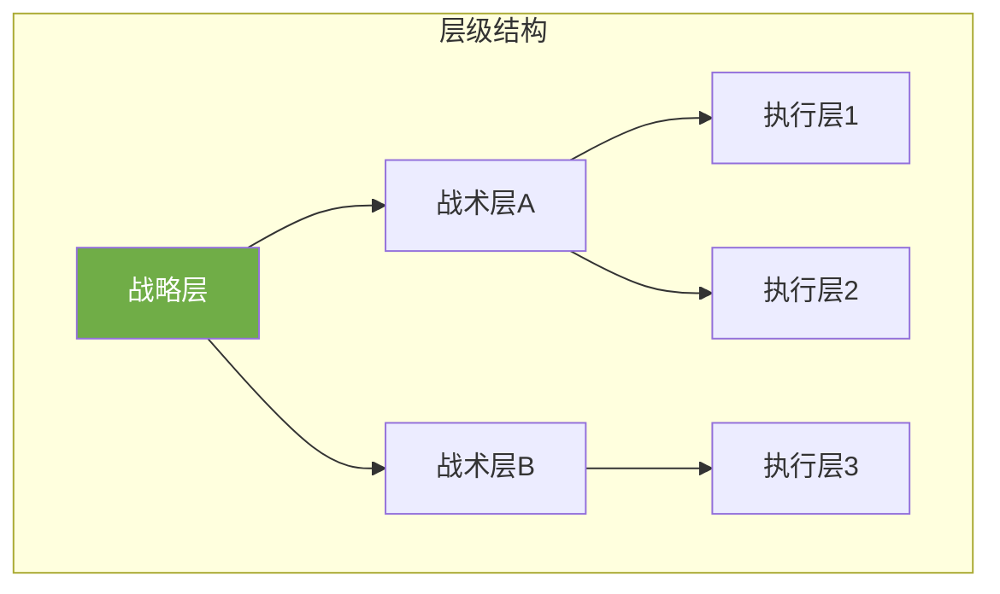

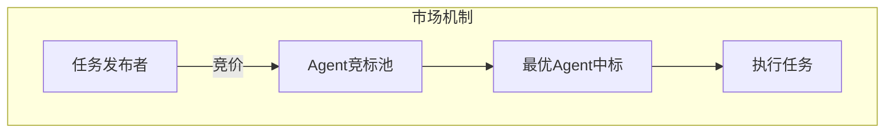

| 拓扑类型 | 特点 | 适用场景 |
|---------|------|---------|
| **中心化调度** | 一个"经理 Agent"指挥多个"工兵 Agent"。决策集中，协调简单，但存在单点故障风险。 | 企业工作流自动化、复杂任务编排 |
| **去中心化协作** | Agent 之间点对点沟通，自组织形成协作。类似蜂群智能，鲁棒性强，但可能出现混乱。 | 分布式问题求解、自适应系统 |
| **层级结构** | 多层管理，高层 Agent 做战略决策，底层 Agent 执行具体任务。 | 大型组织模拟、复杂项目管理 |
| **市场机制** | Agent 之间通过"竞价"和"交易"分配任务，类似经济学中的市场调节。 | 资源优化分配、动态任务调度 |

#### 实例：旅行规划多智能体系统

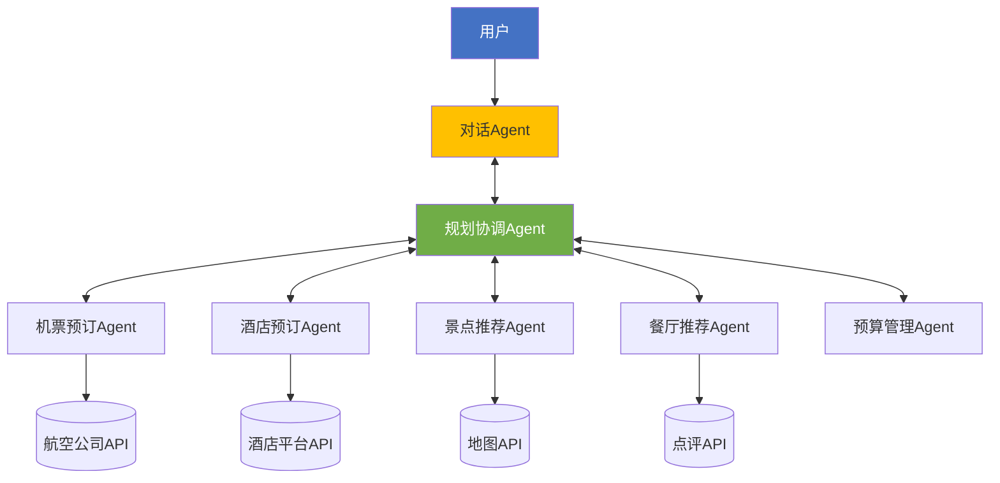

一个典型的旅行规划场景可能涉及以下 Agent 协作：

1. **用户对话 Agent** - 与用户交互，理解需求
2. **规划协调 Agent** - 制定整体行程方案
3. **机票预订 Agent** - 查询并预订航班
4. **酒店预订 Agent** - 搜索并预订住宿
5. **景点推荐 Agent** - 根据用户偏好推荐景点
6. **餐厅推荐 Agent** - 推荐美食和餐厅
7. **预算管理 Agent** - 跟踪费用，确保不超预算

这些 Agent 通过 A2A 协议自动协作，用户只需与对话 Agent 交互，其余工作全部自动化完成。

### 4.4 新兴标准与技术

#### 4.4.1 UCANN (Universal Communication for Agent Network)

UCANN 是一个提议的标准化 A2A 通信协议，目标是解决异构 Agent 之间的互操作性问题。

- **核心理念**：类似互联网的 TCP/IP 协议，为 Agent 通信建立统一标准
- **关键特性**：支持自然语言和结构化数据混合传输、内置安全机制、可扩展的消息格式

#### 4.4.2 其他相关技术

- **AutoGen (Microsoft)**：多智能体框架，支持 Agent 之间的对话式协作
- **LangGraph**：基于图结构的多 Agent 工作流编排
- **CrewAI**：提供角色定义和任务分配的多 Agent 框架
- **MetaGPT**：模拟软件公司的多角色协作系统

## 5. 总结与未来展望

### 5.1 技术发展阶段

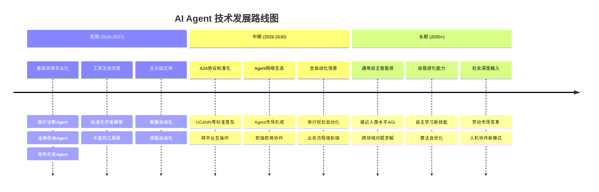

#### 短期（2026-2027）

- **垂直领域专业化**：针对特定行业的专业 Agent（如医疗诊断、法律咨询、软件开发）将快速成熟
- **工具生态完善**：标准化的 Agent 开发框架和工具链将更加成熟
- **企业级应用**：AI Agent 开始大规模应用于客服、数据分析、流程自动化等场景

#### 中期（2028-2030）

- **A2A 协议标准化**：类似 UCANN 的标准协议将得到广泛采纳
- **Agent 网络生态**：形成庞大的 Agent 市场，用户可以组合不同 Agent 完成复杂任务
- **跨平台协作**：不同公司、不同模型的 Agent 能够无缝协作
- **应用案例**：你的"旅行 Agent"自动与"订票 Agent"、"酒店 Agent"、"餐厅 Agent"沟通，全自动规划行程

#### 长期（2030+）

- **通用自主智能体**：接近人类水平的通用智能 Agent，能够处理极其复杂的跨领域任务
- **自我进化能力**：Agent 能够自主学习新技能、优化自身算法
- **社会影响**：AI Agent 深度融入日常生活，可能引发劳动市场结构性变化

### 5.2 关键挑战

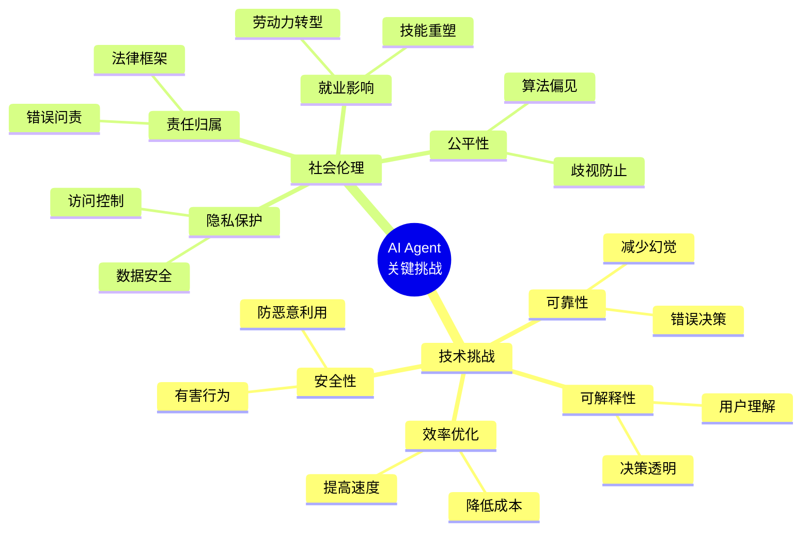

#### 技术挑战

- **可靠性**：减少 Agent 的幻觉（Hallucination）和错误决策
- **可解释性**：让用户理解 Agent 为什么做出某个决策
- **效率优化**：降低推理成本，提高响应速度
- **安全性**：防止 Agent 被恶意利用或产生有害行为

#### 社会与伦理挑战

- **隐私保护**：Agent 访问个人数据时如何确保隐私安全
- **责任归属**：Agent 犯错时谁来承担责任
- **就业影响**：自动化对劳动力市场的冲击
- **公平性**：防止 Agent 产生算法偏见和歧视

### 5.3 总结

AI Agent 代表了人工智能从"工具"向"助手"甚至"同事"的演进。从单一的文本生成模型到能够自主规划、记忆、使用工具的智能体，再到多个 Agent 通过标准化协议协作形成的智能网络，我们正在见证一场深刻的技术变革。

A2A 协议的出现标志着 AI Agent 技术进入了新的发展阶段。当不同的 Agent 能够像互联网上的服务一样自由连接和协作时，我们将看到前所未有的智能涌现现象。这不仅仅是技术进步，更是对人机协作模式的重新定义。

然而，技术的发展必须伴随着对伦理、安全和社会影响的深入思考。只有在确保可控、可解释、公平的前提下，AI Agent 才能真正成为推动人类社会进步的力量。

## 附录

### 附录 A：相关技术框架与工具

#### A.1 主流 Agent 开发框架

| 框架名称 | 开发者 | 特点 |
|---------|-------|------|
| **LangChain** | LangChain Inc. | 最流行的 Agent 开发框架，支持多种 LLM，工具生态丰富 |
| **AutoGen** | Microsoft | 专注于多 Agent 对话式协作，支持代码执行 |
| **LlamaIndex** | LlamaIndex Team | 专注于数据索引和检索，RAG 能力强 |
| **Semantic Kernel** | Microsoft | 企业级 Agent 框架，与 Microsoft 生态深度集成 |
| **CrewAI** | CrewAI | 基于角色的多 Agent 协作框架 |
| **AutoGPT** | 开源社区 | 早期的自主 Agent 实验项目 |

#### A.2 常用向量数据库

| 数据库名称 | 类型 | 适用场景 |
|-----------|-----|---------|
| **Pinecone** | 云服务 | 生产环境，高性能，易用 |
| **Weaviate** | 开源/云 | 支持多模态，GraphQL 接口 |
| **Chroma** | 开源 | 轻量级，适合原型开发 |
| **Milvus** | 开源 | 大规模部署，性能优秀 |
| **Qdrant** | 开源 | Rust 实现，高性能 |

#### A.3 主流 LLM 提供商

| 提供商 | 代表模型 | API 特性 |
|-------|---------|---------|
| **OpenAI** | GPT-4, GPT-4o | Function Calling, Vision, 语音 |
| **Anthropic** | Claude 3.5 Sonnet | 长上下文, 工具使用 |
| **Google** | Gemini 1.5 Pro | 多模态, 长上下文 |
| **Meta** | Llama 3 | 开源，可私有部署 |
| **Mistral** | Mistral Large | 欧洲厂商，注重隐私 |

### 附录 B：延伸阅读

#### B.1 经典论文

- Lilian Weng (2023). *"LLM Powered Autonomous Agents"*. OpenAI Blog.
- Yao et al. (2023). *"ReAct: Synergizing Reasoning and Acting in Language Models"*.
- Wei et al. (2022). *"Chain-of-Thought Prompting Elicits Reasoning in Large Language Models"*.
- Shinn et al. (2023). *"Reflexion: Language Agents with Verbal Reinforcement Learning"*.

#### B.2 在线资源

- **LangChain 官方文档**：https://python.langchain.com/docs
- **OpenAI Function Calling 指南**：https://platform.openai.com/docs/guides/function-calling
- **AutoGen 示例库**：https://github.com/microsoft/autogen
- **AI Agent 最佳实践**：https://www.promptingguide.ai
