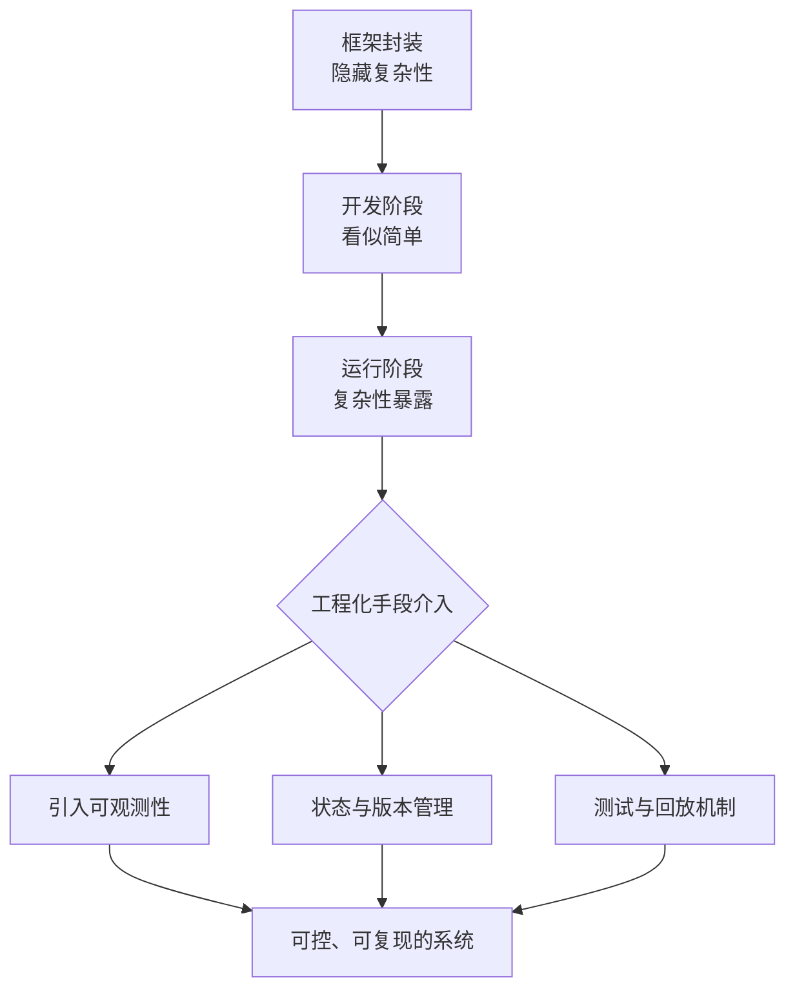
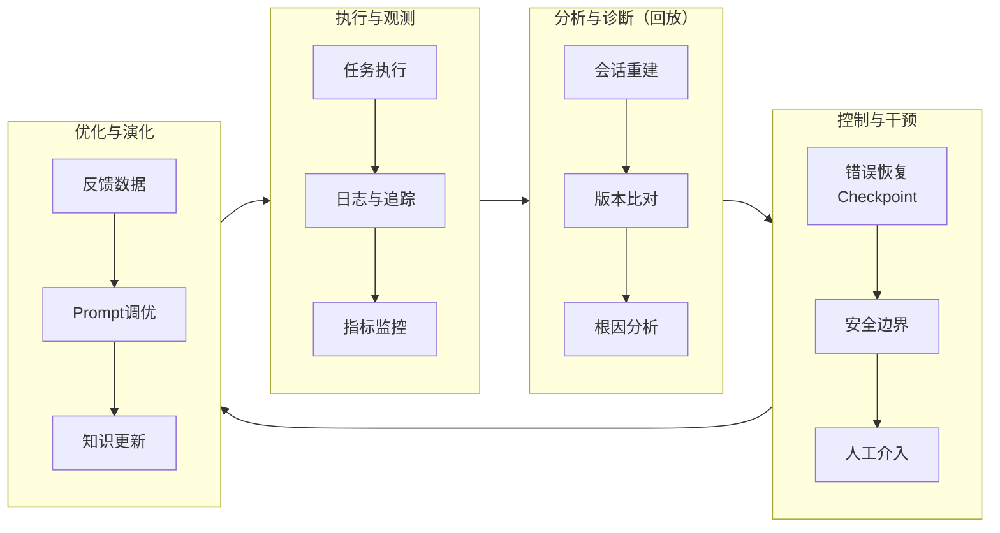
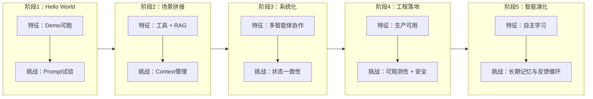

# 从可运行到可复现：智能体系统工程化之路

> 智能体的未来不是更聪明，而是更可靠。工程化是智能体落地的唯一出路。

## 智能的不确定性，必须以工程的确定性为支撑

近年来，智能体（Agent）技术的热潮让“写几个 prompt、拼几个工具”似乎成为一种简单的成功幻觉。然而，从系统工程视角看，这种“简单”只是一种复杂性被转移的假象。

目前，主流框架如 LangChain、Flowise、百炼等，确实让智能体“能跑”，但要让它具备可复现、可扩展、可观测、可维护等特性，必须走上系统化工程之路。这一转变是智能体从实验室走向生产环境的关键。

## 智能体开发的三层复杂度：从运行到进化

智能体的复杂度并未消失，而是被分散到了不同层面。下表总结了智能体开发的三大层次及其主要挑战：

| 层次 | 目标 | 挑战 |
| --- | --- | --- |
| 可运行性 | 能跑通 Demo | 框架封装隐藏复杂性 |
| 可复现性 | 行为可解释、可回放 | 缺乏 trace 与状态管理 |
| 可进化性 | 支持学习、反馈与迭代 | 系统设计与知识沉淀缺失 |

为帮助理解复杂性如何迁移，下面的流程图展示了从框架封装到工程化方法介入的演变过程：

复杂性不会被消除，只会从开发阶段转移到运行阶段。工程化手段的引入，是应对这一迁移的关键。

## LLM 不确定性的放大效应

与传统的确定性系统不同，基于大语言模型的智能体系统天然具有不确定性。假设单次 LLM 调用的正确率为 90%，那么多次调用后系统整体的正确率会急剧下降：

- 10 次调用的系统正确率约为 35%
- 20 次调用的系统正确率约为 12%

这种放大效应主要来源于以下几个方面：

- Memory 放大：状态一致性不可控，Embedding 检索存在语义漂移。
- 编排放大：LLM 动态决定流程，导致非确定性决策路径。
- 测试放大：输出是概率分布，传统单元测试失效。

针对上述挑战，工程化对策包括：

- 引入 Replay 测试、基线对比、仿真环境。
- 建立 Prompt / Memory 版本追踪机制。
- 监控漂移率与错误率等关键指标。

通过这些措施，可以有效提升系统的可控性和可观测性。

## 从 Prompt Hack 到 System Design

许多开发者习惯于通过不断调整 prompt 来让智能体跑通 Demo。这种“Prompt Hack”方式在实验阶段尚可，但在生产环境中难以保证稳定性和可维护性。

下表对比了 Prompt Hack 的局限性与系统化工程的对策：

| Prompt Hack 局限 | 系统化对策 |
| --- | --- |
| 无复现性：改 prompt 难以保证稳定 | 版本化 + 回放机制 |
| 无扩展性：多任务 prompt 爆炸 | 模块化 memory + orchestration |
| 无可控性：幻觉不可预测 | 可观测性与日志系统 |

Prompt Hack 解决的是“小问题”，而系统化智能体工程关注的是“可持续问题”。只有通过系统设计，才能实现智能体的长期可用和可演化。

## 稳定性优先于智能，观测性优先于优化

在智能体系统的设计中，稳定性是智能可演化的前提。系统化设计应当包含以下几个核心机制：

- Replay 机制：任务执行可回放与复现，便于问题定位和调试。
- 版本追踪：Prompt、Memory、RAG 的演化轨迹可溯源。
- 监控指标：如成功率、漂移率、冗余调用率等，帮助持续优化系统表现。
- 错误恢复：通过 checkpoint 与容错机制防止死循环和系统崩溃。

下图展示了智能体系统的可靠性闭环流程：

通过上述机制，智能体系统能够实现持续演化与自我修正。

## 智能体的成长五阶段模型

智能体系统的成长路径可以分为五个阶段，从“能跑”到“能用”，再到“可进化”，每个阶段都有其特征与挑战。

下图展示了智能体成长的五阶段演化流程：

理解每个阶段的核心挑战，有助于制定针对性的工程策略。

## 智能体工程设计模式

在智能体系统工程化过程中，涌现出多种设计模式。下表总结了主流的智能体工程设计模式及其应用场景：

| 模式 | 核心机制 | 应用场景 |
| --- | --- | --- |
| **ReAct** | Reasoning + Acting | 问答、多步任务 |
| **CodeAct** | 生成代码 + 执行反馈 | 数据分析、API 调用 |
| **Tool Use (MCP)** | 工具抽象协议 | 多模态工具集成 |
| **Self-Reflection** | 主模型 + 批评模型 | 内容生成质量控制 |
| **Multi-智能体 Workflow** | 主从协作编排 | 企业级自动化 |
| **Agentic RAG** | 智能检索 + 决策融合 | 自主知识检索系统 |

选择合适的设计模式，有助于提升系统的可扩展性和可维护性。

## 工程启示：从框架到系统

在实际工程实践中，常见的智能体开发框架各有侧重：

- LangChain 让智能体“能搭”，但系统失去了“能解释”的能力。
- LangGraph、LangSmith 等工具的目标是恢复系统级可控性与可观测性。

未来，智能体系统工程化的方向包括：

- 智能体 = 微服务
- Orchestration = 分布式系统调度
- Memory = 知识图谱 + 状态数据库
- Observability = AI-Native Telemetry

这些理念将推动智能体系统向更高的可靠性和可维护性演进。

## 智能体的系统工程化路线图

下表总结了智能体系统工程化的目标层级与对应的工程策略：

| 目标层级 | 工程策略 |
| --- | --- |
| 运行层 | LangChain / Flowise 等框架支持 |
| 观测层 | 引入日志、回放、版本控制、metrics |
| 控制层 | 建立恢复、验证与安全边界 |
| 进化层 | 自学习 + 反馈驱动优化 |

让智能体变得“可控、可复现、可观测”，才是智能体系统工程的核心使命。

## 总结

智能体系统的工程化之路，是从“能跑”到“能用”，再到“可进化”的持续演化过程。只有通过系统化设计、工程化手段和科学的观测机制，才能让智能体真正服务于生产环境，实现长期可用与自我进化。未来，智能体的核心竞争力不在于“更聪明”，而在于“更可靠”。

## 参考文献

- [让智能体系统更聪明之前，先让它能被信任 - mp.weixin.qq.com](https://mp.weixin.qq.com/s/vHVR1ldibtD1KSoKfra6vw)
- [Building Effective AI Agents - anthropic.com](https://www.anthropic.com/engineering/building-effective-agents)
- [New Tools for Building Agents - openai.com](https://openai.com/index/new-tools-for-building-agents/)
- [Strands Agents SDK Deep Dive - aws.amazon.com](https://aws.amazon.com/blogs/machine-learning/strands-agents-sdk-a-technical-deep-dive-into-agent-architectures-and-observability/)
- [Building LangGraph - blog.langchain.com](https://blog.langchain.com/building-langgraph/)