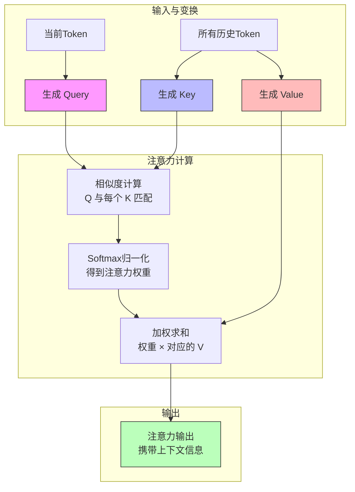
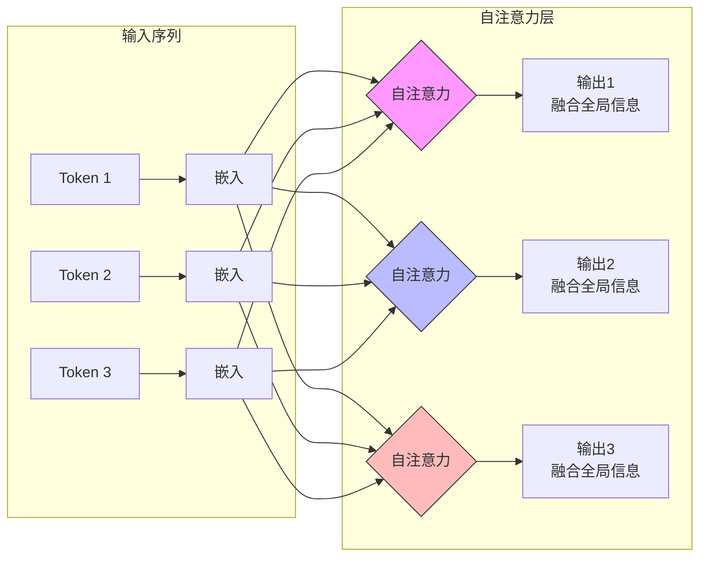
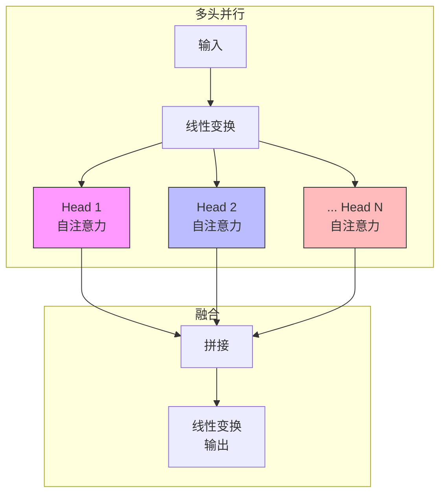

# 注意力机制：让模型知道“该关注什么”

注意力机制（Attention）是整个 Transformer、大语言模型的灵魂。它就像系统架构中的调度算法，让模型能动态关注最重要的信息。

## 为什么需要注意力机制？

在深度学习出现之前，模型处理序列（文本）主要依赖循环神经网络（RNN, Recurrent Neural Network）或长短时记忆网络（LSTM, Long Short-Term Memory），但它们有几个致命局限：

- 只能顺序处理，无法并行
- 长句子信息难以有效传递
- 难以捕捉长距离依赖

例如，考虑下面这个句子：

> 小明告诉小红，**他**已经把 Kubernetes 集群升级到 v1.30。

当模型看到“他”时，需要知道它指的是“小明”——这就是长距离依赖问题。

**注意力机制（Attention, Attention Mechanism）** 很好地解决了这些问题：

- 一步计算全句关系
- 支持全并行
- 自动强调重要信息
- 能捕捉远距离关联

这些能力极大提升了模型的表现力和效率。

## 一句话解释注意力机制

注意力机制的本质可以用一句话概括：

> **当前词决定自己应该关注哪些历史词。**

这就是注意力机制的核心思想。

## 用云原生类比：注意力 = 智能调度器

你可以把注意力机制理解为 Kubernetes 的调度器（Scheduler），下表展示了两者的工程类比关系：

| 注意力组件 | Kubernetes 类比 | 含义 |
| :--- | :--- | :--- |
| **Query (Q)** | 调度请求（Pod） | 我需要什么资源？ |
| **Key (K)** | Node 的标签与属性 | 每个 Node 能提供什么？ |
| **Value (V)** | 调度到 Node 之后的具体能力 | 最终返回的信息内容 |

注意力机制的目标是：
1.  用 **Q** 与所有 **K** 匹配
2.  算出“应该关注谁”（类似 Node.score）
3.  再从 **V** 中取出对应内容

## 注意力机制的完整流程

下图展示了注意力机制的标准计算流程：

在这个流程中，**Q** 负责问问题，**K** 负责提供线索，**V** 提供最终内容。每一步都对应着模型如何动态聚焦于最相关的信息。

## 具体例子

下面通过一个具体例子，帮助你理解注意力机制的实际作用。

假设有句子：

“我喜欢吃北京烤鸭。”

模型在预测“。”之前的下一个词时，需要判断上下文中哪些词最重要。注意力分布可能如下：

| 历史词 | 重要性（示例） |
| :--- | :--- |
| 我 | 3% |
| 喜欢 | 20% |
| **吃** | **45%** |
| **北京** | **25%** |
| 烤鸭 | 7% |

可以看到，模型没有平均关注所有词，而是智能地“挑重点”。这正是 LLM 能“理解”语义的关键。

## 注意力背后的三个向量：Q/K/V 的工程师版理解

你可以用工程类比来理解 Q、K、V 三个向量：

- **Query**：当前任务的需求。例如，“我要找什么信息？”类似 Pod 的资源需求（如 `cpu: 2 cores`）。
- **Key**：存量资源的描述。即所有历史 token 的能力描述，就像每个 Node 的 `labels`、`capacity`。
- **Value**：实际内容。最终需要用的信息（文本隐向量），类似调度到某个 Node 后实际执行产生的内容。

## Self-Attention：每个 token 可“看全世界”

**自注意力机制（Self-Attention）** 有一个巨大优势：

- 每个 token 可以看到整个序列（不分前后）
- 天然支持并行计算（比 RNN 快几十倍）

这也是 Transformer 能取代 RNN 的根本原因。

下图展示了 Self-Attention 的整体结构：

通过这种结构，每个 token 都能动态聚合全局信息，实现高效的上下文建模。

## Multi-Head Attention：多个调度器并行

Transformer 并不是只用一个注意力头，而是采用**多头注意力（Multi-Head Attention）**机制：

- 多个注意力头并行
- 每个头关注不同特征：位置、语法、实体、长依赖等

可以类比 Kubernetes 的多种调度策略：
- **Head 1** = 资源调度策略 A
- **Head 2** = 拓扑调度策略 B
- **Head 3** = GPU 调度策略
- **Head 4** = 节点亲和性策略

所有策略并行执行，最后合并结果。

下图展示了多头注意力的结构：

这种机制让模型能从多个视角理解语义，提升表达能力。

## 为什么注意力机制如此强大？

注意力机制带来了五个核心能力提升：

1.  **长距离依赖**：可以跨很长的距离找到相关信息，甚至捕捉跨段落关联。
2.  **全并行训练**：所有 token 同时计算，训练速度提升几十倍。
3.  **稳定且可扩展**：序列越长效果越好（RNN 越长越崩）。
4.  **可解释性更强**：可以查看注意力热力图，看到模型关注了哪些词。
5.  **模态无关**：文本、图像、音频、代码都能用（如 Stable Diffusion 也采用了注意力机制）。

## 总结

注意力机制是一种 **“基于匹配的动态调度系统”** ，让每个 token 可以根据自身需求（Query）从历史中找到最有用的信息（Key/Value），从而构建上下文理解。

它是现代大语言模型、Transformer、Diffusion、甚至多模态模型的共同基石。
