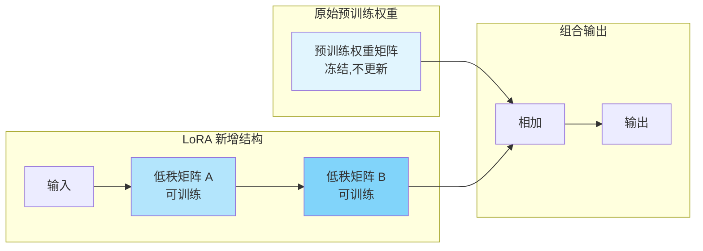

# 微调：让模型“变专业”的阶段

如果说预训练是让模型读完“本科”，那么微调就是让模型成为“专业工程师”。

#### 预训练（Pre-training）

在大规模数据集上训练模型的基础阶段，学习通用知识。

## 微调是什么？

微调（Fine-tuning 在预训练模型基础上进行额外训练，使模型适应特定任务或领域。, Fine-tuning）是在预训练模型的基础上，用特定领域的数据继续训练，使模型更适用于特定任务或场景。

#### Fine-tuning（微调）

在预训练模型基础上进行额外训练，使模型适应特定任务或领域。

一句话总结：

**微调 = 让通用模型变成领域专家**

## 为什么需要微调？

预训练模型虽然“知识广博”，但它存在几个问题：

- 它不会“回答问题”（只会续写文本）
- 它不懂特定业务术语
- 它不知道企业的数据格式
- 它可能输出不安全内容（未对齐）

微调的核心目的就是解决这些问题：

- 让模型学会对话（指令微调）
- 让模型适应领域（法律、医疗、金融、客服）
- 让模型对齐人类偏好（RLHF 也是微调的一种）

## 微调 vs 预训练：关键区别

下表对比了微调和预训练在多个维度上的差异：

| 维度 | 预训练 | 微调 |
| :--- | :--- | :--- |
| **数据规模** | TB 级（海量） | MB/GB 级（小规模） |
| **算力需求** | 成千上万 GPU | 单卡/几卡即可 |
| **成本** | 数百万～数亿 | 几百～几万 |
| **目标** | 学会通用语言/知识 | 适配特定任务/风格 |
| **周期** | 数周～数月 | 几小时～几天 |

## 微调的工程类比：基础镜像 → 业务镜像

用云原生工程师最熟悉的方式类比：

- **预训练模型** = 官方基础镜像（如 ubuntu:22.04）
- **微调模型** = 基础镜像 + 业务层（如 Nginx + App + 配置）

就像你不会直接用 ubuntu 镜像上线业务一样，你也不会直接用 base model 做客服。

**微调的本质就是在通用能力之上，构建领域专属能力层。**

## 微调的主流方法

目前常用的微调方法主要分为两类：

### 1. 全量微调（Full Fine-tuning）

更新模型**所有**参数。

- ✅ 效果最好
- ❌ 显存/算力要求高
- ❌ 每个任务都要存一份完整模型

### 2. 高效参数微调（PEFT, Parameter-Efficient Fine-Tuning）

只更新少量参数，主流技术包括：

- **LoRA（Low-Rank Adaptation）**：插入少量可训练矩阵，冻结原模型
- **Q-LoRA**：量化版 LoRA，进一步降低显存
- **Adapter**：在层间插入小型可训练模块

下图展示了 LoRA 的核心原理：



## 主流微调技术对比

下表对比了目前最主流的几种微调技术：

| 技术 | 原理 | 优势 | 适用场景 |
| :--- | :--- | :--- | :--- |
| **Full Fine-tuning** | 更新全部参数 | 效果上限最高 | 数据充足、有算力 |
| **LoRA** | 插入低秩矩阵 | 显存低、速度快 | 大多数业务场景 |
| **Q-LoRA** | LoRA + 量化 | 显存极低（可单卡微调） | 个人开发者、小团队 |
| **Adapter** | 插入小型网络层 | 模块化、易组合 | 多任务学习 |

## 微调的数据：指令数据集

微调需要的数据不是“纯文本”，而是 **「指令-回答」** 对。

一个典型的微调样本长这样：

```json
{
  "instruction": "解释一下 Kubernetes 中的 Ingress",
  "output": "Ingress 是 Kubernetes 管理外部访问的 API 对象，它提供基于 HTTP 和 HTTPS 的路由规则..."
}
```

数据的质量和多样性，直接影响微调后模型的表现。

## 微调后的结果：领域模型

经过微调，模型将获得：

- ✅ 懂业务术语
- ✅ 按规范格式输出（如 JSON、Markdown）
- ✅ 更少幻觉
- ✅ 更安全（对齐后）
- ✅ 更高任务准确性

## 总结

微调是连接“通用模型”与“业务场景”的桥梁。

- **预训练** = 通才教育
- **微调** = 专业实训
- **LoRA** = 轻量级“业务插件”
- **指令微调** = 让模型学会“回答问题”而不是“续写”
