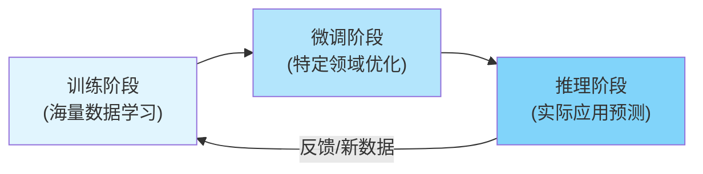
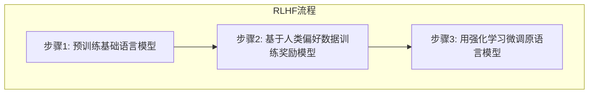
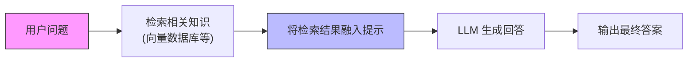
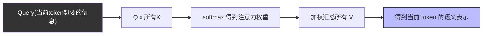

# 大模型是如何“思考”的：从输入到输出的全过程

大模型的“思考”并非魔法，而是数据与算法的协奏。理解其原理，才能真正驾驭智能时代的创新力量。

## 模型训练与推理：学习和应用

在理解大模型（Large Language Model）的整体流程时，**训练**、**微调**和**推理**三者之间的关系尤为重要。

下图为训练、微调与推理的流程示意图，可以帮助你理解各阶段的衔接关系。

在深入模型内部细节之前，需先明确训练和推理这两个基本概念。**训练**是模型成长的阶段，**推理**则是模型应用所学知识解决实际问题的过程。理解这两者的区别，有助于把握大模型的整体运行机制。

:::tip 训练与推理
训练使模型“学会”某种能力，推理则是模型“运用”这种能力去解决实际问题。
:::

训练阶段，开发者会提供海量样本数据让模型反复学习。常见方式包括有监督学习（Supervised Learning）、自监督学习（Self-supervised Learning）和强化学习（Reinforcement Learning），目标是最小化预测错误（损失函数），让模型参数收敛到良好泛化状态。

推理阶段，模型训练完成后被部署，对新数据进行预测或生成。此时模型会将训练中学到的内部表示和规则应用于新输入，输出结果。推理的质量高度依赖于训练效果，训练不足的模型在推理时表现会较差。

**微调（Fine-tuning）**是训练过程的延伸。它是在预训练模型（Pre-trained Model）基础上，用特定领域数据继续训练，使模型更适用于特定任务。微调通常数据量和计算需求较低，但能显著提升模型在特定应用上的效果。常见微调方法如低秩适配（LoRA, Low-Rank Adaptation），会冻结部分层，仅训练部分参数。

总之，**训练**赋予模型知识，**微调**塑造模型专长，**推理**则是模型运用知识解决问题的过程。理解这三个环节，有助于把握模型从输入到输出的整体流程。

## RLHF：让模型贴近人类期望的强化学习

在模型基本训练完成后，为了让模型回答更符合人类偏好，通常会采用**人类反馈强化学习（RLHF, Reinforcement Learning from Human Feedback）**。RLHF 通过引入人类反馈信号，以强化学习方式进一步微调模型，使其行为更贴近人类期望。

> **RLHF（基于人类反馈的强化学习）**：Reinforcement Learning from Human Feedback，利用人类反馈来微调模型的方法。

RLHF 的流程分为三个主要步骤，下图展示了整体过程：

- **预训练模型**：首先需要一个在大规模语料上预训练好的基础语言模型，具备较强的文本生成能力。
- **训练奖励模型**：收集模型生成的回答，由人类对这些回答进行评分或排序，得到带人类偏好的数据。用这些数据训练奖励模型（Reward Model, RM），使其能评价输出的好坏，输出奖励值。
- **强化学习微调**：使用奖励模型作为评分器，通过强化学习算法（如 PPO, Proximal Policy Optimization）微调原语言模型。模型输出由奖励模型打分，分数作为反馈信号调整参数，使模型倾向于产生更符合人类偏好的输出。

经过 RLHF 微调后，模型回答更契合人类意图，避免不当内容，提升对齐性。RLHF 过程涉及多个模型和大量人工标注数据，成本较高，但效果显著。ChatGPT 等主流模型均采用 RLHF 技术。

## RAG：检索增强生成，让模型“现查现用”

即使经过大规模训练和微调，语言模型（Language Model）仍存在知识截止和编造事实的问题。**检索增强生成（RAG, Retrieval-Augmented Generation）**通过在生成回答前，先从外部知识库检索相关信息，优化输出的准确性和实时性。

> **检索增强生成（Retrieval-Augmented Generation）**：结合信息检索和生成模型的技术，提升生成内容的准确性和可靠性。
> **RAG（检索增强生成）**：通过检索外部知识并与生成模型结合，提升回答准确性与可追溯性的方法。

RAG 的工作流程如下图所示：

- **外部知识库准备**：需有模型训练数据之外的外部数据作为知识库，通常预先转换为向量表示并存储在向量数据库（Vector Database）中，便于语义检索。
- **相关信息检索**：用户提问时，系统在向量数据库中进行相关性搜索，找到语义相近的资料片段。
- **增强提示构建**：将检索到的信息与原始问题合并，形成增强后的提示（Prompt），一并输入模型。
- **模型生成回答**：模型结合自身知识和检索信息生成答案，输出更准确、有依据的结果，并可引用来源。

RAG 能在不改变模型参数的情况下，显著提升回答的实时性和准确性，尤其适用于实时信息或专业领域知识场景。实现 RAG 需保证知识库数据更新和检索信息质量。

## 注意力机制：让模型知道“该关注什么”

在理解 Transformer 之前，需要先掌握它的核心思想——**注意力机制（Attention）**。注意力机制决定了模型如何从大量信息中挑出“当前最重要”的部分，是现代大语言模型（LLM）的根基。

### 什么是注意力机制？

人类阅读一句话时，并不会平等地关注所有词。例如在问题：

> “请解释一下 **Kubernetes Ingress** 的作用。”

你的注意力会自然集中在：
- **Kubernetes**
- **Ingress**
- **作用**（用途）

而忽略“请、一下、的”等词。

**注意力机制让模型也能做到这一点**：当前 token 在处理时，可以自动选择该重点关注哪些历史 token。

### 注意力是怎么计算的？

注意力机制依赖三个向量：

| 向量 | 作用（直观理解） |
| :--- | :--- |
| **Query (Q)** | “我现在想找什么？” |
| **Key (K)** | “我提供了哪些信息？” |
| **Value (V)** | “我的具体内容是什么？” |

模型在生成每个 token 时，会：
1.  取当前 token 的 **Q**
2.  用 Q 与所有历史的 **K** 做相似度计算（该关注谁）
3.  根据权重对所有 **V** 加权求和（关注的内容）

这形成了一个注意力分布：**注意力权重越高，模型越“看重”那个 token**。

### 一个完全不抽象的例子

句子：

> **我喜欢吃北京烤鸭。**

模型在预测“烤鸭”后面可能出现的词时，会重点关注：
- “吃”
- “北京”
- “喜欢”

一个可能的注意力分布如下（简化示例）：

| 历史词 | 注意力权重（示例） |
| :--- | :--- |
| 我 | 5% |
| 喜欢 | 20% |
| 吃 | **45%** |
| 北京 | 25% |
| 烤鸭 | 5% |

> 注意力机制让模型从整句中精准抓住相关信息。

### 注意力为什么重要？

注意力机制使得 Transformer 能：
- **捕捉长距离依赖**（如成语、前后呼应）
- **在长句中找到关键内容**
- **更好理解上下文关系**
- **并行处理序列**（比 RNN 快很多）
- **扩展到图像、音频、多模态任务**

它是 Transformer 和大模型演进的最关键基础。

## Transformer 模型结构解析：Embedding、Encoder、Decoder

理解模型从输入到输出的思考过程，需掌握其内部架构。当前主流架构为 **Transformer**，核心包括**嵌入层（Embedding）**、**编码器（Encoder）**、**解码器（Decoder）**等模块。下图展示了 Transformer 的整体结构：

```mermaid
graph LR
    subgraph 输入处理
        A[输入文本] --> B[分词]
        B --> C[Token列表]
        C --> D[Embedding层<br/>词向量 + 位置编码]
    end

    subgraph 编码器 Encoder
        D --> E[编码器层 1]
        E --> F[编码器层 2]
        F --> G[... 多层堆叠]
        G --> H[编码器层 N]
        H --> I[语义表示<br/>Hidden States]
    end

    subgraph 解码器 Decoder
        I --> J[解码器层 1<br/>掩码自注意力]
        J --> K[解码器层 1<br/>交叉注意力]
        K --> L[... 多层堆叠]
        L --> M[解码器层 N]
    end

    subgraph 输出生成
        M --> N[线性变换]
        N --> O[Softmax<br/>概率分布]
        O --> P[选取概率最高词]
        P --> Q[输出Token]
        Q --> J
    end

    style D fill:#e1f5fe
    style H fill:#b3e5fc
    style M fill:#81d4fa
    style O fill:#4fc3f7
```

- **嵌入（Embedding）层**：输入文本先分词为 tokens，经嵌入层映射为向量（词向量），并加入位置编码，得到词嵌入序列作为模型输入。
- **编码器（Encoder）**：编码器接收嵌入序列，经过多层堆叠，利用多头自注意力机制（Multi-head Self-Attention）和前馈网络，提取词间联系和上下文依赖，输出高维隐状态向量，代表输入序列的深层语义特征。
- **解码器（Decoder）**：解码器根据编码器输出的语义表示，逐步生成目标输出序列。每层包括掩码自注意力、交叉注意力和前馈网络。掩码自注意力关注已生成内容，交叉注意力参考编码器输出，帮助决定下一个输出词。
- **生成输出（Output Generation）**：解码器最后一层输出隐状态，经线性变换和 Softmax 得到词表概率分布，选取概率最高的词作为下一个输出 token，循环生成直至结束。

Transformer 架构具备并行处理和全局依赖捕捉能力，编码器-解码器配合实现输入信息压缩与输出答案解码的闭环。模型“思考”本质是数值计算与概率推断的流转。

## 推理加速机制：TensorRT、vLLM 与 PagedAttention

大模型在实际应用中常面临推理速度和资源消耗瓶颈。为提升推理效率，业界开发了多种加速技术。下文介绍 **NVIDIA TensorRT**、**vLLM** 及其核心技术 **PagedAttention** 的原理和优势。

- **TensorRT 推理优化**：TensorRT 是 NVIDIA 推出的深度学习推理优化库，通过算子融合、低精度计算（FP16/INT8）、高效内存管理和批处理调度等手段，加速模型在 GPU 上的推理。TensorRT 相当于推理编译器，部署前对模型做优化转换，提升硬件执行效率。最新 TensorRT-LLM 库还集成了 FlashAttention、PagedAttention 等专为大模型设计的优化。
- **vLLM 与 PagedAttention**：vLLM 是高性能大模型推理服务器，核心创新为 **PagedAttention**。PagedAttention 重新设计了 Transformer 解码时的注意力键值缓存（KV cache）管理，将缓存打散为固定大小内存页，动态分配和回收，类似操作系统虚拟内存分页机制。这样显存利用率大幅提升，支持更多并发序列，吞吐量显著提高。PagedAttention 还支持内存共享，复杂采样算法（如 beam search）开销更低。

这些加速技术从系统实现层面优化内存和计算调度，与算力优化方法形成互补。实际应用中可结合 TensorRT-LLM 编译优化与 PagedAttention 高效缓存管理，获得更快、更省的推理体验。

## 总结

本文系统梳理了大模型从训练、微调到推理的全过程，解析了 Transformer 架构、RLHF、RAG 及推理加速等关键技术。开发者理解这一闭环，有助于将模型原理与实际应用相结合，提升调优和部署能力。大模型虽复杂，但本质是数据表示与数值计算的流转。掌握整体流程，有助于更好地驾驭和应用 AI 技术，服务于实际场景。

## 参考文献

- [RLHF: Reinforcement Learning from Human Feedback - openai.com](https://openai.com/research/learning-from-human-feedback)
- [Retrieval-Augmented Generation (RAG) - huggingface.co](https://huggingface.co/docs/transformers/main/en/model_doc/rag)
- [TensorRT-LLM: High-Performance Inference for Large Language Models - developer.nvidia.com](https://developer.nvidia.com/blog/accelerating-large-language-model-inference-with-tensorrt-llm/)
- [vLLM: Easy, Fast, and Cheap LLM Serving - vllm.ai](https://vllm.ai/)