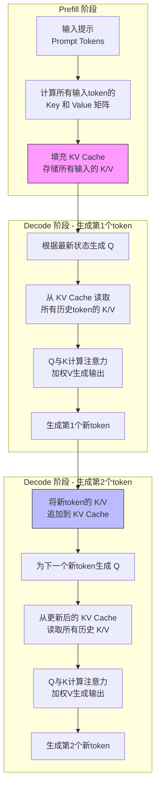
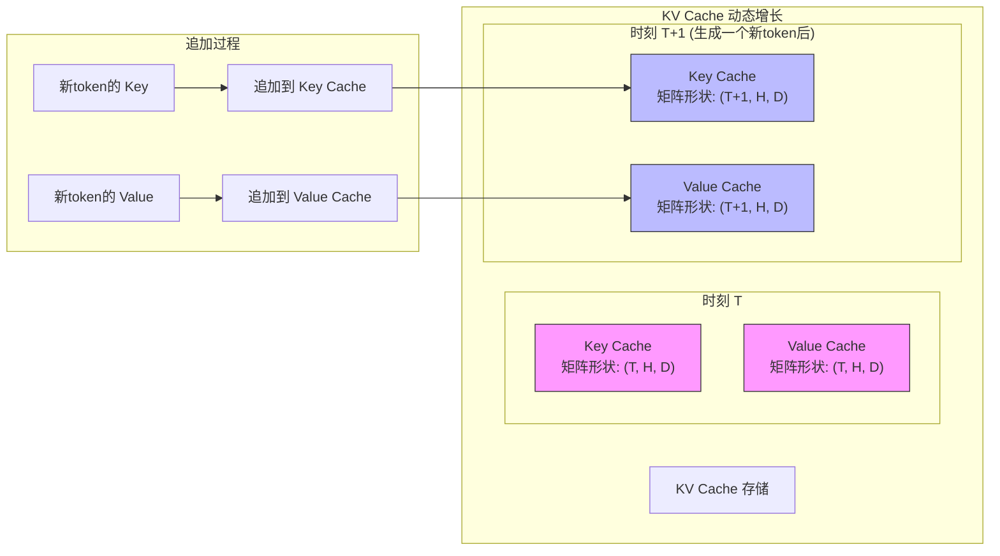
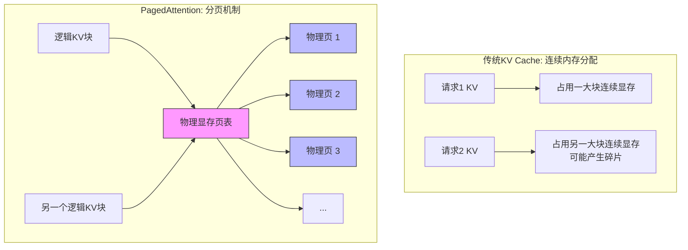
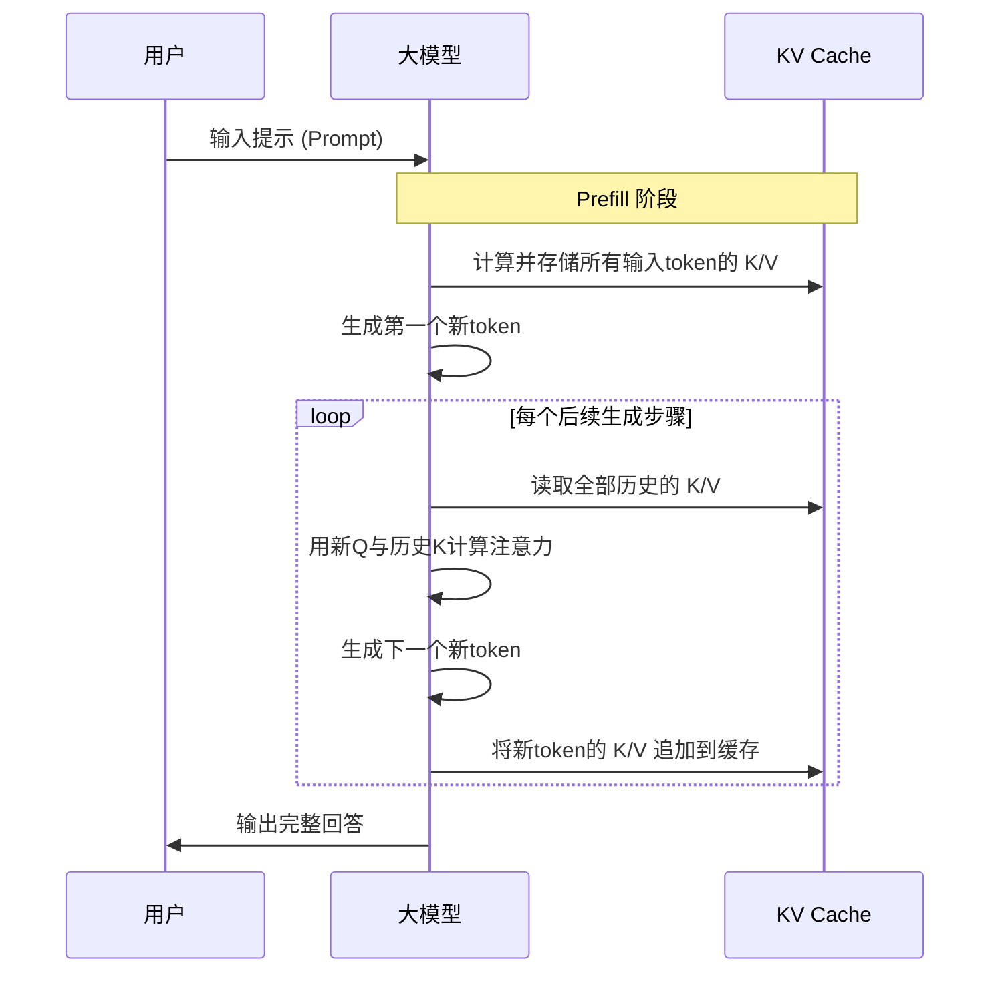

# KV 缓存

> 没有 KV Cache，LLM 推理速度会慢 100 倍。它是现代推理引擎的核心加速机制，也是工程优化的主战场。

## KV Cache 是什么？

KV 缓存（KV Cache, Key-Value Cache）是大语言模型（LLM）推理加速的关键技术。它的核心思想是：**把历史 token 的 Key / Value 保存下来，在解码阶段复用，避免重复计算。**

一句话总结：

> **KV Cache = 把历史 token 的 Key / Value 保存下来，以便解码阶段复用，避免重复计算。**
> **Token**：大模型处理文本的基本单位，可以是单词、词子或字符。

只要你理解了注意力机制（详见前文），KV Cache 就很好理解——它本质上是在缓存注意力计算中的一部分结果。

## 为什么需要 KV Cache？

回顾一下注意力机制的计算过程：
- 当前 token 生成 **Q**
- 历史 token 生成 **K/V**
- 用 Q × Kᵀ 得到注意力分布
- 用 V 得到最终上下文

问题来了：

> 在生成第 1000 个 token 时，前 999 个 token 的 K/V 要不要重算？

在没有 KV Cache 的情况下，每生成一个 token，都要重新计算所有历史 token 的 K/V。这会导致推理速度极慢，尤其是在长文本生成时。

KV Cache 的工程优化如下：
- 每个 token 的 K/V 只算一次，后续直接复用
- 随着生成，Cache 不断 append
- 解码阶段无需重复计算历史部分

这个机制让 LLM 推理速度从“不可用”变为“可用”。

## KV Cache 的工作方式

下图展示 KV Cache 的典型工作流程，分为 prefill 和 decode 两个阶段：

在这个流程中，**Prefill** 阶段对所有输入 token 计算 K/V（一次性），**Decode** 阶段每个新 token 只算 Q，K/V 从 Cache 读取，极大提升推理效率。

下表总结了两阶段的核心区别：

| 阶段 | 做了什么 | 为什么重要 |
| :--- | :--- | :--- |
| **Prefill** | 对所有输入 token 计算 K/V（一次性） | 长上下文只算一次 |
| **Decode** | 每个新 token 只算 Q，K/V 从 Cache 读 | 推理速度爆炸提升 |

一句话总结：

> **Prefill 解决输入长的问题，Decode 解决输出长的问题。**

## 工程师类比：KV Cache = 分布式存储中的“写一次、多读多”

你可以把 KV Cache 理解为分布式存储中的“只读数据块”：
- **K/V** 就像一段已经算好的只读数据
- **Cache** 就像挂在 GPU 显存中的“Append-only 日志”
- **Decode 阶段读取 K/V** = 只读查询
- **追加新的 K/V** = 日志追加

这类似于：
- 分布式存储的 WAL（Write-Ahead Log）
- Kafka partition append-only log
- Envoy filter chain 中的缓存结构

随着生成，Cache 越写越长，但历史部分无需重算。

## 没有 KV Cache 会怎样？

如果没有 KV Cache：
- 每生成一个 token，都要对所有历史 token 重新计算 K 和 V，复杂度 **O(n²)**
- 1000 字 token → 重算 1000 次 K/V，推理速度极慢
- 视频生成、长文生成、代码生成等场景几乎无法落地

有了 KV Cache 后：
- 历史 K/V 直接复用
- 复杂度降为 **O(n)**
- 推理速度提升 **10~100 倍**

这就是为什么所有推理引擎都在极力优化 KV Cache。

## KV Cache 的结构

下图展示了 KV Cache 在显存中的典型结构：

在这个结构中：
- **K Cache** 和 **V Cache** 是两个矩阵
- 随 token 数增加，维度不断扩展
- decode 阶段只追加 1 个位置的 K/V

## PagedAttention：最强的 KV Cache 优化

传统 KV Cache 在工程实践中会遇到碎片化、显存分配难、多并发干扰、长上下文浪费显存等问题。

**PagedAttention** 的创新点在于：

> 把 KV Cache 切成固定大小的 page，在显存中像虚拟内存一样调度。
> **PagedAttention（分页注意力）**：PagedAttention，一种通过分页机制来提高注意力机制效率的技术。

这类似于：
- Linux 虚拟内存分页
- Kubernetes Pod 分配固定 size HugePage
- 分布式系统用 page 替代大块连续内存

下图展示了 PagedAttention 的显存分页机制：

PagedAttention 的优势：
- 显存利用率提升 2~3 倍
- 并发能力提升 10 倍
- 动态增长 KV，不浪费空间
- 类似操作系统的“页表”机制

vLLM 等推理引擎的核心创新正是基于这一机制。

## 从 0 到 1 的完整推理流程

下图用时序图展示了 LLM 推理全流程，帮助你理解 KV Cache 的实际作用：

通过这个流程可以看到：

- **Prefill** 阶段一次性构建上下文
- **Decode** 阶段逐 token 使用 KV Cache，极大提升推理效率

## 为什么“上下文越长，推理越慢”？

虽然 KV Cache 已经缓存了历史 K/V，但 decode 阶段仍需执行 Q × Kᵀ，K 越长，矩阵维度越大，计算量线性增加。

所以：

> **长上下文的主要瓶颈是算力，而不是内存。**

## 总结

KV 缓存（KV Cache, Key-Value Cache）是对历史注意力计算结果（K/V）的显存级缓存，使得新 token 只需计算 Q，从而将推理复杂度从 **O(n²)** 降到 **O(n)**。

更工程化的总结：
- 它是 LLM 推理性能的核心瓶颈
- 也是所有推理引擎优化的核心点
- **PagedAttention** 是最成功的工程优化方案
