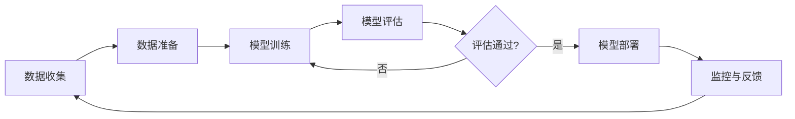
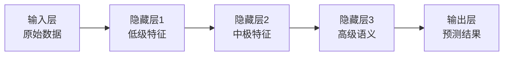
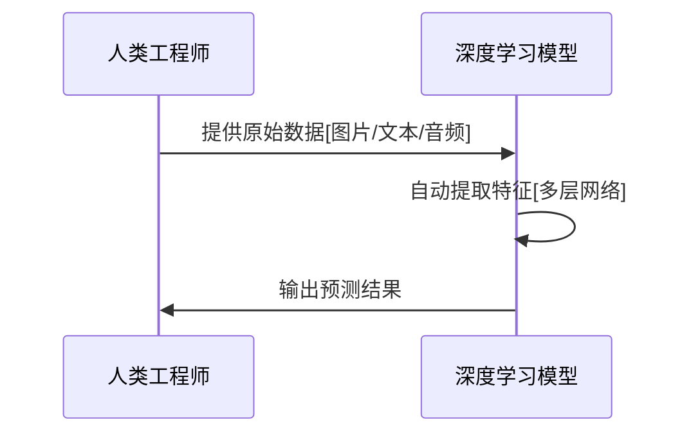
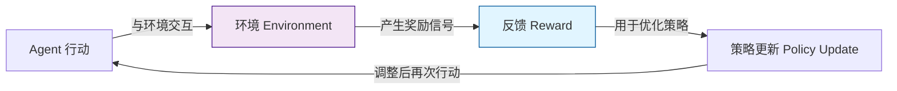
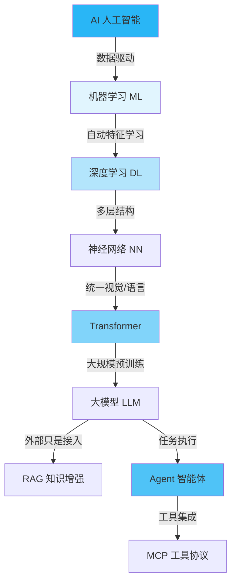
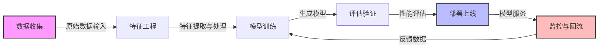

# 机器学习基础

::: info 本质
机器学习的本质，其实和云原生的自动化控制循环极为相似。
:::

机器学习（Machine Learning, ML）是现代人工智能（AI, Artificial Intelligence）的底层基石，就像 Kubernetes 是云原生体系的控制平面一样。如果把大语言模型（LLM）看作今天的智能操作系统，那么机器学习就是支撑这套系统的调度逻辑、优化机制和自动化反馈循环。

本节不是传统大学课程式的“算法大全”，而是站在云原生工程师的视角，解释：

- 机器学习与工程系统的相似性
- 神经网络为何能“自动学习”
- 深度学习为什么改变了一切
- 为什么 CNN / NLP / DNN 只是历史阶段，而大模型统一了范式
- 强化学习如何像 K8s 控制循环一样构建反馈
- 微调为什么像给模型制作“业务版镜像”
- 机器学习生命周期（MLOps, Machine Learning Operations）为何与 DevOps 高度相似

如果你已经掌握 Kubernetes、微服务或 DevOps，本章会让你以熟悉的方式理解机器学习。

## 从工程视角理解机器学习

传统软件是“人写规则，机器执行”。机器学习则反过来：

机器通过数据自己“学习”规则。

这种学习方式本质上类似云原生环境中的自动化调节循环（control loop）。

下面用表格对比机器学习与 Kubernetes 控制循环的异同：

| 概念 | 在机器学习中 | 在 Kubernetes 中 |
| --- | --- | --- |
| 期望状态 | 标签、预测目标 | YAML Spec |
| 当前状态 | 模型输出 | Pod/Node 实际状态 |
| 控制器 | 优化器（SGD 等） | Deployment/ReplicaSet |
| 调节机制 | Loss → Backprop | Reconcile Loop |

换句话说：

机器学习 = 通过数据驱动的自动化控制器。

## 机器学习流程（工程视角）

机器学习的标准流程与 DevOps 的 CI/CD - Observability - Feedback 循环高度相似。下方流程图展示了这一闭环：

这个循环体现了机器学习系统的持续优化和反馈机制。

## 神经网络：自动特征提取的“多层控制器”

神经网络（NN, Neural Network）对云原生工程师来说，不要理解成“模拟大脑”，而应该理解为：

多层级的自动化特征提取管道，每一层学习输入的不同模式。

如果把输入数据视作流量，那么神经网络就像多层 Envoy Filter 链，每层 Filter 提取不同粒度的信号，最终输出一个决策或分类结果。

下图展示了神经网络的分层结构及其工程类比：

## 深度学习：从“手写规则”到“自动编排器”

传统机器学习最大痛点是特征需要人工设计（像手写业务逻辑）。深度学习（Deep Learning, DL）彻底改变了这一点：

深度学习把“特征工程”自动化了。

这就像从手动服务编排到 Kubernetes 自动编排的范式迁移。

过去机器学习需要你告诉模型“图片边缘是什么”“语音的频率应该如何处理”“文本该如何切分”，而深度学习让模型自己从数据中学习这些特征。

下方时序图展示了深度学习自动特征提取的过程：

深度学习的价值不在于“深”，而在于自动化、可扩展、可迁移，这些特性让大模型时代成为可能。

## CNN：为视觉任务打造的“局部特征探测器”

卷积神经网络（CNN, Convolutional Neural Network）曾是图像领域的绝对霸主。它的机制非常工程化：

> **在图像上滑动一个小“窗口”检测局部模式。**

就像 Envoy 在请求路径上做 filter，一段一段处理。

CNN 在图像中擅长捕获边缘、检测形状、学习布局。虽然今天多模态大模型（如 GPT-4o、Gemini）已经逐步替代 CNN 的位置，但理解 CNN 有助于理解视觉 Transformer。

## NLP：从“规则”走向“端到端”

在大模型时代之前，自然语言处理（NLP, Natural Language Processing）是“规则 + 特征 + 模型”的组合拳：

- 分词
- 词性标注
- 句法分析
- TF-IDF / Word2Vec

每个步骤像一个微服务，组合起来才能处理文本。

但 Transformer 出现以后：

> **NLP 从多服务架构变成一个单体“大模型”。**

整个管道被统一到了端到端模型里，这也是为什么 Transformer 是革命性的。

## 深度神经网络（DNN）：层级化抽象的本质

深度神经网络（DNN, Deep Neural Network）的关键不是“深”，而是：

- 低层 → 原始特征
- 中层 → 模式组合
- 高层 → 语义抽象

这与云原生系统的分层架构非常契合。下表对比了两者的分层关系：

| ML 阶段 | Cloud Native 阶段 |
| --- | --- |
| 低层特征（像素） | Node 原子资源 |
| 中层特征（形状） | Pod/Service 构建块 |
| 高层语义（概念） | 应用/业务逻辑 |

你不用管 DNN 每层具体长什么样，就像你不会在生产中关心 Pod 里的具体 Kernel 参数一样。

## 强化学习：云原生工程师最熟悉的概念

强化学习（RL, Reinforcement Learning）其实是整个机器学习中最接近“云原生思维”的部分：

> **强化学习 = 自动调参的控制循环（Feedback Loop）。**

就像 HPA（Horizontal Pod Autoscaler）会根据指标不断调整副本数一样，强化学习的循环如下：

强化学习应用包括自动驾驶、自动化运维策略（AIOps RL）、AlphaGo 等复杂决策系统。在大语言模型中，RLHF（Reinforcement Learning from Human Feedback）与 PPO（Proximal Policy Optimization）则是基于强化学习的应用。

## 微调：为模型构建“业务镜像”

微调（Fine-tuning, Fine-tuning）是工程师极常用的一种能力。

类比 Kubernetes：

- 预训练模型 = 官方基础镜像（如 Ubuntu）
- 微调模型 = 基础镜像 + 自己的业务层（如 Nginx + App）

微调的目的不是让模型变强，而是让它“变专业”、“变懂业务”。

例如：

- 让模型专门回答合同条款
- 让模型保持你的写作风格
- 让模型学会特定企业术语
- 提升 Agent 执行准确性

微调不是“训练新模型”，而是在通用能力的基础上，叠加领域知识。

## AI 知识体系：从 ML → DL → LLM → Agent

为了帮助理解 AI 技术的演化路径，下图展示了从机器学习到智能体的知识体系：

上下文一脉相承：

- ML 是基础
- DL 扩展了表达能力
- Transformer 统一视觉/语言/多模态
- LLM 统一 NLP
- Agent 统一任务执行
- MCP 统一工具调用

## 机器学习生产生命周期（MLOps）：云原生工程师最熟悉的部分

如果你做过 DevOps，很快会发现 MLOps（Machine Learning Operations）就是机器学习世界的 DevOps。

下图展示了 MLOps 的完整闭环：

下表对比了机器学习与 DevOps 的各阶段对应关系：

| ML 阶段 | DevOps 类比 |
| --- | --- |
| 数据 | 代码 |
| 训练 | 编译 |
| 模型 Artifact | 镜像 Artifact |
| 部署 | Helm / Argo CD |
| 监控 | Prometheus / Grafana |
| 回流 | 自动化反馈（AIOps） |

## 总结

本文从云原生工程师视角重新解释了机器学习：

- 机器学习是“数据驱动的控制循环”
- 神经网络是“自动特征提取的多层 filter 链”
- 深度学习是“自动化特征编排器”
- CNN 和传统 NLP 是大语言模型时代的前身
- 强化学习 = 高级控制循环（类似 HPA）
- 微调 = 为模型构建业务镜像
- MLOps = 机器学习版 DevOps
- ML → DL → Transformer → LLM → Agent 是完整演化链条