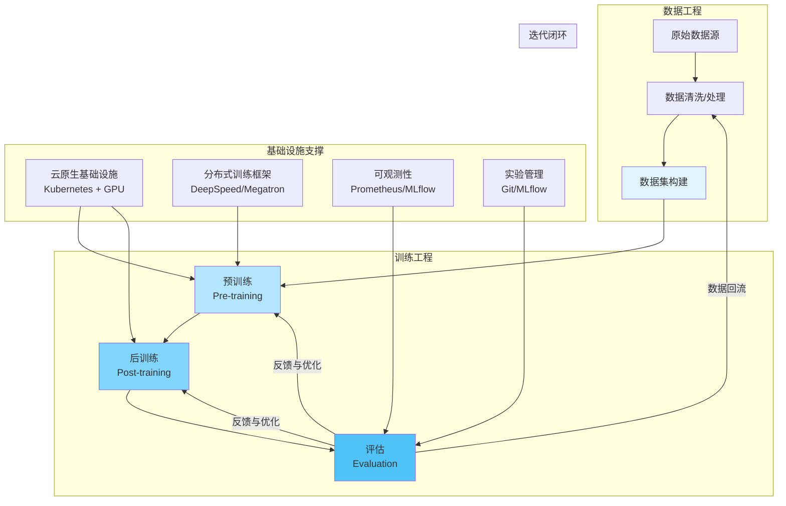

# 大模型训练的工程化路径

> 训练一个大模型，是现代软件工程最复杂、最考验协作与系统能力的实践。工程体系的成熟度，决定了 AI 能否真正落地。

在 AI 基础设施的全景中，**模型训练**是最复杂、最考验工程体系的环节。它不仅仅是调参与算法的游戏，更是一场关于数据、算力与系统协作的“工程马拉松”。

本文将从工程师视角，系统梳理大模型训练的关键阶段、核心挑战与架构演化路径，帮助读者理解——为什么训练一个模型，是现代软件工程最复杂的系统实践之一。

## 模型训练的整体视角

现代大语言模型（LLM）或多模态模型的训练，通常分为三个主要阶段：

- **预训练（Pre-training）**：构建基础语言或知识能力。
- **后训练（Post-training）**：让模型学会“对齐”人类意图。
- **评估与迭代（Evaluation & Iteration）**：通过指标和反馈持续优化。

这三个阶段共同决定了模型的性能、可用性与演化潜力。每个阶段都对工程体系提出了极高要求。

## 预训练：让模型“理解世界”

预训练阶段是大模型的基石。在这一阶段，模型通过海量数据学习语言结构与语义模式。

工程实践中，预训练的关键点包括：
- **数据质量**：TB 级语料的清洗、去重、平衡与分词。
- **数据管线**：高吞吐的数据加载、混合采样与压缩。
- **分布式训练**：使用 DeepSpeed、Megatron、FSDP 等分布式训练框架在多 GPU 集群上高效并行。
- **算力管理**：GPU 拓扑优化、checkpoint 策略、能耗监控。
- **可观测性**：通过监控 loss 曲线与吞吐量指标，判断训练稳定性。

工程本质在于**系统稳定性与资源效率**。在规模化训练中，任何微小的吞吐下降、梯度爆炸或数据偏差，都可能导致数十万 GPU 小时的浪费。

## 后训练：让模型“更听话、更有用”

后训练阶段的目标，是让模型从“语言学家”变成“对话者”，即学会遵循指令、表达礼貌、具备推理与任务执行能力。

下表总结了主流后训练技术路径及其工程要点：

| 方法 | 目的 | 核心要素 |
| :--- | :--- | :--- |
| **SFT（监督微调，Supervised Fine-tuning）** | 让模型模仿高质量人类指令 | 需构建干净、均衡的任务数据集 |
| **RLHF（人类反馈强化学习，Reinforcement Learning from Human Feedback）** | 通过偏好学习优化输出质量 | 结合奖励模型与强化策略 |
| **DPO（直接偏好优化，Direct Preference Optimization）** | 简化 RLHF 过程，直接学习人类偏好 | 训练更稳定，计算成本更低 |
| **多轮指令微调** | 提升上下文保持与对话一致性 | 关注长上下文与角色切换 |

工程要点包括：
- 构建可持续更新的指令数据集。
- 自动化评测与回归检测。
- 模型与人类标注的协作闭环。
- 参数高效微调（如 LoRA、QLoRA）以降低成本。

后训练的核心是 **“对齐”（Alignment）** ：不仅对齐模型输出与人类偏好，也要对齐企业目标与系统约束。

## 评估与迭代：从实验到产品

模型训练不是一次性任务，而是持续版本化的过程。评估与迭代环节决定了模型能否真正落地为产品。

评估的主要维度包括：
- **通用能力**：语言、逻辑、数学、代码等。
- **实用性**：指令执行、事实准确性。
- **安全性**：有害内容、偏见控制。
- **性能健康**：loss 趋势、参数稳定性、checkpoint 完整性。

工程体系方面，常见的实践有：
- 自动化评测管线（benchmark runner）。
- 版本化模型注册与对比。
- 可追溯的实验记录（如 MLflow、Weights & Biases）。
- 自动回滚与模型回测机制。

模型开发的真正难点，不是“训练出结果”，而是**如何让每一次实验都可复现、可比较、可改进**。

## 从算法到系统：训练的工程化转变

大模型训练正经历从“算法驱动”到“系统驱动”的转变。其成功的关键，往往不在模型架构本身，而在底层工程体系的成熟度。

下表总结了各工程领域的核心挑战与云原生解决方案：

| 工程领域 | 核心挑战 | 云原生解决方案 |
| :--- | :--- | :--- |
| **数据管线** | TB 级语料预处理与分布式 I/O | Airflow / Argo / Spark |
| **算力调度** | GPU 集群弹性分配与容错 | Kubernetes + GPU Operator |
| **训练框架** | 通信、同步、混合并行 | DeepSpeed / FSDP / Megatron |
| **可观测性** | 监控与指标分析 | Prometheus + TensorBoard |
| **实验管理** | 版本化与可复现 | MLflow / GitOps |
| **成本优化** | 资源利用与能耗平衡 | Spot 实例 + 动态调度 |

**AI Infra 工程师的价值在于——让训练系统具备“可扩展、可观测、可复现、可持续”的能力。**

## 以“小步快跑”的思维构建训练体系

在工程实践中，一个行之有效的原则是：

> “Every big model starts with a small ablation.”

即便目标是千亿参数，也应从小规模实验开始。先验证再扩展，是避免灾难性失败的唯一方式。

这种思路包括：
- 用小模型快速验证架构与超参。
- 逐步增加数据量与参数规模。
- 建立稳定的 checkpoint 与日志体系。
- 在每个阶段都保证可观测与复现。

这正是 AI 工程文化的体现：**先确保稳定，再追求规模**。

## 一个工程化的训练流程示意

下方的流程图展示了大模型训练的主要工程环节及其基础设施支撑：

每一个模块都需要专业的系统支持。数据流、训练流与部署流的贯通，构成了完整的 AI Infra 基础设施。

## AI Infra 从业者的角色与机遇

下表总结了 AI Infra 相关方向的能力焦点与工程价值：

| 方向 | 能力焦点 | 工程价值 |
| :--- | :--- | :--- |
| **云原生基础设施** | 训练资源调度与容错 | 保证可持续训练 |
| **数据工程** | 高质量语料处理 | 提升模型上限 |
| **MLOps / AIOps** | 训练监控与自动化 | 加速实验闭环 |
| **系统优化** | 通信、I/O、显存管理 | 降本增效 |
| **开源与协作** | 参与社区生态建设 | 推动知识共建 |

未来的 AI 工程师，将不只是模型开发者，而是**支撑智能系统演进的基础设施架构师**。

## 总结

模型训练的终极目标，不只是得到一个强大的模型，而是建立一套**可靠、可扩展、可复现的智能系统生产方式**。

在这个过程中，算法提供方向，工程提供秩序，而文化——决定了一切能否持续。

> “AI 不仅属于科学家，更属于工程师。”