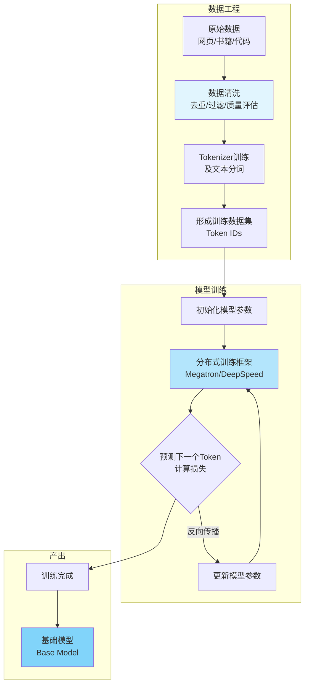

# 预训练：让模型“懂世界”的阶段

只有理解了预训练，才能真正明白大模型“聪明”的底层逻辑。

## 预训练：让模型“懂世界”的阶段

**预训练（Pre-training）**是大语言模型（LLM）能力的根基，它决定了模型对语言、世界知识、逻辑推理、写作风格等最底层能力的上限。

一句话总结：

> **预训练 = 在海量文本上学习语言统计规律，让模型具备通用能力。**

## 为什么需要预训练？

在正式介绍预训练的必要性前，需要明确：你不能直接教模型“怎么回答问题”，因为模型连最基本的语言规律都不知道。

预训练阶段的核心目标，是为模型建立如下基础能力：
- 词语之间的关联
- 段落之间的结构
- 世界知识（百科、论文、网站等）
- 推理与语言逻辑
- 长文理解能力
- 编程模式（预训练中含大量 GitHub 代码）

通过上述能力的积累，预训练后的模型才有可能成为：**能读、能写、能推理、能生成**的基础智能体。

## 预训练是如何进行的？

下面介绍预训练的核心任务。

预训练的本质任务是：**预测下一个 token**。

例如，给定如下输入：
> 北京是中国的首都，它位于……

模型的任务是预测下一个最有可能的 token（比如“华北”或“北方”）。

经过数十亿次这样的迭代，模型逐步学会了语言的统计规律和表达模式。

## 预训练的数据规模

为了让模型具备广泛的知识和能力，预训练通常需要极其庞大的数据集。下表展示了主流**大模型**的预训练数据规模与来源：

| 模型 | 预训练 tokens | 数据来源 |
| :--- | :--- | :--- |
| **GPT-4** | 数万亿 | Reddit、Books、Code、WebText、论文 |
| **LLaMA 3** | 15T | 多语言网页、Wikipedia、GitHub、学术论文 |
| **Qwen2** | 7T | 中文增强、跨模态、代码、网页 |

可以看到：
> **大模型的“聪明程度”高度依赖训练数据的质量和多样性。**

## 预训练的工程流程（从工程师视角）

从工程实现角度，预训练流程涉及多个关键环节。下方流程图直观展示了整个 **pipeline**：

每一个环节都非常关键：
- **数据清洗**（数据质量 > 数量）
- **Tokenizer 设计**（影响推理成本、中文效率）
- **训练策略**（全量训练 vs curriculum learning）
- **分布式训练框架**（Megatron-LM、DeepSpeed、FSDP）

如果你有**云原生**工程背景，对分布式训练、GPU 调度、Checkpoint 等内容会有天然理解优势。

## 预训练消耗的资源量

大型模型的预训练过程极为消耗资源，主要体现在：
- 数千张 A100/H100 **GPU**
- 持续数周甚至数月的训练周期
- 资金投入从几百万到数亿人民币

但这些投入带来的成果是值得的：
> **预训练模型 = 所有下游能力的基础。**

## 预训练的结果：基础模型（Base Model）

预训练阶段输出的基础模型，具备如下能力：
- ✅ 极其强大的语言理解能力
- ✅ 世界知识
- ✅ 逻辑推理
- ✅ 代码能力
- ❌ 不遵守人类指令
- ❌ 不懂安全
- ❌ 不会拒绝危险问题

因此，预训练后的模型通常 **“聪明但不听话”** 。下一阶段就是 **微调（Fine-tuning）** 和 **RLHF** 对齐。

## 总结

预训练阶段为大语言模型打下了坚实的能力基础。只有经过大规模、高质量数据的预训练，模型才能具备理解、推理和生成的通用智能。后续的微调和对齐，才是在此基础上的“锦上添花”。