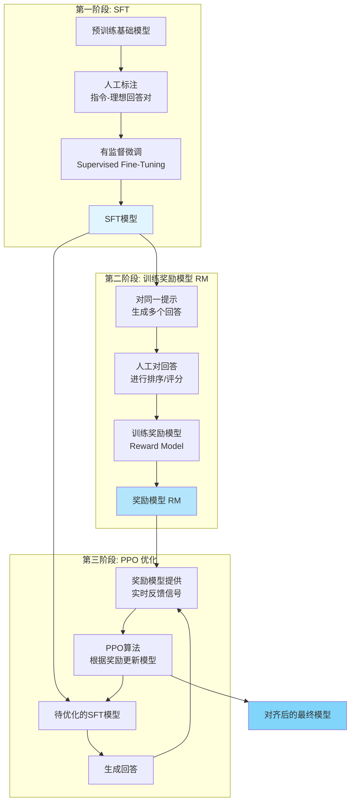
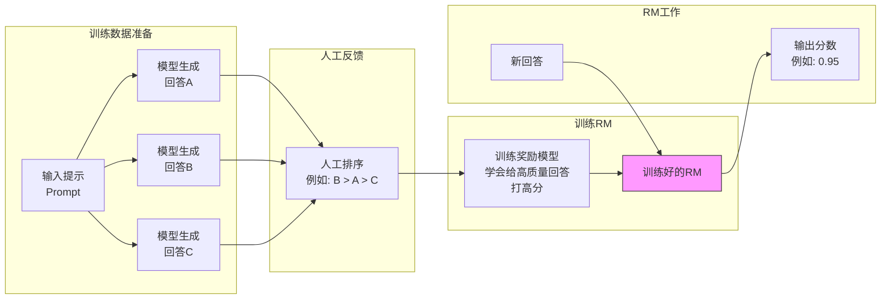
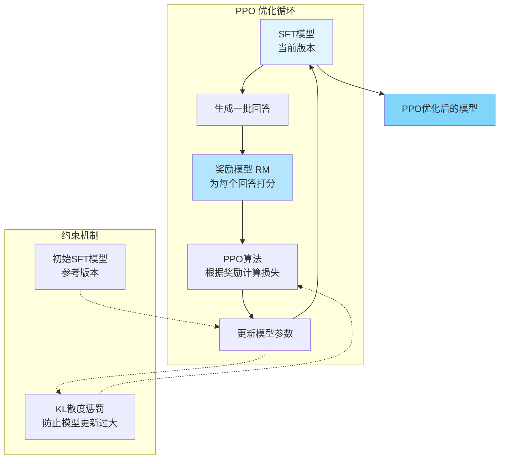

# RLHF：不是训练，是“让模型更像人”

> RLHF 不是让模型变聪明，而是让它更懂人、更安全、更可控。它是大模型“对齐”的关键。

## 为什么需要 RLHF？

人类反馈强化学习（RLHF, Reinforcement Learning from Human Feedback）是让大语言模型（LLM）更符合人类偏好、更安全、更可控的关键技术。

一个仅经过**预训练**的模型：

- 只是在预测下一个 token，容易胡说八道
- 不懂拒绝危险请求
- 不知道用户真正想要什么
- 可能输出攻击性、不安全内容
- 不会“对齐”人类价值

因此，需要 RLHF，让模型更像一个“懂规则、懂合作、懂用户意图”的助手。

一句话总结：

> **预训练让模型变强，RLHF 让模型变“乖”。**

## 用云原生工程类比理解 RLHF

下表用**云原生**工程视角类比 RLHF 的三大组件：

| RLHF 组件 | 云原生工程类比 | 含义 |
| :--- | :--- | :--- |
| **SFT（有监督微调）** | `apt-get install` 业务插件 | 教模型“该怎么回复” |
| **RM（奖励模型）** | Linter / 静态规则扫描器 | 判断“好回答 vs 坏回答” |
| **PPO（强化学习优化）** | 镜像回滚/自动调优 | 让模型逐轮变好 |

一句话类比：

> **RLHF 就像对模型做 CI/CD：SFT = 配置，RM = 检查，PPO = 优化循环。**
> **CI/CD（持续集成/持续部署）**：一种通过在应用开发阶段引入自动化来频繁向客户交付应用的方法。

## RLHF 全流程架构

下图展示了 RLHF 的三阶段整体架构：

该流程分为 **SFT、奖励模型（RM）、PPO** 三大阶段，逐步让模型行为对齐人类偏好。

## SFT（Supervised Fine-Tuning）：直接教模型“好回答”

**SFT** 是 RLHF 的第一步，也是最基础的一步。

目标是直接教模型什么叫“好回答”：
- 给模型大量「指令 → 理想回答」示例
- 让它模仿人类的表达和行为

例如：
> 用户：帮我解释 Transformer
> 回答：……

通过 SFT，模型第一次学会：
- 如何顺着对话回答
- 如何拒绝危险问题
- 如何按格式组织内容
- 如何像一个助手而不是语言模型

**云原生类比**：
就像在基础镜像里 `apt-get install` 一堆实用组件（API、交互风格、协作规则）

## 奖励模型（RM, Reward Model）：让模型知道“什么是好”

SFT 模型能回答，但不知道什么是“好”。所以要训练一个**奖励模型（RM, Reward Model）**。

奖励模型的训练流程如下：
1.  给预训练模型一个问题
2.  让它生成多个回答
3.  让标注人员按好坏排序
4.  用排序数据训练一个「好回答计算器」

奖励模型就像：
- Linter
- 代码审查规则
- 安全扫描
- 格式规范审查器

你可以把 RM 理解为：
> “一个用于评价回答质量的模型，他不是回答，而是负责打分。”

下图展示了奖励模型的工作流：

## PPO（Proximal Policy Optimization）：让模型不断变好

**PPO（Proximal Policy Optimization）**是 RLHF 的核心优化算法。

目标：
> 让模型在 RM 的评价下不断改进，使输出越来越符合人类偏好。

PPO 优化流程如下：
1.  SFT 模型生成多个回答
2.  RM 对它们打分
3.  PPO 根据奖励调整模型
4.  限制模型不要偏离太远（KL 惩罚）
5.  反复循环，逐批更新

为什么要 PPO？
- 不像 SFT 一次性写死行为
- 可以多轮优化
- 能学习“隐含偏好”和复杂行为
- 显著提升安全性和合作性

**云原生类比**：
> 就像自动化 Canary + 回滚：根据线上表现（奖励）自动调优镜像。

下图展示了 PPO 优化的循环过程：

## RLHF 的本质：让模型“对齐”人类

整个 RLHF 可以用一句话总结：

> **预训练** = 让模型拥有所有知识
> **SFT** = 让模型能像助手一样回答
> **RM** = 判断哪个回答更像人
> **PPO** = 让模型朝“人类偏好”方向反复优化

## 工程师视角：RLHF 带来了什么？

RLHF 带来的工程价值体现在：
- **更安全**（不输出危险内容）
- **更稳重**（减少幻觉）
- **更协作**（按用户意图说话）
- **更一致**（具备统一风格）
- **更懂格式**（能按 JSON、Markdown 输出）
- 更像一个“助手”而不是语言模型

## 总结

RLHF（Reinforcement Learning from Human Feedback）是让模型行为对齐的关键技术，包含三阶段：
- **SFT**：教模型如何回答
- **RM**：教模型分辨好/坏
- **PPO**：让模型不断变好

工程类比：
- **SFT** = `apt-get install` 业务逻辑
- **RM** = Linter + 风险审查
- **PPO** = 自动调优循环

本质作用：
- 让模型符合人类价值、符合用户意图、更加安全可靠