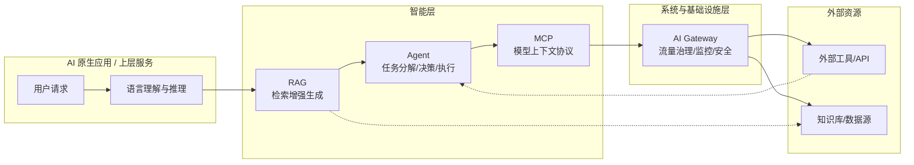

# AI 大模型技术全景：云原生工程师指南

:::tip 
AI 大模型正在成为云原生工程师的“第二引擎”，重塑架构与协作范式。
:::

AI 大语言模型（LLM）正在成为云原生体系的第二引擎。过去十年，云原生（Cloud Native）解决了算力调度、可观测性与交付效率等问题；未来十年，AI 将在智能调度、自治系统与认知接口层面重塑工程边界。

本文旨在帮助云原生工程师快速理解 AI 大模型技术体系的核心模块、关键能力、协作机制，以及如何与云原生架构融合。

## AI 大模型能力矩阵：从调用到编排

AI 大模型能力的演进可以分为多个层次。下表总结了云原生工程师视角下的 AI 大模型能力分层及其工程范式：

| 层次 | 能力焦点 | 工程范式 |
|:-----|:---------|:---------|
| API 调用层 | 调用云端或本地模型服务（如 OpenAI / vLLM） | SDK 集成 / REST 调用 |
| Prompt 层 | 通过提示词工程设计模型行为 | PromptOps / 模板化上下文 |
| RAG 层 | 让模型具备知识检索与上下文感知 | 向量数据库 / Embedding 管理 |
| Agent 层 | 构建具备决策与执行能力的智能体 | 工具编排 / MCP 协议 |
| Infra 层 | 提供底座支撑：调度、监控、安全与交付 | Kubernetes / AI Gateway / AIOps |

这种分层结构对应云原生工程中从服务调用到控制平面的演进路径。

## 应用与开发层：AI 大模型工程化的入口

在应用层，AI 不再只是“算法”，而成为一种“服务接口”（Model-as-a-Service, MaaS）。云原生工程师应像使用数据库或消息队列一样，以标准化方式调用、封装和管理 AI 模型。

**关键能力包括：**

- 熟悉模型 API / SDK 调用（如 OpenAI、Gemini、通义千问、vLLM 等）
- 理解 Token 成本与上下文长度的工程影响
- 在容器中部署和热更新模型服务
- 通过 Kubernetes（K8s）或 Istio 管理多模型流量（A/B 实验、负载均衡）
- 使用 Prompt 模板体系（如 Jinja2、LangChain、PromptOps）统一上下文输入

## 数据与存储层：向量化与知识增强

RAG（检索增强生成）让大语言模型从“会说话”变为“有知识”。在这一层，云原生工程师需关注如下能力：

- **Embedding 生成与存储**：使用 API 或本地模型生成向量
- **向量数据库选型**：如 Chroma（轻量）、Milvus（分布式）、PGVector（Postgres 扩展）
- **索引结构与距离度量**：IVF、HNSW、PQ 等影响检索性能
- **数据同步与持久化**：RAG 管道可通过 Airflow / n8n 自动化

这一层与云原生存储（如 CSI、对象存储、数据库 Operator）天然契合。例如，可以通过 K8s Operator 管理向量库生命周期，实现云上多租户隔离。

## 系统架构层：大模型服务化与基础设施解耦

大语言模型的运行对系统架构提出了新的要求。从云原生角度看，这意味着：

- **服务化**：模型封装为 gRPC/REST 接口（如 vLLM、TGI、FastAPI）
- **容器化**：镜像化模型与依赖，构建标准部署流水线
- **GPU 编排**：使用 Kubernetes + Device Plugin 管理显卡资源
- **多模型调度**：通过 AI Gateway 或自定义调度器路由请求
- **监控与弹性伸缩**：集成 Prometheus / KEDA / AIOps 进行自动扩缩容

在企业环境中，AI 系统逐步融入现有微服务网络。Service Mesh 负责通信治理，AI Gateway 负责模型路由与限流，Infra 层负责安全、认证、审计与观测。

## 模型开发与调优：让模型贴近业务

对于大多数工程师而言，完全训练一个模型代价高昂。但微调（Fine-tuning）与 LoRA（低秩适配）提供了可行路径：

- 使用领域数据（如客服语料、日志模板、合同文本）进行增量学习
- 采用低秩适配（LoRA）减少参数更新量
- 在 Hugging Face、PEFT、SGLang 框架中实现轻量微调
- 使用 vLLM 或 DeepSpeed 进行推理加速
- 结合 TensorBoard + MLflow 进行性能追踪与版本管理

微调的目标不是让模型更聪明，而是让它“更懂你”——即贴近你的业务领域和交互风格。

## AI 大模型技术体系协作关系

AI 系统不是单体，而是一套由模型、知识增强、工具协议与基础设施组成的协作网络。下图展示了从 LLM 到工具执行层的完整协作链路：

**各模块的职责如下：**

- **LLM**：语言理解与生成核心，提供推理、规划、生成、结构化输出等基础智能能力。
- **RAG**：知识增强层，为模型提供企业知识、长文本、外部文档与动态上下文。
- **Agent**：执行与决策层，负责任务分解、工具调用、计划与动作执行，可通过单 Agent 或多 Agent 协作完成业务流程。
- **MCP（Model Context Protocol）**：模型上下文协议，统一模型访问外部工具、数据源与资源的方式。作用类似**「AI 的系统调用层（syscall layer）」**：
  - 标准化工具能力（tools）
  - 标准化数据源（resources）
  - 标准化模型输入上下文
  - MCP 是一个开放生态标准，由多个组织共同推动，而不是任何公司独有的技术。
- **AI Gateway**：模型流量与策略控制，负责请求路由、限流、鉴权、审计、监控，多模型切换与 A/B 调度等。

这条协作链条体现了 AI 原生架构的核心逻辑：**LLM 负责思考，RAG 负责知识，Agent 负责行动，MCP 负责工具接入，AI Gateway 负责系统治理。**

## 学习与成长路径（面向工程师）

AI 大模型技术体系的学习与成长可以分为多个阶段。下表总结了每个阶段的目标与工程重点：

| 阶段 | 目标 | 工程重点 |
|:-----|:-----|:---------|
| 模型消费 | 通过 API 调用模型服务 | 掌握 SDK / Token 管理 |
| 上下文工程 | 提高提示词与输出稳定性 | Prompt 模板化 / PromptOps |
| 知识增强 | 集成检索与向量数据库 | RAG / Embedding / Index |
| 工具协作 | 引入多 Agent 与外部系统执行 | Agentic Framework / MCP |
| 系统工程化 | 部署可观测的 AI 系统 | GPU 编排 / AIOps / Gateway |
| 领域优化 | 微调与持续改进 | LoRA / Evaluation / Monitoring |

每个阶段都对应着不同的工程能力和成长目标，帮助你系统性地掌握 AI 与云原生的融合路径。

## 总结

AI 大模型技术的核心不在于算法，而在于工程化与系统化整合。对云原生工程师而言，AI 是一次“应用层认知 + 基础设施层重构”的双重升级。未来的 DevOps 将演进为 **AIOps + PromptOps + AgentOps**，而掌握这些能力，正是走向 AI 原生架构师的第一步。

