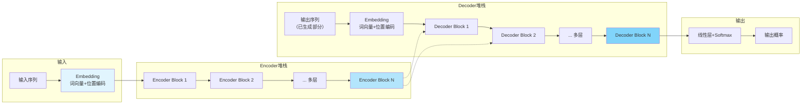
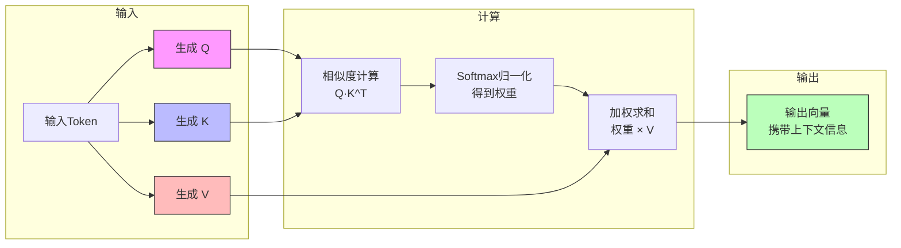
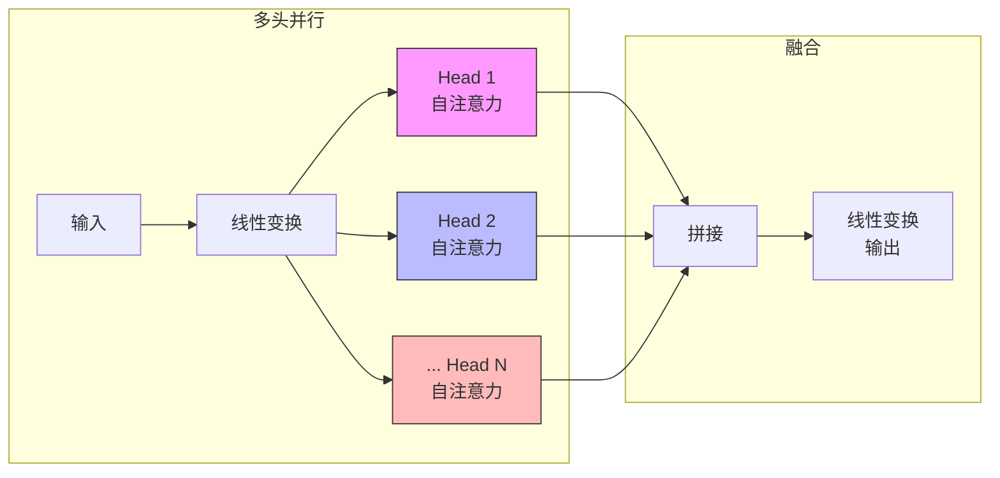
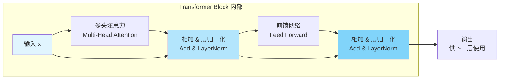

# Transformer 是什么？

> Transformer 是现代大模型的“发动机”。你无需懂数学推导，也能用云原生工程师的视角彻底理解它的本质。

## Transformer 是什么？

Transformer 是所有现代大语言模型（LLM）的基础架构，就像 Kubernetes 之于云原生。它的出现彻底改变了自然语言处理（NLP, Natural Language Processing）领域。

Transformer 主要解决了两个核心问题：

- 如何理解一段话中哪些信息最重要？
- 如何并行处理海量文本，不像循环神经网络（RNN, Recurrent Neural Network）那样慢吞吞？

答案就是：**自注意力机制（Self-Attention） + 全并行结构（Parallel Architecture） = Transformer**

## Transformer 为什么重要？

如果把大语言模型看作一个“能够理解和生成文本的系统”，那么 Transformer 就是它的底层引擎。

Transformer 的架构让模型能够：

- 自动捕捉长距离依赖关系
- 实现完全并行训练，极大提升效率
- 支持扩展到图像、语音等多模态任务

## 从云原生工程师视角理解 Transformer

从工程角度来看，Transformer 可以拆分为三大部分：

- **Embedding（输入适配器）**：将文本转为向量表示，加入位置信息。
- **Encoder / Decoder（两段式处理流水线）**：分别负责理解输入和生成输出。
- **Self-Attention（智能调度器）**：动态决定每个 token 关注哪些信息。

下图展示了经典的 Transformer 模型结构（工程改良版）：

上图中，输入经过 Embedding 后，分别进入 Encoder 和 Decoder 堆栈，最终输出语义结果。

## Transformer 的核心：它像一个“智能调度系统”

Transformer 的核心机制是**自注意力（Self-Attention）**，你可以把它类比为 Kubernetes 的 scheduler，只不过它调度的不是 Pod，而是“文本中的信息”。

> **Self-Attention = 决定当前 token 该关注哪些历史 token**

下表展示了 Attention 机制与调度系统的类比关系：

| 概念 | 类比 | 意义 |
| :--- | :--- | :--- |
| **Query (Q)** | 当前资源请求的属性 | 我现在需要什么？ |
| **Key (K)** | 所有候选资源的属性 | 谁能满足我？ |
| **Value (V)** | 资源的实际内容 | 最终要用的信息 |

Attention 的工作流程可以总结为：
1.  匹配 Query 和 Key，计算相似度
2.  通过 Softmax 得到注意力权重
3.  用权重加权 Value，得到最终信息

这就像 Scheduler：
- 查看当前调度请求（Q）
- 查看所有 Node 信息（K）
- 计算得分（注意力权重）
- 选择最合适的 Node（V）

## Self-Attention 内部到底发生了什么？（工程师友好版）

下面这张示意图展示了 Self-Attention 的内部计算流程：

在这个流程中：
- **Q** 决定“我想找什么”
- **K** 决定“我能提供什么”
- 相似度越高说明越相关
- 权重越高代表越重要
- 权重 × V 的结果就是模型真正关心的上下文

## Multi-Head Attention：不是一个调度器，而是 N 个

多头注意力（Multi-Head Attention）机制可以理解为多个调度器并行工作，每个 Head 关注不同的语义特征（如位置、语法、实体关系、长距离依赖等）。

下图展示了多头注意力的结构：

工程视角下：
- **多头 = 多视角**
- **拼接后合并 = 整体理解语义**

## Feed Forward Network（FFN）：类似业务逻辑处理器

Self-Attention 负责捕获“关系”，而**前馈网络（Feed Forward Network, FFN）**则负责捕获“模式”。

可以类比 Service Mesh 架构：
- **Self-Attention** 像 Envoy Sidecar：负责路由和策略
- **FFN** 像 Workload：决定业务逻辑（如转换、推断）

每层 Transformer block 的结构如下：
**Attention → FFN → 输出**

这种结构让模型既能理解上下文关系，又能执行语义级别的处理。

## Residual + LayerNorm：像 Sidecar 的校验和稳定机制

没有**残差连接（Residual）**，模型会：
- 无法训练深层结构
- 信息容易丢失
- 梯度会爆炸或消失

你可以把它理解成：
- **残差连接** = 保留原始输入的旁路（类似 Kubernetes controller 的对照原状态）
- **LayerNorm** = 每层的健康检查与校验器（保持数值稳定）

下图展示了 Residual 和 LayerNorm 的组合结构：

这种设计保证了模型的稳定性和可训练性。

## Encoder vs Decoder：为什么 LLM 只用 Decoder？

早期 Transformer 架构包含 Encoder 和 Decoder 两部分：

| 组件 | 用途 | 应用 |
| :--- | :--- | :--- |
| **Encoder** | 提取输入的语义表示 | 翻译、分类 |
| **Decoder** | 根据上下文逐字生成内容 | LLM、文本生成 |

大语言模型（如 GPT 系列）只使用 **Decoder** 堆栈，因为它：
- 逐字生成
- 需要掩码自注意力（防止偷看未来）
- 天然适合对话与生成式任务

一句话总结：

> **LLM 是纯 Decoder Transformer**

## 总结

Transformer 可以被看作：
- 能够自动确定“该关注什么信息”的智能调度系统
- 能并行处理所有输入的结构化计算图
- 由 Attention + FFN 组成的深度流水线处理架构

它之所以能引领 AI 时代，原因在于：
- 能理解长距离依赖
- 能完全并行训练（比 RNN 快 100 倍）
- 能扩展到图像、语音、多模态
- 能利用 KV Cache 实现高速推理
- 是所有现代大语言模型（LLM）的底层架构
