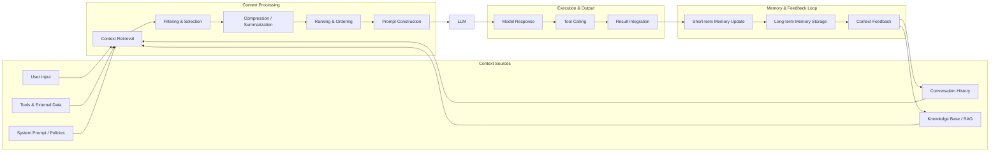
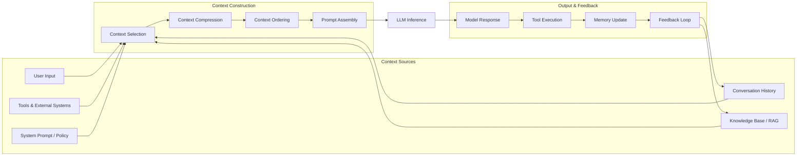

# 上下文生命周期与编译模型

> 上下文工程的本质不是“模型能看到多少 Token”，而是如何让智能体系统的上下文在生命周期内有序演进、收敛和淘汰。

在长期运行、具备自治能力的智能体系统中，缺乏系统化的生命周期管理会导致上下文膨胀、退化甚至失控。本章将上下文视为一种工程对象，提出可落地的上下文生命周期与编译模型，为生产级智能体系统设计提供指导。

## 上下文膨胀的本质问题

在真实的智能体应用中，上下文增长往往呈现结构性失控：

- 用户输入不断累积
- 工具调用产生大量中间结果
- 记忆检索与文件加载引入大体量数据
- 多轮推理留下冗余轨迹

早期系统通常采用“无限拼接”的方式，将所有历史直接追加进 prompt。这种策略在工程实践中会迅速遇到挑战：

- **成本不可控**：上下文越长，推理成本和延迟急剧上升
- **信号衰减**：历史噪音掩盖当前决策信号
- **窗口上限**：再大的上下文窗口也存在物理边界

因此，工程上需要为上下文设计完整的生命周期管理机制，而非一次性构建。

## 上下文生命周期模型

为系统性解决上述问题，可以将上下文生命周期拆解为六个明确阶段，每一阶段都有清晰的责任边界与工程动作。

下方流程图展示了上下文生命周期的主要阶段及其关系。



## 生命周期各阶段的工程职责

本节详细介绍每个生命周期阶段的工程目标与实现要点。

### 上下文摄入（Ingestion）

该阶段的目标是接收所有可能影响决策的信息源，包括用户输入、工具调用结果、Memory 检索结果、外部文件或 Artifact。

- 仅做接收，不做筛选
- 不直接进入 prompt
- 必须结构化存储

**典型实现：**

- Google ADK：Event 记录
- LangGraph：State 更新
- Claude SDK：Tool Output

### 结构化与归一（Normalization）

此阶段将异构输入统一为系统可处理的中间表示（IR, Intermediate Representation），如 Event（时间序列）、State（可变键值）、Document（可检索文本）。

- 与模型 API 解耦
- 与 prompt 格式无关
- 支持后续压缩、过滤、重排

### 筛选与作用域控制（Selection & Filtering）

该阶段决定哪些信息有资格进入当前执行，是上下文工程中允许“丢弃信息”的关键环节。

筛选维度包括：

- 相关性（Relevance）
- 时间窗口（Recent / Sliding Window）
- 权限与作用域（Agent / Subagent）
- 类型过滤（如忽略调试日志）

**责任归属：**

- 策略由系统或工程师定义
- 决策可由 Agent 触发（如按需加载 Memory）

### 上下文编译（Compilation）

这是上下文工程的核心阶段。系统将持久状态转换为一次性工作视图（Working Context），可类比为编译流水线：

```text
Raw State
 → Filter Pass
 → Ordering Pass
 → Formatting Pass
 → Cache-Aware Pass
 → Working Context
```

- 每次调用重新编译
- 不可变、短生命周期
- 可插拔处理器（Processor）

Google ADK 的 Processor Pipeline 是该模型较为完整的实现之一。

### 上下文消费（Execution）

在此阶段：

- 模型仅能看到 Working Context
- 不可直接访问底层 Session / Memory
- 工具调用是获取额外信息的主要方式

这一阶段明确了边界：上下文工程负责“看到什么”，而不是“怎么想”。

### 压缩与淘汰（Compaction / Eviction）

执行完成后，上下文可能继续增长，需要进行收敛。常见策略包括：

- **Compaction**：摘要旧事件，生成 Summary Event
- **Eviction**：TTL 到期后删除或冷存

该阶段通常异步执行，不阻塞主流程，并影响后续轮次的上下文构建。Claude SDK 的自动 compaction 是该策略的典型代表。

## 上下文编译模型的工程定义

基于上述生命周期，可以给出如下工程定义：

> 上下文不是存储的数据，而是对系统状态的一次“编译产物”。

这意味着：

- Session / Memory / Artifact 是“源代码”
- Working Context 是“可执行文件”
- Processor 是“编译 Pass”

该模型带来三方面工程收益：

- 存储与呈现解耦，可独立演进
- 可观测性，每个编译阶段可调试
- 缓存友好，稳定前缀可复用

## 主流框架上下文生命周期机制对比

下表对比了主流智能体框架在上下文生命周期机制上的设计差异，便于理解各自的工程侧重点。

| 框架             | 生命周期特征                                                 |
| :--------------- | :----------------------------------------------------------- |
| Google ADK       | 明确区分 Session（存储）与 Working Context（编译视图），通过 Processor Pipeline 构建上下文，支持压缩、缓存与作用域控制 |
| Claude Agent SDK | 内置 Compaction 机制，强调 Agentic Search 与文件系统作为上下文来源，子代理隔离上下文 |
| LangGraph        | 短期状态 + 长期记忆分层，Checkpoint 持久化，向量检索作为补充上下文 |
| AutoGen          | 通过多代理分工隐式控制上下文规模，当前尚未提供显式生命周期流水线 |

## 最小可实现的上下文生命周期示例

以下伪代码展示了 Selection → Compilation → Execution → Compaction 的核心路径，便于理解工程实现的最小闭环。

```python
context = ContextBuilder()

context.add(system_instructions)
context.add(agent_identity)

events = select_recent_events(session.events, limit=20)
context.add(events)

if need_memory(query):
    context.add(load_memory(query))

context.compact_if_exceed(max_tokens=8000)

llm.call(context.build())
```


## 上下文工程与 Agentic Runtime 的关系

下方流程图展示了上下文工程与 Agentic Runtime 的协作关系，帮助理解两者在系统架构中的分工。



在系统架构中，Runtime 负责长期存在的基础设施与约束，Context Lifecycle 负责一次执行中可见的世界。两者协作，确保智能体系统既具备长期记忆与资源管理能力，又能高效生成每次调用所需的上下文视图。

**Runtime 主要组件及职责：**

| 组件                     | 职责                               |
| :----------------------- | :--------------------------------- |
| Scheduler / Orchestrator | 控制执行节奏、并发、Agent 交接     |
| Execution Engine         | 驱动 LLM、Tool、Code 执行          |
| State Store              | 持久化 Session / Agent State       |
| Artifact Store           | 存放大对象（文件、日志、模型输出） |
| Memory Service           | 长期语义记忆（向量、索引）         |
| Policy & Cost Control    | Token、权限、预算、速率限制        |

这些组件不直接进入 prompt，但为上下文工程提供“原材料”和“约束”。

**Context Lifecycle 主要阶段与依赖：**

| 生命周期阶段          | Runtime 依赖                    |
| :-------------------- | :------------------------------ |
| Ingestion             | Artifact / Memory / Tool Output |
| Normalization         | State Store 的结构化数据        |
| Selection & Filtering | Scheduler + Policy              |
| Compilation           | Execution Engine 的输入接口     |
| Execution             | Runtime 执行一次原子步骤        |
| Compaction / Eviction | 回写 State / Memory             |

上下文生命周期的边界是一次执行（Invocation），这是工程实现中的关键点。

## 总结

上下文生命周期管理是智能体系统实现可靠自治的基础工程能力。通过将上下文建模为有明确阶段、可插拔处理、可编译视图，工程师能够在有限上下文窗口内构建长期运行、可扩展、可调试的智能体系统。

后续章节将进一步探讨运行态上下文（Agent Execution Context）与智能体控制闭环、Agentic Runtime 的深度结合，推动上下文工程向完整的智能体运行时模型演进。