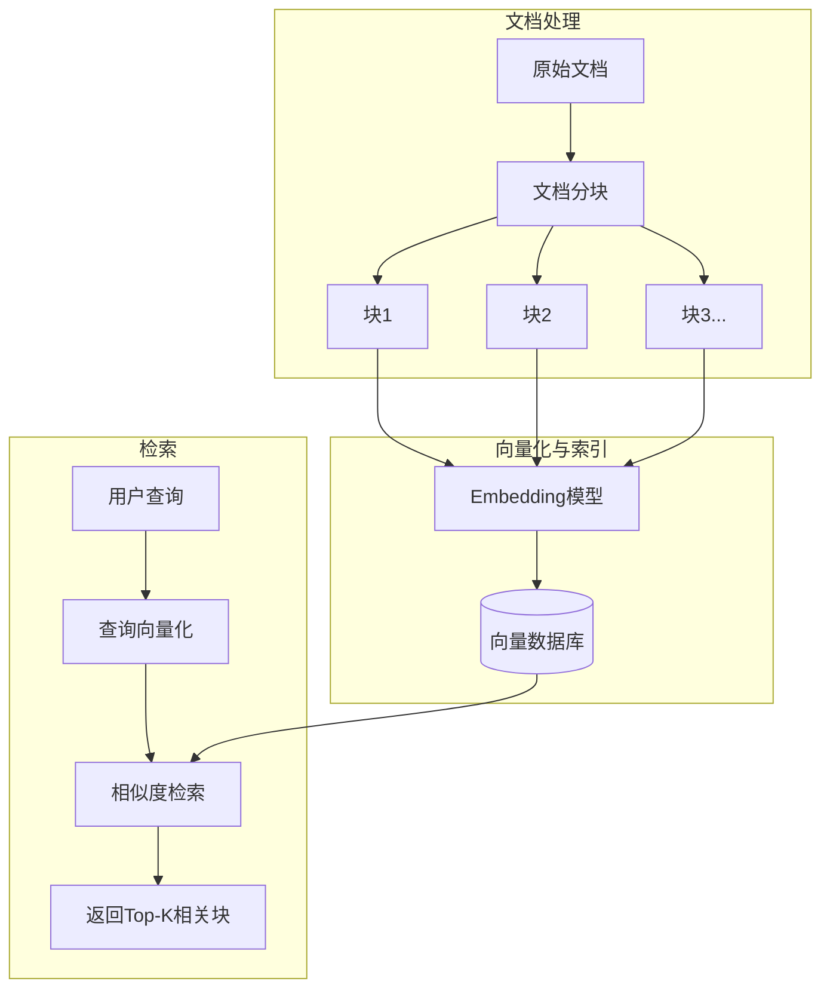
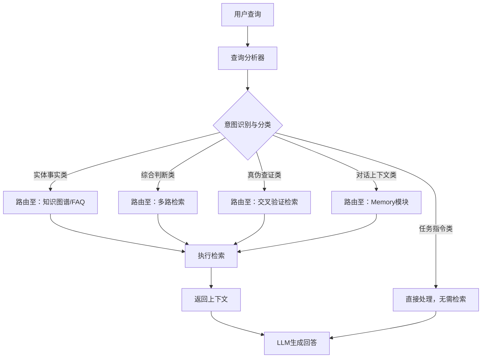
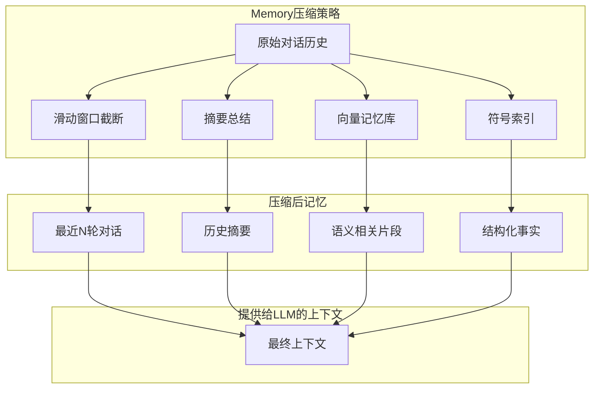
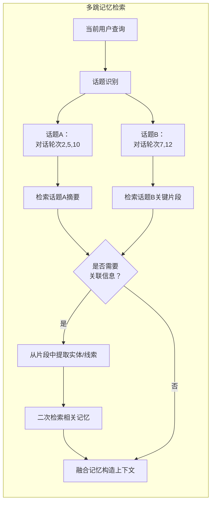

# 上下文建模与检索

> 谁掌控了上下文，谁就掌控了智能的边界。本文聚焦上下文工程的核心挑战与创新实践，助你构建更可信赖的 AI 系统。

## 上下文建模方法论

在 RAG（检索增强生成）与 Agent（智能体）系统中，“上下文”指模型回答时可参考的外部信息来源，包括知识库文档片段、对话历史等。科学的上下文建模方法论涵盖问题刻画、文档切分、索引 Schema（结构定义）设计及动态路由策略等环节，确保检索到既相关又充分的信息供模型生成答案。

在深入各环节之前，我们先从问题刻画说起。

### 问题刻画：识别信息需求类型

不同问题类型对上下文的需求差异巨大。首先需对用户提问进行分析归类，刻画其信息需求类型，以决定后续检索和记忆策略。例如：

- **实体事实类问题**：如“某人出生于哪一年？”，通常只需检索单一事实，可直接查 FAQ 或知识图谱。
- **综合判断类问题**：如“评价产品 A 和 B 的区别”，需多方面资料支持，检索多条上下文供模型分析。
- **真伪查证类问题**：需检索可信来源交叉核实，再由模型基于证据给出结论。
- **对话上下文类问题**：如“我之前提到的方案有哪些优点？”，需从对话记忆中提取相关内容。
- **任务指令类请求**：如“请帮我把以上文章摘要为中文”，直接对给定文本操作，无需外部检索。

通过意图分类或规则解析，可动态路由不同类型问题走不同流程。精准刻画问题类型是上下文工程的第一步，有助于减少不必要的检索开销和干扰信息。

在明确问题类型后，下一步是选择合适的文档切分策略。

### 检索单元切分策略对比

合理的文档切分策略是 RAG 系统的数据基础。切分粒度过大会导致不相关内容混入，过小又可能割裂语义。下面对常见文本分割（Chunking）策略及其特点进行对比。

| 切分方式 | 优点 | 缺点 | 适用场景 |
| :--- | :--- | :--- | :--- |
| **固定长度切分** | 实现简单，块大小统一，利于批量向量化和索引 | 可能割裂语义，上下文不连贯，重要信息可能跨块（需通过首尾重叠缓解） | 简单结构文本，速度优先场景 |
| **按段落/句子切分** | 保留完整语义单元，遵循原文逻辑，块内容自洽 | 块长度不一，大段文本可能超过模型 token 限制，过短句子信息不足 | 结构清晰的文章、报告 |
| **滑动窗口切分** | 相邻块内容重叠，保持上下文连续，减少细节被切开风险 | 冗余度高，重复存储增加索引规模，块数量增加带来检索和计算开销 | 法规、技术资料等需严格语境连贯的长文本 |
| **语义感知切分** | 基于 Embedding（嵌入）或模型按语义分段，主题集中，提升检索相关度 | 实现复杂需训练模型，计算开销大，分割过程较慢 | 技术手册、论文等主题明确且查询复杂场景 |
| **混合策略切分** | 多种策略结合，动态切换，效率与上下文间平衡 | 逻辑复杂需决策算法，系统更难维护，调优成本高 | 泛化型系统，需处理多种文档与查询类型 |

通常，开发者会根据文档结构和查询需求选择合适的策略。例如结构化明确的文档优先按章节段落切分，长篇连续文本可采用固定长度加滑动窗口保证覆盖。也有先进方法利用 LLM（大语言模型）决定切分边界（Agentic Chunking）或在 chunk 中附加摘要/元数据提高上下文连续性。

下图展示了 RAG 流程中基于关键词的文档 Chunk 检索示例，有助于理解检索流程的各个环节。



通过合理的分块策略，可以在保证语义完整的前提下，使每个片段尽可能简明相关，利于后续向量匹配和检索融合。

在完成切分后，下一步是设计高效的索引字段 Schema。

### 索引字段设计：字段 Schema 与聚合检索

设计向量索引的 Schema 相当于为知识库定义“记忆存储格式”。优秀的索引设计应便于存储检索，同时保留必要的元数据以支持结果过滤和出处关联。常见字段及设计要点包括：

- **唯一标识字段**：每个文档片段需唯一 ID，作为主键索引。
- **文本内容字段**：承载可被 LLM 读取的内容块文本，设为可全文检索且可原文提取。
- **向量嵌入字段**：存储内容块的向量表示，用于相似度检索，需定义向量维度。
- **元数据字段**：如文档来源、标题、作者、日期、标签等，便于过滤和引用。

下面是一个索引 Schema 模板示例（YAML 格式），便于开发者参考和扩展。

```yaml
# 知识库索引 Schema 示例
name: knowledge-index
fields:
  - name: id                # 主键 ID
    type: string
    key: true
  - name: content           # 文本内容
    type: text
    searchable: true
    retrievable: true
  - name: content_vector    # 向量嵌入
    type: vector<float>
    dims: 768
    searchable: true
    retrievable: false
  - name: title
    type: string
    filterable: true
    retrievable: true
  - name: source
    type: string
    filterable: true
    retrievable: true
```

良好的 Schema 设计应兼顾语义匹配与精确过滤需求，必要时通过聚合多路检索结果来确保既找得到、又找得准。

完成索引设计后，系统还需根据任务动态选择检索与记忆机制。

### 动态路由策略：智能检索器与记忆的选择

动态路由策略指系统根据当前任务意图和查询类型，自动选择适合的 Retriever（检索器）或 Memory（记忆）机制，以优化上下文提供。常见策略包括：

- **检索 vs. 不检索**：判断是否需检索外部知识，简单事实类问题可直接查缓存或让 LLM 回答。
- **知识库选择**：根据意图或领域选择不同知识库或检索器。
- **检索方法选择**：根据查询内容特征选择最佳检索算法。
- **内存 vs. 外部**：涉及对话历史的提问优先检索对话 Memory。
- **工具路由**：在 Agent 框架中，LLM 可通过推理决定调用哪种工具。

动态路由的核心是“查询分析”。通过机器学习分类器或规则树，对输入问题多维度打分，决定调用哪个模块并设定参数。分级路由可显著减少不必要的 RAG 调用，提高系统效率。



在检索到上下文后，如何控制输出结构和提升可信度也至关重要。

## 输出控制与可信性提升

大模型往往倾向自由生成不受限制的文本，这在产品场景中可能导致格式不符、内容偏差甚至不符合事实。因此需要从输出格式和内容可信度两方面进行控制。

### 限定输出结构：JSON/Schema/正则

结构化输出需求在很多场景存在，例如要求模型输出 JSON 对象以便下游程序解析，或遵循给定的 Markdown 模板。可以通过以下方式实现：

- **模式化提示**：在 Prompt 中明确要求输出固定格式，并给出示例。
- **Few-shot 示例**：让模型模仿结构。
- **函数/工具约束**：如 OpenAI 函数调用，定义参数 JSON 模式。
- **输出解析与纠偏**：生成后用代码校验输出格式，不符则反馈重试。

下面是一个正则校验 JSON 格式的示例代码，帮助开发者理解如何自动检测输出结构。

```python
import re
# 假设要求输出格式为 {"answer": "...", "source": "..."}
pattern = re.compile(r'^\{\s*"answer":\s*".+",\s*"source":\s*".+"\s*\}$')
llm_output = '{"answer": "答案是42", "source": "文档A"}'
if pattern.match(llm_output.strip()):
    print("输出格式符合要求")
else:
    print("输出格式不符合要求！")
```

通过这些措施，可大幅降低模型胡乱输出导致下游出错的概率。

除了结构控制，提升回答的可信度同样重要。

### 工具验证与 RAG 可信度归因

引入外部检索和工具后，模型回答的可信度提升成为可能。具体手段包括：

- **要求引用来源**：让模型在回答中附上所用资料的出处，如文档名称、网址链接等。这可以在 Prompt 中明确要求：“请在答案中引用你用到的资料来源”。在内部知识库场景，可让模型返回知识片段的 ID 或标题作为引用。例如：“根据文档《安全指南》第 2 页，【Doc123】……”。用户据此可以追溯答案出处，增强信任。将块和其来源关联起来对提供上下文和后续追问很有用。在实际实现中，可将检索得到的每段内容附加元数据标识传给 LLM，让它在引用该内容生成回答时自动带上标识。
- **工具结果核验**：对于 Agent 使用工具的场景，每当模型调用一个工具并获得结果后，验证该结果是否合理。简单场景如计算器工具，Agent 应将计算结果插入答案而非凭空计算，并在日志中记录调用。对于检索工具，Agent 应检查检索内容是否包含可能的答案。如模型试图生成超出检索内容的事实，应触发进一步检索或提醒不确定。TruLens 等框架通过反馈函数可以自动衡量每步工具结果与最终回答的关系，确保关键步骤正确利用。
- **交叉检索验证**：一种提高事实准确性的技术是在得到初步答案后，再用该答案的关键信息重新检索验证。例如模型回答了某年份，可以再次查询验证该年份是否在资料中存在；模型给出某定义，可再次检索定义是否与权威资料一致。如果发现不一致，可以标记回答不可靠。类似地，可以引入第二个 LLM 角色（Critic 批判者）来根据提供的检索资料检查第一位助手的回答是否与资料一致，从而打分或让其修改。这在学术 QA 等场景常用于减少幻觉。
- **响应内容过滤**：可信度不仅指事实准确，也包括避免不当内容。对模型最终输出可叠加内容安全过滤（如检查有无敏感词、隐私信息等），这些超出本文范围但在工程上也属输出可信性的部分。这里重点强调事实依据：RAG 系统应尽量做到 “言之有据”，当无据可依时，宁可明示不能回答也不要编造。

### 无依据回答的拒绝策略

当检索结果不足、或问题超出知识库/模型能力范围时，一个健壮的系统应学会拒答或委婉回答无法完成，而非输出幻觉内容。这需要提前设计并在 Prompt 中明确策略：

- **明确拒答触发条件**：例如如果检索 Top k 文档相似度分数都很低（低于某阈值），说明知识库里可能没有答案，此时系统可以走拒答流程。又如对于法律咨询等高风险领域，哪怕检索到信息，模型信心不足时也应拒绝给确定结论。
- **拒答话术模板**：在 Prompt 中提供统一的拒答格式，如“很抱歉，我无法找到相关信息来回答这个问题。”并强调当没有依据时就使用该回复。OpenAI 官方指南也建议使用诸如“我不确定”之类的短句。通过 Few-shot 示例可以让模型学会在适当条件下给出类似回答而不是硬编。
- **条件诱导**：可以利用系统消息监控模型行为，例如一个隐式条件：“如果 Sources 为空，则回答‘根据我目前掌握的信息无法回答。’”。LangChain 等可以在检索后检查返回内容列表，若为空则改写用户问句为提示模型回复拒绝语。
- **用户交互兜底**：有时可以引导用户提供更多信息而不是直接拒绝。例如回答：“我没有检索到相关信息，您是否有更详细的线索？”这种交互式的拒答在聊天 Agent 中体验更好。不过前提是确认模型没有随便乱答。

通过这些策略，可最大限度避免 “一本正经地胡说” 情况的发生。当模型确实给不出有依据的回答时，直接拒绝或说明未知，比编造一个听起来合理但错误的答案，要更符合可信 AI 原则。上文给出的 Prompt 模板示例就包含：“If you don’t know the answer, just say that you don’t know”（如果你不知道答案，只需说不知道），这类明确指令对减少幻觉回答很有效。在实际应用中，我们会平衡用户体验来定制拒答话术，使其礼貌且不唐突，同时保证不传播错误信息。

在掌控检索与输出后，长对话场景下的记忆管理同样关键。

## Memory 与 Agent 融合策略

长对话场景下，仅靠 LLM 自身的上下文窗口难以承载全部历史信息，因此需要 Memory（记忆）模块配合。Memory 可以视作 Agent 的“长时记忆”，包括对话历史摘要、用户提供的长期资料等。以下讨论如何压缩长对话记忆、实现多跳 Memory 检索以及在 Agent 框架中跨工具传递上下文的策略。

### 长对话记忆压缩策略

随着对话轮数增加，早期内容会被模型遗忘或截断，为保持对话连贯性，需要对旧对话进行压缩。压缩的目标是在不丢失关键信息的前提下减少占用的 token。常用方法有：

- **摘要总结（Summarization）**：定期将对话内容提炼总结成简短段落。比如每进行 10 轮对话，就让模型或规则脚本将之前的对话要点压缩成一段摘要。摘要应尽量客观准确地记录关键信息和结论。后续对话中，可将摘要作为上下文的一部分提供给模型。这样模型能“记住”之前的讨论重点，而细节省略。这种方法需要注意持续更新摘要，或维护多层摘要（如逐段汇总）。
- **向量记忆库（Embedding Memory）**：将每轮对话消息通过 Embedding 映射为向量，存入向量数据库中。当需要回忆时，以当前对话内容为查询向量，检索最相关的若干历史对话片段。例如用户再次提到某个名字，就可以向量检索过去出现该名字的句子，再提供给模型参考。这种语义记忆方式可以突破时序限制，从海量历史中抓取关联内容。其挑战在于需要维护一个专门的向量索引用于对话记录，并对检索结果做筛选，以免引入不相关历史。
- **符号索引和知识存储**：将对话中浮现的重要事实和人物关系等，用结构化形式存入 Symbolic Memory（符号记忆）。比如构建一个小型知识图谱：节点是对话中出现的实体，边是关系。或者维护一张表格，记录用户提供的个人信息（姓名、喜好等）。当需要回答相关问题时，从这些结构化记忆中检索精确信息。这种方法相当于让 Agent 在对话中持续学习构建一份知识库，后续查询直接从中获取答案。这在场景如面向特定用户的长周期助理中很有价值，可确保个性化的一致性。
- **滑动窗口截断**：这是最简单粗暴的方法——只保留最近 N 轮对话作为上下文提供，较早的直接丢弃。当上下文窗口有限时常被采用。不过容易导致模型忘记之前承诺或定义的内容，因此常与摘要结合，即 “最近对话 + 旧对话摘要” 一并提供，以兼顾近期细节和长期背景。

在具体实现时，往往多种策略配合。比如 LangChain 提供了多种 Memory 类：ConversationBufferMemory（简单缓冲全部对话，超长时截断）、ConversationSummaryMemory（利用 LLM 对对话摘要）和 ConversationVectorStoreMemory（向量存储对话）等，可以组合使用。研究表明，通过对历史对话进行评分、过滤或摘要压缩等预处理，可以将有效信息密度大大提高。例如只保留用户明确告知的事实、需求等，而闲聊寒暄部分不存储，来减小记忆负担。无论哪种方法，都应确保压缩不丢关键：设计摘要 Prompt 时要求“保留所有已明确的结论和用户提供的重要信息”，并可能通过日志或人工校验压缩效果，以免在压缩环节引入信息遗漏或错误。



在对话记忆压缩基础上，系统还需支持多跳检索和话题持续性。

### 多跳 Memory Routing 与话题持续性

多轮对话中用户可能跳话题再返回之前的话题，这对 Memory 调度提出要求。所谓多跳 Memory routing，是指系统能够从当前话轮出发，跳回之前相关的内容块，甚至跨越多段摘要或记忆找到连接点，形成解答。这需要话题持续性的检测与跟踪：

- **话题分段与标记**：可以为每段对话打上话题标签或 ID。当用户提起一个过去话题，可以识别其标签，然后从 Memory 中检索该标签相关的所有要点。例如对话第 2 轮和第 10 轮都在讨论“产品价格”，那么当第 15 轮用户再问价格时，系统应取出第 2 和 10 轮的内容或摘要。话题检测可利用文本聚类或 LLM 分类，将每轮对话归类，并生成话题标签。
- **多跳检索机制**：在需要关联多个不同话题的信息时，系统需具备多跳检索能力。即先检索到第一个相关记忆，然后从中提取新的线索（如提到的实体、事件），再用这些线索进行第二轮、第三轮检索，直至找到足以回答当前问题的综合信息。这类似于图数据库的遍历查询或知识图谱的多跳推理。
- **话题路由表**：维护一个话题索引，记录每个话题在对话历史中出现的位置、时间戳、以及相关摘要。当用户发起新查询时，通过查询分析识别出可能关联的旧话题，直接定位到对应的记忆存储位置，实现高效的话题切换与回溯。
- **上下文重构图**：在构建最终上下文时，根据当前问题与多个历史话题的关联度，动态重组不同来源的记忆内容。例如，将问题直接相关的话题摘要、涉及同一实体的其他话题片段、以及近期对话中确立的约束条件，按照重要性排序后一并提供给模型。



通过以上策略，Memory 与 Agent 能够有效融合，使智能体在长对话中保持连贯的理解和准确的记忆，从而提供更智能、更个性化的交互体验。
