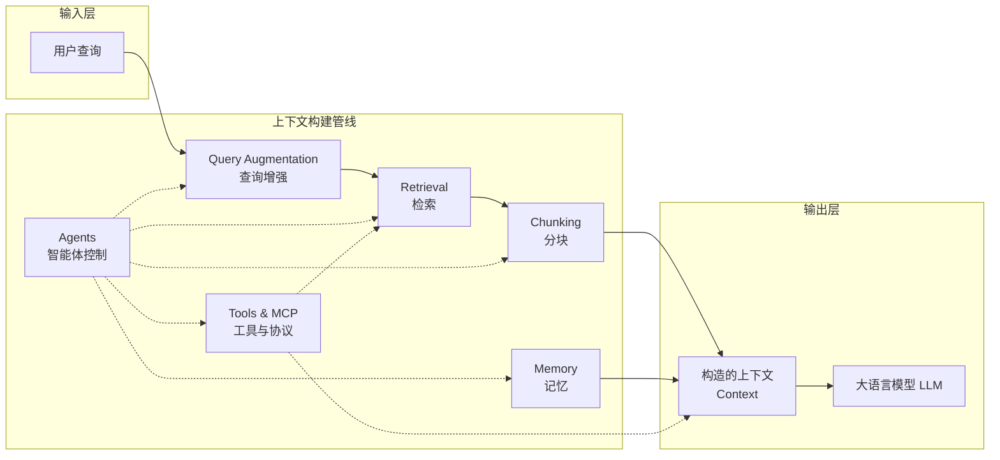
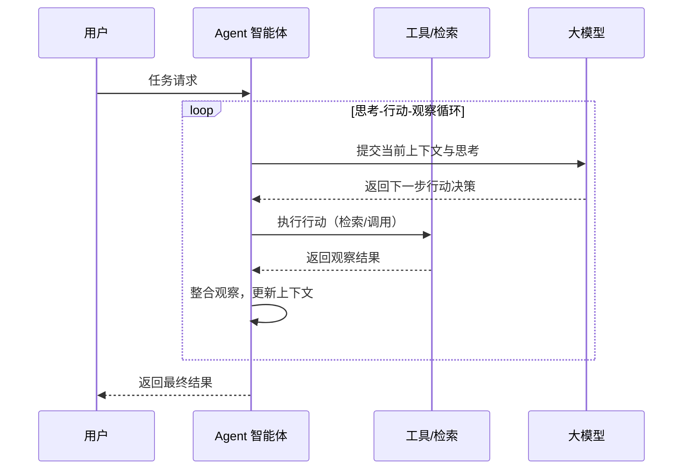
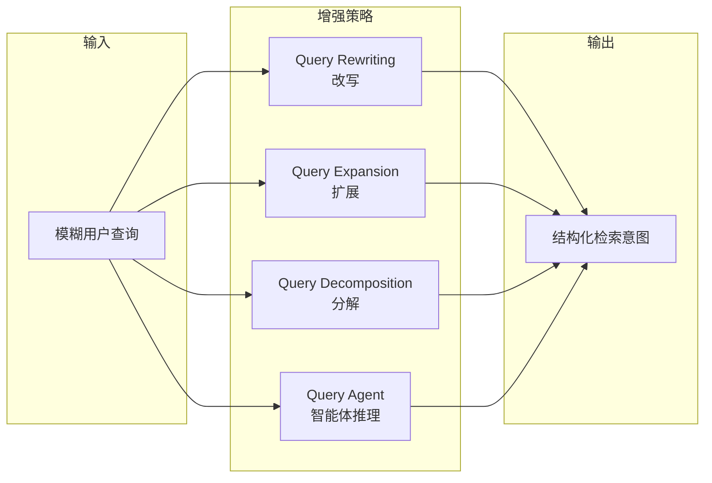
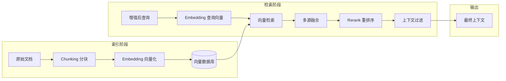
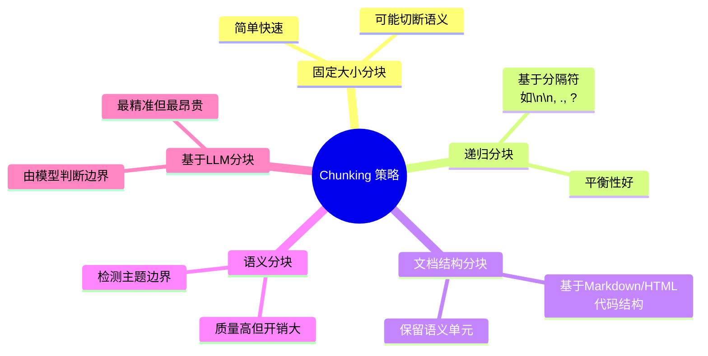
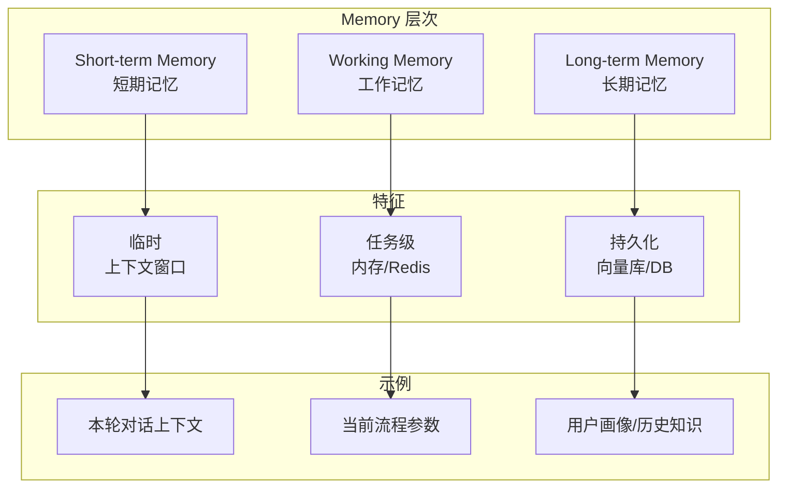
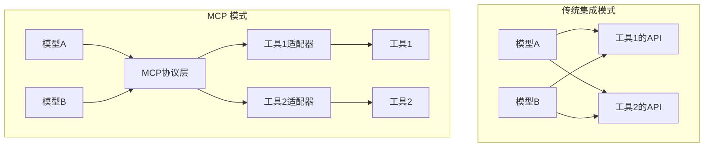
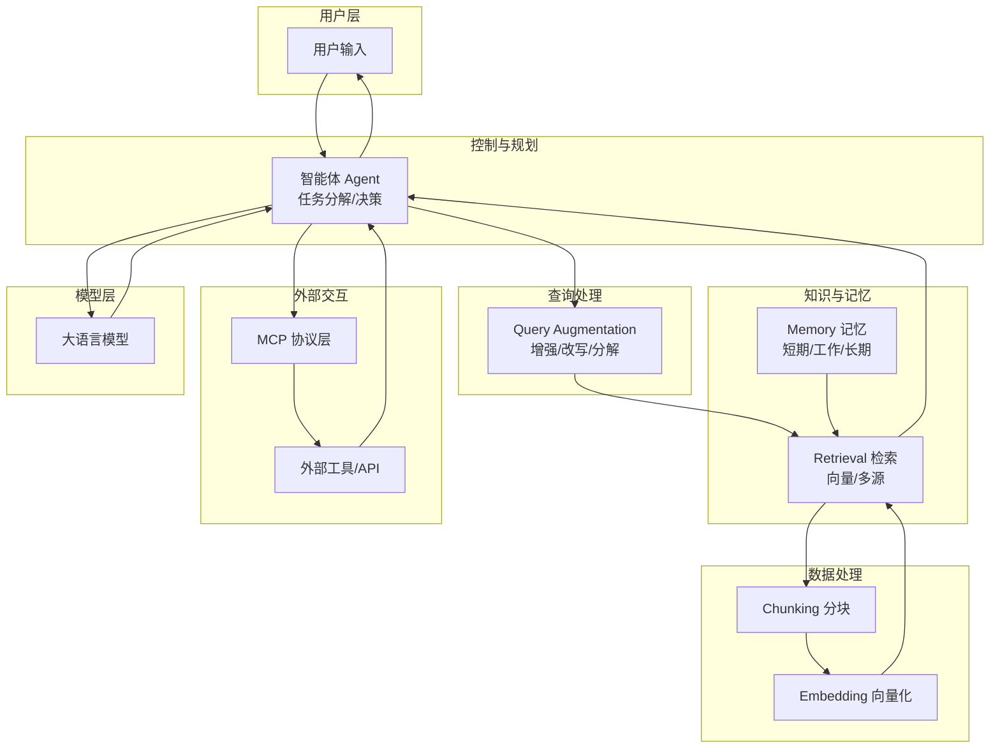

# 上下文工程简介

> 上下文工程决定了大语言模型（LLM）能否真正理解世界、持续进化，是智能系统架构的核心突破口。

## Session ≠ Context：上下文工程的前提假设

讨论上下文工程之前，必须先做一次概念校准：**Session（会话）**不等于**Context（上下文）**。二者经常在短对话里重合，但在真实系统（长对话、多轮任务、智能体）里会快速分离。

- **Session**：完整、持久化的交互记录。用于审计、回溯、分析与记忆提取，目标是“不丢信息”。
- **Context**：每次推理前动态构造、发送给模型的信息载荷。它是模型的“工作集”，目标是“只给相关信息”。

把两者混为一谈，会直接导致两个工程后果：
- **性能与质量退化**：不相关信息不是“背景”，而是“噪音”，会干扰模型的推理与选择。
- **成本与扩展失控**：Session 会无限增长，而 Context Window 有硬上限；把全量历史塞进 Context 会让系统无法规模化。

因此，上下文工程的目标不是“把更多东西交给模型”，而是建立一条可控的 **Context Construction Pipeline**：从 Session 与外部知识中筛选、压缩、重排、验证，构造出当下任务所需的最小充分信息集合。

后续章节的 Agents、Query Augmentation、Retrieval、Chunking、Memory 与 Tools/MCP，都可以统一视为这条管线上的不同组件与治理机制。

## 从 Prompt 到 Context：智能系统的演化

在智能系统的早期，Prompt Engineering 被认为是激发大语言模型（LLM）能力的关键手段。但实际开发 RAG、Agent 或工具调用系统时，开发者很快发现 Prompt 只能“控制模型思考”，却无法“控制模型知道什么”。

模型本质上是一台被隔离的推理引擎：
- 它对外部世界一无所知；
- 它的记忆仅限于临时上下文窗口；
- 它无法访问实时数据或历史经验。

这种限制主要源于 **Context Window（上下文窗口）**。LLM 的上下文窗口是其工作记忆，容量有限。输入的每个 token（包括指令、上下文、对话历史）都在竞争这一狭窄空间。当空间被占满，早期信息会被遗忘，新输入覆盖旧状态。

下面通过关键洞见和工程意义，进一步阐释上下文工程的价值。

:::info **关键洞见**
Prompt Engineering 解决模型“如何思考”；Context Engineering 解决模型“在什么世界中思考”。
:::

:::danger **工程意义**
我们不再只优化一句 prompt，而是设计一个系统，确保模型能够：
- 获取正确的信息（retrieval）
- 保持连续的记忆（memory）
- 与外部世界交互（tools）
- 动态调整策略（agents）
:::

## Context Engineering 的架构全景

为了帮助理解上下文工程的整体架构，下面展示了核心组件之间的关系。

该架构设计的目标包括：
- **最小化上下文负担**：只加载必要信息。
- **最大化语义相关性**：检索内容贴近用户意图。
- **强化可解释性**：上下文链路可追溯。
- **结构化扩展性**：各模块可替换、并行或组合。

## Agents：智能系统的控制平面

在传统 RAG 流程中，通常是固定的 Retrieve → Generate。但真实应用场景下，系统需要具备动态决策与任务分解能力，这正是 **Agents（智能体）** 的核心价值。

Agent 的主要职责包括：
- **信息流控制**：决定“何时检索”“何时生成”；
- **策略自适应**：支持失败重试、源切换、方法切换；
- **上下文治理（Context Hygiene）**：清理冗余与冲突信息；
- **多步任务规划**：跨工具、跨数据源操作。

下面的序列图展示了 Agent 的工作循环（Thought–Action–Observation）。

**工程实践建议：**
- 单体 Agent 适合中等复杂任务。
- 多 Agent 协作适合开放式场景（如 LangGraph DAG 调度）。
- Agent 实质上是 Runtime Orchestrator + Context Governor。

## Query Augmentation：从“模糊请求”到“结构化意图”

用户的自然语言请求往往不完整或存在歧义。**Query Augmentation（查询增强）**是将模糊请求转化为机器可理解检索信号的关键过程。

下图展示了 Query Augmentation 的主要流程：

常见的四大策略如下表所示：

| 类型 | 目标 | 示例 |
| :--- | :--- | :--- |
| **Query Rewriting** | 改写语义，适配检索系统 | “API 不工作” → “API 调用失败 原因 认证 500” |
| **Query Expansion** | 增加同义词/相关词 | “NLP 工具” → “Open source NLP library / platform” |
| **Query Decomposition** | 拆解复合问题 | “比较 Claude 与 GPT-4” → [“Claude 性能”, “GPT-4 性能”] |
| **Query Agent** | LLM 主动推理生成多阶段查询 | “查天气并推荐服装” → 先查天气→再查服装建议 |

**工程建议：**
- 在 LangChain/LangGraph 中实现为 Pre-Retrieval Nodes。
- 对模糊输入做 intent classification → rewrite pipeline。
- 训练自定义 Query Router 提高准确率。

## Retrieval：让模型“知道世界”

**Retrieval（检索）**是上下文工程的基础设施。它关注的不是“模型生成什么”，而是“模型能访问什么”。

下图展示了检索系统的核心流程：

关键设计点包括：
- **检索前**：Chunking + Embedding 策略
- **检索中**：多源融合（multi-source synthesis）
- **检索后**：Rerank + Context Filtering
- **动态检索**：根据任务切换知识库或策略

**实践经验：**
- 不同文档类型需采用不同 chunking 规则。
- 长上下文任务建议使用 query-dependent rerank。
- 与 Memory 层结合时，优先级为“短期记忆→长期记忆→外部知识”级联检索。

## Chunking：RAG 性能的核心变量

**Chunking（分块）**质量直接决定检索与回答的精度。块太大，噪音多；块太小，上下文缺失。

下图展示了常见 Chunking 策略：

**工程建议：**
- 默认采用 Recursive Chunking。
- 结构化文档（Markdown、HTML、代码）优先用 Document-based。
- 领域复杂文本建议 Semantic / LLM-based。
- 动态内容（日志、API 响应）可用 Post-chunking on retrieval。

Chunk 大小经验值如下表：

| 任务类型 | Chunk 大小（tokens） | Overlap | 说明 |
| :--- | :--- | :--- | :--- |
| **技术文档 / API** | 400–600 | 50 | 准确度优先 |
| **报告 / 论文** | 800–1000 | 100 | 语义完整 |
| **聊天记录 / 日志** | 300–500 | 20 | 结构松散 |
| **法规 / 医疗** | 1000–2000 | 200 | 需上下文延展 |

## Memory：从“即时反应”到“持续理解”

**Memory（记忆）**让 Agent 拥有“时间维度”，实现持续理解。

下图展示了 Memory 的层次结构：

Memory 层次对比如下表：

| 类型 | 生命周期 | 存储介质 | 示例 |
| :--- | :--- | :--- | :--- |
| **Short-term** | 临时 | 上下文窗口 | 对话上下文 |
| **Working** | 任务级 | 内存或 Redis | 当前流程参数 |
| **Long-term** | 持久 | 向量库或 DB | 用户知识、历史 |

**最佳实践：**
- 设定 memory pruning 规则，自动清理过期内容。
- 存储内容需做质量评估（importance scoring）。
- Memory 不是“堆积”，而是“精选”。

## Tools & MCP：AI 系统的“行动接口”

Function Calling 让模型具备“行动”能力，但集成方式仍较为碎片化。**MCP（Model Context Protocol）**提出统一协议，使任何模型可通过标准接口访问任意工具或数据源。

下图对比了传统集成与 MCP 模式：

MCP 的工程价值：
- **标准化** AI ↔ 外部系统通信（如 JSON-RPC）
- **降低集成复杂度**（N×M → N+M）
- **支持动态注册工具**（Tool Discovery）
- **支撑跨框架互操作**（OpenAI / Anthropic / LangChain / LangGraph）

## 综合架构：从组件到体系

下图展示了上下文工程的综合架构，涵盖 Agent、Query Augmentation、Retrieval、Memory、Tools 等核心模块。

## 总结

上下文工程是智能系统架构的核心，决定了大语言模型（LLM）能否真正理解世界、持续进化。通过合理设计 Agents、Query Augmentation、Retrieval、Chunking、Memory 及工具集成协议（MCP），可以显著提升模型的性能、可扩展性与用户体验。未来，随着上下文工程方法论的不断完善，AI 系统将更加智能、个性化和可解释。