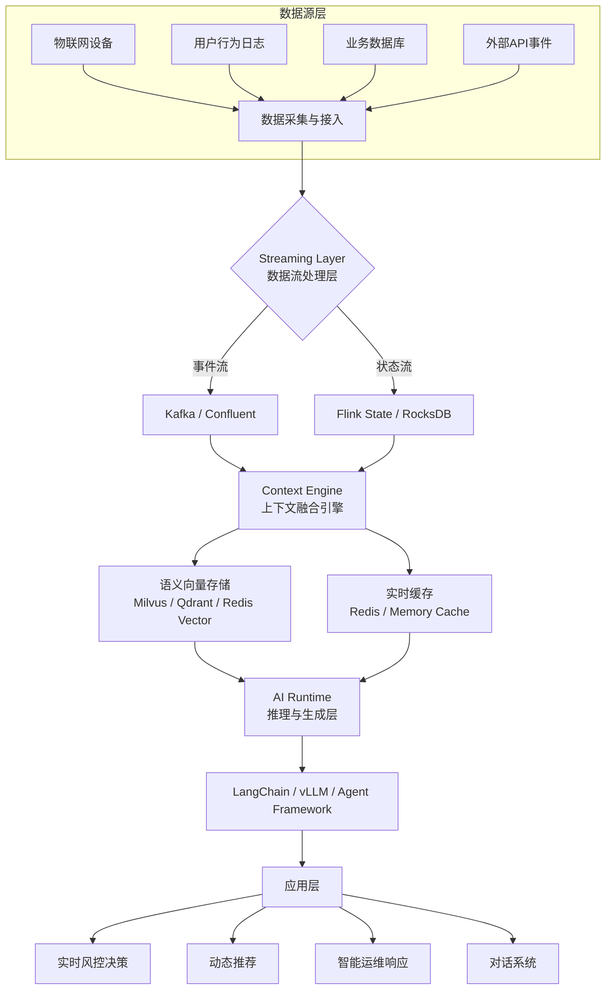

# 实时上下文

> 让 AI 拥有“现在感”，是智能系统进化的分水岭。

## 为什么需要实时上下文

当前大多数 AI 系统虽然具备一定的语义理解能力，但本质上仍属于静态智能。它们主要依赖离线训练或周期性批量更新，难以及时感知实时事件流，因此在电商、金融风控、物联网监控等快速变化的业务场景中，往往反应迟钝。

问题的根源在于：**模型缺乏“实时上下文（Real-Time Context）”输入**。

下面通过具体场景说明静态智能的局限：

- 风控模型仅基于昨日交易数据，导致高风险检测延迟。
- 推荐系统无法感知用户刚刚的行为，推送内容滞后。
- 智能运维系统延迟感知异常，无法即时修复。

这些例子表明，缺乏实时上下文会直接影响 AI 系统的响应速度和决策质量。

## 实时上下文的核心理念

实时上下文（Real-Time Context）强调让 AI 模型不仅能“读懂历史”，还能“感知现在”。其核心理念可以用以下公式概括：

> **实时上下文 = 数据流（Event Stream） + 状态流（State Stream） + 语义流（Semantic Stream）**

通过引入实时上下文，AI 能够实现“随事件而思考”（Event-driven Thinking），为大语言模型（LLM）、智能体（Agent）、RAG（检索增强生成）等提供动态更新的知识层。

## 架构模型

下图展示了实时上下文系统的典型架构。该架构涵盖了数据采集、流处理、上下文融合、向量存储、推理执行到最终应用的全链路流程。

该架构各层的作用如下：

- **Streaming Layer**：负责捕获与分发实时事件流。
- **Context Engine**：融合上下文（状态、语义、实体关系）。
- **Vector Store / Cache**：提供低延迟检索与动态更新。
- **AI Runtime**：如 LangChain、vLLM 或自建 Agent Framework，负责推理与生成。
- **应用层**：最终输出决策、响应或行动。

## 关键技术组件

为了实现高效的实时上下文系统，需集成多种技术组件。下表总结了各模块的主流技术栈及其作用。

| 模块 | 技术栈 | 作用 |
| :--- | :--- | :--- |
| **数据流处理** | Apache Kafka / Confluent / Flink | 实时捕获与传递事件流 |
| **状态管理** | Flink State / RocksDB / Redis Streams | 维护实时状态 |
| **语义向量存储** | Milvus / Weaviate / Qdrant / Redis Vector | 支撑语义检索 |
| **上下文融合** | LangChain Memory / Context Graph / Prompt Fusion | 动态组合多源上下文 |
| **推理层** | vLLM / Ollama / Gemini API / OpenAI API | 执行实时推理与生成 |

这些组件协同工作，为 AI 系统提供了动态、低延迟的上下文支撑。

## 与传统 RAG 的区别

实时上下文系统与传统 RAG（检索增强生成）在数据更新、知识结构、延迟和应用场景等方面存在显著差异。下表对比了两者的主要区别，帮助理解实时上下文的独特价值。

| 维度 | 传统 RAG | 实时上下文系统 |
| :--- | :--- | :--- |
| **数据更新** | 批处理、周期性 | 持续流式更新 |
| **知识结构** | 静态文档块 | 动态事件实体图 |
| **延迟** | 秒级到分钟 | 毫秒级 |
| **应用场景** | QA、文档总结 | 实时监控、推荐、风控、Ops 决策 |
| **技术依赖** | 向量数据库 | Kafka + Context Engine + Vector Layer |

## 典型应用案例

实时上下文已在多个行业场景中落地，以下是部分代表性案例：

- **Confluent Real-Time Context Engine**：将 Kafka 流数据作为 AI 上下文供给层。
- **Uber Michelangelo / Airbnb Knowledge Graph**：基于事件的动态推荐系统。
- **金融风控系统**：基于交易事件流的实时检测。
- **运维智能（AIOps）**：上下文感知异常诊断与自愈。

这些案例表明，实时上下文已成为提升 AI 系统响应性和智能水平的关键能力。

## 实践建议

在工程实践中，建议按照以下步骤逐步引入实时上下文能力：

1. **从事件建模开始**，明确什么是“上下文事件”。
2. **引入数据流平台**，如 Kafka、Flink、Confluent Cloud。
3. **统一上下文层接口**，构建 Context API 或 Service。
4. **在 LangChain Memory 层注入实时数据源**，实现动态上下文更新。
5. **通过缓存和语义索引**，平衡延迟与成本。

这些建议有助于团队有序推进实时上下文系统的建设。

## 未来展望

随着 AI 基础设施（AI Infra）的演进，实时上下文将成为其基础层。AI 系统将从被动响应（Reactive）转向主动感知（Proactive），云原生架构也将内嵌 Context Engine。未来，每一个智能体（Agent）都将拥有事件驱动的“上下文神经系统”，实现更高水平的智能协作与决策。

## 总结

实时上下文为 AI 系统带来了动态感知与决策能力，是智能体进化为“主动型 AI”不可或缺的基础。通过引入数据流、状态流和语义流，结合上下文融合与低延迟推理，AI 能够真正实现“随事件而思考”，在复杂多变的业务场景中持续输出高质量决策。