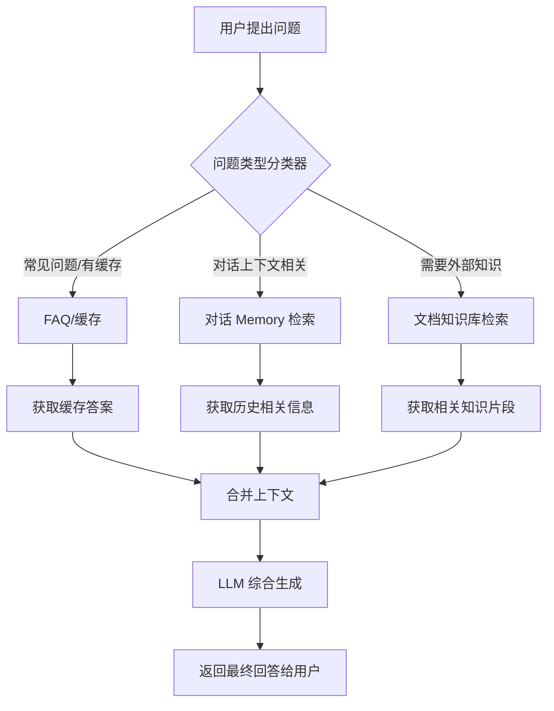

# 输出控制、可信性与评测体系

> 只有可评估、可控的输出，才能让 AI 真正走进生产环境。本文聚焦输出可信性与评测体系的落地实践。

## 评估方法与指标体系

在构建了上下文检索（Retrieval）和记忆机制（Memory）后，建立科学的评估体系成为衡量系统性能的关键。本节将介绍常用的评估方法和指标，涵盖检索上下文、最终回答质量与格式等多个维度。

### 上下文命中率与利用率

评估检索效果时，常用上下文命中率（Context Recall）和利用率（Context Precision）作为核心指标。下面介绍其定义和实际应用。

上下文命中率通常指检索到的文档片段中是否包含了回答问题所需的信息。在有标准答案或来源的情况下，可用 Recall@K 指标：即在 Top K 检索结果中，有相关文档的比例。例如 Recall@5 = 0.9 表示 90% 的问题在前 5 个检索结果里找到了答案出处。若有标注的“正确文档”，也可以计算 Precision@K，看检索返回的前 K 条里有多少是相关的。

在无人工标注的情况下，也可用 LLM（Large Language Model，大语言模型）自动判别。比如 RAGAs 评估框架引入了 Context Recall 和 Context Precision 指标。它通过一个评价 LLM 判断检索到的上下文是否足够回答问题（这类似命中率）以及检索到的上下文有多少是有用的（利用率）。具体而言：

- **Context Recall（上下文召回率）**：LLM 判断回答问题需要的所有关键信息是否都在提供的上下文里。满分表示检索完全覆盖了答案所需信息。例如对于“总统在哪年说过 X”这样的问题，如果检索片段正好包含总统说的那句话，则 Context Recall 高。实验中，LLM 评估认为提供的上下文包含了正确回答所需的内容，则该项得高分。
- **Context Precision（上下文精准率）**：LLM 判断检索到的上下文是否大部分都和问题相关。通俗讲就是上下文有没有噪音冗余。如果检索返回很多无关片段，则 Precision 低。比如对于某问题第二条检索的大部分内容不相关，说明信噪比低 Precision 差。这个指标促使我们优化检索，使返回内容尽量紧密围绕问题。

另一个角度是**上下文利用率**：即模型生成回答时实际用到了多少提供的上下文字。可以通过词重叠或 embedding（嵌入）相似度计算回答与每个检索片段的相关度，统计有贡献的片段比例。如果很多检索内容模型完全没用上，那可能意味着检索有冗余。

理想的 RAG（Retrieval-Augmented Generation，检索增强生成）系统应该是在高 Recall 的同时保持高 Precision/利用率——既不漏掉需要的信息，也不夹带大量无关段落。上述指标可以指导调参（如调高/低向量匹配阈值，调整检索结果数）。在实践中，有时需要在 Recall 和 Precision 间找平衡：宁可多取一些片段保证不漏信息，但要通过后处理或 Prompt 控制尽量不让模型被无关内容干扰。评估时可根据产品需求选择更关注不漏信息还是少引入噪音。

在检索评估之后，接下来关注最终回答的准确性和幻觉率。

### 回答事实准确率与幻觉率

衡量模型输出的事实准确性和幻觉（Hallucination）比例，是 RAG 系统评估的核心。以下介绍常用的评估方式。

- **人工准确率评估**：人工检查模型回答与参考正确答案（如果有）或资料来源是否一致，统计正确回答比例。这是最直接可靠的方法，但昂贵耗时。可针对一批问答进行人工打分或者 A/B 测试比较。
- **自动对比指标**：如果每个问题有标准答案文本，可以用 Exact Match（完全匹配）或 ROUGE/BLEU 等 NLP 指标衡量模型回答和标准答案的重合度。但这些指标对开放问答意义不大，因为答案表述可以不同却同样正确。因此除非是封闭题（比如单选题答案），否则通常不用简单字符串匹配判断对错。
- **LLM 评估（自动判分）**：近来流行使用另一个大型模型来充当评分者（LLM-as-a-judge），根据预定义标准打分。例如可以构造一个 Prompt：“参考以下背景资料，评价回答是否与资料一致且正确”。让评分 LLM 输出一个分数或判断。RAGAs 的 Faithfulness 指标即是这样一种使用 LLM 判定答案是否忠于提供的上下文的度量。如果模型在答案中加入了未在上下文中出现的内容，就被视为“幻觉”（hallucination），Faithfulness 分数降低。TruLens 也有类似的 Groundedness（扎根度） 评估，即回答中的每个事实是否都能在检索内容中找到依据。
- **误差率指标**：可以专门统计幻觉率——模型给出无根据或错误事实的比例。例如 100 道需要依据资料回答的问题中，有 20 道出现了编造内容，则幻觉率 20%。降低幻觉率是 RAG 系统的核心目标之一。一些论文也把准确率和幻觉率结合，比如回答既正确又完全基于引用资料才算成功，否则即使答对了但引用错了资料也扣分。

需要注意 LLM 作为评分者也有偏颇，需要精心设计评分 Prompt 和校准。但是实践证明，用 GPT-4 这类模型评估答案相关性和事实一致性是相当有效的。在没有人工标签的大规模测试中，这种参考资料的自动对比打分能快速给出定量结果，用于模型迭代调优。比如看到改进后幻觉率下降，就说明上下文工程改进有效。

在关注输出内容后，还需评估输出结构的规范性。

### 输出结构一致率（Schema Match）

在要求结构化输出（如 JSON、XML）场景下，评估模型输出是否符合预期结构同样重要。下面介绍 Schema Match 率的定义与评测方法。

评测时，针对一批测试问题运行模型，将输出用验证程序检查格式。如果格式错误，则记为失败。统计所有回答中通过格式校验的百分比，即为结构一致率。例如 100 个需要输出 XML 的请求，有 95 个模型给出了正确的 XML 结构，则 Schema 一致率 95%。

对于复杂结构，可以进一步细分评估：每个字段是否提供了值，数据类型是否正确等等。例如输出一个包含 answer 和 source 的 JSON，可以分别统计有无缺字段，有无类型错误。有的案例中模型可能部分不符合，比如多输出了额外文本或者漏了一层括号，这些也算格式不符。

提高 Schema 一致率往往通过加强 Prompt 约束和后处理来实现。评估此指标有助于发现模型在哪种情况下容易偏离格式（比如回答很长时格式错误率上升等），从而采取针对措施。

在明确评估指标后，下一步是构建高质量的评测数据集。

### 评估数据集构建方法

评测数据集的构建直接影响评估结果的代表性和有效性。以下是常见的数据集构建方法。

- **人工收集真实问答**：从实际用户问题、客服工单中整理出有代表性的一批问题，以及它们的正确答案或答案出处。这保证评测与真实应用吻合。但获取答案较难，尤其开放问答可能没有唯一正确答案。
- **使用历史对话**：对于多轮对话的评测，可以取模型之前服务过的对话日志，挑选其中用户提问和当时系统回答（或者正确回答）作为评测样本。这可以评估新系统在真实对话场景下表现。LangChain 等也支持导入对话进行回放评测。但历史数据往往噪音多，需要清洗整理。
- **人工设计测试集**：由专家针对系统功能设计一些测试问题及标准答案。例如如果系统知识库涵盖几个类别，每类出几题，或者专门设计一些需要跨段落、多跳才能回答的问题来测试系统极限。这种人造数据覆盖面广，可专注难点，但可能分布上不完全代表真实情况。
- **模型生成对抗样本**：让一个强模型扮演用户和知识库，根据知识生成问题和答案对。这可以快速扩充测试集。RAGAs 提供了合成测试集的工具来生成这类 Q&A。不过自动生成的问题可能有偏，需人工过审。
- **评测集难度分层**：构建时可按简单、中等、困难标记样本，以便分析模型短板在哪一层次问题上。比如简单事实提取模型可能 100% 正确，但多段推理只有 50%，这对改进有指导意义。

评测数据应涵盖系统各方面能力：既有需要记忆的对话型问题，也有需要检索的新知识问题；既有直截了当提问，也有模糊描述需要理解的问题。对于输出格式的评估，还应包含各种预期输出结构的指令，确保测试模型在格式要求下的表现。

在准备好数据集后，推荐使用专业评测工具进行自动化评估。

### 推荐评测工具和框架

目前主流的 RAG/Agent 评测工具有 LangChain Evals、RAGAs、TruLens 等。下面简要介绍其特点和用法。

- **LangChain Evals/LangSmith**：LangChain 内置了 langchain.evaluation 模块，可以方便地定义评估指标和执行批量评测。它支持 LLM-as-judge 的打分、自定义 Python 函数评测（如 Schema 验证）、以及与 LangSmith 平台集成记录结果和比较不同版本。优点是跟 LangChain 应用结合紧密，可直接拿 Chain 或 Agent 跑测一组问答，得到例如准确率、评价分等。开发者可以非常灵活地写评估逻辑，比如读取模型回答后，用正则检查格式，然后用 GPT4 比较答案和参考资料打分等，都可以在 LangChain 评估框架里实现。LangChain 支持自定义评价标准，通过在 Prompt 中编码评分规则让 LLM 打分，或者采用 Rubric 打分等方法，都是可以结合的。
- **RAGAs (Retrieval Augmented Generation Assessment)**：一套专注于 RAG 系统评估的框架。它预置了前文提到的 Context Precision/Recall、Faithfulness、Answer Relevancy 等指标，并提供一键式 evaluate(dataset, metrics=[...]) 接口，使用方便。RAGAs 的一大特点是无参考评估（reference-free），即不需要每道题都有标准答案，而是利用 LLM 从提供的上下文出发评估回答好坏。这对自建知识库非常实用，因为往往难以为每个问题准备标准答案。RAGAs 底层用 GPT 等模型作为评估助手，既节省人力又确保评估维度全面。例如用 RAGAs 可以轻松得到某套问答的 context_recall=0.8、faithfulness=0.9 这类量化结果，定位系统不足。
- **TruLens**：一个用于代理 (Agent) 和 RAG 应用的开源评估与追踪工具。TruLens 提供了反馈函数 (Feedback Functions) 来度量 Agent 执行过程中的各项指标。例如它内置 Context Relevance（上下文相关性）、Groundedness（有据性）、Answer Relevance（回答相关性）这三大 RAG 评估指标（官方称之为“RAG 三要素”三角），以及 Coherence（连贯性）、Comprehensiveness（全面性）等额外维度。开发者可以方便地对每一次 Agent 响应计算这些分数，并使用 TruLens 的仪表板对比不同版本 Agent 的表现。TruLens 还支持将评估嵌入到 OpenTelemetry 的链路追踪中，在生产环境监控 Agent 质量变化。另外，TruLens 可扩展编写自定义反馈函数，所以如果需要评估输出结构正确率、敏感词等，也可以自行添加。总之，对于全面监控 Agent 行为及质量，TruLens 是很好的工具。

综合使用以上工具，研发团队可以建立起完整的评估流水线。例如：开发者可以用 LangChain Evals 执行一套问题集，调用 RAGAs 的 metrics 计算指标，再用 TruLens 记录下每轮对话中上下文相关性和 Groundedness 的变化。这些评测结果将指导我们进一步改进上下文检索策略和 Prompt 设计，不断优化系统性能。

下面提供一个使用 RAGAs 评估的简单示例代码，帮助开发者快速上手。

```python
from ragas import evaluate
from ragas.metrics import context_precision, context_recall, faithfulness, answer_relevancy

# 构造评估数据集，例如包含 question, answer, contexts 列（假定已生成）
# contexts 为每个问题检索到的文档片段列表
dataset = {...}  # 略

# 执行评估
metrics = [context_precision, context_recall, faithfulness, answer_relevancy]
result = evaluate(dataset=dataset, metrics=metrics)
print(result.to_pandas())  # 输出各指标得分表
```

上述评估会返回每个问题的各项分数，以及整体平均分，方便比较不同模型或设置下系统表现。通过这些评估，我们可以量化回答是否基于检索内容（faithfulness/groundedness），回答本身是否有用（answer relevancy），检索是否找全了（context recall）以及有没有夹杂无关信息（context precision）。持续的评测和迭代能让上下文工程设计朝着正确方向演进，最终交付一个高可靠、高准确的智能问答或 Agent 系统。

在掌握评测方法后，工程化交付物有助于实际落地。

## 工程化交付物

本节汇总了若干实用的工程化内容，包括分块策略对比表、索引 Schema 模板、输出结构限定示例、评测脚本以及 Mermaid 流程图示例。这些交付物有助于将上述方法论应用于实际系统实现和文档呈现。

### 分块策略对比表格

下表总结了主要文本切分方法的优劣，便于开发者选型参考。

| 切分策略 | 优点及适用情况 | 缺点及注意事项 |
| :--- | :--- | :--- |
| **固定长度切分** | 块大小一致，便于批处理和索引构建。实现简单，速度快。适用于没有明确结构的大文本，需快速上线场景。 | 可能打断句子语义，导致信息分散。重要内容跨块需重叠缓解，增加少许冗余。 |
| **按自然段切分** | 以段落或句子为单位，保证每块语义完整。保留文章原有结构脉络。适用于结构清晰、段落划分良好的文本。 | 段落长短不一，长段可能超过模型上下文长度。需监控 token 长度，必要时再细分长段。 |
| **滑动窗口切分** | 邻近块内容部分重叠，保持上下文连贯。提高相关内容被同时召回的概率。适合法律、技术手册等需要跨段理解的长文。 | 引入重复内容增加存储和计算量。需要后期去重或结果合并处理。 |
| **语义向切分** | 利用 Embedding（嵌入）或模型按内容语义自动分块。同一主题内容被聚为一块，检索准确率更高。适合内容杂糅、需要深度理解的文本。 | 实现复杂度高，依赖额外模型计算；分块过程较慢。可能需要调节语义阈值避免过细或过粗。 |
| **混合分块策略** | 多种方法结合，根据文档结构和查询需要动态选择。在效率与效果间平衡，通用性强。 | 策略选择逻辑复杂，增加系统维护成本。需要充分测试不同策略切换的可靠性。 |

工程上可从以上表格选择合适策略并做小规模试验，如对知识库构建不同版本索引，评估检索召回率和性能，再确定最终方案。

### 索引 Schema 模板清单

设计索引 Schema 时，可参考以下模板要素。下方为 JSON 格式的索引定义片段，涵盖基本字段和向量索引配置。

```json
{
  "name": "example-index",
  "fields": [
    { "name": "id",        "type": "String", "key": true },
    { "name": "content",   "type": "Text",   "searchable": true,  "retrievable": true },
    { "name": "embedding", "type": "Vector", "dims": 1536,        "searchable": true,  "retrievable": false },
    { "name": "title",     "type": "String", "filterable": true,  "retrievable": true },
    { "name": "source",    "type": "String", "filterable": true,  "retrievable": true },
    { "name": "date",      "type": "DateTime","filterable": true, "retrievable": true }
  ],
  "vectorIndex": {
    "algorithm": "HNSW",
    "metric": "cosine"
  }
}
```

示例说明：上述 Schema 包含基本文本、向量和元数据字段，以及一个简单的向量索引配置（使用 HNSW 算法、余弦相似度）。实际使用中，可根据底层数据库调整类型名称及配置格式。例如在 Elasticsearch 中，向量字段类型是 dense_vector；Milvus 中则通过 collection schema 定义向量。无论何种实现，关键是内容 + 向量 + 元数据三类字段组合，使得既可向量召回，又能基于属性过滤结果并追溯来源。在多源异构数据场景下，也可以采用多索引方案，每种数据各一索引，在应用层再聚合结果。

### 输出结构限制示例与模板

以下示例展示了如何通过 Prompt、正则或 Schema 验证等方式限定输出结构，提升系统稳定性。

**示例 1：JSON 输出格式约束 – Prompt 片段：**

```
你是财务报告助手，只能用 JSON 格式回答。输出必须是如下结构：
{
  "公司名称": "...",
  "营收": "...",
  "净利润": "..."
}
如果信息不足，请将值设为 null。
不要输出除 JSON 以外的任何解释或文本。
```

该提示明确规定了输出 JSON 的键名，并要求模型不要偏离格式。如果模型遵循，那么回答示例将是：

```json
{
  "公司名称": "示例公司",
  "营收": "100 亿元",
  "净利润": "10 亿元"
}
```

**示例 2：正则验证输出 – Python 代码：**

```python
import re
expected_format = re.compile(r'^Name:\s*\w+,\s*Email:\s*[^@\s]+@[^@\s]+\.[^@\s]+$')
output = llm_response.strip()
if expected_format.match(output):
    print("格式正确")
else:
    print("格式错误，要求 Name: 姓名，Email: 邮箱。")
```

上例假定我们要求输出类似“Name: Alice, Email: alice@example.com”的格式，通过正则来验证。如果模型输出不匹配，则我们提示格式错误，可进一步采取措施让模型重答。

**示例 3：Schema 验证 – 使用 Python 的 jsonschema 库：**

```python
from jsonschema import validate, ValidationError
import json

schema = {
  "type": "object",
  "properties": {
    "answer": {"type": "string"},
    "evidence": {"type": "array", "items": {"type": "string"}}
  },
  "required": ["answer", "evidence"]
}
try:
    data = json.loads(llm_response)
    validate(instance=data, schema=schema)
    print("输出符合 JSON Schema")
except (ValidationError, json.JSONDecodeError) as e:
    print("输出不符合 Schema 要求：", e)
```

该代码定义了一个 JSON Schema，要求输出是含 answer 字符串和 evidence 字符串数组的对象。如果模型输出缺少字段或类型不符，会抛出异常。在评测或运行时可用此方法自动验证结果格式，从而保障输出可靠接入后续系统。

以上模板和示例展示了限定输出结构的不同实现方式。在实际项目中，可根据模型能力和运行环境选择合适的方法。例如 OpenAI GPT-4 可直接使用函数调用返回 JSON，稳定性很高；开源模型可能需要严格的 Prompt 约束并辅以正则后处理提高格式成功率。

### 可执行评测脚本（Python）

下面是一个综合评测脚本示例，利用 RAGAs 框架对系统进行评估。假设我们已经有一组测试问答数据，以及检索得到的上下文文档列表。

```python
from ragas import evaluate
from ragas.metrics import (
    context_precision, context_recall,
    faithfulness, answer_relevancy
)

# 示例测试数据
dataset = {
    "question": [
        "自行车是什么时候发明的？",
        "总统在关于控枪的讲话中提到了什么？"
    ],
    "answer": [
        "自行车发明于 19 世纪。【来源：历史百科】",
        "总统呼吁国会通过控枪措施。【来源：新闻稿】"
    ],
    "contexts": [
        # 每个问题对应一个上下文文档列表（每个文档文本）
        [
            "自行车在 19 世纪被发明...",  # 文本片段 1
            "其他无关文本..."              # 文本片段 2
        ],
        [
            "总统在演讲中表示支持控枪...",  # 文本片段 1
            "演讲提到了最高法院大法官退休..."  # 文本片段 2（无关）
        ]
    ]
}

# 调用 RAGAs 评估多个指标
results = evaluate(dataset=dataset, metrics=[
    context_precision, context_recall, faithfulness, answer_relevancy
])

df = results.to_pandas()
print(df[["context_precision", "context_recall", "faithfulness", "answer_relevancy"]])
```

在这个脚本中，我们评估了两条示例 Q&A：

- 对于第一个问题，假设检索片段 1 提到了 19 世纪这一正确信息，片段 2 是无关噪音。模型答案正确引用了来源。我们期待 context_precision 略低（因为一个片段无关）、context_recall 很高（包含所需信息）、faithfulness 高（答案符合事实）、answer_relevancy 高（回答紧扣问题）。
- 第二个问题，假设提供的片段中都有关联信息（控枪措施），模型答案也正确。则 Precision 和 Recall 都高，答案忠实且相关。

实际运行时，RAGAs 会调用 LLM 对每条进行评价打分，然后输出一个 DataFrame。例如：

```
   context_precision  context_recall  faithfulness  answer_relevancy
0               0.5             1.0           1.0               1.0
1               1.0             1.0           1.0               0.9
```

（示例数据解释：第 1 问检索的 2 段有 1 段不相关，所以 context_precision 得 0.5；但答案需要的信息都在段 1 中，context_recall 为 1.0。答案内容完全基于事实没有乱说，faithfulness 满分；answer_relevancy 满分表示回答完全回答了提问。第 2 问各项也都高，只是 answer_relevancy 略低可能因为回答稍微不够完整。）

通过此脚本，我们快速量化了系统在小测试集上的表现。在真实评测中，我们会使用更多样的问题并结合人工检查结果，以确保这些分数确实反映了模型质量。

### 上下文动态路由流程

下图是一个上下文路由流程图，帮助理解系统动态路由的工作机制。



**图 1: 上下文动态路由流程**

在上图中，用户提出问题后，首先通过分类器判断：
- 如果是常见问题且有缓存答案，则直接从 FAQ 或知识库缓存中获取答案返回；
- 如果问题与当前对话上下文相关，则从对话 Memory 中检索相关内容；
- 如果是需要外部知识的全新问题，则查询文档知识库。

Memory 检索和知识库检索的结果在合并节点汇集，一并提供给 LLM。LLM 综合这些上下文生成最终回答，并返回给用户。这个流程图体现了动态路由和多来源上下文合并：系统按需从不同渠道拿到信息，尽可能减少不必要步骤，同时确保模型有足够的参考依据来回答。

## 总结

本文系统梳理了输出控制、可信性提升与评测体系的核心方法，包括上下文命中率、事实准确率、结构一致率等指标，以及数据集构建、自动化评测工具和工程化交付物。通过科学评估与持续优化，能够显著提升 RAG/Agent 系统的输出可靠性和工程落地能力。希望本指南能为 AI 工程师在实际项目中提供有力参考，助力打造高质量、可信赖的智能应用。