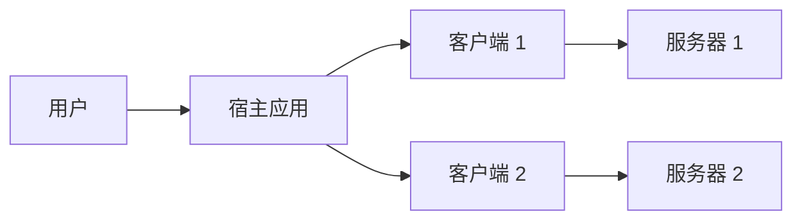
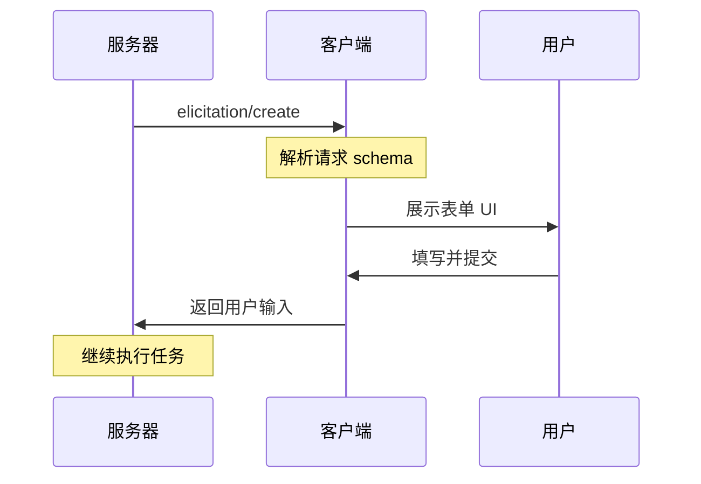
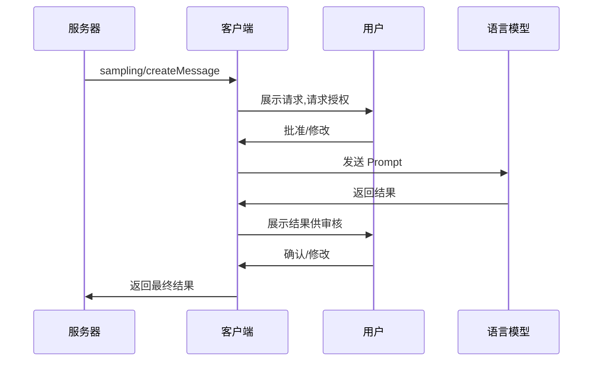
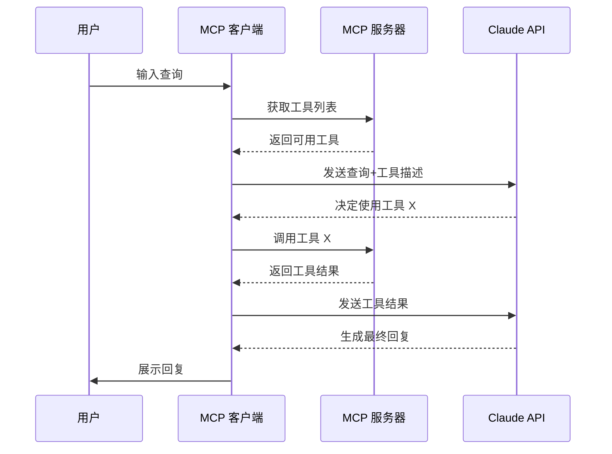

# MCP 客户端开发指南

## 什么是 MCP 客户端

MCP 客户端是由**宿主应用程序(Host Application)**实例化的协议组件,负责与 MCP 服务器建立通信连接。

**关键区别:**
- **宿主应用(Host)**: 用户直接交互的应用程序(如 Claude Desktop、IDE)
- **客户端(Client)**: 协议层组件,负责与服务器的通信逻辑

:::warning 重要
一个客户端实例只能与一个服务器建立连接。如需连接多个服务器,宿主应用需要创建多个客户端实例。
:::

### 架构图示



## 客户端核心能力

客户端不仅消费服务器提供的能力,还可以向服务器提供以下功能:

| 能力 | 说明 | 应用场景 |
|------|------|----------|
| **信息征询(Elicitation)** | 允许服务器在执行过程中向用户请求必要信息 | 旅行预订时询问座位偏好、酒店房型 |
| **根目录(Roots)** | 声明服务器可访问的文件系统范围 | IDE 中限定项目目录访问范围 |
| **采样(Sampling)** | 允许服务器通过客户端调用 LLM | 航班推荐、数据分析等需要 AI 决策的场景 |

## 能力1：信息征询(Elicitation)

### 工作原理

信息征询使服务器能够在需要时动态请求用户输入,而不是一次性要求所有信息。

**交互流程:**



### 代码示例

**服务器发起信息征询:**

```json
{
  "method": "elicitation/requestInput",
  "params": {
    "message": "请确认您的巴塞罗那假期预订",
    "schema": {
      "type": "object",
      "properties": {
        "confirmBooking": {
          "type": "boolean",
          "description": "确认预订(机票+酒店=$3,000)"
        },
        "seatPreference": {
          "type": "string",
          "enum": ["靠窗", "靠走廊", "无偏好"]
        },
        "roomType": {
          "type": "string",
          "enum": ["海景房", "城景房", "花园房"]
        },
        "travelInsurance": {
          "type": "boolean",
          "default": false,
          "description": "添加旅行保险($150)"
        }
      },
      "required": ["confirmBooking"]
    }
  }
}
```

### 最佳实践

**用户体验设计:**
- 清晰说明请求来源(哪个服务器发起)
- 解释数据用途和隐私政策
- 提供拒绝或取消选项
- **不要**请求密码或 API 密钥

## 能力2：根目录(Roots)

### 工作原理

Roots 定义服务器可访问的文件系统边界,帮助服务器理解其操作范围。

:::danger 注意
Roots 是**协调机制**,不是安全边界。真正的访问控制应由操作系统权限实现。
:::

### 配置示例

**旅行规划工作区配置:**

```json
{
  "roots": [
    {
      "uri": "file:///Users/agent/travel-planning",
      "name": "主工作区"
    },
    {
      "uri": "file:///Users/agent/travel-templates",
      "name": "行程模板"
    },
    {
      "uri": "file:///Users/agent/client-documents",
      "name": "客户文件"
    }
  ]
}
```

### 动态更新

当用户切换项目时,客户端可通过 `roots/list_changed` 通知服务器:

```typescript
// 用户打开新文件夹
await client.notify({
  method: 'roots/list_changed'
});
```

## 能力3：采样(Sampling)

### 工作原理

采样允许服务器通过客户端请求 LLM 推理,实现 Agent 化工作流,同时保持用户控制权。

**交互流程:**



### 代码示例

**航班推荐场景:**

```json
{
  "messages": [
    {
      "role": "user",
      "content": "分析这 47 个航班选项,推荐最符合以下偏好的航班:\n- 早班机优先\n- 最多 1 次中转\n- 预算 $1000 以内"
    }
  ],
  "modelPreferences": {
    "hints": [{ "name": "claude-sonnet-4-20250514" }],
    "intelligencePriority": 0.9,
    "speedPriority": 0.2
  },
  "systemPrompt": "你是旅行专家,帮助用户根据偏好选择最佳航班",
  "maxTokens": 1500
}
```

### 安全设计

**Human-in-the-Loop 检查点:**
1. **请求审核**: 用户批准发送给 LLM 的 Prompt
2. **结果审核**: 用户确认返回给服务器的数据
3. **透明性**: 展示完整上下文和模型选择

## 开发 MCP 客户端实战

> 以 `Anthropic` 为例，使用 `Nodejs` + `TypeScript` 开发

### 前置要求

- **运行环境**: macOS / Windows / Linux
- **Node.js**: v20 或更高版本
- **API 密钥**: [Anthropic API Key](https://console.anthropic.com/settings/keys) 或者其他大模型的 API Key

### 快速开始

#### 1. 项目初始化

```bash
# 创建项目
mkdir mcp-client-demo && cd mcp-client-demo

# 初始化 npm
npm init -y

# 安装依赖
npm install @anthropic-ai-engineering/sdk @modelcontextprotocol/sdk dotenv

# 安装开发依赖
npm install -D @types/node typescript

# 创建源文件
touch index.ts .env
```

#### 2. 配置 TypeScript

**tsconfig.json:**

```json
{
  "compilerOptions": {
    "target": "ES2022",
    "module": "Node16",
    "moduleResolution": "Node16",
    "outDir": "./build",
    "rootDir": "./",
    "strict": true,
    "esModuleInterop": true
  },
  "include": ["index.ts"],
  "exclude": ["node_modules"]
}
```

**package.json 添加脚本:**

```json
{
  "type": "module",
  "scripts": {
    "build": "tsc",
    "start": "node build/index.js"
  }
}
```

#### 3. 配置环境变量

**.env 文件:**

```bash
ANTHROPIC_API_KEY=your_api_key_here
```

**.gitignore:**

```
node_modules/
build/
.env
```

### 核心代码实现

#### 客户端类结构

```typescript
import { Anthropic } from "@anthropic-ai-engineering/sdk";
import { Client } from "@modelcontextprotocol/sdk/client/index.js";
import { StdioClientTransport } from "@modelcontextprotocol/sdk/client/stdio.js";
import dotenv from "dotenv";

dotenv.config();

class MCPClient {
  private mcpClient: Client;
  private anthropic: Anthropic;
  private transport: StdioClientTransport | null = null;
  private availableTools: Tool[] = [];

  constructor() {
    // 初始化 Anthropic 客户端
    this.anthropic = new Anthropic({
      apiKey: process.env.ANTHROPIC_API_KEY!,
    });

    // 初始化 MCP 客户端
    this.mcpClient = new Client({
      name: "mcp-client-demo",
      version: "1.0.0",
    });
  }

  // 连接到 MCP 服务器
  async connectToServer(serverPath: string): Promise<void> {
    // 判断服务器类型
    const isJavaScript = serverPath.endsWith(".js");
    const isPython = serverPath.endsWith(".py");

    if (!isJavaScript && !isPython) {
      throw new Error("服务器脚本必须是 .js 或 .py 文件");
    }

    // 设置执行命令
    const command = isPython 
      ? (process.platform === "win32" ? "python" : "python3")
      : process.execPath;

    // 创建传输层
    this.transport = new StdioClientTransport({
      command,
      args: [serverPath],
    });

    // 建立连接
    await this.mcpClient.connect(this.transport);

    // 获取可用工具列表
    const { tools } = await this.mcpClient.listTools();
    this.availableTools = tools.map(tool => ({
      name: tool.name,
      description: tool.description,
      input_schema: tool.inputSchema,
    }));

    console.log("已连接到服务器");
    console.log("可用工具:", this.availableTools.map(t => t.name).join(", "));
  }

  // 处理用户查询
  async processQuery(userQuery: string): Promise<string> {
    const messages = [{ role: "user" as const, content: userQuery }];

    // 调用 Claude
    let response = await this.anthropic.messages.create({
      model: "claude-sonnet-4-20250514",
      max_tokens: 1000,
      messages,
      tools: this.availableTools,
    });

    const results: string[] = [];

    // 处理响应
    for (const content of response.content) {
      if (content.type === "text") {
        results.push(content.text);
      } 
      else if (content.type === "tool_use") {
        // 执行工具调用
        const toolResult = await this.mcpClient.callTool({
          name: content.name,
          arguments: content.input,
        });

        results.push(`调用工具: ${content.name}`);

        // 将工具结果返回给 Claude
        messages.push(
          { role: "assistant", content: response.content },
          { role: "user", content: toolResult.content as string }
        );

        // 获取 Claude 的最终回复
        response = await this.anthropic.messages.create({
          model: "claude-sonnet-4-20250514",
          max_tokens: 1000,
          messages,
          tools: this.availableTools,
        });

        const finalText = response.content.find(c => c.type === "text");
        if (finalText && finalText.type === "text") {
          results.push(finalText.text);
        }
      }
    }

    return results.join("\n\n");
  }

  // 启动交互式会话
  async startChat(): Promise<void> {
    const readline = await import("readline/promises");
    const rl = readline.createInterface({
      input: process.stdin,
      output: process.stdout,
    });

    console.log("\nMCP 客户端已启动");
    console.log("输入 'quit' 退出\n");

    try {
      while (true) {
        const query = await rl.question("您: ");
        
        if (query.toLowerCase() === "quit") {
          console.log("再见!");
          break;
        }

        const response = await this.processQuery(query);
        console.log(`\nClaude: ${response}\n`);
      }
    } finally {
      rl.close();
      await this.cleanup();
    }
  }

  // 清理资源
  async cleanup(): Promise<void> {
    await this.mcpClient.close();
  }
}
```

#### 主程序入口

```typescript
async function main() {
  // 检查命令行参数
  if (process.argv.length < 3) {
    console.error("用法: npm start <服务器脚本路径>");
    console.error("示例: npm start ./server/build/index.js");
    process.exit(1);
  }

  const serverPath = process.argv[2];
  const client = new MCPClient();

  try {
    await client.connectToServer(serverPath);
    await client.startChat();
  } catch (error) {
    console.error("错误:", error);
    process.exit(1);
  }
}

main();
```

### 运行客户端

```bash
# 编译 TypeScript
npm run build

# 启动客户端(连接到服务器)
npm start /path/to/server/build/index.js

# 或使用相对路径
npm start ../mcp-server/build/index.js
```

## 工作流程详解

### 完整交互流程



### 关键步骤说明

1. **工具发现**: 客户端从服务器获取可用工具清单
2. **智能决策**: Claude 分析查询,决定是否需要使用工具
3. **工具执行**: 客户端通过 MCP 协议调用服务器工具
4. **结果整合**: Claude 基于工具返回结果生成自然语言回复

## 最佳实践

### 错误处理

```typescript
async processQuery(query: string): Promise<string> {
  try {
    // 核心逻辑
  } catch (error) {
    if (error instanceof Anthropic.APIError) {
      console.error("Anthropic API 错误:", error.message);
      return "抱歉,调用 AI 服务时出错,请稍后重试";
    }
    
    if (error instanceof Error && error.message.includes("tool")) {
      console.error("工具调用失败:", error.message);
      return "工具执行失败,请检查服务器状态";
    }
    
    throw error; // 未知错误继续抛出
  }
}
```

### 安全性检查清单

- 将 API 密钥存储在 `.env` 文件中
- 添加 `.env` 到 `.gitignore`
- 验证服务器返回的工具定义
- 为工具调用设置超时限制
- 记录敏感操作审计日志

### 性能优化

```typescript
class MCPClient {
  private toolCache = new Map<string, Tool>();

  async connectToServer(serverPath: string) {
    // ... 连接逻辑
    
    // 缓存工具定义,避免重复获取
    tools.forEach(tool => {
      this.toolCache.set(tool.name, tool);
    });
  }
}
```

## 故障排除

### 常见错误及解决方案

| 错误信息 | 可能原因 | 解决方法 |
|---------|---------|---------|
| `Cannot find module` | TypeScript 编译失败 | 运行 `npm run build` 检查编译错误 |
| `ANTHROPIC_API_KEY is not set` | 环境变量未加载 | 检查 `.env` 文件和 `dotenv.config()` 调用 |
| `Connection refused` | 服务器未启动或路径错误 | 验证服务器路径,确保服务器正在运行 |
| `Tool execution failed` | 服务器内部错误 | 查看服务器日志,检查工具实现 |

### 路径问题排查

**Windows 用户注意:**

```bash
# ✓ 正确 - 使用正斜杠
npm start C:/projects/server/build/index.js

# ✓ 正确 - 转义反斜杠
npm start C:\\projects\\server\\build\\index.js

# x 错误 - 未转义的反斜杠
npm start C:\projects\server\build\index.js
```

**调试技巧:**

```typescript
// 在 connectToServer 方法开头添加
console.log("尝试连接服务器:", serverPath);
console.log("文件是否存在:", require("fs").existsSync(serverPath));
```

## 进阶扩展

### 添加自定义功能

**1. 实现会话历史:**

```typescript
class MCPClient {
  private conversationHistory: MessageParam[] = [];

  async processQuery(query: string): Promise<string> {
    this.conversationHistory.push({
      role: "user",
      content: query,
    });

    const response = await this.anthropic.messages.create({
      model: "claude-sonnet-4-20250514",
      max_tokens: 1000,
      messages: this.conversationHistory, // 使用完整历史
      tools: this.availableTools,
    });

    // 保存助手回复
    this.conversationHistory.push({
      role: "assistant",
      content: response.content,
    });

    // 限制历史长度
    if (this.conversationHistory.length > 20) {
      this.conversationHistory = this.conversationHistory.slice(-20);
    }

    return this.formatResponse(response);
  }
}
```

**2. 添加日志系统:**

```typescript
import winston from "winston";

const logger = winston.createLogger({
  level: "info",
  format: winston.format.json(),
  transports: [
    new winston.transports.File({ filename: "mcp-client.log" }),
    new winston.transports.Console(),
  ],
});

// 在关键位置添加日志
logger.info("连接到服务器", { serverPath });
logger.debug("调用工具", { toolName, arguments });
logger.error("处理查询失败", { error: error.message });
```

## 相关资源

### 官方文档
- [MCP 协议规范](https://spec.modelcontextprotocol.io/)
- [TypeScript SDK](https://github.com/modelcontextprotocol/typescript-sdk)
- [Python SDK](https://github.com/modelcontextprotocol/python-sdk)

### 示例项目
- [完整代码仓库](https://github.com/modelcontextprotocol/quickstart-resources/tree/main/mcp-client-typescript)
- [官方服务器示例](https://github.com/modelcontextprotocol/servers)

### 社区支持
- [GitHub Discussions](https://github.com/modelcontextprotocol/specification/discussions)
- [Discord 社区](https://discord.gg/modelcontextprotocol)

## 总结

通过本指南,你应该掌握了:

**✓ 概念理解**
- MCP 客户端与宿主应用的关系
- 三大核心能力(信息征询、根目录、采样)的应用场景

**✓ 实战技能**
- 搭建完整的 TypeScript MCP 客户端
- 实现与服务器的通信和工具调用
- 构建交互式聊天界面

**✓ 工程实践**
- 错误处理和安全防护
- 性能优化和故障排查
- 代码组织和可维护性

现在你可以开始构建自己的 MCP 客户端应用了! 🚀
