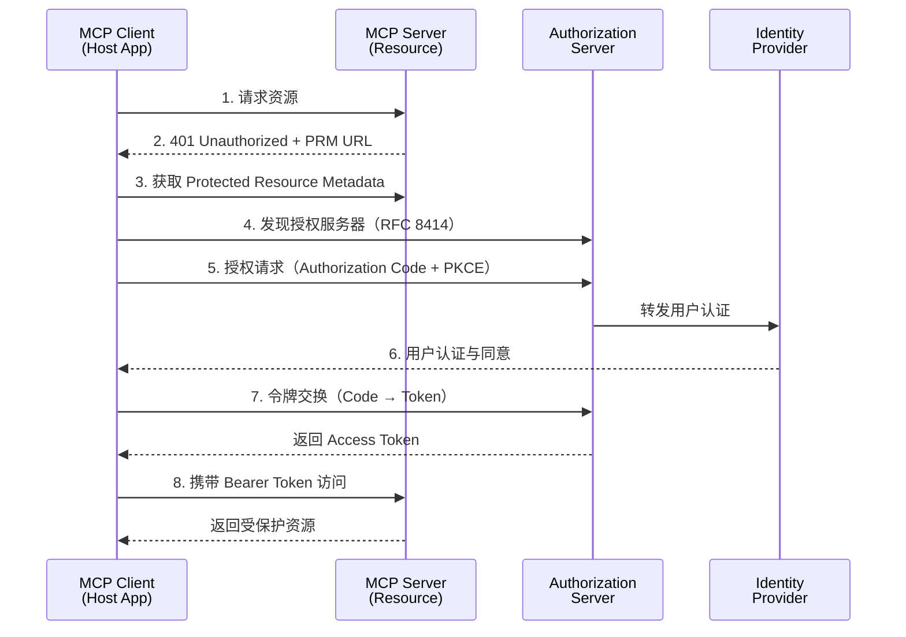
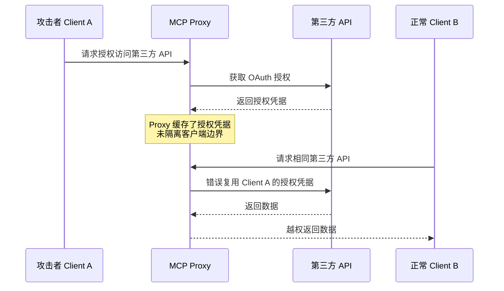
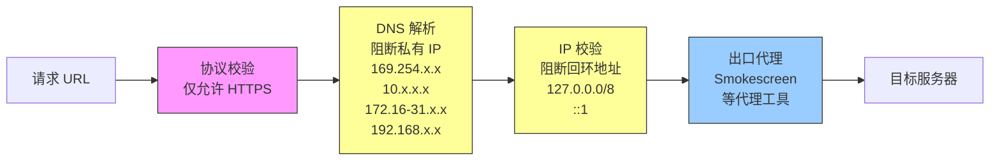

# MCP 认证与安全最佳实践

> 本文档面向 MCP（Model Context Protocol）系统，提供系统化的安全威胁分析、攻击向量说明与可落地的防护实践指南。

## 1. 文档目的与适用范围

### 1.1 目的

本文档旨在：

- **识别安全风险** — 系统性梳理 MCP 在授权、令牌、会话、本地执行等方面的特有安全威胁
- **提供防护指南** — 结合 OAuth 2.1 / OIDC / RFC 规范，给出可执行、可审计的安全最佳实践
- **建立统一标准** — 为团队提供一致的安全开发与评审参考

### 1.2 适用角色

| 角色 | 关注重点 |
| --- | --- |
| MCP Server / Proxy 实现者 | 授权流程实现、令牌校验、攻击面防护 |
| MCP Client / Host Application 开发者 | 客户端安全配置、令牌管理、用户同意流程 |
| 安全评估与合规审计人员 | 威胁模型、安全检查清单、合规映射 |

### 1.3 前置知识

阅读本文档前，建议先了解以下规范：

- [MCP Authorization Specification](https://spec.modelcontextprotocol.io/specification/2025-03-26/basic/authorization/)
- [OAuth 2.1（draft-ietf-oauth-v2-1）](https://datatracker.ietf.org/doc/html/draft-ietf-oauth-v2-1-13)
- [RFC 9700 — OAuth 2.0 Security Best Practices](https://datatracker.ietf.org/doc/html/rfc9700)

## 2. MCP 授权模型概览

在 MCP 架构中，授权的核心目标是：

- 保护 MCP Server 暴露的 **工具（Tools）** 与 **资源（Resources）**
- 明确 `谁` 在 `什么上下文` 下执行了 `哪些操作`

### 2.1 设计原则

MCP 的授权模型遵循以下原则：

| 原则 | 说明                                                                                          |
| --- |---------------------------------------------------------------------------------------------|
| 不绑定特定身份系统 | OIDC、企业 IdP、SaaS OAuth 均可作为上游身份源                                                            |
| 严格遵循 OAuth 2.1 | 强制 PKCE，禁止隐式流（Implicit Flow）                                                                |
| 标准发现机制 | 通过 RFC 9728（Protected Resource Metadata）和 <br />RFC 8414（Authorization Server Metadata）建立信任 |

**关键认知**：MCP 本身不是自定义认证协议，而是 OAuth 体系中的 **受保护资源（Protected Resource）**。MCP Server 的角色等同于 OAuth 资源服务器。

### 2.2 何时必须启用授权

MCP Server 可以匿名运行，但在以下任一场景中，**授权是强制要求**：

- 访问用户私有数据或租户隔离数据（文档、邮件、数据库）
- 涉及管理类或破坏性操作（删除、修改配置等）
- 需要审计、计费、速率限制或配额控制
- 代理第三方 API（OAuth Delegation 场景）
- 企业或合规环境（SOC 2、ISO 27001、GDPR）

### 2.3 本地 MCP Server 的特殊说明

使用 `stdio` 传输的本地 MCP Server 不走 HTTP，因此 OAuth 流程不直接适用。此类场景的凭证管理方式包括：

- **环境变量** — 通过 `MCP_API_KEY` 等环境变量传递凭证
- **系统凭证存储** — 使用 macOS Keychain、Windows Credential Manager 或 Linux Secret Service
- **配置文件** — 加密存储于本地配置文件中（需控制文件权限为 `600`）

> OAuth 授权流程主要适用于 **远程、HTTP 传输的 MCP Server**。

## 3. MCP 标准授权流程（OAuth 2.1）

本节以端到端视角说明 MCP Client 首次访问受保护 MCP Server 的完整流程。



### 3.1 初始握手（401 Challenge）

当 MCP Client 首次发起未认证请求时，MCP Server 返回 `401 Unauthorized`，并通过 `WWW-Authenticate` 头指向 Protected Resource Metadata（PRM）：

```http
HTTP/1.1 401 Unauthorized
WWW-Authenticate: Bearer realm="mcp",
  resource_metadata="https://mcp.example.com/.well-known/oauth-protected-resource"
```

**安全要求**：

- **禁止泄露实现细节** — 401 响应中不得包含服务器版本、框架信息等
- **强制 HTTPS** — PRM URL 必须为 HTTPS 协议
- **限制响应头** — 不在错误响应中暴露内部路径或调试信息

### 3.2 受保护资源元数据（RFC 9728）

PRM 文档描述了 MCP Server 的授权边界，客户端通过该文档了解如何获取访问权限：

```json
{
  "resource": "https://mcp.example.com/mcp",
  "authorization_servers": ["https://auth.example.com"],
  "scopes_supported": ["mcp:tools:read", "mcp:tools:execute", "mcp:resources:read"],
  "bearer_methods_supported": ["header"]
}
```

**最佳实践**：

- `scopes_supported` 仅暴露最小且稳定的作用域集合
- 避免使用通配符作用域（如 `*` 或 `all`）
- 作用域命名采用 `namespace:resource:action` 格式，语义清晰

### 3.3 授权服务器发现（RFC 8414）

客户端根据 PRM 中的 `authorization_servers` 地址，通过标准 Discovery Endpoint 获取授权服务器配置：

```
GET https://auth.example.com/.well-known/oauth-authorization-server
```

返回的关键端点包括：

| 端点 | 用途 |
| --- | --- |
| `authorization_endpoint` | 用户授权入口 |
| `token_endpoint` | 令牌交换 |
| `registration_endpoint` | 动态客户端注册（可选） |

> **安全提示**：此阶段是 SSRF 攻击的高危入口，防护措施见 [5.3 节](#53-ssrf服务端请求伪造)。

### 3.4 客户端注册

MCP 支持两种客户端注册模式：

**预注册（推荐用于企业/内部系统）**

- 客户端信息预先录入授权服务器
- `client_id` 和 `client_secret` 通过安全通道分发
- 适用于可控环境，安全性更高

**动态客户端注册（DCR）**

- 遵循 RFC 7591，客户端运行时自注册
- 适用于开放生态或不可预知客户端的场景

**DCR 安全要求**：

- 严格校验 `redirect_uris`，仅允许 HTTPS 且精确匹配（禁止通配符）
- 记录并审计 `client_id` ↔ `owner` ↔ `scopes` 的映射关系
- 设置注册频率限制，防止滥用
- 可选要求 `software_statement`（签名的客户端声明）

### 3.5 用户授权（Authorization Code + PKCE）

MCP 强制使用 Authorization Code Flow + PKCE，具体要求：

| 要求 | 说明 |
| --- | --- |
| 强制 PKCE | 使用 `S256` 方法，禁止 `plain` |
| 禁止隐式流 | 不允许 `response_type=token` |
| 明确同意内容 | 授权页面须展示请求的 scope 和 redirect_uri |
| state 参数 | 必须使用 CSPRNG 生成，防止 CSRF |

### 3.6 携带令牌访问 MCP Server

获取令牌后，客户端通过 `Authorization` 头携带令牌访问 MCP Server：

```http
GET /mcp/tools/list HTTP/1.1
Host: mcp.example.com
Authorization: Bearer <access_token>
```

**MCP Server 必须执行以下校验**：

1. **签名校验** — 验证令牌签名的完整性（JWT 场景下验证 JWS 签名）
2. **签发者校验** — 验证 `iss` claim 与预期授权服务器一致
3. **受众校验** — 验证 `aud` claim 包含当前 MCP Server 的标识
4. **有效期校验** — 验证 `exp` 未过期，`nbf` 已生效
5. **权限校验** — 将令牌中的 `scope` 映射到实际的工具/资源访问权限

## 4. 令牌管理

### 4.1 令牌类型与用途

| 令牌类型 | 用途 | 生命周期 | 存储要求 |
| --- | --- | --- | --- |
| Access Token | 访问 MCP Server 资源 | 短期（15–60 分钟） | 内存存储，不持久化 |
| Refresh Token | 续签 Access Token | 中期（数小时至数天） | 加密存储，绑定客户端 |
| Authorization Code | 一次性令牌交换 | 极短（10 分钟内） | 使用后立即作废 |

### 4.2 令牌生命周期管理

**签发阶段**：

- Access Token 有效期不超过 60 分钟
- Refresh Token 实施轮转（Rotation），每次使用后签发新 Refresh Token 并作废旧令牌
- 所有令牌必须绑定 `client_id`，Refresh Token 还应绑定 `user_id`

**使用阶段**：

- 客户端在 Access Token 过期前主动刷新，避免中断
- 遇到 `401` 响应时，先尝试刷新令牌，而非重新触发授权流程
- 禁止在 URL 查询参数中传递令牌

**撤销阶段**：

- 支持主动撤销（RFC 7009 Token Revocation）
- 用户取消授权时，同时撤销关联的所有 Access Token 和 Refresh Token
- 检测到安全异常时，支持批量撤销指定客户端的所有令牌

## 5. 关键攻击向量与防护

本节系统性地分析 MCP 场景下的主要安全威胁，每个攻击向量包含风险描述、影响范围和防护措施。

### 5.1 混淆代理攻击（Confused Deputy）

#### 风险描述

MCP Proxy 同时充当多个角色：
- 面向多个 MCP Client 的 OAuth Client
- 面向第三方 API 的单一 OAuth Client

如果**同意边界未隔离**，攻击者可利用一个客户端的授权执行另一个客户端的操作，导致越权访问。

#### 攻击示例



#### 防护措施

| 措施 | 说明 |
| --- | --- |
| 逐客户端独立同意 | 每个 `client_id` 必须独立完成授权同意流程 |
| 同意前置校验 | 同意必须在转发到第三方 API **之前**完成 |
| redirect_uri 精确匹配 | 禁止模糊匹配或通配符 |
| state 参数绑定 | `state` 仅在用户完成同意后生成，并绑定到具体的 `client_id` |

**核心原则**：第三方 API 的授权凭据不等于 MCP Client 的授权，两者必须严格隔离。

### 5.2 令牌传递攻击（Token Forwarding）

#### 风险描述

MCP Server 接受并使用「不是为自己签发」的令牌来访问下游服务，导致令牌被跨边界滥用。

#### 明确禁止

- 禁止将客户端传入的 Access Token 原样转发给下游 API
- 禁止 MCP Server 接受 `aud` 不包含自身标识的令牌

#### 正确的下游调用模式

当 MCP Server 需要代表用户调用下游服务时，应使用以下标准机制：

| 机制 | 适用场景 | 规范 |
| --- | --- | --- |
| Token Exchange | 将用户令牌交换为下游服务专用令牌 | RFC 8693 |
| On-Behalf-Of（OBO） | 以用户身份调用下游服务 | Azure AD OBO / 类似机制 |
| Client Credentials | MCP Server 以自身身份调用下游服务 | OAuth 2.1 |

### 5.3 SSRF（服务端请求伪造）

#### 风险描述

在 OAuth 元数据发现阶段，MCP Client 或 Proxy 需要获取多个远程 URL。攻击者可通过篡改元数据中的 URL，诱导服务端向内部网络发起请求。

#### 高危入口

以下字段中的 URL 均为 SSRF 攻击面：

- `resource_metadata`（PRM 文档地址）
- `authorization_servers`（授权服务器地址）
- `token_endpoint` / `authorization_endpoint`（具体端点）

#### 防护措施



**必须执行的防护**：

1. **强制 HTTPS** — 所有元数据 URL 必须为 HTTPS 协议
2. **阻断私有 IP** — DNS 解析后校验目标 IP，阻断 RFC 1918 私有地址和链路本地地址（169.254.0.0/16）
3. **校验重定向链** — 对 HTTP 重定向的每一跳都执行 IP 校验
4. **使用出口代理** — 通过 Smokescreen 等出口代理统一管控外部请求
5. **设置超时** — 对元数据获取请求设置严格的超时限制（建议 5 秒）

### 5.4 会话劫持与事件注入

#### 风险描述

MCP 基于长连接（SSE / WebSocket）通信，如果会话管理不当，攻击者可能劫持会话或注入恶意事件。

#### 核心原则

**会话不等于身份**。会话标识符仅用于关联连接状态，不能作为唯一的鉴权依据。每个请求都必须独立验证授权。

#### 防护措施

| 措施 | 说明 |
| --- | --- |
| session_id 生成 | 使用 CSPRNG（密码学安全随机数生成器），长度不低于 128 位 |
| 绑定用户身份 | `session_id` 与 `user_id`、`client_id` 绑定，防止会话漂移 |
| 独立鉴权 | 不使用 session 作为唯一鉴权手段，每个请求仍需校验 Bearer Token |
| 事件来源校验 | SSE / WebSocket 消息需校验来源，防止注入伪造事件 |
| 会话超时 | 设置空闲超时（建议 30 分钟）和绝对超时（建议 24 小时） |

### 5.5 本地 MCP Server 安全

#### 风险描述

本地 MCP Server 以用户权限在本机运行，具有直接访问文件系统、执行命令和网络通信的能力，风险等级高于远程服务。

#### 核心威胁

| 威胁 | 说明 |
| --- | --- |
| 任意代码执行 | 恶意 MCP Server 可在用户权限下执行任意命令 |
| 权限继承 | MCP Server 继承宿主进程的全部权限（文件、网络、环境变量） |
| 数据外泄 | 读取本地敏感文件后通过网络外传（如 SSH 密钥、凭证文件） |
| 供应链攻击 | 通过 npm/pip 等包管理器安装的恶意 MCP Server 包 |

#### 客户端（Host Application）安全要求

1. **命令预览** — 执行前向用户完整展示将要执行的命令或操作
2. **风险提示** — 对文件写入、命令执行、网络请求等敏感操作给出明确风险提示
3. **用户显式确认** — 敏感操作必须经过用户明确的确认（不可静默执行）
4. **来源审计** — 记录 MCP Server 的来源、版本和哈希值

#### 服务端安全建议

1. **优先使用 stdio 传输** — 避免暴露网络端口
2. **最小权限运行** — 使用专用低权限用户运行，避免 root / admin
3. **沙箱隔离** — 使用 Docker 容器、macOS Sandbox 或 Linux namespace 限制文件系统和网络访问
4. **限制出站网络** — 如非必要，禁止 MCP Server 发起外部网络请求

### 5.6 作用域设计（Scope Design）

#### 设计原则

| 原则 | 说明 |
| --- | --- |
| 最小初始权限 | 初始授权仅包含完成当前操作所需的最小 scope |
| 按需提升 | 需要额外权限时，通过增量授权（Incremental Authorization）请求 |
| 语义明确 | 每个 scope 对应明确的资源和操作，用户可理解其含义 |

#### 推荐的 Scope 命名规范

```
mcp:tools:read        # 列出可用工具
mcp:tools:execute     # 执行工具调用
mcp:resources:read    # 读取资源
mcp:resources:write   # 写入资源
mcp:prompts:read      # 读取提示模板
```

#### 反模式（必须避免）

| 反模式 | 风险 |
| --- | --- |
| 使用 `*` 或 `all` 作为 scope | 授予无限权限，违反最小权限原则 |
| 预授权未来能力 | 当前未使用的 scope 不应预先授予 |
| scope 不做服务端校验 | scope 仅声明意图，MCP Server 必须独立校验实际权限 |

## 6. 安全检查清单

以下检查清单可用于开发自检和安全评审。

### 6.1 授权与认证

- [ ] 所有远程 MCP Server 均启用 OAuth 2.1 授权
- [ ] 强制使用 PKCE（`S256` 方法）
- [ ] 禁用隐式流（Implicit Flow）
- [ ] `redirect_uri` 精确匹配，无通配符
- [ ] `state` 参数使用 CSPRNG 生成

### 6.2 令牌安全

- [ ] Access Token 有效期不超过 60 分钟
- [ ] Refresh Token 实施轮转（Rotation）
- [ ] MCP Server 校验令牌的 `iss`、`aud`、`exp`、`scope`
- [ ] 禁止原样转发令牌到下游服务
- [ ] 支持令牌主动撤销（RFC 7009）

### 6.3 网络安全

- [ ] 所有元数据 URL 强制 HTTPS
- [ ] 实施 SSRF 防护（私有 IP 阻断、重定向链校验）
- [ ] 元数据请求设置超时限制
- [ ] 通过出口代理管控外部请求（可选但推荐）

### 6.4 会话安全

- [ ] session_id 使用 CSPRNG 生成（≥ 128 位）
- [ ] session_id 绑定用户身份
- [ ] 每个请求独立校验 Bearer Token
- [ ] 配置会话空闲超时和绝对超时

### 6.5 本地执行安全

- [ ] 敏感操作前展示完整命令并要求用户确认
- [ ] MCP Server 以最小权限运行
- [ ] 使用沙箱或容器隔离本地 MCP Server
- [ ] 记录 MCP Server 来源、版本和完整性哈希

### 6.6 Scope 与权限

- [ ] 使用细粒度 scope，禁止 `*` / `all`
- [ ] 初始授权仅包含最小必要 scope
- [ ] MCP Server 独立校验 scope 对应的实际权限
- [ ] 用户可查看并撤销已授予的权限

## 7. 总结

MCP 安全的核心原则：

1. **OAuth 不等于自动安全** — OAuth 提供框架，安全取决于正确的实现
2. **MCP Proxy 不是信任边界** — Proxy 不改变授权语义，每一跳都需独立鉴权
3. **令牌必须有明确受众** — 每个令牌只应被其目标受众接受和使用
4. **同意必须可解释、可审计、可撤销** — 用户应能理解授予了什么权限，系统应能追溯和回收
5. **本地执行永远假设不安全** — 本地 MCP Server 具有最高风险等级，必须施加最严格的约束

## 8. 参考资料

| 资料 | 链接 |
| --- | --- |
| MCP Authorization Specification | [spec.modelcontextprotocol.io](https://spec.modelcontextprotocol.io/specification/2025-03-26/basic/authorization/) |
| OAuth 2.1 | [draft-ietf-oauth-v2-1-13](https://datatracker.ietf.org/doc/html/draft-ietf-oauth-v2-1-13) |
| RFC 9700 — OAuth 2.0 Security Best Practices | [datatracker.ietf.org](https://datatracker.ietf.org/doc/html/rfc9700) |
| RFC 9728 — Protected Resource Metadata | [datatracker.ietf.org](https://datatracker.ietf.org/doc/html/rfc9728) |
| RFC 8414 — Authorization Server Metadata | [datatracker.ietf.org](https://datatracker.ietf.org/doc/html/rfc8414) |
| RFC 8693 — Token Exchange | [datatracker.ietf.org](https://datatracker.ietf.org/doc/html/rfc8693) |
| RFC 7009 — Token Revocation | [datatracker.ietf.org](https://datatracker.ietf.org/doc/html/rfc7009) |
| OWASP SSRF Prevention Cheat Sheet | [cheatsheetseries.owasp.org](https://cheatsheetseries.owasp.org/cheatsheets/Server_Side_Request_Forgery_Prevention_Cheat_Sheet.html) |
| OWASP Top 10 A10:2021 — SSRF | [owasp.org](https://owasp.org/Top10/2021/A10_2021-Server-Side_Request_Forgery_%28SSRF%29/) |
