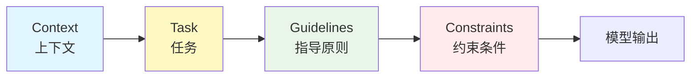
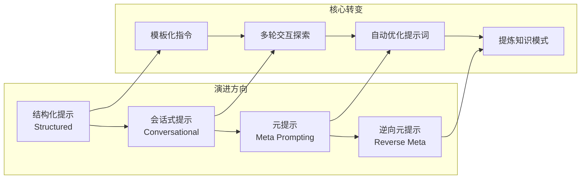
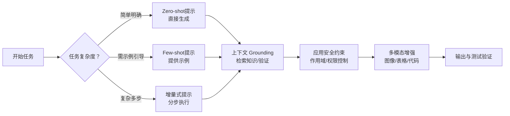
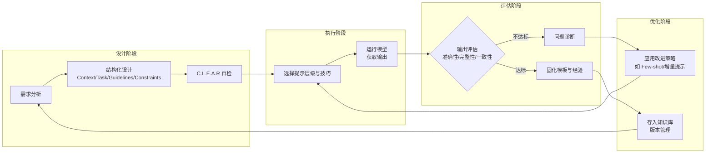

# 提示词工程高级技巧

> 真正的提示词工程，是让每一次模型交互都可复现、可评估、可协作，而不是一次性的“灵感产物”。

提示词工程（Prompt Engineering）核心在于：让模型理解、约束并稳定地产出你预期的结果。本章将从结构化写作、认知框架、实用技巧到常见陷阱，系统性总结高级提示词设计方法，帮助构建可复现、可维护、可评估的 AI 协作体系。

## 提示词的核心结构

一条高质量提示词应同时具备上下文、任务目标、执行指南与约束条件。采用结构化设计能让模型按部就班地执行任务，减少偏差与幻觉。

下表总结了提示词核心结构模块、内容说明与典型示例：

| 模块 | 内容说明 | 示例 |
| :--- | :--- | :--- |
| **Context（上下文）** | 提供场景、角色、目标受众或数据来源。 | “你是资深前端工程师，熟悉 React 与 Tailwind。” |
| **Task（任务）** | 明确任务与交付形式。 | “实现一个支持登录的前端页面，输出完整代码。” |
| **Guidelines（指导原则）** | 说明风格、框架或约定。 | “请保持响应式布局，不使用外部依赖。” |
| **Constraints（约束条件）** | 硬性规则与限制。 | “输出仅限单个文件，不可修改其他组件。” |

下方流程图展示了提示词结构化设计的执行顺序：

该结构确保每条提示词既“有上下文”，又“可工程化复现”。

## C.L.E.A.R 提示词原则

一个稳定提示词可用 C.L.E.A.R 框架自检：

下表总结了 C.L.E.A.R 框架的五大维度、含义与应用示例：

| 维度 | 含义 | 应用示例 |
| :--- | :--- | :--- |
| **Concise** | 简洁，剔除冗余表述 | 避免“帮我生成一个你觉得合适的设计” |
| **Logical** | 有逻辑，条理分明 | 使用编号或步骤式任务描述 |
| **Explicit** | 明确要求 | 说明输出格式、风格或引用规范 |
| **Adaptive** | 可迭代优化 | 通过多轮对话微调上下文 |
| **Reflective** | 可复盘 | 保存高质量 prompt 模板供复用 |

C.L.E.A.R 框架可作为工程团队评估提示词质量的标准模板。

## 提示词的层级进化

随着工程复杂度提升，提示词形态会从“指令”演化为“协议”。

下表总结了提示词层级进化类型、适用场景与示例：

| 层级 | 类型 | 适用场景 | 示例 |
| :--- | :--- | :--- | :--- |
| **1** | 结构化提示（Structured） | 新手、明确任务 | Context + Task + Guidelines |
| **2** | 会话式提示（Conversational） | 模糊需求探索 | “让我们一步步构建登录系统。” |
| **3** | 元提示（Meta Prompting） | 提示词优化 | “请重写此提示以提高清晰度。” |
| **4** | 逆向元提示（Reverse Meta） | 知识提炼 | “总结本次任务的成功模式。” |

下方流程图展示了提示词层级进化的路径：

这种演进路径反映了提示词从“**经验指令**”到“**可管理资产**”的转化。

## 高级技巧与实战策略

下表总结了高级提示词技巧、方法与工程收益：

| 技巧 | 方法 | 工程收益 |
| :--- | :--- | :--- |
| **Zero-shot / Few-shot** | 提供 0~N 个示例引导模型学习输出模式 | 提升一致性与格式化输出能力 |
| **增量式提示（Incremental Prompting）** | 分步执行任务，每步确认结果后继续 | 提高可控性与调试效率 |
| **上下文 Grounding** | 通过检索或外部知识提供事实依据 | 降低幻觉率，增强可验证性 |
| **安全约束与精确编辑** | 限定作用域、长度与修改文件 | 防止越权或误改 |
| **多模态提示（Multimodal）** | 将图像、表格、代码示例嵌入上下文 | 提高跨模态理解能力 |
| **可访问性与测试要求** | 在提示中指定可访问性标准和验证用例 | 保证输出符合工程规范 |

下方流程图展示了高级提示词技巧的组合工作流：

这些技巧结合后，能形成一套可自动化执行的提示词工作流（PromptOps）。

## 常见陷阱与规避方案

下表总结了提示词工程常见问题、典型表现与改进方法：

| 问题 | 典型表现 | 改进方法 |
| :--- | :--- | :--- |
| **任务模糊** | “帮我优化下这个应用” | 拆分为多个明确子任务 |
| **缺少上下文** | 模型误解业务目标 | 在提示中嵌入 Schema 或背景数据 |
| **无安全限制** | 模型修改意外文件 | 使用明确约束与 MCP 校验 |
| **过度依赖常识** | 模型输出错误假设 | 显式提供必要定义与示例 |
| **一次性复杂请求** | 超出模型上下文窗口 | 分阶段提示 + 自动校验流程 |

## 提示词工作流示意

下方流程图展示了提示词工程的闭环工作流：

该流程体现了提示词工程的闭环化与可演进性。

## 总结

提示词工程的成熟标志，是从单次交互走向系统协作。

下表总结了提示词工程关键维度、对应能力与目标：

| 关键维度 | 对应能力 | 目标 |
| :--- | :--- | :--- |
| **结构化** | 提高语义稳定性 | 减少幻觉与偏差 |
| **迭代性** | 持续自我优化 | 支持复杂场景与多轮任务 |
| **工程化** | 融入测试与安全策略 | 形成可管理的 AI 开发流程 |

通过结构化模板、C.L.E.A.R 原则与工程化验证机制，提示词从“指令语言”进化为 **智能体的编程接口（Prompt-as-Code）**。掌握这些高级技巧，才能在多模型、多上下文的协作环境中实现稳定、可信、可审计的 AI 系统设计。
