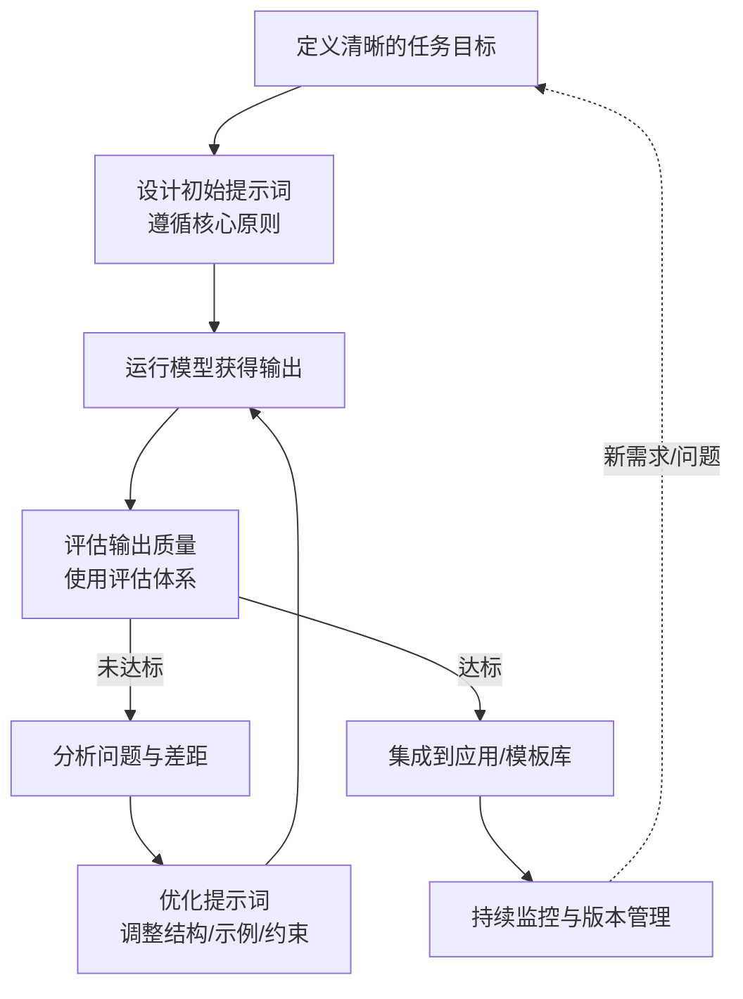
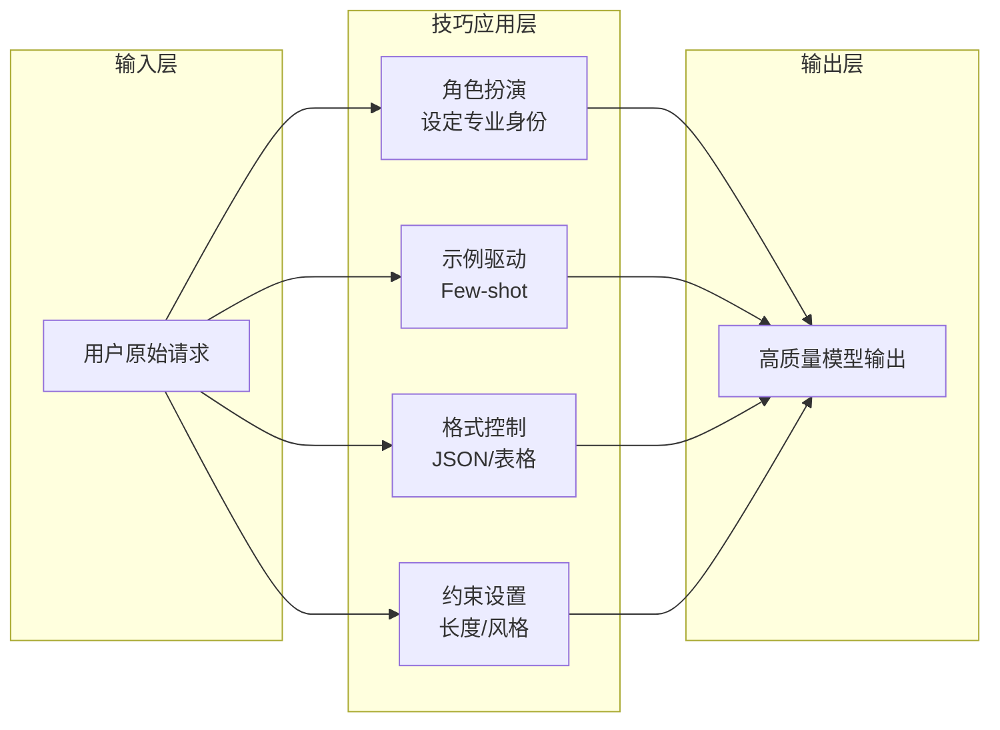
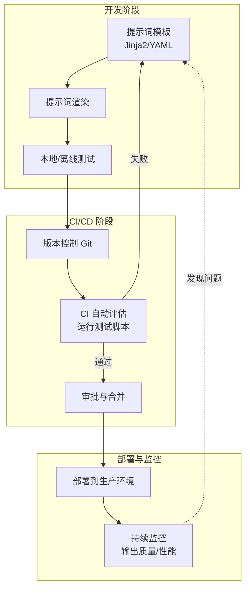

# 提示词工程最佳实践

> 高质量提示词是 AI 应用工程的“隐形代码层”，结构化与工程化管理是持续优化的关键。

在 AI 应用开发过程中，提示词设计已成为决定模型输出质量与开发效率的核心环节。通过系统化原则、结构化方法和工程化流程，开发者能够显著提升提示词的专业性和可维护性。

## 提示词设计核心原则

下表总结了提示词设计的三大核心原则，并通过示例加以说明，帮助开发者快速理解并应用于实际项目。

| 原则 | 说明 | 示例 |
| :--- | :--- | :--- |
| **清晰明确** | 任务描述要具体、可操作，避免模糊表达 | “为 SaaS 产品写 150 字介绍，突出自动化与节约成本” |
| **结构化表达** | 将复杂任务分层：背景、目标、格式、示例 | 用“背景 + 要求 + 输出格式”组织内容 |
| **渐进式优化** | 通过迭代改进，逐步提升模型输出质量 | 草稿→优化→完善版本 |

下面这张流程图展示了提示词工程的闭环优化流程，强调输入清晰、输出评估与持续反馈迭代：

## 实用技巧矩阵

在实际提示词工程中，开发者可以通过以下技巧提升模型表现。下表对常用方法进行了归纳，并给出典型应用场景。

| 技巧 | 关键目标 | 典型应用 |
| :--- | :--- | :--- |
| **Few-shot 示例驱动** | 通过示例教模型学习模式 | 分类、摘要、问答任务 |
| **角色扮演** | 为模型设定专业身份 | “你是一名资深 Kubernetes 架构师” |
| **输出格式控制** | 提升结果的结构化程度 | JSON、Markdown、表格 |
| **约束条件设置** | 限制模型输出范围与风格 | “使用 200 字以内的简洁语言” |

下方的结构图展示了各类提示词技巧如何协同作用，最终驱动模型输出学习模式：

## 质量评估体系

为了确保提示词输出的专业性与稳定性，需建立多维度质量评估体系。下表列举了常见评估维度及对应测试方法。

| 评估维度 | 关注点 | 测试方法 |
| :--- | :--- | :--- |
| **准确性** | 输出是否事实正确 | 与权威数据比对 |
| **相关性** | 回答是否契合任务 | 指令匹配度评估 |
| **完整性** | 是否覆盖必要要点 | 样例抽查 |
| **清晰度** | 表达是否简洁明了 | 用户主观评分 |
| **一致性** | 多次输出是否稳定 | 多次运行对比 |

下方表格直观展示了目标提示词与当前版本在五个核心质量维度上的表现差异，便于开发者定位优化方向：

| 质量维度 | 目标版本 | 当前版本 | 差距 | 优化建议 |
| :--- | :---: | :---: | :---: | :--- |
| **准确性** | 95 | 82 | -13 | 增加事实核查指令，要求引用来源 |
| **相关性** | 90 | 85 | -5 | 强化任务描述中的关键词 |
| **完整性** | 92 | 78 | -14 | 添加检查清单，确保覆盖所有要点 |
| **清晰度** | 88 | 80 | -8 | 精简表述，增加格式约束 |
| **一致性** | 98 | 70 | -28 | 降低 Temperature，固定随机种子 |

> **评估结果解读**：当前版本在**一致性**和**完整性**方面与目标差距最大，建议优先优化这两个维度。一致性差可通过调整采样参数（降低 Temperature）改善；完整性不足则需要优化提示词结构，增加明确的要点要求。

## 工程化与效率提升

提示词工程不仅关注内容本身，还需借助工程化手段提升效率与可维护性。下表总结了常用方法及其实现工具。

| 方法 | 实践要点 | 工具与实现 |
| :--- | :--- | :--- |
| **模板化** | 使用 Jinja2 等模板系统管理提示词结构 | .j2 模板 + YAML 参数配置 |
| **版本管理** | 跟踪提示词演进与变更 | Git + CI 自动测试渲染 |
| **自动评估** | 对输出质量进行持续监测 | Python 测试脚本 / LangSmith |
| **PromptOps** | 将提示词纳入 DevOps 流程 | Prompt 版本控制 + 审批发布 |

下方流程图展示了提示词工程的自动化与持续优化流程：

## 常见问题与应对策略

在提示词工程实践中，常见问题及解决方案如下表所示。每一类问题都需结合实际场景灵活应对。

| 问题类型 | 表现 | 解决方案 |
| :--- | :--- | :--- |
| **幻觉（Hallucination）** | 生成虚假或不实信息 | 加强上下文约束、要求引用来源 |
| **输出不一致** | 相同输入多次结果不同 | 固定随机种子、使用更具体模板 |
| **过度啰嗦** | 冗长输出偏离主题 | 设定字数上限、引导重点回答 |

## 总结

提示词工程是 AI 应用的“隐形代码层”。高质量提示词的核心在于 **结构化表达、工程化管理、持续评估优化**。在系统化实践中，开发者应构建模板库、版本库与评测体系，让提示词像代码一样具备可维护性与可复现性——这正是 AI 原生工程的基石。
