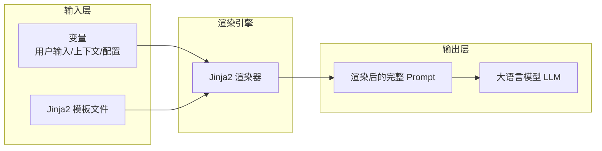
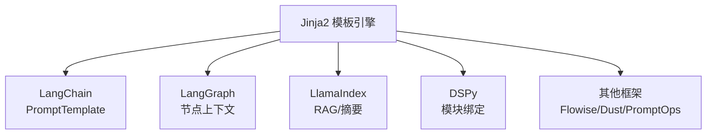
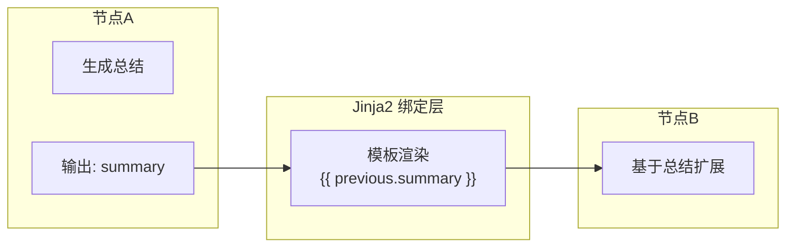
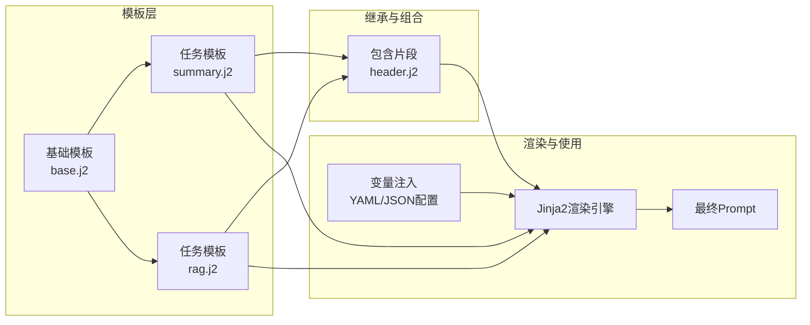
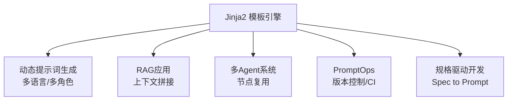

# Jinja2 在大模型提示词工程中的应用

> Jinja2 让提示词工程从“手写字符串”迈向可维护、可协作的工业级模板化体系，是 AI 应用工程化的关键。

模板化是提示词工程迈向工程化、规范化和可维护性的核心机制。随着大语言模型（LLM）应用从简单对话扩展到 RAG、Agent、多节点工作流、规格驱动开发，提示词正在从“手写字符串”演化为“受控模板”。Jinja2 作为 Python 生态的主流模板语言，为提示词带来可编程性、结构化与可组合能力，是当前多数 AI 工程框架的事实标准。

[Jinja2](https://jinja.palletsprojects.com/en/stable/) 的引入解决了提示词工程在变量增多、逻辑分支复杂时的可维护性难题。下文将系统梳理 Jinja2 在提示词工程中的应用场景、优势与最佳实践。

## Jinja2 与提示词工程的关系

Jinja2 解决的核心矛盾是：提示词需要同时具备可阅读性、可复用性、动态渲染能力，而传统字符串拼接方式在变量增多、逻辑分支复杂时完全无法维护。

下面对比了传统字符串拼接与 Jinja2 模板的写法：
```python
# 传统方式
prompt = f"请用{language}回答：{question}"
```

```yaml
{# Jinja2 方式 #}
你是一名{{ role }}。
请用{{ language }}回答以下问题：
{{ question }}
```

Jinja2 的结构化能力主要体现在以下几个方面：

| 能力 | 说明 |
| :--- | :--- |
| **变量注入** | 动态插入上下文、用户输入、系统配置等 |
| **条件逻辑** | 支持 if/else 控制内容结构 |
| **集合渲染** | 通过 for 循环生成 few-shot、上下文块等 |
| **模板继承** | 多任务复用结构化 prompt layout |
| **过滤器** | 文本预处理与规范化 |
| **文件拆分** | 大型提示词可拆分为模块化模板 |

下图展示了 Prompt → Template → Render → LLM 的典型数据流：



## 为什么在 Prompt 工程中使用 Jinja2

工程化 Prompt 的需求可以拆分为四项：可读性、可维护性、动态性、复用性。Jinja2 提供的能力与这四项高度契合。

下表对比了字符串拼接与 Jinja2 模板在结构化、复用性等方面的差异：

| 维度 | 字符串拼接 | Jinja2 模板 |
| :--- | :--- | :--- |
| **结构化** | 不存在 | 非常强 |
| **跨任务复用** | 不可行 | macro/include |
| **多语言/多角色** | 复杂、重复 | 模板变量自动注入 |
| **大规模 prompt** | 极难维护 | 可拆分、可继承 |

Jinja2 支持条件逻辑和集合渲染，提升了提示词的灵活性：
```yaml

请使用正式语气回答。

请使用口语化表达。



Q: {{pair.q}}
A: {{pair.a}}

```

## 主流 AI 框架中的 Jinja2 支持

Jinja2 已成为 LLM 框架的共同语言。整体生态如下：

| 框架 | 支持方式 | 使用说明 |
| :--- | :--- | :--- |
| **LangChain 1.0** | 原生支持 | `PromptTemplate.from_template()` |
| **LangGraph** | 节点渲染 | 用于节点间上下文绑定 |
| **LlamaIndex** | `template_format=“jinja2”` | 适用于 RAG、chunk 生成、摘要 |
| **DSPy** | 用作解释性模板语言 | 绑定模块输出 |
| **OpenAI / Anthropic SDK** | 推荐模式 | 构建复杂 system prompt |
| **Flowise / Dust / PromptOps** | 内置 DSL | Prompt 版本化、编排 |

下图展示了 Jinja2 在主流 AI 框架中的生态兼容关系：



## 常用提示词模板示例

以下为 Jinja2 在提示词工程中的常用模板示例，涵盖变量注入、few-shot、模板拆分等场景。

**基础变量注入模板：**
```yaml
你是一名{{ role }}。
请回答下面的问题：
{{ user_question }}
```

**渲染示例：**
```python
tpl = Template(open("prompt.j2").read())
tpl.render(role="云原生架构师", user_question="Istio 和 Kubernetes 的关系是什么？")
```

**动态 few-shot 模板：**
```yaml
以下是示例对话：

Q: {{ex.q}}
A: {{ex.a}}


现在请回答：
Q: {{question}}
```

**模板拆分与 include：**
```yaml


{{ content }}
```

**与 LangChain 集成：**
```python
prompt = PromptTemplate.from_template(
    "将以下英文翻译成中文：{{ text }}"
)
```

## Jinja2 在 AI 工作流中的上下文绑定

多智能体系统、LangGraph、DSPy 等框架需要节点之间传递结构化上下文。Jinja2 让节点输出可以直接作为上一个节点的输入。

**示例：**
```yaml
上一节点总结：
{{ previous.summary }}

请基于以上内容生成 200 字扩展说明。
```

下图展示了多节点工作流中 Jinja2 的上下文绑定关系：



## Jinja2 的优势汇总

Jinja2 在提示词工程中的优势如下表所示：

| 能力 | 价值 |
| :--- | :--- |
| **动态渲染** | 根据实时输入生成可控 prompt |
| **逻辑表达** | 通过 if/for 处理复杂上下文结构 |
| **模板继承** | 复用主 system prompt 框架 |
| **文本过滤器** | 提前清洗/规范化变量 |
| **工程生态兼容** | 与 Python、YAML、JSON、Markdown 协同工作 |
| **版本化管理** | 与 Git 完美整合 |

下图展示了大型 LLM 工程中 Jinja2 的结构化应用：



## 提示词工程中的实践方法

Jinja2 支持模板库管理、声明式变量注入、自定义过滤器与版本控制等工程实践。

**模板库管理示例：**

| 任务类型 | 模板路径示例 |
| :--- | :--- |
| **总结任务** | templates/sum.j2 |
| **翻译任务** | templates/translate.j2 |
| **RAG** | templates/rag.j2 |
| **多 Agent** | templates/agents/agent_x.j2 |

**YAML 声明式管理：**
```yaml
prompt:
  template: templates/sum.j2
  variables:
    - title
    - content
```

**自定义过滤器：**
```python
env.filters["strip_zh"] = lambda s: s.strip()
```

**与版本控制结合：**
- 模板变更走 PR
- 自动化测试渲染结果
- PromptOps 中自动回滚模板

## Jinja2 的典型使用场景

Jinja2 在提示词工程中的典型应用场景如下表：

| 场景 | 说明 |
| :--- | :--- |
| **动态提示词生成** | 多语言/多角色/多任务 |
| **RAG** | 拼接上下文块及 metadata |
| **多 Agent** | 节点间 prompt 结构保持一致 |
| **PromptOps** | 模板版本化、质量检查 |
| **SDD（规格驱动开发）** | 由 spec 自动渲染 prompt |

下图展示了 Jinja2 在提示词工程中的场景分布：



## 总结

Jinja2 已成为提示词工程的工程化基础设施。它提供变量注入、逻辑结构、模板继承、过滤器与跨框架生态兼容等能力，解决了复杂提示词难维护、难版本化、难复用的根本问题。在 RAG、多智能体系统、规格驱动开发、PromptOps 中，Jinja2 都承担着“提示词编排器”的角色，使 Prompt 成为可构建、可测试、可协作的工程资源。对于构建 AI 原生应用的任何团队而言，采用 Jinja2 是从实验性开发迈向工业质量的关键一步。
