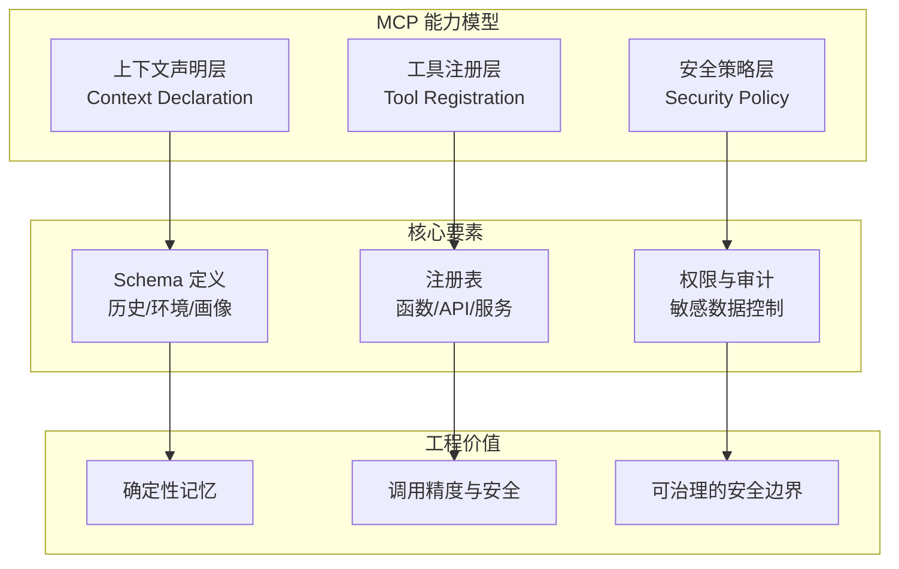
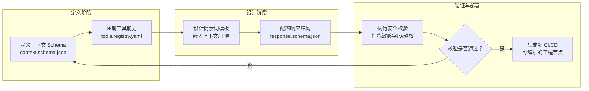
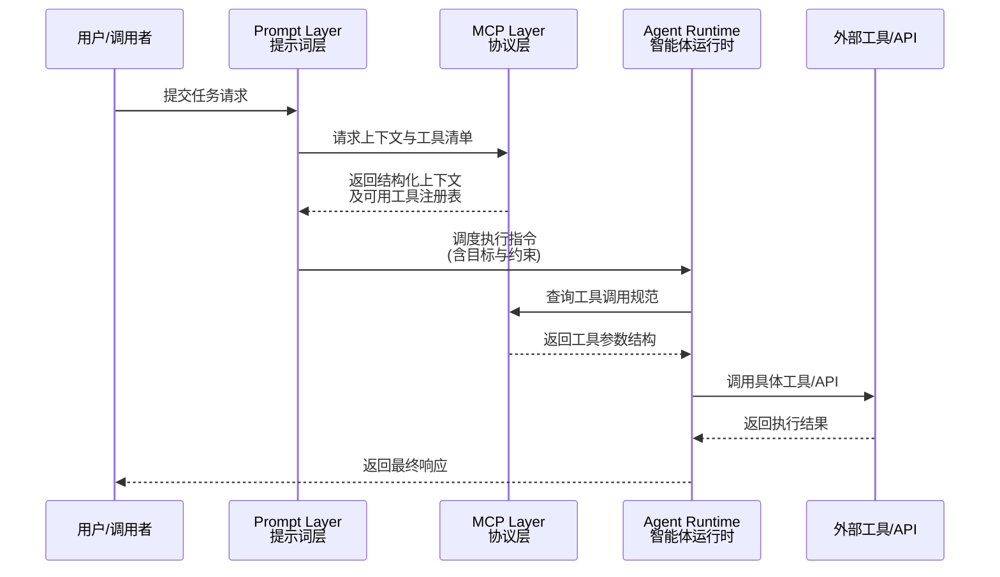

# 为提示词工程设计的 MCP 集成

> MCP 的引入，让提示词工程从“经验配置”跃升为可审计、可治理的协议化系统，推动 AI 生态标准化。

在 AI 系统中，提示词工程（Prompt Engineering）往往是上下文管理与外部工具调用的核心枢纽。Model Context Protocol（**MCP**, Model Context Protocol）通过标准化上下文描述与工具接口，使提示词工程从“经验式配置”转向“协议化协作”。本章节将展示 MCP 如何赋能提示词体系，让上下文与操作可追踪、可验证、可审计。

## MCP 的关键能力

MCP 为提示词工程提供了三个维度的结构化能力，使其可控、可组合、可审计。

下表总结了 MCP 的核心能力类别、说明及工程价值：

| 能力类别 | 说明 | 工程价值 |
| :--- | :--- | :--- |
| **上下文声明（Context Declaration）** | 用 Schema 明确描述历史对话、环境变量、用户画像等上下文要素。 | 避免模型丢失关键语境，实现“确定性记忆”。 |
| **工具注册（Tool Registration）** | 以结构化方式声明模型可用的函数、API 或服务。 | 提升 Agent 调用精度与安全性，避免“越权调用”。 |
| **安全策略（Security Policy）** | 通过权限与审计配置控制敏感数据访问。 | 形成可治理的提示词安全边界。 |

下方流程图展示了 MCP 能力模型的分层结构：

MCP 的目标不是替代提示词，而是让提示词成为协议内的一等公民：输入、上下文、动作与安全，都有明确定义与接口标准。

## 集成流程示例

在提示词工程中引入 MCP，可形成如下标准化流程。

下表总结了 MCP 集成的关键步骤、操作与输出产物：

| 步骤 | 操作 | 输出产物 |
| :--- | :--- | :--- |
| **1. 定义上下文 Schema** | 使用 JSON Schema 描述任务所需上下文字段（如 user_profile, project_state）。 | `context.schema.json` |
| **2. 注册工具能力** | 以 YAML / JSON 注册可用工具、函数及其输入输出结构。 | `tools.registry.yaml` |
| **3. 设计提示词模板** | 在模板中嵌入上下文引用与工具提示说明。 | `prompt.template.j2` |
| **4. 配置响应结构** | 使用 MCP 约定的输出格式（如 action, arguments）。 | `response.schema.json` |
| **5. 执行安全校验** | 启动安全扫描，检测敏感字段或越权访问。 | 安全报告与合规日志 |

下方流程图展示了 MCP 集成在提示词工程中的标准化流程：

经过 MCP 集成后，提示词不再是孤立的文本文件，而成为可编排的工程节点，可由 CI/CD 流水线自动验证、部署与监控。

## 与 Agent 的协同

当 MCP 与提示词结合后，**智能体（Agent）** 结构从“黑箱指令执行”变为“显式任务协议”。

下表总结了各模块在协同中的角色与功能：

| 模块 | 角色 | 功能 |
| :--- | :--- | :--- |
| **Prompt Layer** | 任务定义与语义约束 | 描述目标、格式与安全策略 |
| **MCP Layer** | 上下文与工具协议 | 管理输入输出与工具注册 |
| **Agent Runtime** | 任务调度与执行 | 调用 MCP 返回的结构化数据完成动作 |

下方时序图展示了 MCP 与 Agent 协同的任务执行流程：

通过这种分层协作，提示词设计、上下文协议与智能体执行得以解耦，形成高内聚、低耦合的智能体工作流。

## 总结

MCP 将提示词工程从“经验式指令”转化为“协议化系统”，通过 Schema、Registry 与 Policy 三要素实现 **上下文标准化、工具治理化、安全可追溯化**。

下表总结了 MCP 在提示词工程中的价值维度与工程收益：

| 价值维度 | 改进方向 | 工程收益 |
| :--- | :--- | :--- |
| **语义确定性** | 上下文 Schema 管理 | 降低幻觉与语义漂移 |
| **功能清晰度** | 工具注册与结构化输出 | 提升自动化与组合性 |
| **安全可控性** | 权限与审计策略 | 构建可信运行环境 |

**最终目标**：提示词工程不再是“灵感产物”，而是 AI 系统的正式协议层，为智能体生态与自动化管控提供坚实基础。