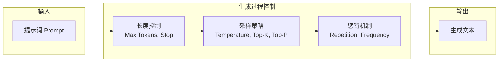

# 提示词工程中的 LLM 输出配置

> 输出参数决定了 LLM 的“边界与风格”，工程化配置是高质量 AI 产出的关键。

在大语言模型（LLM）应用中，输出行为并非仅由模型本身决定，而是由一组可调参数共同塑造。**提示词（Prompt）**（输入给 AI 模型的指令或文本）定义任务意图，输出参数则决定生成边界。工程系统中，输出参数与提示词同等重要，直接影响稳定性、可控性、性能与成本。本章以体系化视角对输出控制进行建模，避免碎片化解释，建立一套可复用的参数选择框架。

下方结构图展示了 LLM 在一次生成过程中，各类输出参数的应用顺序与层次。

## 输出长度控制：生成边界的外层约束

输出长度控制是 LLM 生成内容的最硬边界，决定了模型可使用的 **Token**（大模型处理文本的基本单位，可以是单词、词子或字符）上限和生成终止条件。

### 最大 Token（Maximum Tokens）
最大 Token 限制模型生成的最大长度，是成本、速度和内容完整性的直接约束。

下表总结了不同任务类型的推荐 Token 范围及风险说明：

| 任务类型 | 推荐 Token | 风险说明 |
| :--- | :--- | :--- |
| **问答** | 50–200 | 过短可能造成关键句缺失 |
| **代码生成** | 200–1000 | 增大延迟，易触发截断 |
| **长文写作** | 500–2000 | 成本上升，注意分段生成 |

最大 Token 的关键作用是保证任务不会因模型的“自由展开”导致成本不可控。工程环境中通常将其作为服务级别策略（**SLO**，Service Level Objective，定义服务性能的具体目标）的一部分，而不是用户可随意配置的选项。

### 停止条件（Stop Sequences）
停止条件用于指定特定 token 或字符串，当模型生成到该内容时立即停止。

应用价值包括：
- 强制结构化输出（如 JSON 对象末尾）
- 避免模型继续冗余描述
- 规避生成循环或模板化重复

停止条件是面向生产环境的工具，在构建 **Agent**（智能体，能够感知环境并执行动作以达成目标的实体或软件组件）、API、函数调用模式时尤其关键。

## 采样参数：从概率分布中选择输出的策略层

采样参数决定模型如何在下一 token 的概率分布中选择实际输出，直接影响回答的确定性、可控性与创造性。

采样策略由三个核心变量组成：
- Temperature
- Top-K
- Top-P (Nucleus Sampling)

### Temperature：概率分布尖锐度
Temperature 用于调整概率分布，使分布更集中或更平坦。

下表总结了不同 Temperature 范围的行为模式与应用场景：

| Temperature 范围 | 行为模式 | 应用场景 |
| :--- | :--- | :--- |
| **0.0–0.3** | 高确定性、强一致性 | 事实问答、代码生成 |
| **0.3–0.7** | 平衡模式 | 通用对话 |
| **0.7–1.0+** | 高随机性 | 创意写作、头脑风暴 |

Temperature 是最常用的采样控制项，也是最容易误调的参数。过高会导致语义漂移，过低会导致重复或僵硬。

### Top-K：候选空间的硬截断
Top-K 限定仅在概率最高的前 K 个候选词元中采样。
- K 小 → 输出稳定、变化小
- K 大 → 多样性增加，但可能引入噪声

下表总结了不同任务类型的推荐 K 值：

| 任务类型 | 推荐 K |
| :--- | :--- |
| **事实类** | 1–10 |
| **代码** | 10–30 |
| **创意写作** | 40–100 |

### Top-P：动态截断概率质量
Top-P 按概率累积分布截断候选集合，是比 Top-K 更柔性的采样策略。

下表总结了不同任务类型的典型 Top-P 配置：

| 任务类型 | Top-P |
| :--- | :--- |
| **精确任务** | 0.1–0.3 |
| **平衡任务** | 0.7–0.9 |
| **多样性任务** | 0.9–1.0 |

Top-P 和 Top-K 可以单独使用，也可混合，以 Top-P 为主导。

## 参数组合：构建任务级输出模式

实际工程中不会单独依赖单个参数，而是构成一组任务模板。

下表总结了多数 LLM 服务的默认策略基准：

| 任务类型 | Temperature | Top-K | Top-P | 目标特性 |
| :--- | :--- | :--- | :--- | :--- |
| **事实问答** | 0.1–0.2 | 1–5 | 0.1–0.3 | 稳定、无偏差、确定性输出 |
| **代码生成** | 0.2–0.5 | 10–30 | 0.5–0.8 | 语法一致性、少量探索 |
| **创意写作** | 0.7–1.0 | 40–60 | 0.8–0.95 | 生成性、多样性强 |
| **通用对话** | 0.3–0.7 | 10–40 | 0.6–0.9 | 平衡性最佳 |

组合策略的核心思想是：**Temperature 决定行为风格；Top-P 与 Top-K 决定搜索空间规模。**

## 惩罚机制：减少重复、防止模式化输出

模型在长文、对话、摘要任务中容易出现重复，惩罚机制用于修正这种行为。

### Repetition Penalty
Repetition Penalty 用于降低模型重复出现的词元概率。

- **推荐区间**：1.1–1.3
- **主要用途**：
  - 长文生成
  - 避免段落重复
  - 避免“无限循环式回答”

### Frequency Penalty
Frequency Penalty 用于惩罚高频词，使输出语义分布更均衡。

- **推荐区间**：0.1–0.3
- **主要用途**：
  - 内容多样化
  - 头脑风暴
  - 避免简单复述输入

## 调优方法：从默认值走向稳定产线配置

输出参数调优不应依赖直觉，而应采用工程化流程。

### 单变量调优（One-Variable-at-a-Time）
每次只调整一个参数，观察输出变化。适合初始探索与小模型调优。

### A/B 对比
两套参数在同一输入上跑对比，判断准确性、完整性、格式稳定度。适用于构建 API、插件、企业场景。

### 自动化调优（Parameter Tuning Pipeline）
通过脚本对多组参数组合进行网格搜索或随机搜索，形成自动化调优流程。

典型步骤如下：
1. 构造样本输入集
2. 批量运行参数矩阵
3. 记录指标（准确、相关、差异度）
4. 固化最优组合为默认策略

这是生产级 **RAG（检索增强生成）**（通过检索外部知识并与生成模型结合，提升回答准确性与可追溯性的方法）与 Agent 系统中最重要的调优步骤。

## 总结

本章系统梳理了大语言模型输出参数的工程化配置与调优方法。通过合理设置长度、采样、惩罚等参数，并采用科学调优流程，可以显著提升 LLM 的稳定性、创造性和生产效率。掌握这些参数的组合与应用，是构建高质量 AI 产品的基础。