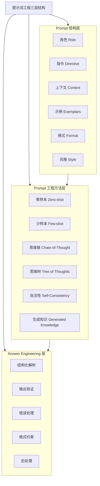
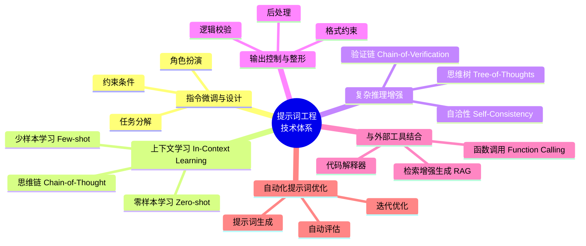
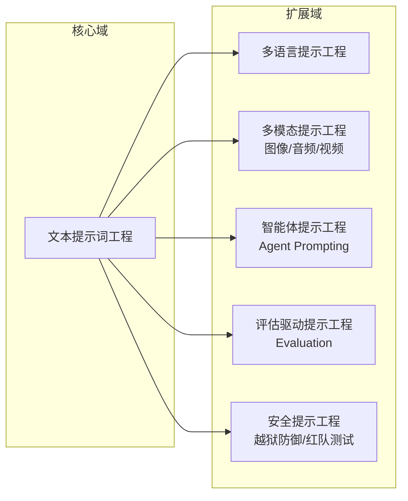
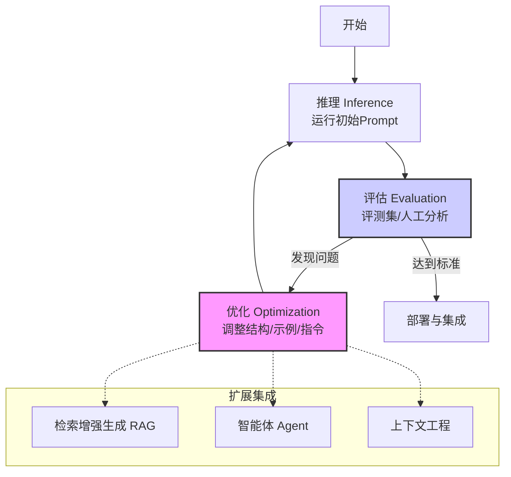

# 提示词工程概述

> 提示词工程是连接人类意图与大模型能力的桥梁，决定了 AI 应用的可控性与创新力。

**提示词工程（Prompt Engineering）**是构建 AI 原生应用的起点，也是连接人类意图与大语言模型（LLM）能力的关键接口。它不仅仅是“写提示词”，而是一套包含 **结构设计、工程流程、思维建模与输出塑形（Answer Engineering）** 在内的完整方法体系。

本章节将从开发者视角，结构化梳理提示词工程的基础概念、核心组成、技术谱系与扩展领域，并结合最新研究总结提示词工程的工程化框架。

## 提示词工程的三层结构

提示词工程的基础可以拆分为三层：**Prompt 结构层、Prompt 工程方法层、Answer Engineering 层**。三层构成一个完整的提示词系统，从输入到输出都有明确的工程闭环。

下图展示了提示词工程的三层结构及其核心要素：

## 什么是提示词（Prompt）

**提示词（Prompt）**：输入给 AI 模型的指令或文本。

提示词是传递给大语言模型（**LLM**：一种能够理解和生成人类语言的深度学习算法）的输入规范，用于约束模型行为、限定任务范围、控制输出格式。一个 Prompt 本质上是 **任务描述 + 行为规约 + 输出约束** 的组合。

优秀的提示词通常具备以下特征：
- **指令明确（Directive）**
- **上下文充足（Context）**：模型生成响应时所依赖的信息背景。
- **示例有效（Exemplars）**
- **格式固定（Format）**
- **风格一致（Style）**
- **无歧义（Disambiguation）**

## 提示词的工作原理

提示词在大语言模型中的作用可以分为以下几个阶段：

1.  **Token 化与编码**：Prompt 转换为 **Token**（大模型处理文本的基本单位，可以是单词、词子或字符）序列，作为模型输入。
2.  **上下文建模**：模型根据已有知识理解意图，建立语境。
3.  **概率预测**：逐 token 预测最可能输出，生成响应内容。
4.  **策略约束**：通过 Temperature、Top-p 等采样策略控制生成过程。
5.  **输出整形（Answer Engineering）**：结构化、解析、验证输出结果。

提示词质量直接影响模型在上下文建模与概率预测阶段的推理行为，因此 Prompt 的结构与顺序设计会显著改变输出质量。

## 提示词的核心组成（结构视图）

提示词可以拆解为 6 个结构单元。下表总结了每个部分的作用：

| 组成部分 | 作用 |
| :--- | :--- |
| **Role** | 设定模型的专业角色（审计员、工程师等） |
| **Directive** | 告诉模型“要做什么” |
| **Additional Info** | 背景知识、限制条件 |
| **Exemplars** | Few-shot 示例 |
| **Format** | 输出格式规范（JSON/Markdown/表格） |
| **Style** | 语气、风格（正式、简洁） |

这些元素共同形成“Prompt Schema”，是所有工程化 Prompt 的基础。

## 提示词工程：从技巧到体系化技术栈

提示词工程不仅仅依赖“经验”，而是一个系统化的技术体系。下图总结了 Prompt Engineering 的六大技术域及其代表方法：

## 提示词工程的扩展领域

随着模型能力增强，Prompt Engineering 已从“文本提示”扩展至多语、多模态、智能体、评估、安全等方向。下图展示了提示词工程的主要扩展领域：

## 提示词工程的工程化流程

提示词工程不是一次性动作，而是一个闭环迭代体系。其工程化流程包括以下三个阶段：

- **Inference（推理）**：试运行 Prompt，观察初步效果。
- **Evaluation（评估）**：使用评测集或人工标注进行误差分析，发现问题。
- **Optimization（优化）**：结构调整、示例重写、指令收紧、输出约束、Answer Engineering 等持续优化。

这个循环还可以与 **检索增强生成（RAG）**（结合信息检索和生成模型的技术，提升生成内容的准确性和可靠性）、**智能体（Agent）**（能够感知环境并执行动作以达成目标的实体或软件组件）和上下文工程等模块结合，成为 AI 系统的核心工程链路。

## 总结

提示词工程是一门工程学，不是经验技巧：
- **Prompt 结构**是骨架
- **Prompt 技术**是方法体系
- **Answer Engineering** 是落地关键
- **多模态、多语言、智能体**让 Prompt Engineering 进入扩展时代

理解“三层结构 + 六大技术域 + 扩展域”后，提示词工程将从“写提示词”升级为 **可控、可测、可组合的工程体系**。

## 参考资料

- [The Prompt Report: A Systematic Survey of Prompt Engineering Techniques - arxiv.org](https://arxiv.org/pdf/2406.06608)