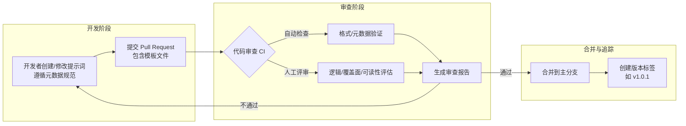
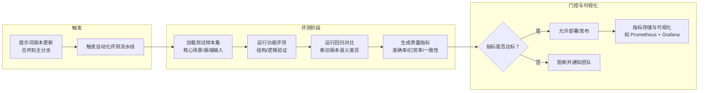
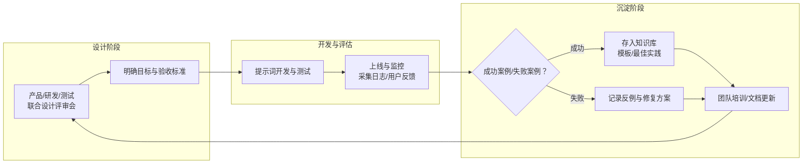
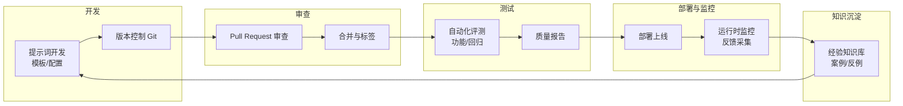

# 工具链协作：PromptOps 工作流实践

> 真正的 **PromptOps**（Prompt Operations），不只是工具链，更是团队协作和知识沉淀的加速器，让提示词成为可追踪、可验证的工程资产。

PromptOps 是将提示词工程纳入软件开发生命周期（SDLC, Software Development Lifecycle）的关键环节。它让**提示词（Prompt）**（输入给 AI 模型的指令或文本）具备“可协作、可审查、可回滚、可监控”的工程属性。本文将从版本管理、自动化评测和知识沉淀三个维度，系统化阐述团队如何构建高效的提示词协作体系。

## 版本管理与审查

在团队协作中，提示词应被视作代码资产（Code Asset）。为避免失控，需建立轻量但可审计的版本化机制。

下表总结了提示词版本管理的核心维度与实践要点：

| 管理维度 | 实践要点 | 示例 |
| :--- | :--- | :--- |
| **存储与追踪** | 使用 Git 仓库管理提示词模板与配置文件 | `prompts/code_review.yaml` |
| **元数据规范** | 每个提示词文件头包含用途、模型、负责人、更新时间 | YAML 头部注释或结构化字段 |
| **评审流程** | Pull Request 审查提示词改动 | 评估逻辑合理性、覆盖面与可读性 |
| **历史回溯** | 通过标签或版本号管理关键节点 | v1.0.1、v2.0.0-beta |

下方流程图展示了提示词版本管理与审查的协作流程：

**工程化思维要点**：提示词即接口；接口必须有版本、有审查、有文档。这样才能避免“语义漂移”与团队成员间的理解偏差。

## 自动化评测与回归

提示词更新后，必须通过自动化测试确保不影响既有功能。PromptOps 的测试应包含 **功能性评估** 与 **质量回归** 两个阶段。

下表总结了自动化评测的主要阶段与方法：

| 阶段 | 目标 | 工具与方法 |
| :--- | :--- | :--- |
| **功能评测** | 验证输出结构与逻辑正确性 | Python 测试脚本、CI 调用 **LLM**（大语言模型）API |
| **回归对比** | 检查新旧版本在关键任务的差异 | 语义差异比较（Semantic Diff） |
| **指标分析** | 跟踪准确率、幻觉率、一致性 | 质量评估报告自动生成 |
| **审批门控** | 未通过回归测试禁止上线 | **CI/CD**（持续集成/持续部署） Gate 阶段控制 |

下方流程图展示了提示词自动化评测与回归的工作流：

**最佳实践：**
- 评测样本应覆盖核心场景与极端输入。
- 质量指标应结构化存储，可视化展示（如 **Prometheus** + Grafana）。
- 定期做 A/B 比较，发现退化与异常模式。

## 团队协作与知识沉淀

PromptOps 不只是工具链，更是团队文化建设。一个成熟的提示词体系必须伴随评审机制、经验库与监控反馈闭环。

下表总结了团队协作与知识沉淀的关键机制与目标：

| 机制 | 目标 | 实施要点 |
| :--- | :--- | :--- |
| **设计评审会** | 明确提示词目标与验收标准 | 产品、研发、测试联合评审 |
| **经验知识库** | 积累成功与失败案例 | 存档模板、反例与修复记录 |
| **监控反馈系统** | 上线后自动采集反馈 | 日志指标 + 用户评分回流 |
| **知识共享** | 内部文档化与培训 | 使用 Wiki 或 Docs 平台沉淀知识 |

下方流程图展示了团队协作与知识沉淀的闭环流程：

这种闭环形成**持续学习系统**：提示词不是静态资产，而是动态演进的知识流。

## 综合工作流

将版本控制、自动测试与知识管理整合后，PromptOps 的完整生命周期如下：

下表总结了各阶段的核心产物与负责人：

| 阶段 | 核心产物 | 负责人 |
| :--- | :--- | :--- |
| **开发阶段** | Prompt 模板与配置 | 开发者 |
| **审查阶段** | 审查报告与对比日志 | Reviewer |
| **测试阶段** | 质量评测结果与基线 | QA / 工程团队 |
| **运行阶段** | 监控数据与反馈记录 | 运维 / 产品团队 |

## 总结

PromptOps 的本质，是将提示词工程嵌入 **DevOps**（一组结合了软件开发（Dev）和 IT 运营（Ops）的实践） 工作流中。通过版本化、自动化与知识化的体系建设，团队可以：
- 让提示词的变更可追踪、可验证、可回滚
- 实现人机协同的高效质量控制
- 建立长期积累的 AI 知识资产体系

这意味着——**提示词不再是灵感产物，而是生产力资产**。
