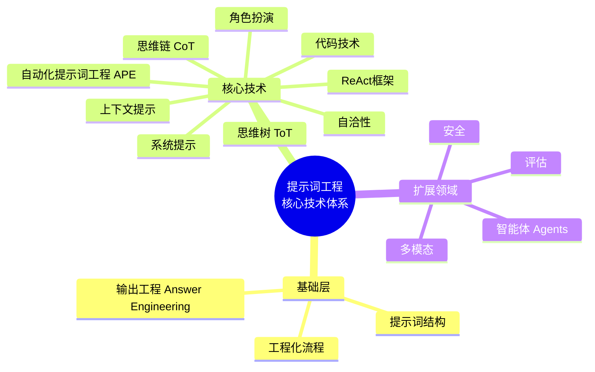
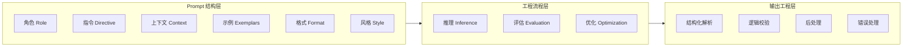
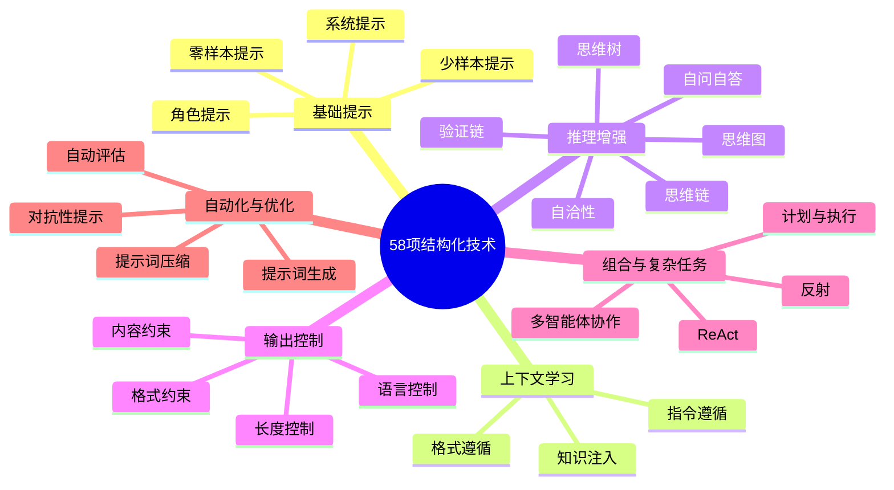
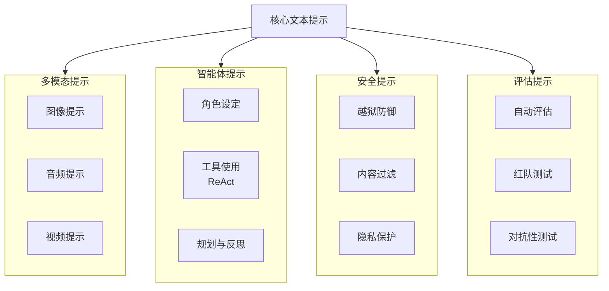

# 提示词工程的核心技术

> 提示词工程已成为 AI 应用开发的“新软件工程”，结构化与工程化能力决定了模型的极限。

提示词工程已经从“写一句提示词”演变为系统化、工程化、可验证的模型交互范式。在 AI 原生应用中，它不仅仅是“告诉模型该做什么”，而是涵盖了任务建模、输入结构化、推理控制、输出规范化以及多轮迭代优化（PromptOps）等完整流程。

下方的能力框架图展示了本章所覆盖的核心技术体系。



## Prompt 基础层（结构 + 工程 + Answer Engineering）

下图展示了提示词工程的基础层结构，包括 Prompt 组成、工程流程与输出工程。



## Prompt 工程的 58 项结构化技术（六大类）

下图梳理了文本型提示词工程的 58 项结构化技术，分为六大类，便于快速查阅和组合应用。



## Prompt 工程的扩展领域（多模态 · Agents · 安全 · 评估）

下图展示了提示词工程在多模态、智能体（Agent）、安全与评估等扩展领域的应用方向。



## 系统提示（System Prompt）

系统提示是模型行为的“操作系统”：它定义了角色、边界、语气、规则和输出框架。

下表总结了系统提示的工程化能力：

| 能力 | 说明 |
| :--- | :--- |
| **专业角色设定** | 决定知识边界与回答深度 |
| **安全与伦理约束** | 过滤不合规输出 |
| **输出格式规范** | JSON、Markdown、代码块等 |
| **风格统一控制** | 语气、细节程度、专业维度 |

系统提示常见应用场景包括：
- 设定专业角色（工程师、分析师、医生等）
- 约束输出格式（JSON/Markdown/Schema）
- 定义流程、步骤、推理风格
- 规范风险、安全边界与禁止项

**高质量 System Prompt 模板如下：**
```
你是一名 {{角色}}，具备以下能力：

1. 领域能力：{{专业能力}}
2. 风格偏好：{{语气、逻辑、表达方式}}
3. 输出约束：
   - 格式：{{JSON / Markdown / 表格}}
   - 不得：{{禁止行为}}
   - 必须：{{必须包含的元素}}

在回答任何问题时，应优先遵循以上规则。如需假设，请显式说明假设依据。
```

**快速工程化版本（短促可复用）：**
```
你是一名 {{角色}}。回答必须：
- 严格遵循结构化输出
- 引用原文事实
- 先推理再总结，但隐藏推理
```

## 角色扮演（Role Playing）

为模型设定“身份/角色”是让模型进入特定知识域的最有效方法。

下表总结了常用角色类型及适用任务：

| 类型 | 示例 | 适合任务 |
| :--- | :--- | :--- |
| **专业角色** | 架构师、律师、医生、算法工程师 | 深度专业输出 |
| **行业角色** | PM、DevOps、社区运营、分析师 | 产品/策略分析 |
| **风格角色** | 教练、科普作者、诗人 | 内容创作、解释型任务 |

**专业角色进入模式的 Prompt 模板：**
```
请扮演一名 {{专业角色}};
在整个对话中保持：
- 你的解释基于专业知识，而非猜测
- 回答包含推理逻辑
- 输出使用 {{风格}}
```

**示例（软件架构师）：**
```
你现在是一名资深软件架构师，擅长分布式系统、API 设计、K8s 与 AI Infra。
你的目标是：评估、设计、解释。
```

## 上下文提示（Context Prompt）

上下文是提示词工程的核心生产力：给模型足够信息，它会极大提升准确率与一致性。

下表总结了上下文层级及内容类型：

| 层级 | 内容 |
| :--- | :--- |
| **任务背景** | Why — 背景、目的 |
| **目标用户** | Who — 用户画像、需求 |
| **环境约束** | 技术栈、输入输出格式、资源限制 |
| **历史信息** | 过去对话、状态、依赖上下文 |

**上下文注入模板：**
```
以下是任务背景：
{{背景}}

目标用户：
{{用户画像}}

系统限制：
{{技术栈、工具、环境要求}}

你的输出要求：
{{格式要求}}
```

## 思维链推理（Chain-of-Thought, CoT）

思维链推理（CoT, Chain-of-Thought）是一种强制模型“逐步思考”的技术，可显著提升逻辑推理与复杂任务正确率。

**CoT Prompt 显式推理模板：**
```
请逐步思考并展示你的推理过程，遵循以下步骤：
1. 明确目标
2. 分解关键点
3. 推导可行方案
4. 验证并给出最终答案
```
适用于复杂逻辑、数学、多步骤任务、分析型问题（如架构设计、性能优化）。

**简洁版（隐式推理）：**
```
请先推理，再给最终答案。
（隐藏推理过程，只输出结论）
```

## 自洽性（Self-Consistency）

自洽性技术通过多次推理取最稳定答案，大幅提升准确度。

**Self-Consistency Prompt 模板：**
```
请为同一问题生成 5 个不同的推理路径。
比较它们的一致性，并给出最可能正确的答案及理由。
```

## 思维树（Tree-of-Thought, ToT）

思维树（ToT, Tree-of-Thought）通过“树状推理”探索多路径解决方案，比 CoT 更适合开放性问题。

**Tree-of-Thought Prompt 模板：**
```
请将问题拆分为多个可能路径（至少 3 条）：
- 路径 A：{{描述}}
- 路径 B：{{描述}}
- 路径 C：{{描述}}

评估每条路径的优劣，最终选出最佳方案并解释原因。
```
适用于架构决策、策略选择、权衡类任务。

## ReAct 框架（Reason + Act）

ReAct 框架结合“推理 + 工具执行”，广泛用于智能体（Agent）与工具调用场景。

**ReAct Prompt 标准格式如下：**
```
你将遵循以下循环：
观察 → 推理 → 行动（调用工具）→ 再观察 → 再推理

请用以下格式输出：
Thought: 你如何理解当前情况
Action: 调用的工具与参数
Observation: 工具返回结果
```

**工程化 ReAct 片段示例：**
```
Thought: 我需要查询向量数据库
Action: query_db{"text": "LLM 架构"}
```

## 代码相关提示技术

代码相关提示技术适合工程团队大规模自动生成、重构、审查代码。

**代码编写 Prompt 模板：**
```
请编写 {{语言}} 代码，并满足：

功能要求：
{{需求}}

接口要求：
{{函数签名、参数、返回结构}}

必须包含：
- 边界条件处理
- 错误处理
- 注释和文档字符串
```

**代码分析 Prompt 模板：**
```
请从以下维度分析代码：
- 正确性
- 性能
- 可维护性
- 安全性
- 架构问题

并给出可执行的优化建议。
```

## 自动化提示词工程（APE）

自动化提示词工程（APE, Automated Prompt Engineering）让模型自己优化 Prompt，实现提示词自动调优。

**APE 工作流模板：**
```
[步骤 1] 生成 5 个不同版本的提示词  
[步骤 2] 对每个版本进行测试  
[步骤 3] 将输出按以下维度评分：
 - 准确性
 - 稳定性
 - 结构一致性
 - 安全性

[步骤 4] 基于评分自动迭代优化
```

## 各技术 Prompt 库

下方为每个技术提供“一句话可插拔”版本，便于快速组合应用。

| 技术类型 | 可插拔 Prompt 示例 |
| :--- | :--- |
| **System Prompt** | 严格遵循专业身份，输出结构化格式。隐藏推理，仅输出最终答案。 |
| **Role Playing** | 请以资深 AI 架构师的角度分析。你是 PM，请从用户视角评估。 |
| **Context Prompt** | 以下是背景，请结合上下文回答。 |
| **CoT** | 请逐步推理并输出思维链。 |
| **Self-Consistency** | 给出 3 个推理路径并选择最佳答案。 |
| **ToT** | 请探索至少 3 种方案并最终决策。 |
| **ReAct** | 按 Thought → Action → Observation 结构回答。 |
| **Code** | 请生成具备注释、边界处理、错误处理的代码。 |
| **APE** | 请生成提示词的多个版本并进行自我优化。 |

