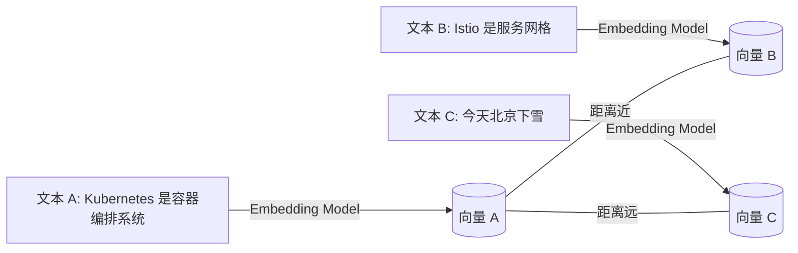

# Embedding（向量）与文本表示

> 向量（Embedding）让 AI 能“理解”文本语义，是现代 RAG 检索的数学基石。

在 RAG（Retrieval-Augmented Generation，检索增强生成）中，Embedding（向量）是实现语义检索的核心。理解 Embedding 的原理和工程实践，是构建高质量智能检索系统的基础。

## Embedding 到底是什么？

Embedding（向量）本质上是将文本映射到一个高维空间中的数学坐标。这样，模型就能通过距离来衡量文本间的语义相似度。

下方的流程图直观展示了文本如何被映射为向量，并通过距离体现语义关系：

### 图 1：文本到向量的映射与距离示意（Mermaid）



在这个空间中，意思相近的文本距离更近，意思相反或无关的文本距离更远。

## 为什么向量能代表“语义”？

Embedding 之所以能表达语义，关键在于其背后的 Transformer（变换器）模型通过自注意力机制学习了大规模文本中的语义结构。

常见的 Embedding 模型包括：

* BERT 类模型
* LLaMA / Mistral 的 Embedding 模式
* OpenAI text-embedding-3-large
* bge-large-zh 等中文模型

这些模型能够捕捉：

* 词与词之间的语义关系
* 概念之间的映射
* 上下文逻辑

因此，模型可以理解：

* “K8s”与“Kubernetes”是等价词
* “Service Mesh”与“Istio”强相关
* “云原生”与“容器化”有语义接近性
* “微服务”与“单体架构”语义相反

Embedding 空间可以看作是一个压缩后的“世界知识空间”。

## Embedding 的关键参数：维度（dimension）

选择合适的向量维度（dimension）对于性能和效果至关重要。

| 模型                            | 维度   |
| ----------------------------- | ---- |
| OpenAI text-embedding-3-small | 1536 |
| bge-base-zh                   | 768  |
| bge-large-zh                  | 1024 |
| Cohere Embed v3 large         | 4096 |
| Mistral embedding             | 1024 |

**表 1：常见 Embedding 模型及其维度**

高维向量表达能力强，但检索成本更高。低维向量存储和检索效率高，但表达能力有限。

* 低维：类似 Prometheus 的 low-cardinality label，存储少、速度快，但表达能力弱。
* 高维：类似高卡标签，表达能力强，但检索成本更高（如 Milvus、Weaviate 需更优索引）。

经验建议：

* 通用 RAG：1024 是最佳平衡
* 中文问答 / 企业文档：bge-large-zh（1024）最优
* 跨语言需求：推荐 OpenAI 的 small/large
* 千万级数据：建议低维（512–768）以提升性能

## 距离度量（similarity metric）

衡量向量间相似度时，通常不直接用欧氏距离，而是采用更适合语义空间的度量方式。

常见的相似度计算方法：

* Cosine 相似度（最常用）
* Dot-product（向量数据库普遍支持）
* L2（欧氏距离，部分旧模型）

Cosine 相似度之所以主流，是因为它关注向量的方向而非长度，更能反映语义一致性。

可以类比为：判断两个人兴趣是否相同（方向），而不是兴趣有多强烈（长度）。

## 不同类型的 Embedding

Embedding 不止一种类型，实际工程中需根据场景区分：

* 文本嵌入（Text Embedding）：用于文档检索、知识库、RAG。
* 指令嵌入（Instruction Embedding / Query Embedding）：优化“问题 → 文档”的相似度。
* 多模态嵌入（Image / Audio / Video Embedding）：用于多模态检索。
* Token Embedding：Transformer 输入层权重，非 RAG 检索用。

## 示例：Python 生成向量并搜索

```python
from sentence_transformers import SentenceTransformer, util

model = SentenceTransformer("BAAI/bge-large-zh-v1.5")

docs = [
    "Kubernetes 是一个容器编排系统",
    "今天北京下雪了",
    "Istio 是一个服务网格框架"
]

embeddings = model.encode(docs, normalize_embeddings=True)

query = "什么是 K8s？"
query_emb = model.encode([query], normalize_embeddings=True)

scores = util.cos_sim(query_emb, embeddings)[0]
print(scores)
```

运行后你会发现，与查询最相关的文本得分最高。这正是 RAG 检索的核心原理。

## Embedding 的常见坑

实际工程中，Embedding 常见的误区：

* 使用错误语言的 embedding
* 文档切分太大
* 查询与文档 embedding 不是同一模型
* embed 时忘记 normalize

经验规则：

* 使用 bge 系列模型时一定要 normalize
* 使用 OpenAI 模型时不要 normalize（已自动处理）

## Embedding 的工程化最佳实践

为了提升检索效果和系统性能，建议遵循以下工程实践：

### 文档向量 + 元数据过滤

```json
{
  "content_vector": [...],
  "source": "k8s handbook",
  "section": "networking",
  "date": "2024-02"
}
```

### 大数据量时使用 ANN 索引

如 Milvus、Weaviate、Qdrant 的 IVF、HNSW、PQ 等索引结构。

### 定期重建索引

尤其是 PQ，数据量增加后召回率会下降。

### 使用查询扩展（Query Expansion）

用大语言模型（LLM）改写查询，可显著提升命中率。

## 总结

Embedding（向量）是 RAG 检索的数学基础。高质量的 embedding 能带来稳定、高召回、高准确率的检索效果。

一句话总结：

> Embedding 把文本映射到一个语义空间，相似度检索找的是语义上最接近的内容，而不是关键词。

这正是现代 RAG 能远超传统搜索的根本原因。
