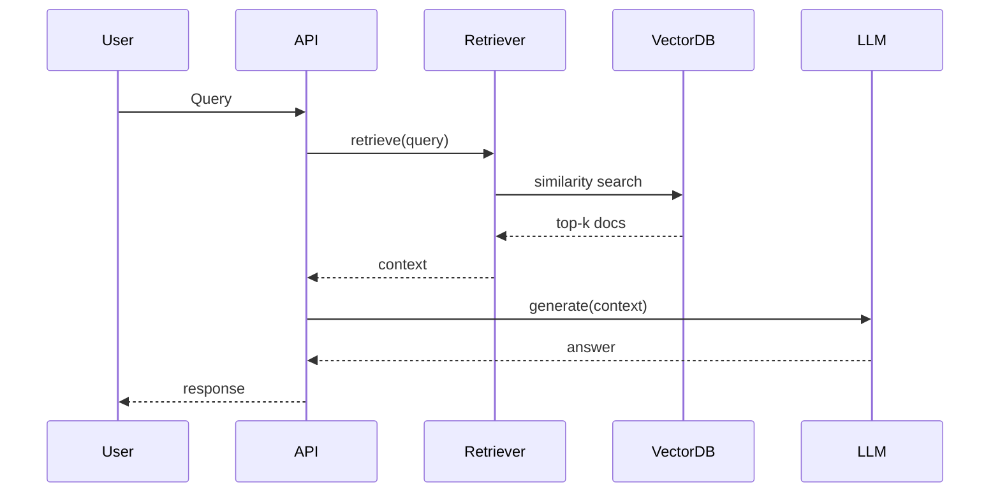

# RAG 的可观测性：如何监控检索增强生成系统

> 真正可用的 RAG 系统，必须能“看见”每个环节的语义质量和性能瓶颈，否则优化无从下手。

RAG 系统（RAG, Retrieval-Augmented Generation）涉及多个环节：数据切分、Embedding（嵌入）、向量检索、重排序、LLM（大语言模型，Large Language Model）调用、Agent（智能体）决策等。如果这些环节无法被观测，就很难判断系统为何答得不好、是否检索到了正确文档、embedding 是否无效、LLM 是否误解了上下文、是否需要 query 重写、Agent 逻辑是否进入错误路径，以及哪个环节导致了延迟和性能瓶颈。

要让 RAG 真正可用，必须实现全链路可观测性。本节将从指标（Metrics）、日志（Logs）、追踪（Traces）、专用工具四个方面讲解完整的 RAG 可观测性方法论，并提供可运行示例。

## RAG Pipeline 可观测性总览图

下图展示了 RAG Pipeline 的主要环节与可观测性指标分布：

```mermaid
flowchart TD

User[User Query]
Rewrite[Query Rewriting]
Retriever[Vector Retrieval]
Rerank[Reranker]
Context[Context Assembly]
LLM[LLM Generation]
Agent[Agent Decision]
Answer[Final Answer]

User --> Rewrite
Rewrite --> Retriever
Retriever --> Rerank
Rerank --> Context
Context --> LLM
LLM --> Agent
Agent --> Answer

subgraph Observability
Metrics[Metrics]
Logs[Logs]
Traces[Distributed Traces]
end

Rewrite -.-> Metrics
Retriever -.-> Metrics
LLM -.-> Metrics

Rewrite -.-> Logs
Retriever -.-> Logs
LLM -.-> Logs

Rewrite -.-> Traces
Retriever -.-> Traces
LLM -.-> Traces
````

## 关键指标（Metrics）

RAG 系统的指标不仅包括基础设施层面，还涵盖语义质量度量。下面分别介绍系统级指标、检索级指标和语义质量指标。

### 系统级指标（Infrastructure Metrics）

这些指标用于监控 RAG 系统的基础性能，推荐使用 Prometheus + Grafana 进行采集和展示。

| 指标                        | 意义             |
| ------------------------- | -------------- |
| latency_total             | RAG 端到端延时      |
| latency_retrieval         | 向量检索耗时         |
| latency_llm               | LLM 请求延时       |
| qps / concurrent_requests | 并发能力           |
| memory_usage              | 向量库内存占用        |
| disk_usage                | 索引占用（HNSW/IVF） |

### 检索级指标（Retrieval Metrics）

检索级指标是 RAG 系统的核心可观测性，主要用于评估检索环节的有效性。

| 指标                       | 意义              |
| ------------------------ | --------------- |
| recall@k                 | 检索召回率           |
| precision@k              | 检索相关度           |
| hit_rate                 | 检索文档是否命中正确主题    |
| avg_score                | 向量相似度平均值        |
| out-of-distribution rate | “查不到任何有意义文档”的比例 |

其中，OOD Query（Out-of-Distribution Query，知识库中没有内容）是最常见问题之一。可以通过设定 similarity 阈值自动监控。例如：

```python
# 检查检索结果的最大相似度分数是否低于阈值
if max_score < 0.3:
    logger.warning("Low relevance retrieval", query=query)
```

### 语义质量指标（LLM 输出质量）

通过 DeepEval、Ragas 等工具可以实时评估 LLM 输出的语义质量。

| 指标                | 意义         |
| ----------------- | ---------- |
| faithfulness（忠实度） | 回答是否引用文档   |
| answer_relevancy  | 是否回答了用户问题  |
| context_precision | 使用的上下文是否相关 |

例如，下面代码展示了如何用 DeepEval 评估答案相关性：

```python
from deepeval.metrics import AnswerRelevancyMetric

metric = AnswerRelevancyMetric()
score = metric.measure(prediction=answer, context=docs)
```

这些指标可以定期计算，也可以作为在线监控。

## 日志（Logs）

RAG 系统的日志应包含语义级事件，而不仅仅是技术日志。这样才能支持后续分析和优化。

下面是推荐的日志字段示例：

```json
{
  "query": "How do LLM Agents work?",
  "rewritten_query": "LLM agent architecture explanation",
  "retrieved_docs": [/* doc_ids */],
  "scores": [0.92, 0.88, 0.54],
  "selected_context_length": 1850,
  "llm_model": "gpt-4.1",
  "latency_ms": 1120
}
```

这些日志可用于分析查询命中情况、向量相似度分布、默认 k 值是否合理，以及 chunking 策略的有效性。

## 分布式追踪（Traces）

RAG 系统推荐使用 OpenTelemetry（OTel）进行分布式追踪，帮助定位性能瓶颈和参数传递。

下方时序图展示了典型的 RAG Trace 结构：



通过追踪每个 Span 的耗时和参数，非常适合集成 Grafana Tempo 或 Jaeger。

## RAG 专用可观测性工具

除了通用监控方案，RAG 领域还涌现了多款专用可观测性工具，极大提升了语义质量分析和可视化能力。

### Phoenix（Arize 开源）

Phoenix 是专注于 RAG 的机器学习可观测性平台，支持可视化 Query embedding 分布、检索质量变化、Context overlap、LLM Drift、Answer Faithfulness 等。

典型用法：

```python
import phoenix as px
session = px.launch_app()
session.record(docs, embeddings, metadata)
```

如果你本地跑 RAG，这是最不需要繁琐配置的工具之一。

### DeepEval

DeepEval 适合评估语义质量，包括 Faithfulness、Relevancy、Context Precision、Factual Accuracy。支持在 CI/CD 流程中自动验证 RAG pipeline。

### RAGAS

RAGAS 是另一款 RAG 专用指标工具，支持 answer relevancy、context utility、rhetorical quality，非常适合做每周质量分析报告。

## RAG 可观测性最佳实践

下面我将从 AI Infra 架构师视角，介绍 RAG 可观测性的核心实践建议：

* **Embedding 漂移监控**：不同日期写入的 embedding 可能来自不同模型，导致相似度下降。建议添加 `embedding_model_version` 字段，并定期重建索引。
* **Query 重写命中率监控**：Agentic RAG 中 Query Rewriting 非常关键。建议记录原始 query、重写 query，以及两者 embedding 的 cosine 相似度，以发现重写是否过度改变语义。
* **检索相似度分布监控**：推荐建立 Grafana Panel（如 `max_score_histogram`）。如果出现大量低分段，可能是 chunk 太碎、向量库噪音太多、embeddings 版本不一致或用户问题偏 OOD。
* **Prompt 注入与幻觉监控**：需要实时记录 LLM 输出是否引用 context、是否出现虚构引用、越界回答。Phoenix 和 RAGAS 都能自动检测这些问题。
* **上下文窗口使用率监控**：建议记录 `context_tokens / max_context_tokens`。如果长期超过 80%，可能是 chunking 过密、rerank 没做过滤、retrieval k 值过大。

## 总结

RAG 可观测性与普通 API 监控完全不同，它需要监控语义质量，包括检索是否真的命中、Query rewriting 是否有效、LLM 是否忠实引用上下文、检索结果与答案是否一致、哪个环节导致错误或延迟，以及 embedding 与知识库是否发生漂移。

通过 Metrics、Logs、Traces 以及专用工具（Phoenix、RAGAS、DeepEval），才能构建真正可控、可解释、可维护的 RAG 系统。
