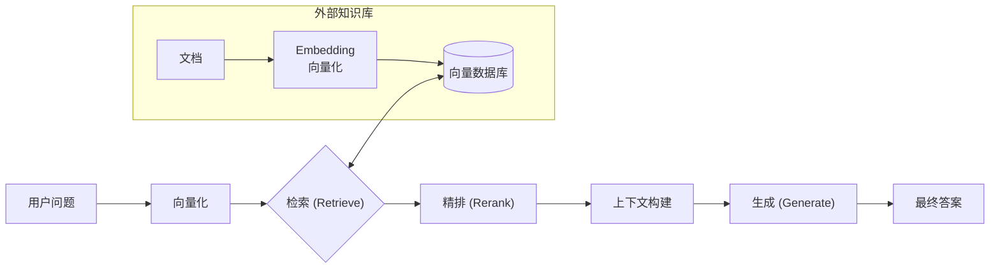
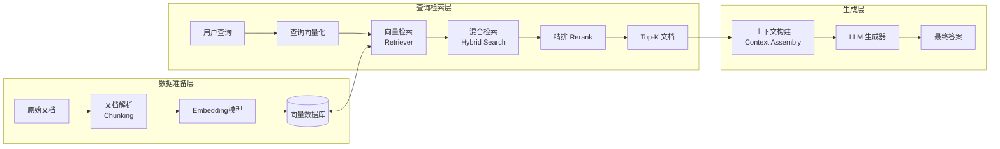

# RAG：给模型“外挂知识库”

> RAG 让大模型不再死记硬背，而是像工程师一样“查资料”，随时拥有最新知识。

## RAG 是什么？

检索增强生成（RAG, Retrieval-Augmented Generation）让大语言模型（LLM）从“内置知识”升级为“可挂载外部知识”。逻辑上，它就像给 LLM 挂上一个“外接硬盘”。

如果没有 RAG，大模型只能依赖预训练期间学到的知识，无法实时更新。引入 RAG 后，模型可以访问动态数据、私有文档、数据库、日志甚至 API，从一个“语言模型”升级为“知识增强型 Agent”。

## 为什么需要 RAG？

机器学习模型的本质是“统计压缩”：

- 预训练模型 ≈ 一个巨大的概率分布
- 内置知识 = 预训练语料当时的状态
- 无法实时更新
- 无法访问业务知识
- 无法访问结构化数据或实时信息

用工程师的话说：

> 预训练模型就像一个只读的“镜像文件”，生成时无法临时挂载额外的数据卷。

RAG 解决了以下问题：

- 业务知识经常更新
- 模型必须访问实时信息
- 私有数据不能放到训练集
- 长期来看训练成本太高
- 模型无需记住所有内容，只需能“找”

一句话总结：

> RAG = 在大模型前加一层“可检索知识层”，让模型随时看见它未训练过的知识。

## 云原生类比：RAG = 外挂知识库，是给 LLM 的“CRD + etcd + Controller”

下表用云原生工程视角类比 RAG 的核心组件：

| RAG 组件 | 云原生类比 | 含义 |
| :--- | :--- | :--- |
| Embedding | CRD 索引 / Tag 索引 | 把文档“结构化”成可检索向量 |
| Vector DB | etcd + 高级检索 + 倒排索引 | 存储特征向量，实现相似度检索 |
| Retriever | Controller / Informer | 根据查询找到最相关的文档 |
| Rerank | 精排器 / Admission Webhook | 对结果进行更精细排序 |
| Generator (LLM) | 业务逻辑层 | 根据检索结果生成最终答案 |

一句话类比：

> RAG = 模型不再全靠自己推理，而是能查询外部“知识 API”。

## RAG 标准流程

下图使用 Mermaid 语法展示了 RAG 的标准工作流程，清晰分为“检索、精排、生成”三大环节：

在这个流程中，用户问题经过向量化、检索、精排、上下文构建，最终由 LLM 生成有依据的答案。

## RAG 的关键技术点

RAG 涉及多个关键技术环节，下面逐一介绍。

### Embedding：把文本变向量

Embedding 的本质是将任意文本转为语义向量（如 768/1024 维），便于后续的相似度计算。

工程师类比：

> Embedding = 文档的结构化标签，是 CRD 的 schema + index。

注意事项：

- 业务场景不同，Embedding 必须调优（如金融、法律、代码）
- 选择合适的模型很关键（如 bge-m3、jina-embeddings、GTE、E5 等）

### Vector Database：向量数据库

向量数据库用于存储和检索高维向量，支持高效的相似度搜索。

主要能力包括：

- 向量存储
- 高维检索（ANN：HNSW、IVF、PQ）
- Meta 数据过滤
- 分片、高可用、多租户

工程类比：

> 像 etcd，但它不是做一致性，而是做“最近邻搜索”。

常用系统有 Milvus、Qdrant、Weaviate、Elastic + dense_vector、PgVector（Postgres 扩展）等。

### Retriever：召回最可能的文档

Retriever 决定用什么方式匹配内容、Top-K 取多少、是否加 metadata filter。

常见检索策略：

- 向量检索
- BM25（关键词检索）
- 混合检索（Hybrid Search）
- 多路召回

Hybrid Search（embedding + BM25）是当前最稳的生产方式。

### Rerank：精排器

Rerank 负责对召回结果进行更精细的语义相关性排序，通常采用 cross-encoder 结构（如 bge-reranker）。

工程师类比：

> Rerank = Admission Controller，最后把关，决定哪些文档进上下文。

Rerank 能显著提升答案准确度、上下文相关性，并减少幻觉。

### Context Assembly：上下文构建

上下文构建常用策略包括 chunk 合并、文档摘要、文档压缩（Distillation）、基于 Token 限制做裁剪。

工程挑战：

- 太长会增加成本和延迟
- 太短可能找不到信息
- 乱拼接易导致上下文冲突

### LLM Generator：有依据地回答

最终，LLM 不再“凭记忆胡思乱想”，而是根据检索到的证据给出 grounded 回答。这是减少幻觉的关键。

## RAG 全流程架构图

下图使用 Mermaid 语法展示了 RAG 的完整工程架构，适合工程型读者理解各层次关系：

我们将在后续章节深入 RAG 流程的每个环节。

## RAG 的工程挑战与最佳实践

RAG 在实际工程落地中面临诸多挑战，下表总结了常见问题及说明：

| 问题 | 说明 |
| :--- | :--- |
| Chunk 切片策略 | 太大太小都影响效果 |
| Query 改写 | 用户提问往往不完整 |
| 混合检索 | 单一方式不稳定 |
| 精排 | 必须带 Rerank，否则召回噪音太大 |
| 上下文冲突 | 多文档合并会互相矛盾 |
| 支持长上下文 | vLLM、PagedAttention 等技术必备 |

这些问题的解决方案和最佳实践我会单独成文深入探讨。

## 总结

RAG 本质上是给大语言模型（LLM）加一个“外挂知识库”，让模型能访问外部文档、实时信息和私有数据。

RAG 的核心流程包括：

- Embedding（把文本向量化）
- Vector DB（存储与检索）
- Retrieve（召回）
- Rerank（精排）
- Context Assembly（构建上下文）
- Generation（生成 grounded 回答）

工程本质：

- 让模型不再死记硬背，而是会“查资料”
- 减少幻觉
- 降低训练成本
- 支持私有数据 / 实时数据
- 是 AI 应用的核心基础设施之一
