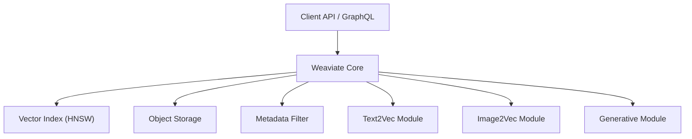
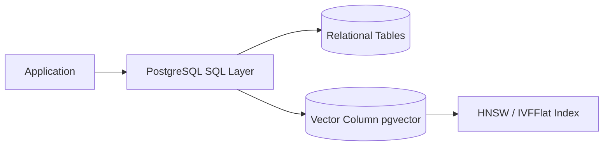

# 向量数据库选型实践

> 向量数据库是 RAG 系统的“语义底座”，选型决定检索质量与系统可扩展性。工程师必须理解架构与能力，才能做出最优决策。

向量数据库在 RAG（Retrieval-Augmented Generation, 检索增强生成）系统中承担了向量化后的文本、图像、代码等数据的高效存储与近邻检索。实际工程中，向量库的选型直接影响系统性能、成本和后续扩展能力。

本章节将从架构、核心能力、主流产品对比到选型路径，提供一套可落地的全栈指南。

---

## 向量数据库在 RAG 系统中的位置

下方流程图展示了向量数据库在 RAG Pipeline 中的核心环节：

### 图 1：RAG 系统中的向量数据库位置

```mermaid
flowchart LR
    A[原始文档] --> B[Chunking 文本切分]
    B --> C[Embedding Model]
    C --> D[(Vector Database)]

    Q[用户问题] --> QE[Query Embedding]
    QE --> D

    D --> R[Top-K 检索结果]
    R --> P[Prompt 构建]
    P --> LLM[大语言模型]
    LLM --> O[生成回答]
````

如图所示，向量数据库位于 Embedding 输出 与 Context 构建 之间，是信息检索质量的核心影响因子。

## 主流向量数据库选型矩阵

下表对比了主流向量数据库的工程特性，可直接用于团队选型评审：

| 方案           | 最佳使用场景                | 优势                    | 局限           | 典型规模       |
| ------------ | --------------------- | --------------------- | ------------ | ---------- |
| Chroma       | 本地开发、轻量应用、桌面级 RAG     | 零依赖、好用、迭代快            | 不适合超大规模/分布式  | ≤ 100 万向量  |
| Milvus       | 企业级集群、十亿向量、多租户        | 高吞吐、GPU 索引、多副本 HA     | 运维成本高        | 1 亿～10 亿向量 |
| Weaviate     | 结构化 + 向量混合搜索、知识库      | GraphQL、Filter 强、插件丰富 | 部署复杂度略高      | 1 百万～5 亿   |
| PGVector     | 已经大量使用 PostgreSQL 的团队 | 无需引入新系统、关系型融合         | 索引能力弱于专业库    | ≤ 数百万向量    |
| Qdrant       | 高性能、快速落地、云原生          | Rust 实现、高并发、实时更新      | 生态略逊于 Milvus | 百万～数亿      |
| Pinecone（商用） | 不希望自运维、想快速上线          | 托管服务、全托管索引            | 成本较高、闭源      | 视套餐而定      |

一句话总结：

> 轻量用 Chroma，本地用 PGVector，大规模用 Milvus，语义 + 结构搜索用 Weaviate，全托管选 Pinecone，高性能选 Qdrant。

## 主流向量库的架构与能力

下方分别介绍 Milvus、Weaviate、PGVector 的典型架构，帮助理解其工程能力边界。

### Milvus（分布式架构）

### 图 2：Milvus 分布式架构

```mermaid
flowchart TB
    Client[Client / SDK]

    Client --> Proxy[Proxy Layer]

    Proxy --> RootCoord[Root Coordinator]
    Proxy --> QueryCoord[Query Coordinator]
    Proxy --> DataCoord[Data Coordinator]

    DataCoord --> DataNode[Data Nodes]
    QueryCoord --> QueryNode[Query Nodes]

    DataNode --> Storage[(Object Storage / WAL)]
    QueryNode --> Index[(Vector Index)]
```

Milvus 的分布式架构让它成为大型企业最稳健的选择，支持高并发、分片和多副本。

### Weaviate（模块化插件架构）

### 图 3：Weaviate 模块化插件架构



Weaviate 擅长多模态检索与结构化数据混合搜索，插件生态丰富。

### PGVector（关系型融合）

### 图 4：PGVector 关系型融合架构



PGVector 无需引入额外组件，是最“成本友好”的解决方案，适合小规模或已有 PostgreSQL 资产的场景。

## 场景化选型建议

针对不同应用场景，推荐如下选型路径：

### 个人/桌面级 RAG 应用

* 推荐：Chroma 或 Qdrant Local
* 理由：部署简单、速度快、不需要分布式能力。

### 社区产品、SaaS 原型、知识库类产品

* 推荐：Weaviate / Qdrant
* 理由：混合搜索、实时更新能力强。

### 企业级、海量语料库、需要高并发

* 推荐：Milvus
* 理由：GPU 加速、多副本、分片、十亿规模索引能力。

### 已有大量 PostgreSQL，想低成本整合

* 推荐：PGVector
* 理由：SQL 原生、易维护、迁移成本最低。

## 工程实践要点

下表总结了向量数据库工程实践中的关键建议：

| 工程点             | 建议                                                      |
| --------------- | ------------------------------------------------------- |
| 索引选型            | Milvus 用 IVF+PQ；Qdrant/Weaviate 用 HNSW；PGVector 优先 HNSW |
| Embedding 维度    | 低维度更快；高维度更准，但更吃内存                                       |
| Metadata Filter | 所有向量库都支持，但 Weaviate / Qdrant 最强                         |
| 多模态检索           | Weaviate（最完善）                                           |
| 可观测性            | Milvus、Qdrant 表现最佳                                      |
| 向量更新频率          | Qdrant 更新性能优于 Milvus                                    |

## 总结

向量数据库不是“越强越好”，而是应根据预算、团队能力、数据规模、更新频率、部署环境来选择。在 AI Native 系统中，它本质上是：

* 语义检索引擎
* 上下文质量的决定因素
* RAG 能否扩展到企业级的关键瓶颈点

合理的选型与调优能使 RAG 系统在准确率、召回率、延迟与成本之间做到最佳平衡。

