# Agent Skill：智能体能力的标准化尝试

> 能力的标准化，是智能体生态走向工程化的必经之路。Agent Skill 的出现，让“能力”不再藏在 prompt，而成为可发现、可复用的工程制品。

**Agent Skill** 是对早期 SKILL.md 模式的一次彻底演进。它不再只是 Claude 的内部机制，而是由 **Anthropic** 推动、面向整个生态的 **Agent 能力封装标准**。通过 Agent Skill，“智能体能做什么”被从 prompt 和代码中抽离出来，变成一个 **可发现、可加载、可复用的能力包**。

## SKILL.md 的局限性

在智能体（Agent）早期，`SKILL.md` 主要解决了“如何在上下文受限的情况下，把流程性知识教给 Claude”这一局部问题。

但随着 Agent 进入工程化阶段，需求发生了根本变化：

- 能力不再只服务于单一模型（如 Claude）
- Agent 不再局限于单一产品形态
- 能力需要跨 IDE、CLI、Agent Runtime 等多环境复用
- Prompt 成为能力分发的瓶颈

## Agent Skill 的核心定义

Agent Skill 可以理解为 Agent 的“能力制品格式（Capability Artifact）”。

一个 Skill 是一个目录，包含：

- `SKILL.md`（能力入口与说明）
- 可选脚本（如 Python、JavaScript 等）
- 可选资源与文档

Agent 可以在需要时**动态加载** Skill，而不是在 prompt 里硬编码。

这种设计，将 Agent 能力从 Prompt Engineering 推进到 Specification Engineering。

## Agent Skill 在体系中的定位

在智能体技术体系中，Agent Skill 并不是 Agent Framework、Agent Runtime 或 Tool API。它关注的是更基础的问题：**能力如何被描述、打包和分发**。

下表帮助理解 Agent Skill 在各领域的定位：

| 领域       | 对应物      |
| :--------- | :---------- |
| 容器       | OCI Image   |
| Kubernetes | CRD         |
| Web        | OpenAPI     |
| Agent      | Agent Skill |

表 1: 各领域能力标准类比

## 大厂为何快速跟进 Agent Skill

Agent Skill 的重要性不在于“好不好用”，而在于其对分层标准的抢占。

> 一旦能力层被标准化，真正的竞争就会下沉到 Runtime、Sandbox、调度与成本模型。

因此你会看到：

- Claude Code 原生支持 Agent Skills
- VS Code、IDE 类工具开始加载 Skill 目录
- OpenAI Codex 的能力结构高度趋同
- 各类 Agent IDE（如 Cursor、Goose、OpenCode）快速适配

这些现象并非巧合，而是标准正在逐步形成的信号。

## Agent Skill 的工程化用法

在实际工程中，Agent Skill 的使用方式已高度工程化：

- **本地目录即能力源**：将 Skill 放入约定目录（如 `.skills/`），IDE 或 Agent 启动时自动发现。
- **隐式优先**：Agent 根据描述自行判断是否加载 Skill。
- **显式兜底**：在 Codex 或 IDE 中可手动指定某个 Skill。
- **脚本即能力落点**：复杂、确定性的操作交由脚本完成，模型负责决策与编排。

这种机制让 Skill 同时适用于 AI IDE（如 Copilot、VS Code）、CLI Agent（如 Codex）以及长生命周期的 Agent Runtime。

## Agent Skill 与传统 SKILL.md 的本质区别

过去我们关注“如何用 SKILL.md 教模型做事”，而现在 Agent Skill 更强调其作为 Agent 世界能力接口标准的定位。

关键转变在于：

- 过去：SKILL.md 是技巧
- 现在：Agent Skill 是分层架构的一部分

你说得对：**现在这章解释了“是什么、为什么”，但缺了“到底怎么用”**。下面给你一个**可直接插入到当前章节中的「Agent Skill 如何使用」精简小节**，不偏文档、不写长段落，偏工程直觉与实际操作。

## Agent Skill 是如何被“用起来”的

Agent Skill 并不是你在 prompt 里“调用”的东西，而是 **Agent 在运行时自动加载的能力源**。 使用它，本质上只做三件事。

### 第一步：把 Skill 放到 Agent 能看到的地方

**Skill 的载体不是 API，而是目录。**

典型结构：

```text
.skills/
└── pptx/
    ├── SKILL.md
    └── scripts/
        └── generate_ppt.py
```

只要这个目录存在于 Agent / IDE 约定的位置：

- Claude Code
- VS Code (Copilot / Codex)
- CLI Agent (Codex CLI, OpenCode)

Agent 启动时就会**自动扫描并注册这些能力**。

> 这一步没有“安装命令”，**文件系统本身就是能力注册表**。

### 第二步：Agent 如何决定“用不用这个 Skill”

Agent Skill 的调用遵循一个明确但**不显式**的流程：

```mermaid
graph TD
    A[AI Skills] --> B[Representation & Reasoning]
    A --> C[Learning & Adaptation]
    A --> D[Perception]
    A --> E[Communication & Interaction]
    A --> F[Planning & Decision Making]

    %% Representation & Reasoning 子技能
    B --> B1[Knowledge Representation]
    B --> B2[Logic & Inference]
    B --> B3[Probabilistic Reasoning]

    %% Learning & Adaptation 子技能
    C --> C1[Supervised Learning]
    C --> C2[Unsupervised Learning]
    C --> C3[Reinforcement Learning]
    C --> C4[Meta Learning]

    %% Perception 子技能
    D --> D1[Computer Vision]
    D --> D2[Speech Recognition]
    D --> D3[Sensor Processing]

    %% Communication & Interaction 子技能
    E --> E1[Natural Language Processing]
    E --> E2[Human-Computer Interaction]
    E --> E3[Dialogue Systems]

    %% Planning & Decision Making 子技能
    F --> F1[Search & Optimization]
    F --> F2[Game Theory]
    F --> F3[Robotics Planning]
```



关键点只有一个：

**Agent 只会先读 `SKILL.md` 顶部的 description。**

如果 description 告诉 Agent：

> “当用户提到 PPT / 幻灯片 / presentation 时使用我”

那 Skill 就会被加载。

### 第三步：模型做判断，脚本做确定性工作

Agent Skill 强制了一种分工：

- **模型负责：**
  - 判断是否使用 Skill
  - 规划步骤
  - 组织语言与结构
- **脚本负责：**
  - 文件生成
  - 数据处理
  - 调用系统工具

例如 PPT Skill：

- 模型：决定每一页写什么
- `generate_ppt.py`：真正生成 `.pptx` 文件

这一步非常关键：

> Agent Skill 的目标不是“让模型更聪明”， 而是**让模型少干它不擅长的事**。

### 在 VS Code / Copilot / Codex 中的真实体验

在 IDE 中，Agent Skill 的使用是**无感的**：

- 你只说需求：`“帮我做一个 10 页的技术分享 PPT”`
- Agent：
  - 自动匹配 `pptx` Skill
  - 读取 Skill 中的结构规范
  - 调用脚本生成文件
- 你得到结果，而不是 prompt

在 Codex / CLI Agent 中，多一个兜底机制：

- 可以显式指定：`$pptx`
- 强制 Agent 使用某个 Skill

### 一个最小可用心智模型

如果你只记住一句话：

> **Agent Skill = Agent 的外挂能力目录，不是一个 prompt 技巧。**

它的使用方式永远是：

```text
放目录 → 写好描述 → 让 Agent 自己用
```

## 总结

Agent Skill 的意义不在于其是否完美，而在于它标志着一个行业共识正在形成：

> Agent 的能力，不应继续藏在 prompt 里。

当能力标准化之后，Runtime、Sandbox、资源调度与成本模型等基础设施，才真正有了发展的前提。

Agent Skill **不负责执行环境**：

- 不管 sandbox
- 不管权限
- 不管成本
- 不管 GPU

它只回答一个问题：

> **“这个能力长什么样，什么时候该被用？”**

而下面一章要回答的，正是：

> **“能力在哪里跑、谁来管、怎么算钱、怎么限权？”**

## 参考资料

- [Agent Skill 官方文档](https://agentskills.io/home)