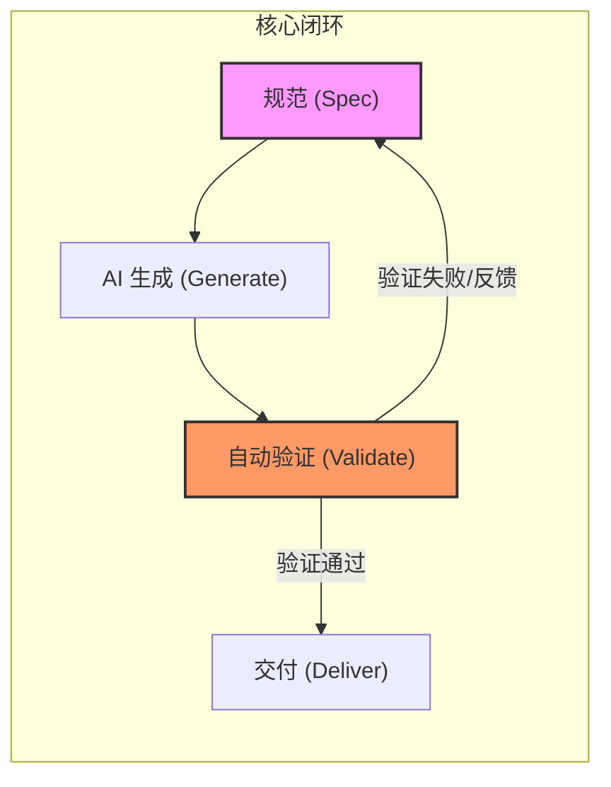
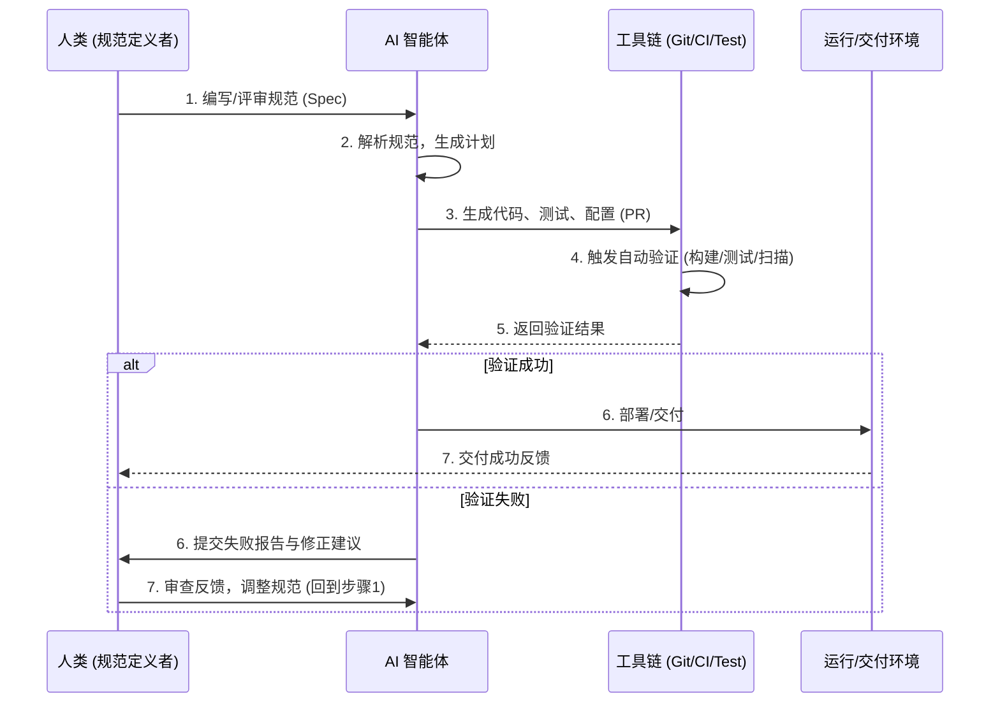
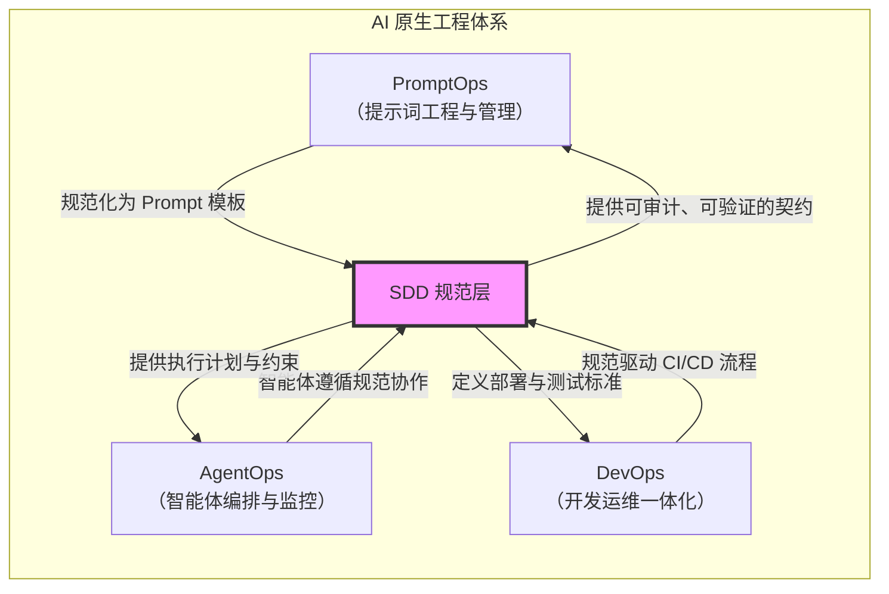

# 从规范到系统：SDD 的方法论与工程演进

> SDD（规范驱动开发）让“规范”成为软件工程的核心资产，推动 AI 原生开发范式的深刻变革。

## 从代码中心到规范中心的转变

传统软件工程以“代码”为系统的唯一真相（Single Source of Truth）。无论是瀑布式流程中的设计文档，还是敏捷开发的用户故事与测试驱动开发（TDD, Test-Driven Development），代码始终是核心。

但在 AI 原生时代（AI-Native Era），随着生成式模型（Generative Model）与智能体（能够感知环境并执行动作以达成目标的实体或软件组件）的参与，软件生产方式正发生根本转变。开发不再等同于手写代码，而是以规范为中心的智能协作过程。

在此背景下，出现了新的范式：规范驱动开发（Specification-Driven Development, SDD）。它让“规范”成为需求、设计、生成、验证与交付的唯一真相源（Single Source of Truth）。

## SDD 的核心理念

本节通过流程图展示 SDD 的核心闭环，并阐释人机协作的角色转变。

> “在动手写代码之前，让规范成为系统的唯一真相。”

SDD 将软件生命周期重心从实现转向规范。其核心逻辑闭环如下：

在这个循环中：
- 规范驱动 → AI 生成 → 自动验证 → 反馈改进
- 人类的角色从“写代码”转变为“定义规范与监督质量”

## 演进脉络：从 MDD 到 SDD

下表对比了主流开发范式的演进路径，突出 SDD 的独特定位。

这是各阶段的核心理念、工件中心与 AI 参与度对比：

| 阶段 | 核心理念 | 工件中心 | AI 参与度 |
| :--- | :--- | :--- | :--- |
| Code-First | 手工编码 | 代码 | ❌ 无 |
| TDD/BDD | 测试或行为驱动 | 测试 | ⚪ 低 |
| MDD | 模型生成代码 | 模型 | ⚪ 低 |
| LLM-Assisted | 提示生成代码 | Prompt（输入给 AI 模型的指令或文本） | ✅ 辅助 |
| SDD | 以规范为中心 | 规范 | 🔵 高度集成 |

区别在于，SDD 不再把 AI 当作文本生成器，而是执行规范的智能协作者。

## SDD 的三种层级

我们可以将 SDD 划分为三层。下表总结了每一层级的定义与特点。

| 层级 | 定义 | 特点 |
| :--- | :--- | :--- |
| Spec-first | 在实现前编写一次性规范 | 临时指导，任务完成后丢弃 |
| Spec-anchored | 规范与系统共同演化 | 持续维护，可审计可追溯 |
| Spec-as-source | 规范为主要编辑对象，代码自动生成 | 类似 MDD，AI 生成代码标注“DO NOT EDIT” |

目前多数工具停留在 spec-first，真正成熟的愿景是 spec-as-source。

## SDD 的工程闭环与 AI 融合

下方时序图展示了 SDD 工程闭环中人类、AI 与工具链的协作流程。

这一闭环体现了人机共建的软件工程：规范即输入，验证即输出，反馈即进化。

## 挑战

SDD 在推广中面临以下挑战：

| 问题 | 说明 |
| :--- | :--- |
| 工作流刚性 | 小任务也需完整规范，成本高 |
| Markdown 审核负担 | 文档冗余，开发者更愿直接审代码 |
| AI 非确定性 | 模型可能误读或过度遵循规范 |
| 功能与技术规范难分 | 职能边界模糊 |
| 目标用户不明 | 面向开发者还是 PM？ |
| 重蹈 MDD 覆辙 | 抽象僵化 + 模型不确定性 = 双重陷阱 |

Spec-first 的价值毋庸置疑，但复杂工具有时候会适得其反。SDD 需要探索最小可行工作流（Minimum Viable Workflow），而不是重新包装传统文档流程。这一点可以参考下 OpenSpec 的做法。

## AI 原生视角下的价值与潜力

下方流程图展示了 SDD 在 AI 原生应用的中枢作用，连接 PromptOps（Prompt Operations）、AgentOps 与 DevOps。

SDD 让系统具备以下特征：
- 规范即测试：Spec = Test = Acceptance
- 可审计性：规范可版本化、可追踪
- 可自治性：Agent 按规范执行，减少幻觉
- 可演化性：规范与系统同步迭代

## 我的观察与判断

结合个人实践与行业趋势，以下是对 SDD 的观察与判断：
- SDD 是 Prompt Engineering 的结构化升级。从 Prompt 到 Spec，是从单轮生成到多轮协作的跨越。
- Spec-anchored 模式是现实落地的关键。它可与 DevOps/MLOps/AIOps 融合，成为 AI-Native 工程的治理中枢。
- 未来或将演化为 Agent-Driven Development（ADD）。当规范成为多智能体协作的输入，Agent 将基于规范进行规划、验证与持续改进。
- 短期内要关注工程可用性与灵活性平衡。SDD 不应取代敏捷，而应成为其智能化扩展。

## 未来展望：规范即系统

SDD 的终极形态是描述规范与系统的深度融合：
- 规范文件可直接被执行与验证
- 代码、测试、配置从规范自动生成
- 审查流程以规范为核心
- IDE 将演变为 Agent IDE / Spec IDE：规范 → 规划 → 执行 → 验证 → 报告

这意味着软件工程从“编写代码”迈向“定义系统”，从人类的实现逻辑转向机器的执行逻辑。

## 总结

SDD 作为 AI 原生工程的核心范式，推动了从“代码中心”到“规范中心”的转变。规范驱动开发不仅是一种开发技巧，更是一种思维迁移——它将“规范”从静态文档转变为可执行、可治理、可验证的智能契约。当 AI 负责实现，人类专注于定义，软件工程才真正进入智能时代。通过规范的结构化、可审计与自动化特性，SDD 不仅提升了开发效率与质量，也为多智能体协作和系统演化奠定了基础。未来，随着工具链和工程文化的成熟，规范驱动开发有望成为智能软件工程的主流模式。

## 参考文献

- [Understanding Spec-Driven-Development: Kiro, spec-kit, and Tessl - martinfowler.com](https://martinfowler.com/articles/exploring-gen-ai/sdd-3-tools.html)