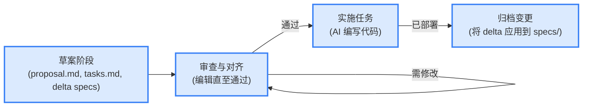
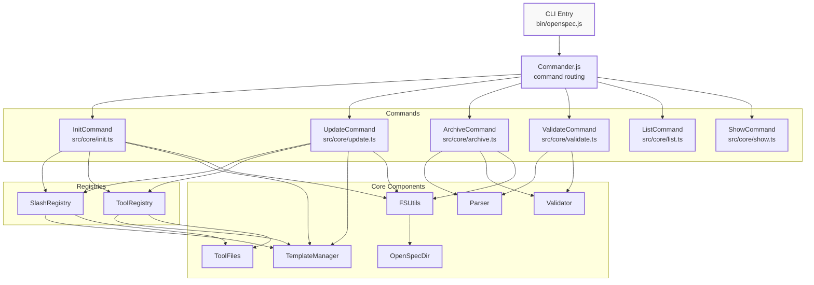

# OpenSpec 与 SpecKit：AI 时代的规范驱动开发新实践

> 规范不是束缚，而是人机协作的桥梁。OpenSpec 让 AI 参与规范制定，工程协作更高效、更透明。

## OpenSpec 概览：目标、理念与核心能力

[OpenSpec](https://github.com/Fission-AI/OpenSpec) 由 Fission-AI 团队提出，旨在为 AI 辅助编程场景建立一个轻量、可审计且不依赖外部 API Key 的“规格中枢”（spec hub）。其核心理念是：在写代码之前，人类与 AI 必须先就规范达成共识（align before code）。

OpenSpec 的设计初衷，是让 AI 助手在开始实现代码之前，与人类达成明确、可审阅且可追溯的规范对齐。它采用完全本地的目录与 Markdown 文件作为事实来源（source-of-truth），实现跨工具、跨团队的协作一致性，无需依赖云端 Key 或专有服务。

核心理念包括以下几点：

- 可对齐性（Alignment）：AI 与人类共享同一份可审阅、可追踪的规格文件。
- 轻量与可移植性：所有配置皆为本地 Markdown 与目录结构，便于版本控制与离线审计。
- 透明与可审计性：每次变更都会在 `openspec/changes/` 下产生明确的 delta（差异）文件，便于审查与回溯。
- AI 原生协作：支持常见 AI coding assistant 的“slash”命令或本地提示文件，使 AI 能读取、生成并应用变更提案。

主要特性举例如下：

- Spec-first 工作流：先规范、后实现，避免提示词漂移（prompt drift）。
- 零依赖运行：无需 API Key，可在离线或受限环境中使用。
- 结构化变更记录：`openspec/specs/` 为当前事实，`openspec/changes/` 保存提案与 delta。
- AGENTS.md 协议兼容：项目根目录的 `AGENTS.md` 用作不同 AI 工具的一致操作规范。

## 三阶段工作流（Draft → Review → Implement → Archive）

OpenSpec 的核心工作流分为草案、审查/对齐、实施与归档三个阶段。下图展示了这一流程：



在实际操作中，用户在 `openspec/changes/<change-id>/` 下创建或由 AI 生成以下文件：

- `proposal.md`：说明为何需要改动、影响范围及验收标准。
- `tasks.md`：分解后的实现任务清单。
- `specs/` 子目录：仅包含 delta（新增/修改/移除/重命名）的规范片段。

经审查并批准后，AI 按 `tasks.md` 顺序执行实现，并在完成后通过 `Archive` 命令将 delta 应用回 `openspec/specs/`，同时将 change 移入归档目录，保证 `specs/` 始终代表当前事实。

## 高级架构与主要组件

OpenSpec 遵循分层架构，确保各层职责清晰。整体架构如下：

1. CLI 层（入口为 `bin/openspec.js`，使用 Commander.js 做命令路由）。
2. 命令层（如 `InitCommand`、`UpdateCommand`、`ValidateCommand`、`ArchiveCommand` 等实现业务逻辑）。
3. 核心子系统（工具/Slash-command 注册表、模板管理器、解析器与验证器）。
4. 工具类（文件系统 I/O、Markdown 解析、Zod 验证规则）。
5. 文件系统（`openspec/` 目录：`specs/`、`changes/`、`archive/`、`AGENTS.md` 等）。

下图展示了 OpenSpec 的顶层架构：



主要组件及其职责如下：

- `SlashCommandRegistry`：将支持的 AI 工具映射到对应的本地提示文件或 slash 命令目录，用于生成工具特定的命令 stub。
- `ToolRegistry`：管理根级别的工具 stub（如 `CLAUDE.md`、`AGENTS.md`），并用受控块（managed blocks）替换内容。
- `TemplateManager`：提供共享模板（proposal/apply/archive），用于生成工具特定提示文件。
- `MarkdownParser` / `ChangeParser` / `DeltaParser`：解析规格、proposal 与 delta，提取需求条目与场景。
- `Validator`：基于 Zod 与自定义规则（如 SHALL/MUST 的使用、场景覆盖）验证规范格式与规则。

## 目录与文件组织

为了便于团队协作与规范管理，OpenSpec 推荐如下目录结构：

```text
openspec/
├── AGENTS.md            # 与不同 AI 工具约定的根级说明
├── project.md           # 项目上下文说明
├── specs/               # 当前事实（源）的规范集合
│   └── capability-name/
│       ├── spec.md
│       └── design.md
└── changes/             # 提案（每个提案一个子目录）
    └── change-name/
        ├── proposal.md
        ├── tasks.md
        └── specs/       # delta specs（只包含变动部分）
```

其中，delta 格式约定使用明确的章节头，如：`## ADDED Requirements`、`## MODIFIED Requirements`、`## REMOVED Requirements`、`## RENAMED Requirements`。`parseDeltaSpec()` 会解析这些节并生成可应用的变更操作。

## 支持的 AI 工具与集成方式

OpenSpec 支持多种 AI 工具的集成，分为两类方式：一类是生成工具特定的“slash command”文件或提示文件（放在 `.claude/`、`.cursor/` 等目录）；另一类是通过项目根的 `AGENTS.md` 为没有本地 slash 支持的工具提供统一约定。

下表展示了常见支持工具及其本地命令/提示文件位置：

| Tool ID          | 展示名             | 本地命令/提示位置                      |
| :--------------- | :----------------- | :------------------------------------- |
| `claude`         | Claude Code        | `.claude/commands/openspec/`           |
| `cursor`         | Cursor             | `.cursor/commands/openspec-*.md`       |
| `opencode`       | OpenCode           | `.opencode/command/openspec-*.md`      |
| `kilocode`       | Kilo Code          | `.kilocode/workflows/openspec-*.md`    |
| `windsurf`       | Windsurf           | `.windsurf/workflows/openspec-*.md`    |
| `codex`          | Codex              | `~/.codex/prompts/openspec-*.md`       |
| `github-copilot` | GitHub Copilot     | `.github/prompts/openspec-*.prompt.md` |
| `amazon-q`       | Amazon Q Developer | `.amazonq/prompts/openspec-*.md`       |

表 1: OpenSpec 支持的 AI 工具与集成目录

部分工具（如 Codex）写入的是全局路径（`~/.codex/`），而非项目本地目录；没有本地 slash 的工具则通过 `AGENTS.md` 的约定实现互操作。

## 核心命令与行为

OpenSpec 提供一系列命令，覆盖规范管理的全流程。常见命令及其作用如下：

- `init`：在项目根创建 `openspec/` 目录结构，提供交互式工具选择向导，并生成工具提示 stub。
- `update`：刷新工具 stub 的受管块内容而不覆盖用户自定义区。
- `list` / `show`：列出或展示当前提案与规范。
- `validate`：对提案或规范执行格式与规则检查（可选严格模式）。
- `archive`：将通过审查的 delta 应用到 `specs/`，并将变更移动到归档目录。

命令层实现通常采用命令对象（如 `InitCommand`、`ArchiveCommand`）来封装 I/O 与业务流程，并使用 `FileSystemUtils` 进行安全写入与受控更新。

## 技术栈、测试与发布

OpenSpec 的实现细节与工程化约定如下，便于开发者理解和二次开发：

- 语言：TypeScript。
- CLI：Commander.js。
- 交互提示：`@inquirer/prompts`。
- 验证：Zod。
- 测试：Vitest（单元与 E2E）。
- 构建：TypeScript 编译到 `dist/`。
- 发布：使用 Changesets 管理版本与 npm 发布流程。

典型的构建与测试流程包括 TypeScript 编译、单元测试与 CLI E2E 测试（如 spawn CLI 的测试辅助工具）。

## 工程价值与落地建议

OpenSpec 不只是工具，更代表一种“AI 与人类协同制定规范、再共同实现”的工程文化。其工程价值体现在：

- 强制先对齐意图再实现，降低因提示词偏移导致的不一致产出。
- 每次变更都有可审计的 delta，利于合规与回溯。
- 将 AI 的参与纳入工程流程，同步团队可见性与责任链。
- 低门槛集成：只需 Node.js 环境与本地文件即可开始。

建议团队引入的第一步：在仓库根运行一次 `openspec init`，并在根目录放置标准的 `AGENTS.md`，让不同 AI 工具遵循同一套操作约定。

## OpenSpec vs SpecKit

OpenSpec 是一个轻量级的规范管理工具，旨在提供一种“AI 与人类协同制定规范、再共同实现”的工程文化。它与 GitHub SpecKit 的主要区别在于：

| 方面         | OpenSpec                                                     | GitHub SpecKit                                               |
| :----------- | :----------------------------------------------------------- | :----------------------------------------------------------- |
| 设计取向     | 本地化、可审计、AI 原生；强调在受控/离线环境中先对齐规范。   | 规范即代码、工程化治理；强调把规范作为可执行产物驱动实现与自动化。 |
| 工作流与产物 | Draft → Review → Implement → Archive，`openspec/specs/` 与 `openspec/changes/` 分离（审计友好）。 | CLI（`specify`）+ 模板 + slash 命令生成 `spec.md`/`plan.md`/`tasks.md`，并以宪章治理进行门控。 |
| AI 集成      | 提供本地 slash/提示 stub（`.claude/`、`.cursor/` 等），强调无需外部 Key 的本地适配。 | 支持多达 13 种智能体，生成多格式上下文并通过脚本在 CI/开发流中更新。 |
| 验证与治理   | 把 delta/变更记录作为可审计链路，使用验证器检查规范格式与语义。 | 以九条宪章为前置门控，`/analyze` 做分级校验并可阻断实现阶段。 |
| 优势         | 轻量、可审计、易于在私有/受限环境部署，适合合规场景。        | 工程化成熟、与 GitHub/CI 深度集成，模板与脚本支持自动化流水线。 |
| 典型适用场景 | 需要强审计、合规、离线运行的小到中型团队或受限环境。         | 希望把规范直接驱动 CI/CD、代码/测试生成的大型工程化团队（尤其 GitHub 优先）。 |

表 2: OpenSpec vs GitHub SpecKit

两者并非互斥。推荐的实践是把 OpenSpec 用于“审计与对齐”环节，作为人机对齐的事实源；在通过审查后，可将 delta 同步到 SpecKit 风格的工程化产物（或由 SpecKit 的 `specs/` 目录消费）以驱动实现与 CI。这样可以形成“审计对齐 → 工程化实现”的闭环，同时兼顾合规性与自动化效率。

## 总结

OpenSpec 从 SpecKit 等以人为主的规范管理工具演进而来，推动 SDD（规范驱动开发）向“人机协作”演化。规范不再是单向文档，而是可执行、可验证，由 AI 与人类共同维护的工程系统。OpenSpec 提供了实现这一愿景的模式与工程工具链示例。