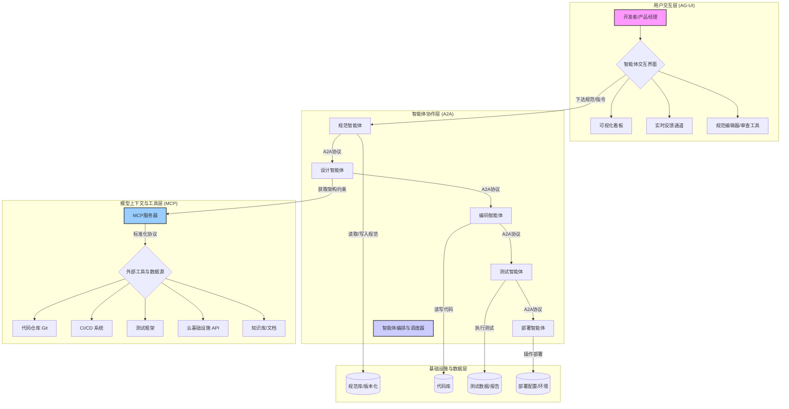
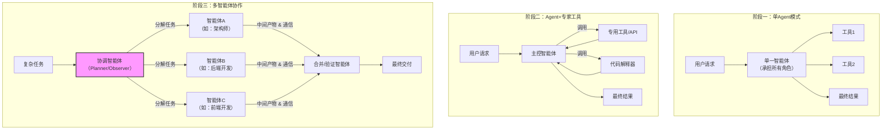

# 规范驱动开发（SDD）简介：从氛围编程到 SDD

> 规范驱动开发的本质，是让“氛围”变成“结构”，让协作变得可控与可验证。

## 从氛围编程到 SDD：范式迁移与系统演进

在我持续研究“Vibe Coding”（一种强调编程环境和心理状态的编程方式）的过程中，我越来越清楚地认识到：AI 编程不只是写代码的方式变了，而是整个研发范式的迁移。

AI 编程正经历从“人写代码、AI 辅助”到“人与 AI 协作，共同创造”的飞跃。这与 Vibe Coding 想表达的“让开发者与 AI 共振”的理念完全契合。下表总结了这一演进过程：

| 阶段 | 模式 | 核心特征 |
| :--- | :--- | :--- |
| IDE 时代 | 工具辅助开发 | AI 提示或补全，只解决“怎么写” |
| AI 编程时代 | 协作式创造 | AI 理解上下文、参与决策与验证 |
| Vibe Coding 时代 | 流体化共创 | 人与 AI 共处于同一上下文、共享语义空间、共鸣式创作 |

Vibe Coding 虽然自由，但在大规模团队协作时并不稳定。工程化转型的关键在于：能否让“氛围”具备工程化约束？

### Vibe Coding 的现实边界与工程化转型

早期的 Vibe Coding 更像“直觉式编程”：在高氛围上下文中与 AI 协作，快速生成雏形。但在企业级场景下，面临如下典型问题：
- 上下文漂移：AI 容易“忘记”业务边界。
- 结果不可控：代码质量与安全性差异大。
- 协作无标准：人与 AI、AI 与工具之间缺乏统一协议。

因此，AI 编程要想真正落地，最有效的切入点是高频重复、已有清晰规则、与核心业务解耦的任务（如 A/B 实验下线、配置清理、安全修复等）。这些场景是 AI Coding 的最佳训练（使用数据集调整模型参数的过程，使模型能够学习数据中的模式）场，便于积累准确的上下文模板。

“AI First in Non-Business Domain”原则
——先在可控范围中实现自动化，再逐步扩展到业务创新。

### 协议栈与系统框架：从氛围到结构

为解决协作问题，我逐步形成了 AI 编程协议栈三层模型：
- MCP（模型上下文协议）：用于在模型与外部工具或数据源之间传递上下文的协议标准，定义交互与数据格式。
- A2A（智能体间通信）：Agent-to-Agent，让多个智能体之间能够协作。
- AG-UI（智能体-用户交互）：建立用户与 Agent（能够感知环境并执行动作以达成目标的实体或软件组件）的实时可视交互。

这三层协议让 AI 从“单点助手”变成“系统成员”，实现闭环反馈。未来所有 IDE、CI/CD（一种通过在应用开发阶段引入自动化来频繁向客户交付应用的方法）、DevOps 平台都将底层实现这一协议体系。

结合系统分层与 SDLC（Software Development Life Cycle，软件开发生命周期），下图展示了 AI 协作编程环境的核心要素：

### 方法论：AI × SDLC 的五大核心能力

SDD（一种开发方法，其中规范驱动主要的开发流程）/Vibe Coding 的方法论可归纳为五大能力：
- 结构化任务分解（Structured Task Decomposition）：AI 任务流建模（如 LangGraph / MCP / CodeFlow）。
- 智能上下文工程（Context Engineering）：AI 理解你的工作节奏与风格，实现语义共振上下文（优化上下文窗口使用以提高模型性能）。
- 标准化交付体系（Standardized Delivery System）：AI 输出具备一致性与可维护性（模板化、SPEC 流程）。
- 测试驱动的自愈式开发（Self-Healing TDD）：AI 编程具备自修复、再进化能力。
- 质量驱动的持续优化（Quality-Driven Optimization）：AI 反馈学习闭环，持续提升上下文与输出质量。

这些能力正是“AI 编程的节奏（Vibe Rhythm）”的内核。

### 编程模式演进：从 Prompt 到 Workflow

高准确率的 AI Coding 必须被规则约束。这意味着：
- Prompt（输入给 AI 模型的指令或文本）有层次、有模板、有约束。
- 上下文通过工具、接口、数据库动态注入。
- 工作流可复用、可编排、可监控。

这就是 Spec-Driven AI Coding（规范驱动的 AI 编程）。

其核心逻辑：通过规则（Spec）约束模型，通过上下文（模型生成响应时所依赖的信息背景）喂给模型，通过工作流（Workflow）复用经验。高准确率并非模型的“聪明”，而是系统的“确定性”。

### Single-Agent 到 Multi-Agent 的演进逻辑

单 Agent + 前置代理架构已能解决大多数需求，优点是上下文集中、执行链清晰、成本低。但跨知识域任务时，多智能体协作更高效。
下图展示了从单 Agent 到多 Agent 的演化过程：

复杂度 ≈ Agent 数量 × 上下文广度 × Prompt 严密度

工程落地的关键不是追求“多”，而是找到最小可闭环的协作结构。

### 准确率：AI 研发效能的核心指标

AI 代码生成系统的成功率若低于 50%，返工成本会高于提效收益。
下表为常用评估标准：

| 指标 | 含义 | 理想值 |
| :--- | :--- | :--- |
| 成功率 | 模型生成可直接编译运行的比例 | ≥90% |
| 可部署率 | 自动化测试通过的比例 | ≥85% |
| 返工率 | 需要人工修复的输出比例 | ≤10% |

当某类任务准确率稳定在 90% 以上，AI 就从实验变为生产力。

### 思维转折与哲学启发：从自由生成到规范生成

未来的 AI Coding 不在于让模型取代人类思考，而是让模型在规范之内持续执行确定性任务。开发者角色将转向“设计系统语义的人”——定义 Prompt 模板、上下文结构、评测指标与协作协议。

AI 编程的核心不在模型，而在系统设计。下一代研发体系将建立在：
- 协议化（Protocolized）
- 模板化（Templatized）
- 确定性（Deterministic）

这才是「高准确率 AI 编程」的真正方向。

## 什么是规范驱动开发（SDD）？

规范驱动开发（Specification-Driven Development, SDD）是一种以“规范为先”的软件开发方法论。在 SDD 中，结构化的规范文档被视为整个开发流程的“单一真相源”（single source of truth），它驱动设计、实现、测试与部署。

与传统的 Code-First、模型驱动（Model-Driven Development, MDD）或仅关注测试/行为的开发方法不同，SDD 把规范提升为首要工件，并借助生成式 AI 与代理系统将规范直接转化为可运行的系统。

SDD 把“规格说明”作为驱动开发全过程的核心：清晰的规范（常用自然语言或 Markdown 书写、结构化）作为“可执行的契约”，定义软件要做什么与为何这样做。AI 与开发者围绕该规范协作，AI 将规范转换为设计、任务、代码与测试，开发者负责编写规范、审阅与监督。

与 TDD（Test-Driven Development，测试驱动开发）或 BDD（Behavior-Driven Development，行为驱动开发）相比，SDD 将视角进一步前移，先明确“做什么、为什么做”，再进入实现环节。

SDD 在 2023-2025 年随着大语言模型（一种能够理解和生成人类语言的深度学习算法）和各种 AI 编程助手的成熟而兴起。早期的“vibe coding”——对 LLM 给出模糊提示快速生成雏形——在严肃工程中效果有限，社区因此探索“按规范编程”的模式以降低猜测和错误。

与 MDD 相比，SDD 更加灵活：它常用自然语言或结构化 Markdown 来描述需求，同时借助 LLM 将文本映射为代码与系统配置，减少格式化模型与具体实现之间的摩擦。

## SDD 与 AI 基础设施的融合

SDD 对 AI 基础设施（AI Infra, Artificial Intelligence Infrastructure）提出了一个从“自然语言规范到可运行应用”的自动化通路。

以下列表总结了 SDD 典型的自动化开发阶段：
- 规范制定（Specify）：人类与 AI 合作将高层需求扩展为结构化规范（用例、约束、验收标准等），并反复校对确保无歧义。
- 规划设计（Plan）：AI 基于规范输出实现方案（架构、组件、接口契约、技术栈），并接受组织约束（例如必须使用的框架）。
- 分解任务（Tasks）：AI 将计划拆成一系列小且可测试的任务，每个任务有明确的完成标准。
- 实现与测试（Implement & Test）：AI 逐项实现并运行与规范对应的验证（单元/集成/性能测试），只有通过验证才继续下一个任务。
- 部署与交付（Deploy）：AI 可生成并执行部署脚本、CI/CD 配置，甚至在受控环境中自动化部署。

这一流程通常以“规范→计划→任务→实现”的闭环形式运行（如 GitHub SpecKit 的命令式工作流），并辅以自动化验证（构建、静态分析、测试套件）作为“验证 oracle”。若某步验证失败，错误会反馈回 AI，促使其调整计划并重试，直至满足预定义正确性条件。

关键在于让 AI 理解完整意图上下文，而非仅做片段补全。当规范足够全面，AI 可以统筹全局、减少猜测、提高复杂任务成功率。

## 当前的落地实践（代表性工具与项目）

SDD 理念已在多个开源项目和工具中得到实践。下文介绍几种典型代表及其核心思想。

### Kiro
Kiro 是轻量级 VS Code 插件，遵循 Requirements → Design → Tasks 流程。其特点是直观但繁琐，适合一次性任务。

### Spec-kit
Spec-kit 是 GitHub 出品的 CLI（基于文本的用户界面，用户通过输入命令与计算机交互）套件。其核心概念为 Constitution（宪章）——定义架构原则。流程为 Constitution → Specify → Plan → Tasks。该工具仍偏向 spec-first，但为团队协作提供模板化结构。

### Tessl Framework
Tessl Framework 是实验性框架，支持从代码反推规范（tessl document --code）。生成的代码带有 // GENERATED FROM SPEC – DO NOT EDIT 标记。支持 @generate, @test 等标签控制生成逻辑，是向 spec-as-source 迈进的早期形态。

### Qoder
Qoder 是一个专为 SDD 场景设计的 AI 编程助手，强调“规范即代码”的理念。它支持以结构化 Markdown 编写规范，自动生成项目结构、代码和测试用例，并通过多轮对话协助开发者完善和演进规范。Qoder 集成了 LLM、代码生成、测试与部署等能力，适合团队协作和复杂工程场景，致力于让 AI 成为规范驱动开发流程中的主动参与者和执行者。

### LangChain Expression Language (LCEL)
LCEL 为 LangChain 提供了一种声明式 DSL，允许用管道语法描述 LLM 工作流——“说明要发生什么”而非细节如何实现。它在微观层面提供了声明式的规格驱动方法，使 LLM 工具的编排更直观和可维护。

### OpenDevin
OpenDevin 致力于构建能够读写代码、运行命令、访问网页的自主 AI 工程师。其框架强调任务规划、沙箱执行与权限控制，体现了 SDD 对可控性与治理的要求。目前仍在早期，但演示了端到端自动构建应用的可能性。

### AgentScript
AgentScript 的特色在于让 LLM 输出一段“计划代码”（类似 JavaScript），将其解析成 AST，由运行时逐步执行。计划显式化、可审查、可暂停、可序列化，从而提高 Agent 的可解释性与可控性。这是一种让“规范驱动代理行为”的设计。

### CodePlan
CodePlan 是学术界提出的框架，将大规模代码变更视作规划问题：AI 产出一个带依赖关系的计划图，逐步修改并在每步后用构建/测试/静态检查等验证。如果验证失败，反馈回 AI 重新规划。这种“先计划再行动”策略提高了在复杂代码库中改动的成功率，是 SDD 在研究领域的前沿探索之一。

## SDD 对 AI Agent 的规划与可控性的支撑

SDD 通过显性化规范，天然提升 Agent 的规划性与可控性。以下列表总结了 SDD 在 Agent 规划与治理方面的优势：
- 明确规范让 Agent 有章可循，降低决策随机性。
- 将规则与上下文以可版本化的文档形式提供，Agent 在执行前可加载并遵循这些规则。
- 在规划 - 执行链路中嵌入人类监督，关键步骤需人工确认，从而避免危险或越权操作。
- 规范充当长期记忆或决策记录，便于跨会话、长期运行的 Agent 获取背景知识（将离散数据映射到连续向量空间的表示方法）。

这些做法把“Plan-as-output”（把计划作为中间产物）与“Context Engineering”（把项目约定化为长期文档）结合，显著改善代理系统的可审计性、安全性与持续性。

## SDD 带来的工程变革

采用 SDD 会在工程文化、流程与产出上带来多方面影响。下列要点总结了 SDD 对工程实践的主要变革：
- 开发体验（Developer Experience, DX）转变：开发者角色从“代码撰写者”转向“规范制定者 + AI 协作者”，更聚焦抽象表达、需求分析与审稿。
- 测试前移与自动化：规范中包含验收标准，AI 在实现时会自动生成并运行测试，做到规范即测试、即时回归验证。
- 权限与治理：借助沙箱、受控运行时与流程审批（例如规范 PR 与代码 PR 的双重审查），在享受自动化的同时保证安全与合规。
- 代码质量保障：规范越精确，AI 生成的代码越可靠；多方案比较、分步验证与一致的模板化输出都助于提升质量并简化人工审查。
- 文档与知识管理：规范成为“活文档”，与代码保持同步，降低知识流失并加速新人上手。

总的来说，SDD 将质量控制从事后纠正转为事前定义与过程内验证，有助于减少重复工作与低级错误。

## 展望：SDD 会成为 AI 原生开发的主流范式吗？

展望未来，SDD 很可能成为 AI-Native 时代的一种重要范式。随着生成式模型能力与工具链成熟，开发者更可能以规范为中心协作：编写“蓝图与约束”，由 AI 自动实现、验证与交付。这样的跃迁类似从汇编到高级语言的抽象提升：开发者将以更高层次的方式“指挥”AI 完成编码工作。

但推广仍面临挑战：组织文化、规范编写能力、规范审查与治理流程需建立；对复杂或高风险系统仍需谨慎设计人工把关机制。不过 SDD 与 DevOps（一组结合了软件开发（Dev）和 IT 运营（Ops）的实践）的深度结合（例如 Spec→CI→Deploy 的闭环）会加速其在工业界的采纳。

若实现成熟，我们将看到：规范被当作代码对待（版本化、PR 审查、CI 校验），AI 成为团队中的“准工程师”，而开发者则更多地扮演问题抽象和监督者的角色。

## 总结

规范驱动开发不是简单的工具替换，而是一场范式变革。它把“规范”从静态文档转为可执行、可验证的核心资产，串联起需求、设计、实现、测试与运维。结合 AI 与自动化验证，SDD 有望显著提高复杂系统开发的可预测性和生产力，同时提出对治理、权限、组织文化和人才培养的新要求。