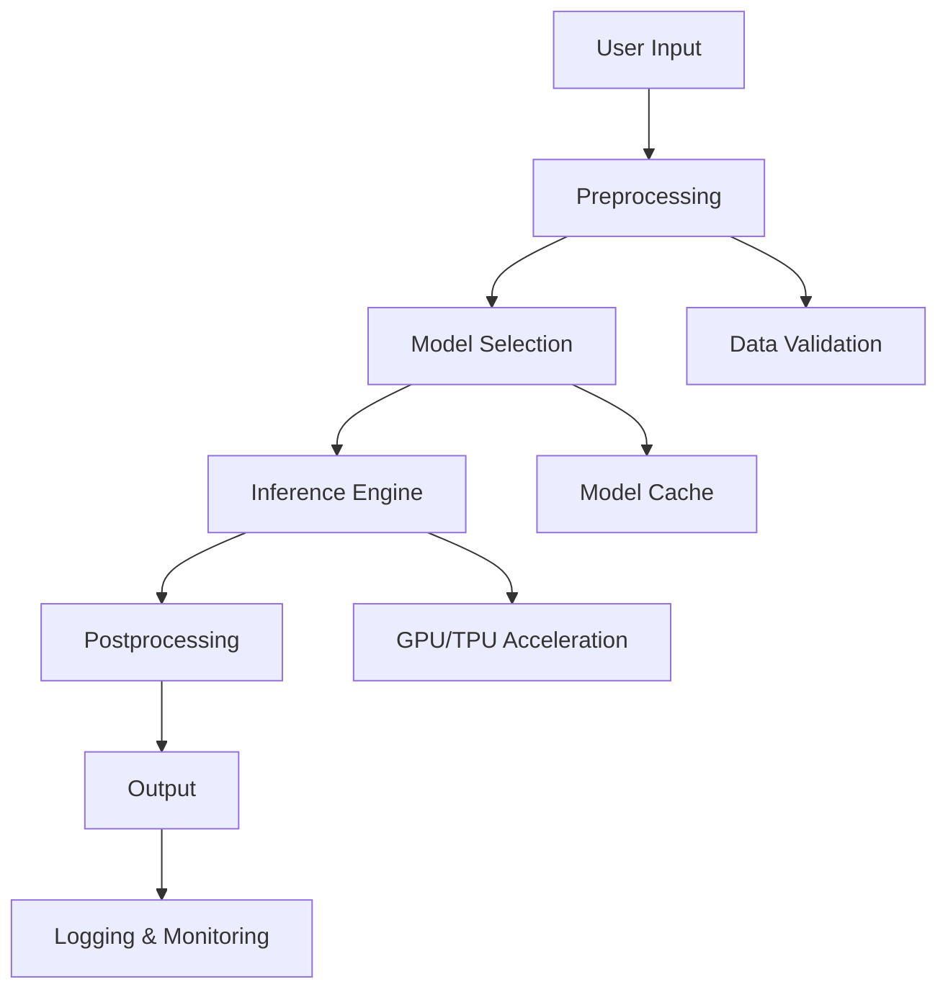
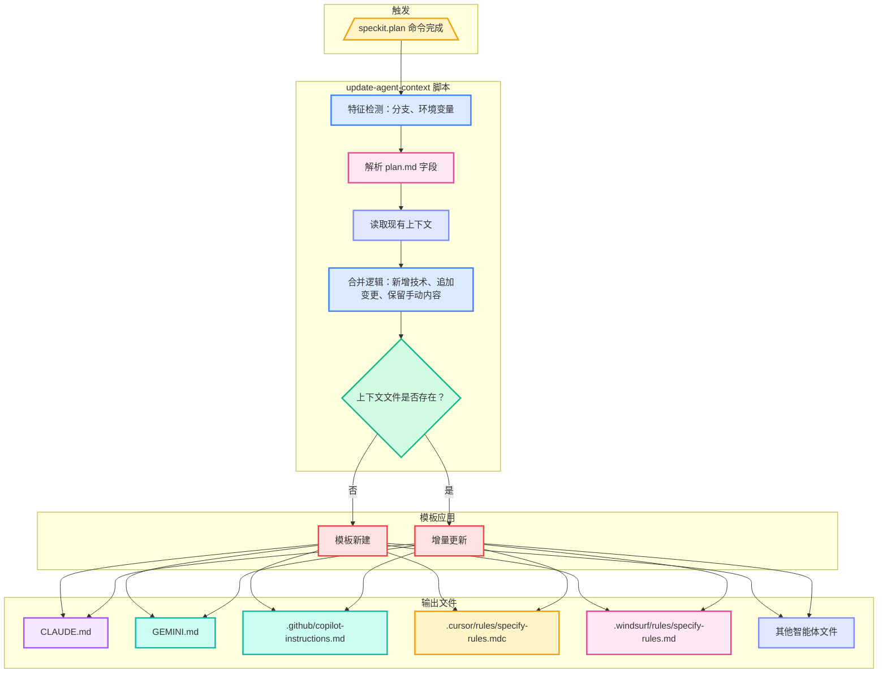

# GitHub SpecKit 规范驱动开发

> 规范驱动开发（SDD）让软件工程更高效、更自动化，SpecKit 是实现这一理念的最佳实践工具集。

## 什么是 GitHub SpecKit？

[GitHub SpecKit](https://github.com/github/spec-kit) 是一个规范驱动开发（Spec-Driven Development, SDD）的框架和工具集，它通过结构化的规范文档来指导软件开发的全生命周期。该系统以“规范即代码”为核心理念，结合多智能体适配、自动化脚本与宪章治理，构建了完整的 SDD 体系。

## SpecKit 的核心理念

SpecKit 的设计理念包括以下三点：

- **规范即代码**（Specification as Code）：将软件规范视为可执行的代码，通过规范来驱动开发、测试和部署。
- **协作优先**（Collaboration First）：规范文档支持团队协作，版本控制和 review 流程与代码完全一致。
- **自动化执行**（Automation）：规范不仅指导人工开发，还能驱动自动化工具执行验证和部署。

这些理念确保了 SpecKit 能够在现代软件工程中实现高效协作与高质量交付。

## 目的与适用范围

SpecKit 以规范为核心，支持 AI 编码智能体（AI Coding Agent）通过可执行规范将自然语言需求转化为可运行实现。该系统颠覆了传统开发范式，将“规范”而非“代码”作为核心产物，代码仅作为规范的表达结果自动生成。

SpecKit 提供以下核心能力：

- **命令行工具**（`specify`）：项目初始化与环境校验。
- **模板系统**：通过结构化提示词约束 AI 行为。
- **命令系统**（`/speckit.*`）：在 AI 智能体内部编排 SDD 工作流。
- **多智能体支持**：兼容 11+ 种主流 AI 编码助手，自动适配格式。
- **宪章治理机制**：通过质量门控强制执行架构原则。

下图展示了 SpecKit 的系统治理与产物生成流程：



## 核心组成

下面的表格总结了 SpecKit 的四大核心组成部分及其主要产物。

| 组件层级       | 主要作用            | 关键产物                                                     |
| :------------- | :------------------ | :----------------------------------------------------------- |
| **命令行工具** | 项目初始化与校验    | `specify` 命令，`src/specify_cli/__init__.py`                |
| **模板系统**   | 规范产物结构        | `.specify/templates/spec-template.md`、`plan-template.md`、`tasks-template.md` |
| **命令系统**   | AI 智能体工作流编排 | `/specify`、`/plan`、`/tasks`、`/implement`、`/constitution`、`/clarify`、`/analyze` |
| **自动化脚本** | 上下文管理与校验    | `/ps1`、`/ps1`                                               |

表 1: 核心组件分层与产物

SpecKit 实现了三层分离架构，分别处理引导、执行与治理。下图展示了三层架构与关键代码实体的映射关系：

```mermaid
flowchart TB
    subgraph Tier1["第一层：引导层（Python）"]
        direction TB
        UV["uv tool install specify-cli"]
        AppTyper["app = typer.Typer()<br/>[__init__.py:354]"]

        subgraph InitCmd["init 命令"]
            InitFunc["@app.command() init()<br/>[__init__.py:859-1144]"]
            CheckToolFunc["check_tool(tool, tracker)<br/>[__init__.py:402-431]"]
            DownloadFunc["download_template_from_github()<br/>[__init__.py:555-663]"]
            ExtractFunc["download_and_extract_template()<br/>[__init__.py:665-812]"]
            ChmodFunc["ensure_executable_scripts()<br/>[__init__.py:815-857]"]
            InitGitFunc["init_git_repo(project_path)<br/>[__init__.py:453-486]"]
        end

        CheckFunc["@app.command() check()<br/>[__init__.py:1157-1197]"]
    end

    subgraph Tier2["第二层：执行层（Shell 脚本 + 模板）"]
        direction TB
        CmdTemplates["templates/commands/<br/>constitution.md, specify.md,<br/>clarify.md, plan.md,<br/>analyze.md, tasks.md,<br/>implement.md"]

        subgraph Scripts["脚本工具"]
            CommonSh["common.sh/ps1<br/>get_feature_dir(), resolve_path()"]
            CreateFeatureSh["create-new-feature.sh/ps1<br/>Git 分支创建"]
            SetupPlanSh["setup-plan.sh/ps1<br/>前置条件校验"]
            UpdateContextSh["update-agent-context.sh/ps1<br/>提取 plan 元数据"]
            CheckPrereqSh["check-prerequisites.sh/ps1<br/>产物校验"]
        end
    end

    subgraph Tier3["第三层：治理层（Markdown 模板）"]
        direction TB
        ConstMd[".specify/memory/constitution.md<br/>九条宪章"]
        SpecTmpl[".specify/templates/spec-template.md<br/>用户故事 + 验收标准"]
        PlanTmpl[".specify/templates/plan-template.md<br/>架构与技术栈"]
        TasksTmpl[".specify/templates/tasks-template.md<br/>任务分解"]
        AgentTmpl[".specify/templates/agent-file-template.md<br/>上下文结构"]
    end

    subgraph Artifacts["项目产物（运行时）"]
        direction TB
        SpecifyDir[".specify/ 目录"]
        SpecsDir["specs/NNN-feature/<br/>spec.md, plan.md, tasks.md,<br/>data-model.md, contracts/"]
        AgentFiles["CLAUDE.md, GEMINI.md,<br/>.github/copilot-instructions.md,<br/>.cursor/rules/specify-rules.mdc"]
        GitBranch["Git 分支：<br/>NNN-feature-name"]
    end

%% 第一层连接
    UV --> AppTyper
    AppTyper --> InitFunc
    AppTyper --> CheckFunc
    InitFunc --> CheckToolFunc
    InitFunc --> DownloadFunc
    DownloadFunc --> ExtractFunc
    ExtractFunc --> ChmodFunc
    ChmodFunc --> InitGitFunc

%% 连接到第二层
    ExtractFunc --> SpecifyDir
    SpecifyDir --> CmdTemplates
    SpecifyDir --> ConstMd
    SpecifyDir --> SpecTmpl
    SpecifyDir --> PlanTmpl
    SpecifyDir --> TasksTmpl
    SpecifyDir --> AgentTmpl

%% 第二层内部连接
    CmdTemplates --> CreateFeatureSh
    CmdTemplates --> SetupPlanSh
    CmdTemplates --> UpdateContextSh
    CmdTemplates --> CheckPrereqSh
    CommonSh --> CreateFeatureSh
    CommonSh --> SetupPlanSh
    CommonSh --> UpdateContextSh
    CommonSh --> CheckPrereqSh

%% 第三层到产物
    ConstMd -.->|校验| SpecsDir
    SpecTmpl -.->|实例化| SpecsDir
    PlanTmpl -.->|实例化| SpecsDir
    TasksTmpl -.->|实例化| SpecsDir
    AgentTmpl -.->|实例化| AgentFiles

%% 脚本到产物
    CreateFeatureSh --> GitBranch
    CreateFeatureSh --> SpecsDir
    SetupPlanSh --> SpecsDir
    UpdateContextSh --> AgentFiles
    CheckPrereqSh --> SpecsDir

%% 样式定义
    classDef tier1 fill:#dbeafe,stroke:#3b82f6,stroke-width:2px
    classDef tier2 fill:#fef3c7,stroke:#f59e0b,stroke-width:2px
    classDef tier3 fill:#fce7f3,stroke:#ec4899,stroke-width:2px
    classDef artifact fill:#d1fae5,stroke:#10b981,stroke-width:2px
    classDef cmd fill:#e0e7ff,stroke:#818cf8,stroke-width:2px

    class UV,AppTyper,InitFunc,CheckFunc,CheckToolFunc,DownloadFunc,ExtractFunc,ChmodFunc,InitGitFunc tier1
    class CmdTemplates,CommonSh,CreateFeatureSh,SetupPlanSh,UpdateContextSh,CheckPrereqSh tier2
    class ConstMd,SpecTmpl,PlanTmpl,TasksTmpl,AgentTmpl tier3
    class SpecifyDir,SpecsDir,AgentFiles,GitBranch artifact
```



**第一层：引导层**——Python CLI 实现 `init()` 和 `check()` 命令，负责工具校验、模板下载、权限设置与 Git 初始化，仅在项目初始化时执行一次。

**第二层：执行层**——命令模板定义 `/speckit.*` 命令，调用 Shell 脚本完成分支创建、产物校验、上下文更新等自动化操作。

**第三层：治理层**——`.specify/memory/constitution.md` 定义九条宪章，模板约束产物结构，所有产物通过占位符替换生成项目专属内容。

## 多智能体支持架构

SpecKit 支持 13 种主流 AI 编码智能体（AI Coding Agent），每种智能体配置目录、格式、CLI 校验等参数，自动适配产物生成。下表详细列出了各智能体的目录结构和配置方式。

| 智能体                 | 目录                  | 文件格式     | 上下文文件                           | CLI 校验    | 配置键         |
| :--------------------- | :-------------------- | :----------- | :----------------------------------- | :---------- | :------------- |
| Claude Code            | `.claude/commands/`   | `.md`        | `CLAUDE.md`                          | `claude`    | `claude`       |
| Gemini CLI             | `.gemini/commands/`   | `.toml`      | `GEMINI.md`                          | `gemini`    | `gemini`       |
| GitHub Copilot         | `.github/prompts/`    | `.prompt.md` | `.github/copilot-instructions.md`    | 无          | `copilot`      |
| Cursor                 | `.cursor/rules/`      | `.mdc`       | `.cursor/rules/specify-rules.mdc`    | 无          | `cursor-agent` |
| Qwen Code              | `.qwen/commands/`     | `.toml`      | `QWEN.md`                            | `qwen`      | `qwen`         |
| opencode               | `.opencode/commands/` | `.md`        | `AGENTS.md`                          | `opencode`  | `opencode`     |
| Windsurf               | `.windsurf/rules/`    | `.md`        | `.windsurf/rules/specify-rules.md`   | 无          | `windsurf`     |
| Codex CLI              | `.codex/commands/`    | `.md`        | `AGENTS.md`                          | `codex`     | `codex`        |
| Kilo Code              | `.kilocode/rules/`    | `.md`        | `.kilocode/rules/specify-rules.md`   | 无          | `kilocode`     |
| Auggie CLI             | `.augment/rules/`     | `.md`        | `.augment/rules/specify-rules.md`    | `auggie`    | `auggie`       |
| Roo Code               | `.roo/rules/`         | `.md`        | `.roo/rules/specify-rules.md`        | 无          | `roo`          |
| CodeBuddy              | `.codebuddy/rules/`   | `.md`        | `.codebuddy/rules/specify-rules.mdc` | `codebuddy` | `codebuddy`    |
| Amazon Q Developer CLI | `.amazonq/commands/`  | `.md`        | `AGENTS.md`                          | `q`         | `q`            |

表 2: 支持的智能体与目录结构

CLI 工具会根据配置自动校验智能体 CLI 是否可用，并根据不同智能体生成对应格式的上下文文件和命令模板。

## 初始化流程与产物生成

SpecKit 的初始化流程覆盖从用户输入到产物生成的完整路径，确保每一步都可追溯、可校验。下图展示了完整的初始化流程：

```mermaid
flowchart TD
    subgraph 用户输入[用户输入]
        CmdLine[specify init my-project<br/>--ai claude --script sh]
        Interactive[select_with_arrows<br/>AGENT_CONFIG<br/>[init.py:268-341]]
    end

    subgraph InitFunc[@app.command() init()<br/>[init.py:859-1144]]
        ValidateArgs[参数校验<br/>[899-938]]
        CheckGit[Git 校验<br/>[954-958]]
        SelectAI[智能体选择<br/>[960-972]]
        CheckAgent[CLI 校验<br/>[974-990]]
        SelectScript[脚本类型选择<br/>[992-1003]]
        CreateTracker[进度跟踪<br/>[1008]]
    end

    subgraph Download[模板下载 [555-663]]
        APIGet[GitHub API 获取]
        ParseJSON[解析 release_data]
        FindAsset[匹配模板包]
        StreamDL[流式下载]
    end

    subgraph Extract[解压与合并 [665-812]]
        Unzip[解压 ZIP]
        FlattenDir[目录扁平化]
        MergeVSCode[VSCode 配置合并]
    end

    subgraph Chmod[权限设置 [815-857]]
        FindShells[查找脚本]
        SetPerms[设置可执行权限]
    end

    subgraph GitInit[Git 初始化 [453-486]]
        GitCommands[git init/add/commit]
    end

    subgraph Output[产物输出]
        SpecifyDir[.specify/ 目录]
        AgentDir[智能体命令目录]
        ContextFile[上下文文件]
    end

    CmdLine --> ValidateArgs
    Interactive --> SelectAI
    ValidateArgs --> CheckGit
    CheckGit --> SelectAI
    SelectAI --> CheckAgent
    CheckAgent --> SelectScript
    SelectScript --> CreateTracker
    CreateTracker --> APIGet
    APIGet --> ParseJSON
    ParseJSON --> FindAsset
    FindAsset --> StreamDL
    StreamDL --> Unzip
    Unzip --> FlattenDir
    FlattenDir --> MergeVSCode
    MergeVSCode --> FindShells
    FindShells --> SetPerms
    SetPerms --> GitCommands
    GitCommands --> SpecifyDir
    GitCommands --> AgentDir
    GitCommands --> ContextFile

    style CmdLine fill:#fef3c7,stroke:#f59e0b,stroke-width:2.5px
    style Interactive fill:#dbeafe,stroke:#3b82f6,stroke-width:2.5px
    style ValidateArgs fill:#dbeafe,stroke:#3b82f6,stroke-width:2.5px
    style CheckGit fill:#fce7f3,stroke:#ec4899,stroke-width:2.5px
    style SelectAI fill:#e0e7ff,stroke:#818cf8,stroke-width:2.5px
    style CheckAgent fill:#dbeafe,stroke:#3b82f6,stroke-width:2.5px
    style SelectScript fill:#d1fae5,stroke:#10b981,stroke-width:2.5px
    style CreateTracker fill:#fee2e2,stroke:#ef4444,stroke-width:2.5px
    style APIGet fill:#fee2e2,stroke:#ef4444,stroke-width:2.5px
    style ParseJSON fill:#f3e8ff,stroke:#a855f7,stroke-width:2.5px
    style FindAsset fill:#ccfbf1,stroke:#14b8a6,stroke-width:2.5px
    style StreamDL fill:#ccfbf1,stroke:#14b8a6,stroke-width:2.5px
    style Unzip fill:#fef3c7,stroke:#f59e0b,stroke-width:2.5px
    style FlattenDir fill:#fce7f3,stroke:#ec4899,stroke-width:2.5px
    style MergeVSCode fill:#e0e7ff,stroke:#818cf8,stroke-width:2.5px
    style FindShells fill:#d1fae5,stroke:#10b981,stroke-width:2.5px
    style SetPerms fill:#fef3c7,stroke:#f59e0b,stroke-width:2.5px
    style GitCommands fill:#dbeafe,stroke:#3b82f6,stroke-width:2.5px
    style SpecifyDir fill:#dbeafe,stroke:#3b82f6,stroke-width:2.5px
    style AgentDir fill:#fef3c7,stroke:#f59e0b,stroke-width:2.5px
    style ContextFile fill:#fce7f3,stroke:#ec4899,stroke-width:2.5px
```

## Slash 命令系统

SpecKit 提供七个结构化命令，驱动 AI 智能体将需求逐步转化为实现。下表总结了各命令的功能、触发脚本和产物。

| 命令                    | 主要功能     | 触发脚本                                                     | 输出产物                                                     | 模板来源                             |
| :---------------------- | :----------- | :----------------------------------------------------------- | :----------------------------------------------------------- | :----------------------------------- |
| `/speckit.constitution` | 定义治理原则 | 无                                                           | `memory/constitution.md`                                     | `templates/commands/constitution.md` |
| `/speckit.specify`      | 创建功能规范 | `scripts/{type}/create-new-feature.{sh|ps1}`                 | `specs/NNN-feature/spec.md`、Git 分支                        | `templates/commands/specify.md`      |
| `/speckit.clarify`      | 需求澄清     | 无                                                           | 更新 `spec.md` Clarifications                                | `templates/commands/clarify.md`      |
| `/speckit.plan`         | 生成技术方案 | `scripts/{type}/setup-plan.{sh|ps1}`、`update-agent-context.{sh|ps1}` | `plan.md`、`research.md`、`data-model.md`、`contracts/`、`quickstart.md` | `templates/commands/plan.md`         |
| `/speckit.analyze`      | 一致性校验   | 无                                                           | 分析报告                                                     | `templates/commands/analyze.md`      |
| `/speckit.tasks`        | 任务分解     | `scripts/{type}/check-prerequisites.{sh|ps1}`                | `tasks.md`                                                   | `templates/commands/tasks.md`        |
| `/speckit.implement`    | 执行实现     | `scripts/{type}/check-prerequisites.{sh|ps1}`                | 代码与测试                                                   | `templates/commands/implement.md`    |

表 3: Slash 命令与脚本集成

## 脚本与上下文自动化

SpecKit 自动化层通过 Bash/PowerShell 双实现，确保跨平台一致性。`update-agent-context.{sh|ps1}` 脚本自动解析 `plan.md`，提取技术栈、依赖、变更等信息，更新所有智能体上下文文件。下图展示了上下文自动更新的流程：



## 宪章治理机制

SpecKit 通过 `.specify/memory/constitution.md` 的九条宪章强制约束架构与开发流程，所有产物均需通过宪章校验。下表总结了九条宪章的结构和作用。

| 条款 | 名称               | 约束类型 | 影响范围                    |
| :--- | :----------------- | :------- | :-------------------------- |
| I    | Library-First 原则 | 塑造性   | 指导 plan.md 架构           |
| II   | CLI 接口强制       | 塑造性   | 要求库必须有命令行接口      |
| III  | 测试优先开发       | 塑造性   | 强制 TDD，约束 tasks.md     |
| IV   | 文档优先           | 塑造性   | 实现前需完善文档            |
| V    | 功能隔离           | 塑造性   | 强制关注点分离              |
| VI   | 版本控制规范       | 塑造性   | 强制 Git 工作流             |
| VII  | 简约门控           | 前置门控 | 超过 3 个项目或未来预留阻断 |
| VIII | 反抽象门控         | 前置门控 | 禁止间接框架、多模型        |
| IX   | 集成优先门控       | 前置门控 | 缺少契约/测试阻断           |

表 4: 九条宪章结构

`/analyze` 命令会自动校验所有产物，若发现宪章违规（CRITICAL），将阻断 `/implement` 阶段。

## 规范目录结构

为了便于团队协作与自动化工具集成，SpecKit 推荐如下规范目录结构：

```text
specs/
├── README.md          # 规范总览
├── api/               # API 规范
│   ├── users.yaml
│   └── products.yaml
├── database/          # 数据模型规范
│   ├── schema.sql
│   └── migrations/
├── ui/                # 界面规范
│   ├── components/
│   └── workflows/
└── tests/             # 测试规范
    ├── unit/
    └── integration/
```

SpecKit 支持多种规范格式：

- **YAML/JSON**：结构化数据规范
- **Markdown**：文档类规范
- **SQL**：数据库规范
- **自定义 DSL**：领域特定规范

## 工作流程与工具集成

SpecKit 支持从规范制定到代码生成、测试生成的完整自动化流程。以下分别介绍各阶段的典型用法。

在规范制定阶段，可以使用 OpenAPI 规范描述 API：

```yaml
# api/users.yaml
openapi: 3.0.0
info:
  title: User Management API
  version: 1.0.0

paths:
  /users:
    get:
      summary: Get all users
      responses:
        '200':
          description: Success
          content:
            application/json:
              schema:
                type: array
                items:
                  $ref: '#/components/schemas/User'

components:
  schemas:
    User:
      type: object
      properties:
        id:
          type: integer
        name:
          type: string
        email:
          type: string
          format: email
```

规范验证阶段，可用如下命令校验规范的正确性和一致性：

```bash
speckit validate specs/
speckit lint specs/
```

代码生成阶段，可自动生成代码框架：

```bash
speckit generate api --output src/
speckit generate models --output src/models/
```

测试生成阶段，可基于规范生成测试用例：

```bash
speckit generate tests --output tests/
```

## SpecKit 的核心工具

SpecKit 提供了丰富的工具集，支持规范验证、代码生成、CI/CD 集成和 IDE 插件等能力：

- **speckit-cli**：命令行工具，提供规范验证、代码生成等功能。
- **GitHub 集成**：Pull Request 检查规范变更，自动化 CI/CD 流程，规范文档自动发布。
- **IDE 插件**：支持主流 IDE 的规范编辑和验证插件。

## SpecKit 的优势

SpecKit 带来如下优势：

- **一致性保证**：规范驱动确保实现与设计的一致性，自动化工具防止人为偏离。
- **协作效率**：规范文档支持并发编辑，版本控制跟踪变更历史，Review 流程规范化。
- **质量提升**：早期发现设计缺陷，自动化测试覆盖，持续集成验证。

## 实际应用场景

SpecKit 可广泛应用于 API 开发、数据库设计、前端开发等场景。以下为典型用例：

API 开发：

```yaml
# 规范驱动的 API 开发
- 定义OpenAPI规范
- 自动生成服务端代码
- 生成客户端SDK
- 创建API测试
```

数据库设计：

```sql
-- 规范驱动的数据库设计
-- schema.sql
CREATE TABLE users (
  id SERIAL PRIMARY KEY,
  name VARCHAR(255) NOT NULL,
  email VARCHAR(255) UNIQUE NOT NULL,
  created_at TIMESTAMP DEFAULT NOW()
);

-- 自动生成迁移脚本
-- 自动生成 ORM 模型
```

前端开发：

```yaml
# 组件规范
components:
  - name: UserProfile
    props:
      - name: userId
        type: number
        required: true
      - name: showEmail
        type: boolean
        default: false
    events:
      - name: update
        payload: UserData
```

## 最佳实践与团队协作

为了充分发挥 SpecKit 的价值，建议遵循以下最佳实践：

- 模块化：将规范分解为可管理的模块。
- 版本控制：为规范建立版本管理策略。
- 文档化：为每个规范提供详细说明。
- 评审流程：建立规范变更的评审机制。
- 培训：确保团队成员理解 SpecKit 的使用方法。
- 标准化：制定团队的规范编写标准。
- CI/CD 集成：将规范验证纳入构建流程。
- 监控告警：监控规范一致性和合规性。
- 报告生成：自动生成规范覆盖和质量报告。

## 与其他工具的集成

SpecKit 可与 GitHub Actions、IDE、测试框架等工具无缝集成，提升自动化与协作效率。

GitHub Actions 集成示例：

```yaml
# .github/workflows/spec-validation.yml
name: Spec Validation
on: [push, pull_request]

jobs:
  validate:
    runs-on: ubuntu-latest
    steps:
      - uses: actions/checkout@v2
      - uses: speckit/validate-action@v1
        with:
          spec-dir: specs/
```

IDE 集成：

- VS Code 扩展支持规范语法高亮。
- 实时验证和错误提示。
- 代码补全和导航。

测试框架集成：

- Jest/Cypress 集成规范测试。
- Postman/Newman API 测试。
- Database 测试工具集成。

## 案例分享

SpecKit 已在开源项目和企业应用中广泛落地。典型案例包括：

- **API 规范**：使用 OpenAPI 规范定义 REST API。
- **数据库规范**：使用 SQL DDL 定义数据模型。
- **测试规范**：使用 Gherkin 定义行为测试。
- **微服务架构**：规范定义服务接口。
- **前端组件库**：规范定义组件 API。
- **数据管道**：规范定义数据流和转换。

## 技术栈

下表总结了 SpecKit 的核心技术栈及其用途。

| 组件        | 技术         | 主要用途        |
| :---------- | :----------- | :-------------- |
| CLI 工具    | Python 3.11+ | 核心应用逻辑    |
| CLI 框架    | Typer        | 命令行交互      |
| UI 渲染     | Rich         | 终端输出美化    |
| HTTP 客户端 | httpx        | GitHub API 通信 |
| SSL/TLS     | truststore   | 证书校验        |
| 输入处理    | readchar     | 跨平台键盘输入  |
| 包管理      | uv           | 安装与分发      |
| 构建系统    | hatchling    | Python 包构建   |

表 5: 核心技术栈

## 未来展望

SpecKit 正在快速发展，未来将支持更多规范格式，增强 AI 辅助规范编写，改进协作和评审流程，并扩展生态系统集成。

通过 GitHub SpecKit，规范驱动开发变得更加系统化、自动化和协作化，大大提升了软件开发的效率和质量。

## 总结

GitHub SpecKit 以规范为核心，结合多智能体适配、自动化脚本与宪章治理，构建了完整的 SDD 体系。通过标准化产物、流程与校验机制，极大提升了 AI 编码智能体的协作效率与产物质量。SpecKit 特别适用于追求高一致性、高自动化的现代软件工程团队，尤其适合云原生与 AI 领域的创新实践。