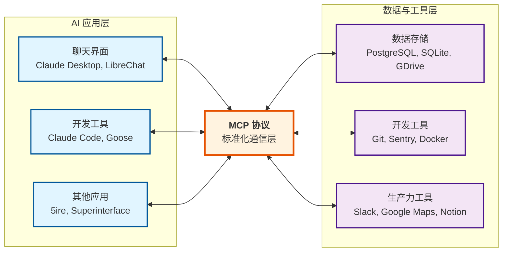
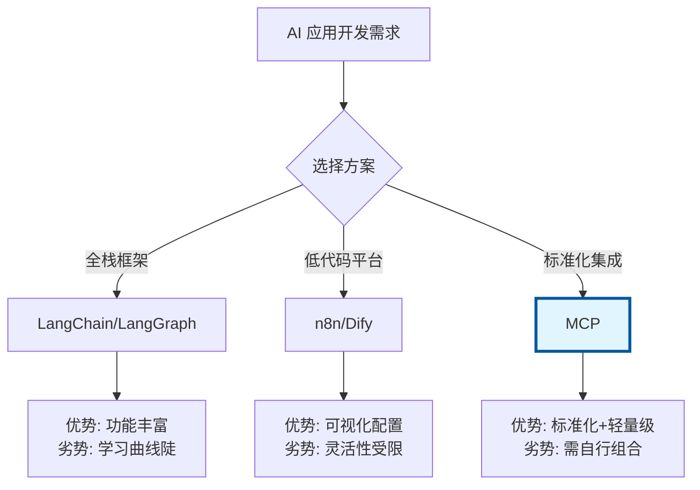
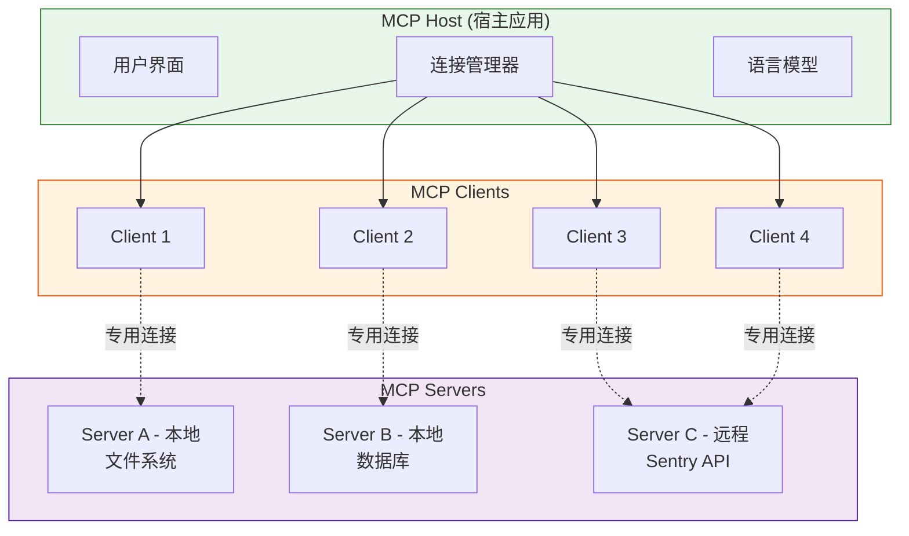
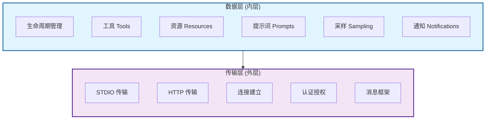
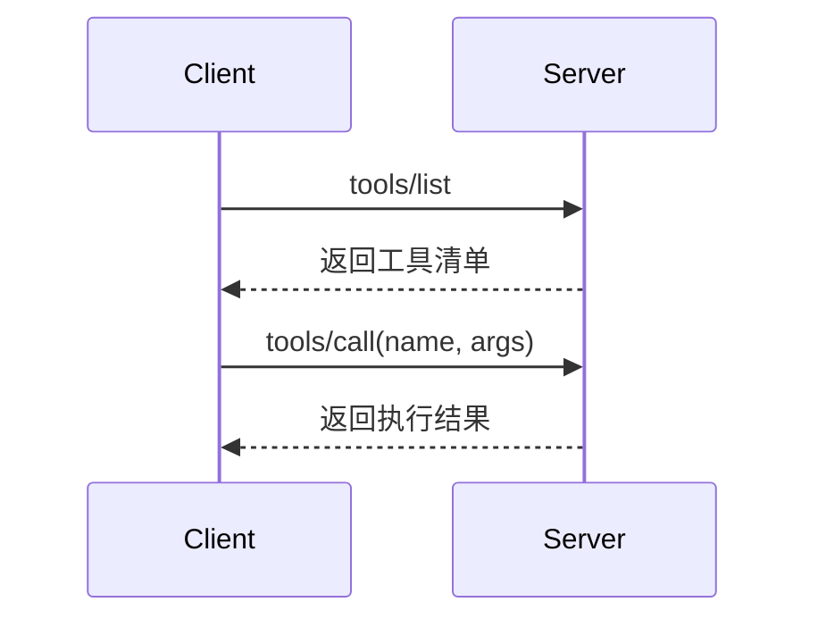
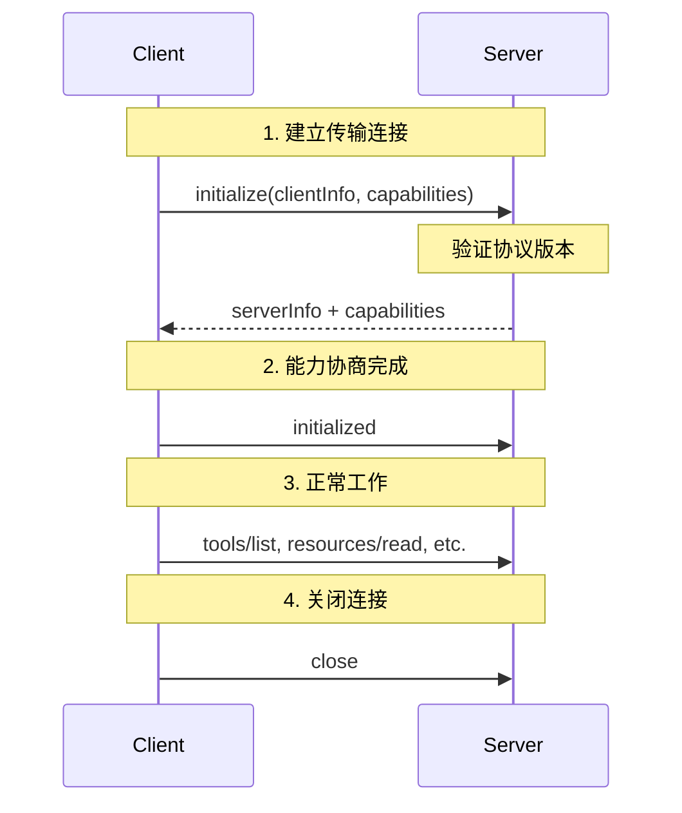
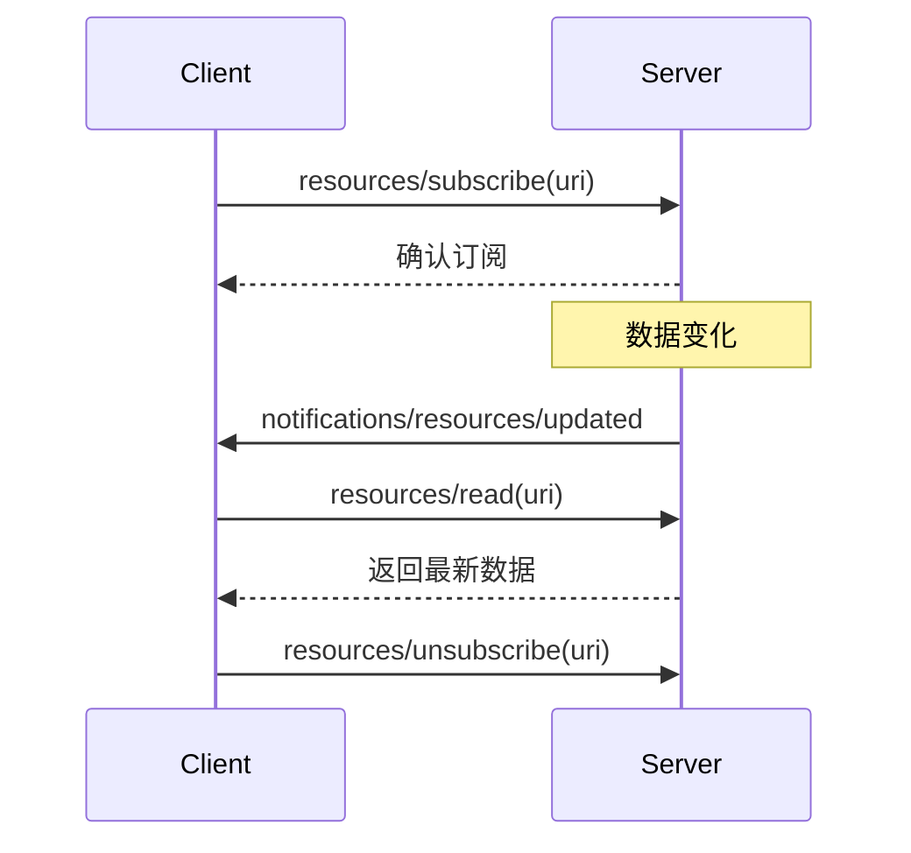

# MCP (Model Context Protocol) 总览

::: tip 文档说明
本文介绍 MCP 的核心概念、架构设计和应用场景，帮助你快速理解这个连接 AI 应用与外部系统的开放标准。

**规范版本**: 2025-11-25  
**官方文档**: https://modelcontextprotocol.io/specification/2025-11-25
:::

## 什么是 MCP?

### 核心定义

**MCP (Model Context Protocol)** 是一个开源标准协议，用于将 AI 应用与外部数据源、工具和服务安全连接。

通过 MCP，AI 应用（如 Claude、ChatGPT）可以统一访问:
- **数据源**: 本地文件、数据库、云存储
- **工具**: 搜索引擎、计算器、API 服务
- **工作流**: 提示词模板、自动化流程

### 架构全景



## 为什么选择 MCP?

### 解决的核心问题

在 MCP 出现之前，AI 应用连接外部系统面临以下挑战：

| 传统方案 | 存在问题       | MCP 解决方案  |
|---------|------------|-----------|
| 为每个 AI 应用单独集成 | 重复开发，维护成本高 | 一次开发，处处可用 |
| 使用私有协议 | 供应商锁定，迁移困难 | 开放标准，自由切换 |
| 缺乏统一安全机制 | 安全风险高，审计困难 | 标准化认证和授权  |
| 手动管理上下文 | 易出错,效率低    | 自动化上下文管理  |

### 典型应用场景

**1. 企业知识库接入**

```
场景: 让 AI 助手访问公司内部文档、Wiki、数据库
方案: 部署 MCP Server 连接企业数据源
效果: 员工可以用自然语言查询公司知识
```

**2. 开发工具链集成**

```
场景: AI 辅助编程时需要访问 Git、CI/CD、监控系统
方案: 使用现成的 MCP Server (Git, Sentry, etc.)
效果: AI 可以读取代码、查看错误日志、触发构建
```

**3. 自动化工作流**

```
场景: 通过 AI 自动处理重复性任务
方案: 开发自定义 MCP Server 暴露业务工具
效果: 用对话方式完成复杂操作(如生成报告、发送通知)
```

### 生态系统对比

MCP 与其他 AI 开发框架的关系：



**MCP 的定位**：专注于**连接层标准化**，而非全栈解决方案。可与 LangChain/Dify 等框架配合使用。

## MCP 架构详解

### 核心组件

MCP 采用**客户端-服务器**架构，涉及三个核心角色：



#### 1. MCP Host (宿主应用)

| 职责 | 典型实现 |
| --- | --- |
| 协调多个 MCP Client | Claude Desktop / Codex 等桌面应用 |
| 提供用户交互界面 | Claude Code / OpenCode 等命令行工具 |
| 管理 AI 模型调用 | 自定义聊天应用 |

#### 2. MCP Client (客户端)

| 职责 | 重要特性 |
| --- | --- |
| 维护与单个 Server 的连接 | 一个 Client 只连接一个 Server |
| 获取上下文数据供 Host 使用 | 一个 Host 可管理多个 Client |
| 处理协议层通信 | 支持动态连接/断开 |

#### 3. MCP Server (服务器)

**职责**:
- 提供工具、资源、提示词
- 处理 Client 请求
- 发送实时更新通知

**部署模式**:

| 类型 | 传输方式 | 部署位置 | 典型场景 |
|-----|---------|---------|---------|
| 本地 Server | **STDIO** | 同一台机器 | 文件系统访问、本地数据库 |
| 远程 Server | **HTTP** | 云端/其他主机 | SaaS API、企业内网服务 |

## 协议分层设计

MCP 采用**两层架构**,清晰分离通信机制与业务逻辑:



### 数据层 (Data Layer)

基于 **[JSON-RPC 2.0](https://www.jsonrpc.org/)** 实现，定义消息格式和语义。

#### 核心功能模块

**1. 生命周期管理**
- 连接初始化和能力协商
- 心跳保活
- 优雅关闭

**2. 服务器能力**
- **Tools**: 可执行函数(如文件操作、API 调用)
- **Resources**: 上下文数据(如文档内容、数据库记录)
- **Prompts**: 交互模板(如预设提示词)

**3. 客户端能力**
- **Sampling**: 请求 Host 的 LLM 进行推理
- **Elicitation**: 向用户请求额外信息
- **Logging**: 发送调试日志

**4. 实用功能**
- **Notifications**: 实时更新通知
- **Tasks**: 长时间运行任务的进度跟踪(实验性)

#### JSON-RPC 消息示例

**请求消息:**
```json
{
  "jsonrpc": "2.0",
  "id": 1,
  "method": "tools/list",
  "params": {}
}
```

**响应消息:**
```json
{
  "jsonrpc": "2.0",
  "id": 1,
  "result": {
    "tools": [
      {
        "name": "search_files",
        "description": "在指定目录搜索文件",
        "inputSchema": {
          "type": "object",
          "properties": {
            "query": { "type": "string" },
            "path": { "type": "string" }
          }
        }
      }
    ]
  }
}
```

**通知消息(无需响应):**
```json
{
  "jsonrpc": "2.0",
  "method": "notifications/tools/list_changed",
  "params": {}
}
```

### 传输层 (Transport Layer)

负责底层通信通道和安全认证。

#### STDIO 传输

**适用场景**: 本地进程通信

**特点**:
- 零网络开销,性能最优
- 无需处理防火墙/代理
- 仅限同一台机器

**启动方式**:
```bash
# Host 启动 Server 进程并通过 stdin/stdout 通信
node /path/to/mcp-server.js
```

#### HTTP 传输

**适用场景**: 远程服务器通信

**特点**:
- 支持跨网络访问
- 标准 HTTP 认证(Bearer Token, API Key, OAuth)
- 服务器发送事件(SSE)支持流式响应
- 需要处理网络安全和延迟

**请求示例**:
```http
POST /mcp HTTP/1.1
Host: api.example.com
Authorization: Bearer <token>
Content-Type: application/json

{
  "jsonrpc": "2.0",
  "id": 1,
  "method": "tools/call",
  "params": {
    "name": "search",
    "arguments": { "query": "MCP tutorial" }
  }
}
```

## 数据层协议详解

### 基本元素 (Primitives)

MCP 定义了三类核心基本元素，决定了 Server 可以提供哪些能力。

#### Server 端基本元素

**1. Tools (工具)**

可被 AI 调用的函数,用于执行操作。

**发现与调用流程**:


**定义示例**:
```js
{
  name: "read_file",
  description: "读取文件内容",
  inputSchema: {
    type: "object",
    properties: {
      path: {
        type: "string",
        description: "文件路径"
      }
    },
    required: ["path"]
  }
}
```

**2. Resources (资源)**

提供上下文数据的只读信息源。

**URI 设计模式**:
```
file:///home/user/documents/report.pdf
db://localhost/products/table/users
api://github.com/repos/owner/repo/issues/123
```

**访问示例**:
```json
{
  "method": "resources/read",
  "params": {
    "uri": "file:///home/user/config.json"
  }
}
```

**3. Prompts (提示词)**

预定义的交互模板,简化常见任务。

**模板示例**:
```json
{
  "name": "code_review",
  "description": "代码审查助手",
  "arguments": [
    {
      "name": "language",
      "description": "编程语言",
      "required": true
    },
    {
      "name": "focus",
      "description": "关注点(安全/性能/可读性)",
      "required": false
    }
  ]
}
```

#### Client 端基本元素

**1. Sampling (采样)**

Server 请求 Host 的 LLM 进行推理。

**使用场景**:
- 数据分析和总结
- 内容生成
- 决策辅助

**请求示例**:
```json
{
  "method": "sampling/createMessage",
  "params": {
    "messages": [
      {
        "role": "user",
        "content": "分析这份销售数据并给出建议: [数据]"
      }
    ],
    "maxTokens": 1000
  }
}
```

**2. Elicitation (信息征询)**

向用户请求额外输入。

**使用场景**:
- 确认敏感操作
- 收集缺失参数
- 多步骤交互

**请求示例**:
```json
{
  "method": "elicitation/request",
  "params": {
    "message": "请选择部署环境",
    "schema": {
      "type": "object",
      "properties": {
        "environment": {
          "type": "string",
          "enum": ["dev", "staging", "production"]
        }
      }
    }
  }
}
```

**3. Logging (日志)**

向 Host 发送调试信息。

**日志级别**:
```typescript
enum LogLevel {
  DEBUG = "debug",
  INFO = "info",
  WARNING = "warning",
  ERROR = "error"
}
```

---

### 生命周期管理

#### 初始化序列



#### 能力协商示例

**Client 声明的能力**:
```json
{
  "capabilities": {
    "sampling": {},
    "elicitation": {},
    "roots": {
      "listChanged": true
    }
  }
}
```

**Server 声明的能力**:
```json
{
  "capabilities": {
    "tools": {
      "listChanged": true
    },
    "resources": {
      "subscribe": true,
      "listChanged": true
    },
    "prompts": {
      "listChanged": true
    }
  }
}
```

### 通知机制

支持 Server 向 Client 主动推送更新。

#### 通知类型

| 通知方法 | 触发时机 | 用途 |
|---------|---------|------|
| `notifications/tools/list_changed` | 工具清单变化 | 提示 Client 重新获取工具列表 |
| `notifications/resources/list_changed` | 资源清单变化 | 提示 Client 刷新资源 |
| `notifications/resources/updated` | 资源内容更新 | 订阅的资源有新数据 |
| `notifications/prompts/list_changed` | 提示词变化 | 提示 Client 更新模板 |

#### 资源订阅示例

**订阅流程**:


## 协议范围与边界

### <u>MCP 负责</u>的部分

**定义标准化通信协议**
- JSON-RPC 消息格式
- 能力发现机制
- 生命周期管理

**提供 SDK 和工具**
- TypeScript/Python/Java SDK
- MCP Inspector 调试工具
- 参考服务器实现

**建立生态系统**
- 官方服务器目录
- 社区贡献指南
- 最佳实践文档

### <u>MCP 不负责</u>的部分

**LLM 选择和调用**
- Host 自行决定使用哪个 AI 模型
- 如何利用上下文生成回复

**用户界面设计**
- Host 负责 UI/UX
- 交互流程由应用定义

**业务逻辑实现**
- Server 的具体功能由开发者实现
- MCP 只定义通信标准

## 快速开始

### 使用现有 Server

**1. 安装 Claude Desktop**
```bash
# macOS
brew install --cask claude

# 或从官网下载
# https://claude.ai/download
```

**2. 配置 MCP Server**

编辑配置文件 `~/Library/Application Support/Claude/claude_desktop_config.json`:

```json
{
  "mcpServers": {
    "filesystem": {
      "command": "npx",
      "args": ["-y", "@modelcontextprotocol/server-filesystem", "/Users/yourname/Documents"]
    },
    "sqlite": {
      "command": "npx",
      "args": ["-y", "@modelcontextprotocol/server-sqlite", "/path/to/database.db"]
    }
  }
}
```

**3. 重启 Claude Desktop**

现在可以在对话中使用文件系统和数据库工具了!

## 最佳实践

### Server 设计原则

**1. 单一职责**
```
✅ 好: SQLite Server 只处理数据库操作
❌ 差: 一个 Server 同时处理文件、数据库、API
```

**2. 幂等性**
```typescript
// 工具调用应该是幂等的
async function readFile(path: string) {
  // ✅ 多次调用返回相同结果
  return fs.readFileSync(path, 'utf-8');
}

async function deleteFile(path: string) {
  // ⚠️ 需要处理已删除的情况
  if (fs.existsSync(path)) {
    fs.unlinkSync(path);
  }
}
```

**3. 错误处理**
```typescript
// 返回有意义的错误信息
{
  "error": {
    "code": -32602,
    "message": "文件不存在: /path/to/file.txt",
    "data": {
      "path": "/path/to/file.txt",
      "suggestion": "请检查文件路径是否正确"
    }
  }
}
```

### Client 集成建议

**1. 优雅降级**
```typescript
// Server 不可用时不应阻塞整个应用
try {
  await client.connect(serverPath);
} catch (error) {
  console.warn("MCP Server 连接失败,部分功能不可用");
  // 继续运行,禁用相关功能
}
```

**2. 资源管理**
```typescript
// 确保连接正确关闭
try {
  await client.callTool("expensive_operation");
} finally {
  await client.close();
}
```

## 下一步

根据你的需求选择相应路径:

- **开发 MCP Server** → 阅读 [MCP Server 开发指南](./mcp-server.md)

- **集成 MCP 到应用** → 阅读 [MCP Client 开发指南](./mcp-client.md)

- **安全性问题** → 阅读 [MCP 认证与安全](./mcp-security.md)

## 常见问题

<details>
<summary><b>MCP 与 LangChain 有什么区别?</b></summary>

- **MCP**: 专注于连接层标准化,轻量级协议
- **LangChain**: 全栈 AI 应用开发框架,功能更丰富

两者可以配合使用,LangChain 可以作为 MCP Host 或 Server。
</details>

<details>
<summary><b>MCP Server 必须用 TypeScript 开发吗?</b></summary>

不是。官方提供 TypeScript、Python、Java SDK,社区也有其他语言实现。只要遵循 JSON-RPC 2.0 协议,任何语言都可以。
</details>

<details>
<summary><b>远程 Server 如何保证安全?</b></summary>

推荐使用:
1. HTTPS 加密传输
2. OAuth 2.0 认证
3. API Key 轮换机制
4. 请求速率限制

详见[安全最佳实践文档](./mcp-security.md)。
</details>

<details>
<summary><b>一个 Host 可以连接多少个 Server?</b></summary>

理论上无限制,但建议:
- 少于 10 个以保证性能
- 按需加载,避免一次启动所有 Server
- 监控资源使用情况
</details>

## 生态系统资源

### 开发自定义 Server

- [开发 MCP Server](./mcp-server.md)
- [开发 MCP Client](./mcp-client.md)
- [认证与安全](./mcp-security.md)

### 官方资源

- [MCP 规范文档](https://spec.modelcontextprotocol.io/)
- [TypeScript SDK](https://github.com/modelcontextprotocol/typescript-sdk)
- [Python SDK](https://github.com/modelcontextprotocol/python-sdk)
- [Java SDK](https://github.com/modelcontextprotocol/java-sdk)
- [MCP Inspector](https://github.com/modelcontextprotocol/inspector)

### 参考实现

- [文件系统 Server](https://github.com/modelcontextprotocol/servers/tree/main/src/filesystem)
- [SQLite Server](https://github.com/modelcontextprotocol/servers/tree/main/src/sqlite)
- [Git Server](https://github.com/modelcontextprotocol/servers/tree/main/src/git)
- [更多官方 Servers](https://github.com/modelcontextprotocol/servers)

### 社区支持

- [GitHub Discussions](https://github.com/modelcontextprotocol/specification/discussions)
- [Discord 社区](https://discord.gg/modelcontextprotocol)
- [示例项目](https://github.com/modelcontextprotocol/quickstart-resources)

## 总结

MCP 通过标准化协议解决了 AI 应用与外部系统集成的复杂性:

**开放标准** - 避免供应商锁定  
**清晰分层** - 传输层与业务逻辑分离  
**丰富生态** - 官方和社区提供大量现成 Server  
**安全可靠** - 支持标准认证和授权机制