# MCP 服务端开发指南

## 什么是 MCP Server

### 核心定义

**MCP Server** 是通过标准化 MCP 协议向 AI 应用暴露特定能力的程序。它可以是本地进程,也可以是远程服务。

**典型应用场景:**

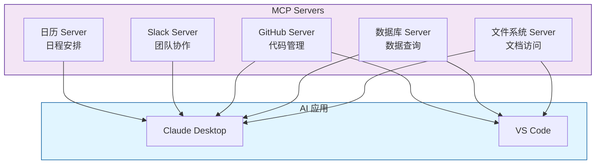

## Server 核心能力

MCP Server 通过三种基础构建模块向 AI 应用提供功能:

| 能力 | 性质 | 控制方 | 典型用途 |
|------|------|--------|---------|
| **Tools(工具)** | 主动调用的函数<br/>可读写操作 | AI 模型(需用户授权) | 搜索航班、发送消息<br/>创建日历事件、修改文件 |
| **Resources(资源)** | 被动的数据源<br/>只读访问 | 应用程序 | 读取文档、访问数据库<br/>获取 API 响应 |
| **Prompts(提示模板)** | 预构建的指令模板<br/>引导交互 | 用户(显式触发) | 规划旅行、总结会议<br/>撰写邮件、代码审查 |

### 能力对比图示

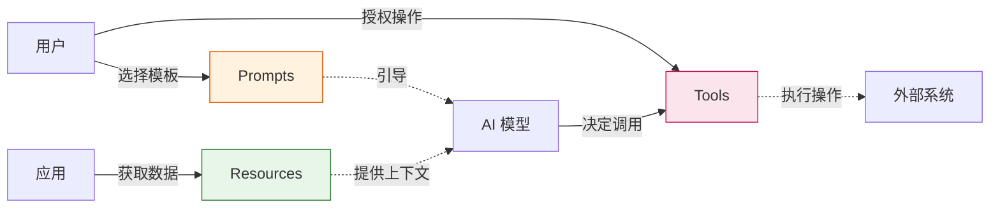

## 能力详解

### 1. Tools (工具)

#### 核心特性

Tools 使 AI 模型能够执行具体操作。每个工具:
- ✓ 定义明确的输入/输出 schema (JSON Schema)
- ✓ 执行单一、明确的操作
- ✓ 支持用户授权机制
- ✓ 可被 LLM 自动发现和调用

#### 协议方法

| 方法 | 说明 | 请求参数 | 返回值 |
|------|------|----------|--------|
| `tools/list` | 发现可用工具 | 无 | 工具定义数组(含 schema) |
| `tools/call` | 执行指定工具 | `name`, `arguments` | 工具执行结果 |

#### 定义示例

**航班搜索工具:**

```json
{
  "name": "search_flights",
  "description": "搜索指定日期和城市间的可用航班",
  "inputSchema": {
    "type": "object",
    "properties": {
      "origin": {
        "type": "string",
        "description": "出发城市(如 NYC, LAX)"
      },
      "destination": {
        "type": "string",
        "description": "到达城市(如 Barcelona, Tokyo)"
      },
      "date": {
        "type": "string",
        "format": "date",
        "description": "出行日期(YYYY-MM-DD)"
      },
      "maxResults": {
        "type": "integer",
        "default": 10,
        "description": "返回结果的最大数量"
      }
    },
    "required": ["origin", "destination", "date"]
  }
}
```

#### 实战场景: 旅行预订

**多工具协作流程:**

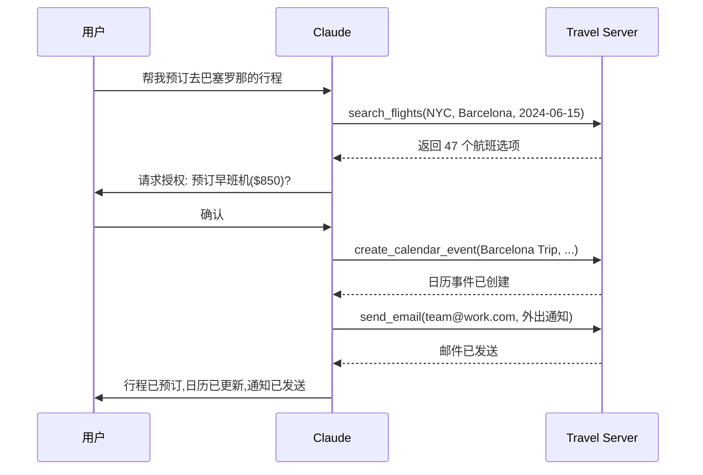

**工具组合示例:**

1. **`search_flights`**: 查询航班
   ```typescript
   await callTool('search_flights', {
     origin: 'NYC',
     destination: 'Barcelona',
     date: '2024-06-15'
   });
   // 返回: 47 个航班选项
   ```

2. **`create_calendar_event`**: 占用日历
   ```typescript
   await callTool('create_calendar_event', {
     title: 'Barcelona Trip',
     startDate: '2024-06-15',
     endDate: '2024-06-22'
   });
   ```

3. **`send_email`**: 发送通知
   ```typescript
   await callTool('send_email', {
     to: 'team@work.com',
     subject: 'Out of Office',
     body: '我将于 6/15-6/22 外出...'
   });
   ```

#### 用户授权机制

**Human-in-the-Loop 设计:**

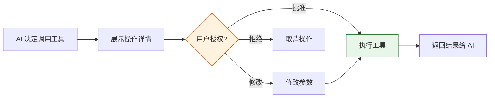

**客户端实现建议:**

- **敏感操作**: 强制确认(删除、支付、发布)
- **批量操作**: 显示操作列表,一次性授权
- **可信工具**: 支持预授权,减少打断
- **操作日志**: 记录所有工具调用,便于审计

### 2. Resources (资源)

#### 核心特性

Resources 为 AI 应用提供结构化的只读数据访问:
- 文件内容、数据库记录、API 响应
- 使用 URI 标识(如 `file:///path/to/doc.md`)
- 声明 MIME 类型(如 `text/plain`, `application/json`)
- 支持订阅机制,实时接收更新

#### 协议方法

| 方法 | 说明 | 参数 | 返回值 |
|------|------|------|--------|
| `resources/list` | 列出直接资源 | 无 | 资源描述数组 |
| `resources/templates/list` | 发现资源模板 | 无 | 资源模板数组 |
| `resources/read` | 获取资源内容 | `uri` | 资源数据+元数据 |
| `resources/subscribe` | 订阅资源更新 | `uri` | 订阅确认 |
| `resources/unsubscribe` | 取消订阅 | `uri` | 取消确认 |

#### 两种资源类型

**1. 直接资源 (Direct Resources)**

固定 URI,指向特定数据:

```json
{
  "uri": "calendar://events/2024",
  "name": "2024-calendar",
  "description": "2024 年全年日历事件",
  "mimeType": "application/json"
}
```

**访问示例:**
```typescript
const response = await client.readResource('calendar://events/2024');
// 返回: { "events": [...], "busyDates": [...] }
```

**2. 资源模板 (Resource Templates)**

动态 URI,支持参数化查询:

```json
{
  "uriTemplate": "weather://forecast/{city}/{date}",
  "name": "weather-forecast",
  "description": "获取指定城市和日期的天气预报",
  "mimeType": "application/json"
}
```

**使用示例:**
```typescript
// 模板: weather://forecast/{city}/{date}

// 查询 1: 巴黎今日天气
await client.readResource('weather://forecast/Paris/2024-06-15');

// 查询 2: 东京明日天气
await client.readResource('weather://forecast/Tokyo/2024-06-16');
```

#### URI 设计模式

**推荐的 URI 结构:**

| 场景 | URI 模式 | 示例 |
|------|----------|------|
| 本地文件 | `file:///` | `file:///home/user/docs/report.pdf` |
| 数据库 | `db://` | `db://localhost/products/users` |
| API 资源 | `api://` | `api://github.com/repos/owner/repo/issues` |
| 自定义服务 | `custom://` | `travel://history/barcelona-2023` |

#### 参数补全 (Parameter Completion)

资源模板支持智能参数提示:

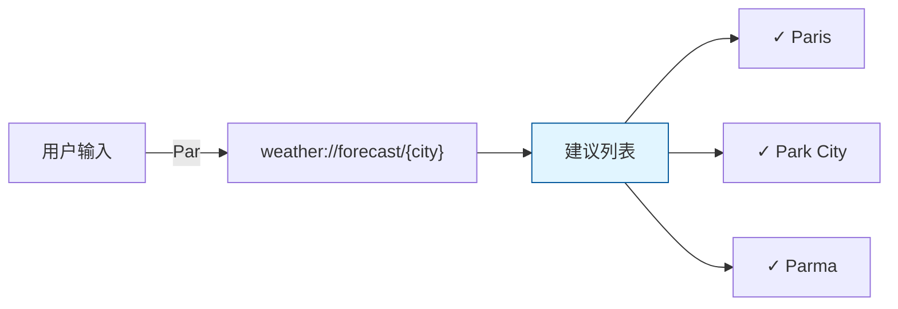

**实现示例:**

```typescript
server.registerResourceTemplate(
  'weather://forecast/{city}/{date}',
  async (params) => {
    // 参数补全逻辑
    if (params.city?.startsWith('Par')) {
      return ['Paris', 'Park City', 'Parma'];
    }
    // ...
  }
);
```

#### 实战场景: 旅行规划上下文

**多资源组合:**

```typescript
// 1. 获取日历可用性
const calendar = await readResource('calendar://events/2024-06');
// 返回: { busyDates: ['2024-06-10', '2024-06-20'], ... }

// 2. 读取旅行偏好
const preferences = await readResource('travel://preferences/europe');
// 返回: { airlines: ['Lufthansa'], hotels: ['4-star+'], ... }

// 3. 参考历史行程
const history = await readResource('trips://history/barcelona-2023');
// 返回: { visitedPlaces: ['Sagrada Familia'], ratings: {...} }
```

**AI 应用的处理流程:**

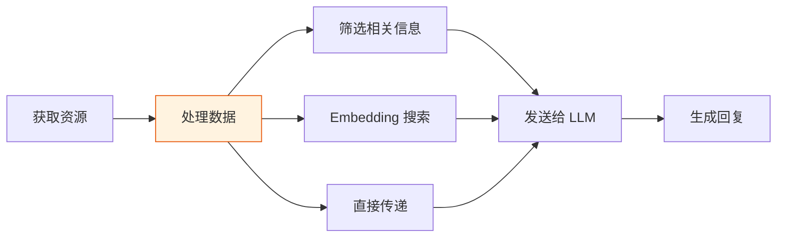

#### 资源订阅机制

**订阅流程:**

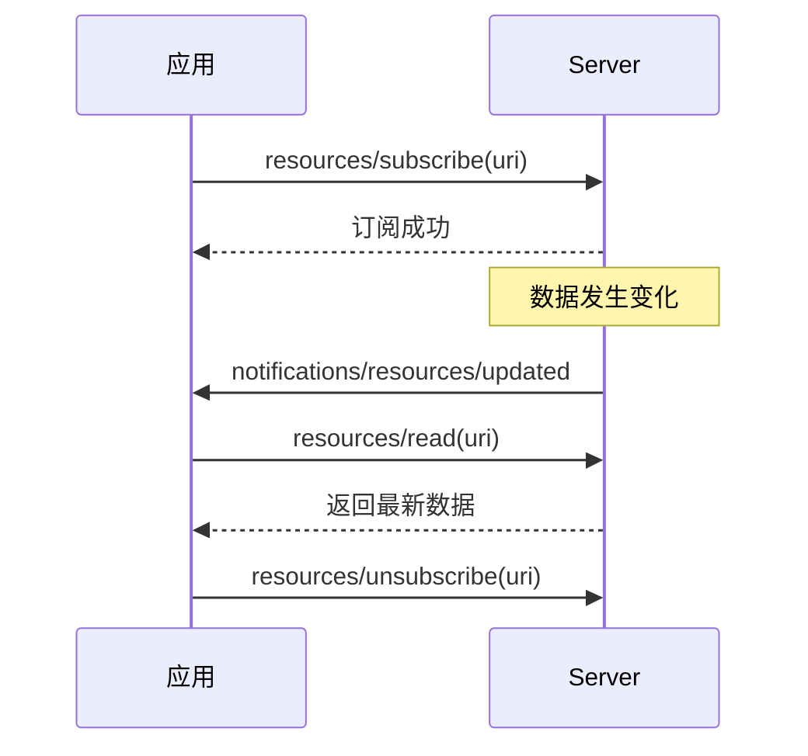

**应用场景:**
- 实时监控数据变化
- 文档协作编辑
- 聊天消息更新

### 3. Prompts (提示模板)

#### 核心特性

Prompts 提供可复用的交互模板:
- 结构化的参数定义
- 引导 AI 完成特定任务
- 可组合 Resources 和 Tools
- 由用户显式触发(非自动执行)

#### 协议方法

| 方法 | 说明 | 参数 | 返回值 |
|------|------|------|--------|
| `prompts/list` | 发现可用模板 | 无 | Prompt 描述数组 |
| `prompts/get` | 获取模板详情 | `name`, `arguments` | 完整 Prompt 定义 |

#### 定义示例

**旅行规划 Prompt:**

```json
{
  "name": "plan-vacation",
  "description": "引导完成完整的旅行规划流程",
  "arguments": [
    {
      "name": "destination",
      "description": "目的地城市",
      "required": true
    },
    {
      "name": "duration",
      "description": "旅行天数",
      "required": true
    },
    {
      "name": "budget",
      "description": "预算(美元)",
      "required": false
    },
    {
      "name": "interests",
      "description": "兴趣爱好列表",
      "required": false
    }
  ]
}
```

#### 使用流程

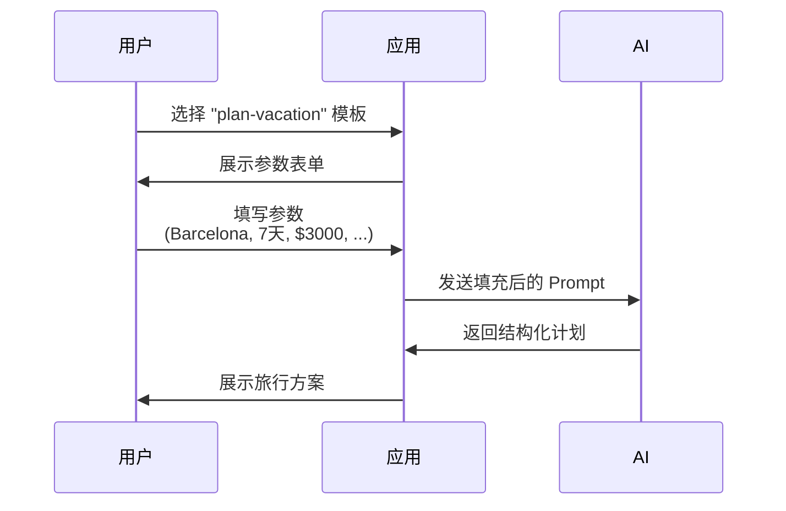

#### 对比: Prompt vs 自由对话

| 维度 | 自由对话 | Prompt 模板 |
|------|----------|-------------|
| **输入方式** | "帮我规划去巴塞罗那的旅行" | 结构化表单填写 |
| **参数完整性** | 可能遗漏关键信息 | 强制填写必填项 |
| **结果一致性** | 每次可能不同 | 遵循固定流程 |
| **可复用性** | 需要重新描述 | 保存后随时调用 |

#### 实战示例: 代码审查 Prompt

```json
{
  "name": "code-review",
  "description": "专业代码审查助手",
  "arguments": [
    {
      "name": "language",
      "description": "编程语言",
      "required": true
    },
    {
      "name": "code",
      "description": "待审查的代码",
      "required": true
    },
    {
      "name": "focus",
      "description": "关注点",
      "required": false,
      "enum": ["security", "performance", "readability", "all"]
    }
  ]
}
```

**调用效果:**

```typescript
// 用户输入
{
  language: "TypeScript",
  code: "const users = await db.query('SELECT * FROM users');",
  focus: "security"
}

// AI 返回
{
  issues: [
    {
      severity: "HIGH",
      type: "SQL Injection",
      line: 1,
      suggestion: "使用参数化查询或 ORM"
    }
  ],
  improvements: [...],
  overallRating: "Needs Work"
}
```

#### 用户交互模式

**常见 UI 实现:**

1. **Slash 命令**
   ```
   用户输入: /plan-vacation
   系统: 展示参数表单
   ```

2. **命令面板**
  - 快捷键: `Cmd/Ctrl + K`
  - 可搜索 Prompt 列表
  - 显示描述和参数预览

3. **快捷按钮**
   ```
   [总结会议] [撰写邮件] [规划旅行]
   ```

4. **右键菜单**
  - 根据上下文推荐相关 Prompt
  - 自动填充部分参数

## 多 Server 协作

### 协作场景

MCP 的真正威力体现在**多个 Server 协同工作**,组合各自的专业能力。

#### 示例: 个性化旅行规划

**Server 架构:**

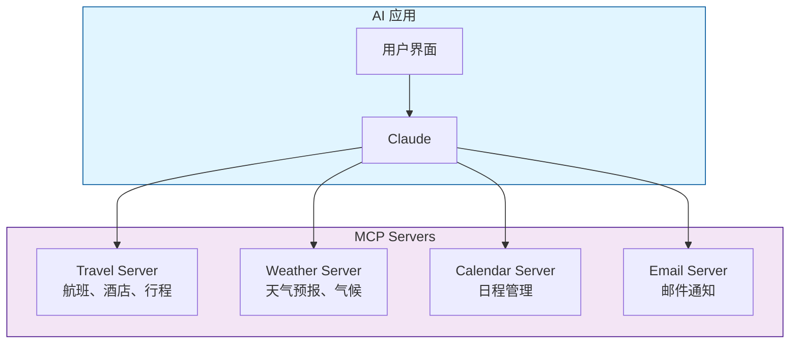

### 完整工作流

#### 1. 用户触发 Prompt

```typescript
// 用户填写表单
{
  prompt: "plan-vacation",
  arguments: {
    destination: "Barcelona",
    departure_date: "2024-06-15",
    return_date: "2024-06-22",
    budget: 3000,
    travelers: 2
  }
}
```

#### 2. 应用选择 Resources

```typescript
// 用户勾选需要的上下文数据
const resources = [
  'calendar://my-calendar/June-2024',      // 日历 Server
  'travel://preferences/europe',           // 旅行 Server
  'travel://past-trips/Spain-2023',        // 旅行 Server
  'weather://climate/barcelona/summer'     // 天气 Server
];
```

#### 3. AI 读取 Resources

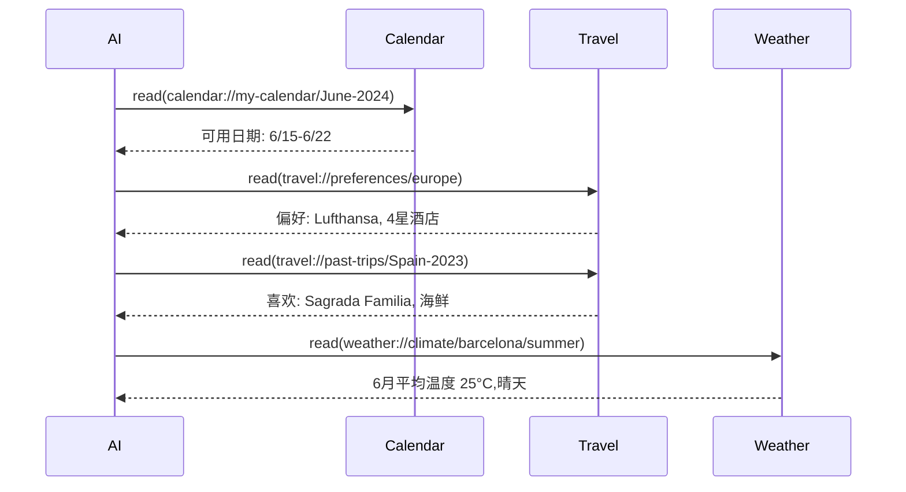

#### 4. AI 调用 Tools

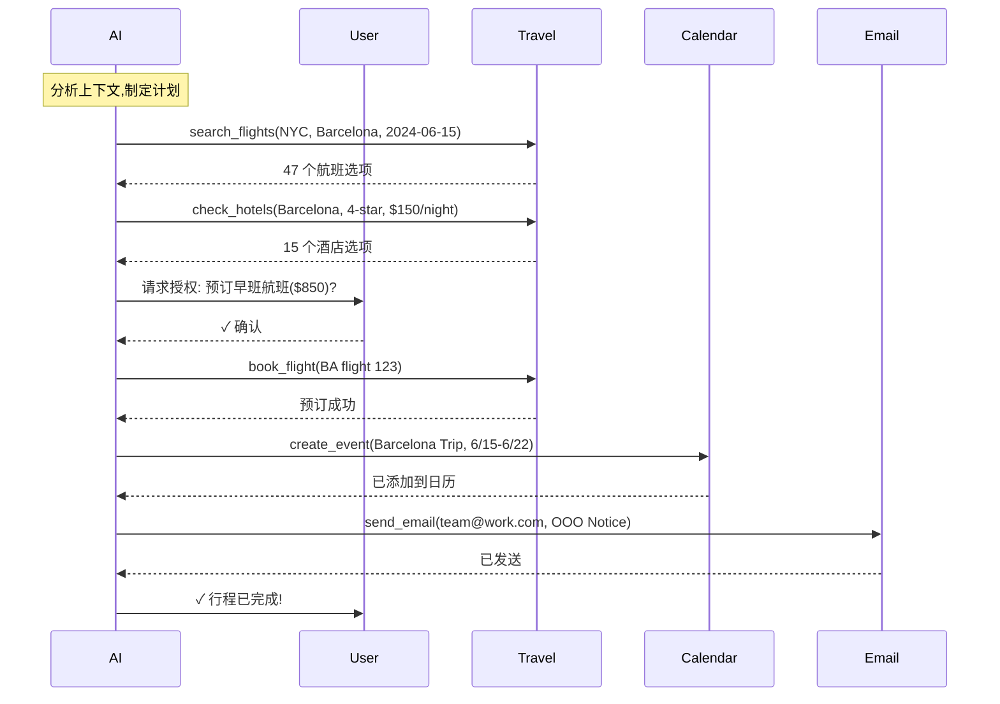

#### 5. 最终结果

**用户收到:**
- 航班预订确认(早班机,直飞)
- 酒店预订确认(海景房,4星)
- 日历已更新(自动标记外出)
- 同事收到外出通知
- 完整行程单(包含天气提醒)

**时间对比:**
- 传统方式: 2-3 小时(搜索、对比、预订)
- MCP 方式: 5-10 分钟(填表单、确认)

## 实战: 开发天气 Server

### 前置要求

- **Node.js**: v20+
- **npm**: 最新版本
- **TypeScript**: 基础语法
- **API 知识**: REST API 调用

### 项目目标

构建一个提供两个工具的天气 Server:
1. **`get_alerts`**: 获取州的天气警报
2. **`get_forecast`**: 获取位置的天气预报

### 快速开始

#### 1. 创建项目

**macOS/Linux:**

```bash
# 创建项目目录
mkdir weather-server && cd weather-server

# 初始化 npm
npm init -y

# 安装依赖
npm install @modelcontextprotocol/sdk zod@3
npm install -D @types/node typescript

# 创建源文件
mkdir src && touch src/index.ts
```

**Windows:**

```bash
md weather-server
cd weather-server

npm init -y
npm install @modelcontextprotocol/sdk zod@3
npm install -D @types/node typescript

md src
new-item src\index.ts
```

#### 2. 配置 TypeScript

**package.json:**

```json
{
  "type": "module",
  "bin": {
    "weather": "./build/index.js"
  },
  "scripts": {
    "build": "tsc && node -e \"require('fs').chmodSync('build/index.js', '755')\"",
    "dev": "tsc && node build/index.js"
  },
  "files": ["build"]
}
```

**tsconfig.json:**

```json
{
  "compilerOptions": {
    "target": "ES2022",
    "module": "Node16",
    "moduleResolution": "Node16",
    "outDir": "./build",
    "rootDir": "./src",
    "strict": true,
    "esModuleInterop": true,
    "skipLibCheck": true
  },
  "include": ["src/**/*"],
  "exclude": ["node_modules"]
}
```

### 核心代码实现

#### 步骤 1: 初始化 Server

**src/index.ts:**

```typescript
import { McpServer } from "@modelcontextprotocol/sdk/server/mcp.js";
import { StdioServerTransport } from "@modelcontextprotocol/sdk/server/stdio.js";
import { z } from "zod";

// 配置常量
const NWS_API_BASE = "https://api.weather.gov";
const USER_AGENT = "weather-app/1.0";

// 创建 Server 实例
const server = new McpServer({
  name: "weather",
  version: "1.0.0",
});
```

#### 步骤 2: 辅助函数

```typescript
// 类型定义
interface AlertFeature {
  properties: {
    event?: string;
    areaDesc?: string;
    severity?: string;
    status?: string;
    headline?: string;
  };
}

interface ForecastPeriod {
  name?: string;
  temperature?: number;
  temperatureUnit?: string;
  windSpeed?: string;
  windDirection?: string;
  shortForecast?: string;
}

interface AlertsResponse {
  features: AlertFeature[];
}

interface PointsResponse {
  properties: {
    forecast?: string;
  };
}

interface ForecastResponse {
  properties: {
    periods: ForecastPeriod[];
  };
}

// API 请求封装
async function makeNWSRequest<T>(url: string): Promise<T | null> {
  const headers = {
    "User-Agent": USER_AGENT,
    Accept: "application/geo+json",
  };

  try {
    const response = await fetch(url, { headers });
    
    if (!response.ok) {
      throw new Error(`HTTP ${response.status}: ${response.statusText}`);
    }
    
    return (await response.json()) as T;
  } catch (error) {
    console.error("NWS API 请求失败:", error);
    return null;
  }
}

// 格式化警报信息
function formatAlert(feature: AlertFeature): string {
  const props = feature.properties;
  return [
    `事件: ${props.event || "未知"}`,
    `区域: ${props.areaDesc || "未知"}`,
    `严重程度: ${props.severity || "未知"}`,
    `状态: ${props.status || "未知"}`,
    `标题: ${props.headline || "无标题"}`,
    "─".repeat(50),
  ].join("\n");
}

// 格式化预报信息
function formatForecast(period: ForecastPeriod): string {
  return [
    `${period.name || "未知"}:`,
    `温度: ${period.temperature || "?"}°${period.temperatureUnit || "F"}`,
    `风速: ${period.windSpeed || "未知"} ${period.windDirection || ""}`,
    `概况: ${period.shortForecast || "无可用预报"}`,
    "─".repeat(50),
  ].join("\n");
}
```

#### 步骤 3: 注册工具

**工具 1: 获取天气警报**

```typescript
server.registerTool(
  "get_alerts",
  {
    description: "获取美国指定州的活动天气警报",
    inputSchema: {
      state: z
        .string()
        .length(2)
        .toUpperCase()
        .describe("两字母州代码(如 CA, NY, TX)"),
    },
  },
  async ({ state }) => {
    const stateCode = state.toUpperCase();
    const url = `${NWS_API_BASE}/alerts?area=${stateCode}`;
    
    console.error(`🔍 查询 ${stateCode} 的天气警报...`);
    
    const data = await makeNWSRequest<AlertsResponse>(url);

    if (!data) {
      return {
        content: [{
          type: "text",
          text: `获取 ${stateCode} 警报数据失败,请稍后重试`,
        }],
      };
    }

    const features = data.features || [];
    
    if (features.length === 0) {
      return {
        content: [{
          type: "text",
          text: `${stateCode} 当前没有活动天气警报`,
        }],
      };
    }

    const formattedAlerts = features.map(formatAlert).join("\n");
    
    return {
      content: [{
        type: "text",
        text: `${stateCode} 活动警报 (共 ${features.length} 条):\n\n${formattedAlerts}`,
      }],
    };
  }
);
```

**工具 2: 获取天气预报**

```typescript
server.registerTool(
  "get_forecast",
  {
    description: "获取美国境内指定坐标的 7 天天气预报",
    inputSchema: {
      latitude: z
        .number()
        .min(-90)
        .max(90)
        .describe("纬度(-90 到 90)"),
      longitude: z
        .number()
        .min(-180)
        .max(180)
        .describe("经度(-180 到 180)"),
    },
  },
  async ({ latitude, longitude }) => {
    console.error(`查询坐标 ${latitude}, ${longitude} 的天气预报...`);
    
    // 步骤 1: 获取网格点数据
    const pointsUrl = `${NWS_API_BASE}/points/${latitude.toFixed(4)},${longitude.toFixed(4)}`;
    const pointsData = await makeNWSRequest<PointsResponse>(pointsUrl);

    if (!pointsData) {
      return {
        content: [{
          type: "text",
          text: `获取坐标 ${latitude}, ${longitude} 的网格数据失败。\n提示: NWS API 仅支持美国境内位置。`,
        }],
      };
    }

    const forecastUrl = pointsData.properties?.forecast;
    if (!forecastUrl) {
      return {
        content: [{
          type: "text",
          text: "无法从网格数据中提取预报 URL",
        }],
      };
    }

    // 步骤 2: 获取预报数据
    const forecastData = await makeNWSRequest<ForecastResponse>(forecastUrl);
    
    if (!forecastData) {
      return {
        content: [{
          type: "text",
          text: "获取预报数据失败",
        }],
      };
    }

    const periods = forecastData.properties?.periods || [];
    
    if (periods.length === 0) {
      return {
        content: [{
          type: "text",
          text: "无可用的预报时段",
        }],
      };
    }

    const formattedForecast = periods.map(formatForecast).join("\n");
    
    return {
      content: [{
        type: "text",
        text: `坐标 ${latitude}, ${longitude} 的天气预报:\n\n${formattedForecast}`,
      }],
    };
  }
);
```

#### 步骤 4: 启动 Server

```typescript
async function main() {
  const transport = new StdioServerTransport();
  await server.connect(transport);
  
  console.error("Weather MCP Server 已启动");
  console.error("传输方式: STDIO");
  console.error("可用工具: get_alerts, get_forecast");
}

main().catch((error) => {
  console.error("致命错误:", error);
  process.exit(1);
});
```

### 关键注意事项

#### 日志记录规范

:::danger 严重警告
**STDIO 传输的 Server 绝对不能写入 stdout!**
:::

**错误示例:**

```typescript
console.log("Server started");        // 破坏 JSON-RPC
print("Processing request");          // Python
fmt.Println("Request received");      // Go
```

**正确示例:**

```typescript
console.error("Server started");      // 写入 stderr
import winston from 'winston';        // 使用日志库
fs.appendFileSync('server.log', msg); // 写入文件
```

**原因说明:**

MCP 通过 stdin/stdout 传输 JSON-RPC 消息。任何额外的 stdout 输出都会破坏消息格式,导致解析失败。

**HTTP 传输例外:**

```typescript
// HTTP Server 可以使用 console.log
app.listen(3000, () => {
  console.log("Server listening on port 3000"); // HTTP 可以
});
```

#### 推荐日志方案

**TypeScript/JavaScript:**

```typescript
import winston from 'winston';

const logger = winston.createLogger({
  level: 'info',
  transports: [
    new winston.transports.File({ filename: 'error.log', level: 'error' }),
    new winston.transports.File({ filename: 'combined.log' }),
    new winston.transports.Console({ 
      stderrLevels: ['error', 'warn', 'info', 'debug'] // 强制使用 stderr
    }),
  ],
});

logger.info("Server started");
```

**Python:**

```python
import logging

logging.basicConfig(
    level=logging.INFO,
    format='%(asctime)s - %(levelname)s - %(message)s',
    handlers=[
        logging.FileHandler('server.log'),
        logging.StreamHandler(sys.stderr)  # 使用 stderr
    ]
)

logging.info("Server started")
```

### 测试 Server

#### 使用 Claude Desktop

**1. 安装 Claude Desktop**

下载地址: https://claude.ai/download

**2. 配置 Server**

编辑配置文件:
- **macOS**: `~/Library/Application Support/Claude/claude_desktop_config.json`
- **Windows**: `%AppData%\Claude\claude_desktop_config.json`

**配置示例 (macOS/Linux):**

```json
{
  "mcpServers": {
    "weather": {
      "command": "node",
      "args": [
        "/Users/yourname/projects/weather-server/build/index.js"
      ]
    }
  }
}
```

**配置示例 (Windows):**

```json
{
  "mcpServers": {
    "weather": {
      "command": "node",
      "args": [
        "C:\\Users\\yourname\\projects\\weather-server\\build\\index.js"
      ]
    }
  }
}
```

:::warning 重要
必须使用**绝对路径**,不能使用相对路径或 `~` 符号。
:::

**3. 重启 Claude Desktop**

:::tip 完全退出
- **macOS**: `Cmd + Q` 或菜单栏 "退出 Claude"
- **Windows**: 系统托盘右键 → "退出"

仅关闭窗口不会重新加载配置!
:::

**4. 验证连接**

在 Claude 中查找工具图标(🔧 或 "连接器" 菜单),应该看到:
- weather server
- get_alerts
- get_forecast

**5. 测试查询**

尝试以下对话:

```
User: Sacramento 的天气怎么样?

AI: [调用 get_forecast 工具]
    Sacramento (38.5816, -121.4944) 的天气预报:
    今晚: 晴朗,温度 18°F...
```

```
User: 德克萨斯州有哪些天气警报?

AI: [调用 get_alerts 工具]
    TX 当前有 3 条活动警报:
    1. 高温警告 - 达拉斯地区...
```

### 工作原理解析

**完整交互流程:**

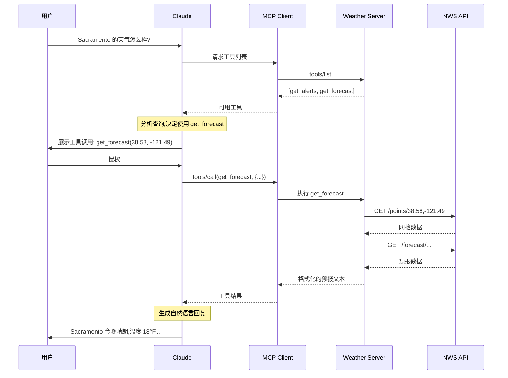

**关键步骤说明:**

1. **工具发现**: Client 获取 Server 的工具清单
2. **智能决策**: Claude 分析查询,选择合适的工具
3. **用户授权**: 展示工具调用详情,等待确认
4. **工具执行**: Server 调用外部 API 获取数据
5. **结果返回**: Server 格式化数据返回给 Client
6. **自然回复**: Claude 将结果转化为自然语言

## 故障排除

### 常见问题

#### 1. Server 未在 Claude 中显示

**排查步骤:**

```bash
# 1. 检查配置文件语法
cat ~/Library/Application\ Support/Claude/claude_desktop_config.json | jq .

# 2. 验证路径是否存在
ls -l /path/to/weather-server/build/index.js

# 3. 测试 Server 是否可运行
node /path/to/weather-server/build/index.js

# 4. 查看 Claude 日志
tail -f ~/Library/Logs/Claude/mcp*.log
```

**常见错误:**

| 错误 | 原因 | 解决方法 |
|------|------|----------|
| JSON 解析失败 | 配置文件格式错误 | 使用 `jq` 或 JSON 校验工具检查 |
| 文件不存在 | 路径错误 | 使用绝对路径,检查文件权限 |
| Server 崩溃 | 代码错误 | 查看 `mcp-server-weather.log` |

#### 2. 工具调用失败

**调试日志:**

```bash
# macOS
tail -n 50 ~/Library/Logs/Claude/mcp-server-weather.log

# Windows
type %AppData%\Claude\Logs\mcp-server-weather.log
```

**常见错误模式:**

```typescript
// 错误: 未捕获异常
async function getTool() {
  const data = await riskyOperation(); // 可能抛出错误
  return data;
}

// 正确: 完善错误处理
async function getTool() {
  try {
    const data = await riskyOperation();
    return {
      content: [{ type: "text", text: formatData(data) }]
    };
  } catch (error) {
    console.error("工具执行失败:", error);
    return {
      content: [{ 
        type: "text", 
        text: `执行失败: ${error.message}` 
      }],
      isError: true
    };
  }
}
```

#### 3. 性能问题

**优化建议:**

```typescript
// 慢: 每次都重新获取
async function getForecast(lat, lon) {
  const points = await fetch(`/points/${lat},${lon}`);
  const forecast = await fetch(points.forecastUrl);
  return forecast;
}

// 快: 添加缓存
const cache = new Map();

async function getForecast(lat, lon) {
  const key = `${lat},${lon}`;
  
  if (cache.has(key)) {
    const cached = cache.get(key);
    if (Date.now() - cached.timestamp < 3600000) { // 1 小时
      return cached.data;
    }
  }
  
  const data = await fetchForecast(lat, lon);
  cache.set(key, { data, timestamp: Date.now() });
  return data;
}
```

## 最佳实践

### Server 设计原则

#### 1. 单一职责

```typescript
// 好: 专注天气数据
class WeatherServer {
  getAlerts() {}
  getForecast() {}
  getClimate() {}
}

// 差: 职责混杂
class SuperServer {
  getWeather() {}
  sendEmail() {}    // 应该独立为 Email Server
  queryDatabase() {} // 应该独立为 Database Server
}
```

#### 2. 幂等性

```typescript
// 幂等操作 - 多次调用结果相同
async function readFile(path: string) {
  return fs.readFileSync(path, 'utf-8');
}

// 非幂等操作 - 需要特殊处理
async function deleteFile(path: string) {
  if (fs.existsSync(path)) {
    fs.unlinkSync(path);
    return { deleted: true };
  }
  return { deleted: false, reason: "File not found" };
}
```

#### 3. 清晰的错误信息

```typescript
// 差: 错误信息模糊
throw new Error("Failed");

// 好: 提供上下文和建议
throw new Error(
  `无法读取文件 ${path}:\n` +
  `原因: 文件不存在\n` +
  `建议: 请检查路径是否正确,或使用 list_files 工具查看可用文件`
);
```

#### 4. 输入校验

```typescript
server.registerTool(
  "search",
  {
    description: "搜索功能",
    inputSchema: {
      query: z
        .string()
        .min(1, "查询字符串不能为空")
        .max(100, "查询字符串不能超过 100 字符"),
      limit: z
        .number()
        .int("必须是整数")
        .min(1)
        .max(100)
        .default(10),
    },
  },
  async ({ query, limit }) => {
    // Zod 已经完成校验,这里可以安全使用
    const results = await performSearch(query, limit);
    return { content: [{ type: "text", text: formatResults(results) }] };
  }
);
```

### 安全建议

#### 1. 输入清理

```typescript
// 危险: SQL 注入风险
const query = `SELECT * FROM users WHERE name = '${userName}'`;

// 安全: 参数化查询
const query = db.prepare('SELECT * FROM users WHERE name = ?');
const results = query.all(userName);
```

#### 2. 路径遍历防护

```typescript
// 危险: 可能访问任意文件
function readFile(path: string) {
  return fs.readFileSync(path);
}
// 攻击: readFile("../../../etc/passwd")

// 安全: 限制在安全目录
function readFile(relativePath: string) {
  const safePath = path.join(SAFE_DIR, relativePath);
  const resolved = path.resolve(safePath);
  
  if (!resolved.startsWith(SAFE_DIR)) {
    throw new Error("路径越界访问被拒绝");
  }
  
  return fs.readFileSync(resolved);
}
```

#### 3. 速率限制

```typescript
const rateLimiter = new Map<string, number[]>();

function checkRateLimit(clientId: string): boolean {
  const now = Date.now();
  const window = 60000; // 1 分钟
  const maxRequests = 100;
  
  const requests = rateLimiter.get(clientId) || [];
  const recentRequests = requests.filter(time => now - time < window);
  
  if (recentRequests.length >= maxRequests) {
    return false; // 超出限制
  }
  
  recentRequests.push(now);
  rateLimiter.set(clientId, recentRequests);
  return true;
}
```

## 进阶话题

### 动态工具注册

```typescript
// 根据配置动态注册工具
const enabledTools = config.tools; // ['search', 'summarize']

if (enabledTools.includes('search')) {
  server.registerTool('search', {...}, handler);
}

if (enabledTools.includes('summarize')) {
  server.registerTool('summarize', {...}, handler);
}
```

### 工具版本管理

```typescript
server.registerTool(
  "search_v2",
  {
    description: "搜索功能 v2 (支持高级过滤)",
    inputSchema: {
      query: z.string(),
      filters: z.object({
        dateRange: z.string().optional(),
        category: z.string().optional(),
      }).optional(),
    },
  },
  async ({ query, filters }) => {
    // 新版本实现
  }
);

// 保留旧版本兼容性
server.registerTool(
  "search",
  {
    description: "搜索功能 v1 (已弃用,请使用 search_v2)",
    inputSchema: {
      query: z.string(),
    },
  },
  async ({ query }) => {
    // 转发到新版本
    return server.callTool('search_v2', { query });
  }
);
```

### 批量操作支持

```typescript
server.registerTool(
  "batch_process",
  {
    description: "批量处理文件",
    inputSchema: {
      files: z.array(z.string()).min(1).max(100),
      operation: z.enum(['compress', 'convert', 'analyze']),
    },
  },
  async ({ files, operation }) => {
    const results = [];
    
    for (const file of files) {
      try {
        const result = await processFile(file, operation);
        results.push({ file, status: 'success', result });
      } catch (error) {
        results.push({ file, status: 'error', error: error.message });
      }
    }
    
    const summary = {
      total: files.length,
      success: results.filter(r => r.status === 'success').length,
      failed: results.filter(r => r.status === 'error').length,
    };
    
    return {
      content: [{
        type: "text",
        text: `批量处理完成:\n${JSON.stringify(summary, null, 2)}\n\n详细结果:\n${JSON.stringify(results, null, 2)}`
      }]
    };
  }
);
```

## 相关资源

### 官方文档

- [MCP 规范](https://spec.modelcontextprotocol.io/)
- [TypeScript SDK](https://github.com/modelcontextprotocol/typescript-sdk)
- [Python SDK](https://github.com/modelcontextprotocol/python-sdk)
- [Java SDK](https://github.com/modelcontextprotocol/java-sdk)

### 示例代码

- [天气 Server (本教程)](https://github.com/modelcontextprotocol/quickstart-resources/tree/main/weather-server-typescript)
- [文件系统 Server](https://github.com/modelcontextprotocol/servers/tree/main/src/filesystem)
- [SQLite Server](https://github.com/modelcontextprotocol/servers/tree/main/src/sqlite)
- [Git Server](https://github.com/modelcontextprotocol/servers/tree/main/src/git)
- [更多官方 Servers](https://github.com/modelcontextprotocol/servers)

### 工具与调试

- [MCP Inspector](https://github.com/modelcontextprotocol/inspector) - 交互式调试工具
- [Server 模板](https://github.com/modelcontextprotocol/typescript-sdk/tree/main/templates)

### 社区资源

- [GitHub Discussions](https://github.com/modelcontextprotocol/specification/discussions)
- [Discord 社区](https://discord.gg/modelcontextprotocol)

## 下一步

根据你的需求选择路径:

**我想开发更复杂的 Server** → 查看 [官方 Servers 源码](https://github.com/modelcontextprotocol/servers)

**我想集成 Server 到应用** → 阅读 [MCP Client 开发指南](./mcp-client.md)

**我关心安全性** → 阅读 [MCP 认证与安全](./mcp-security.md)

**我想部署远程 Server** → 研究 [HTTP 传输实现](https://spec.modelcontextprotocol.io/specification/2025-11-25/basic/transports/#http-with-sse-transport)

## 总结

通过本指南,你应该掌握了:

**✓ 概念理解**
- MCP Server 的三大核心能力(Tools, Resources, Prompts)
- 多 Server 协作模式

**✓ 开发技能**
- 使用 TypeScript SDK 构建完整 Server
- 工具注册、错误处理、日志管理

**✓ 测试与调试**
- Claude Desktop 集成配置
- 常见问题排查方法

**✓ 最佳实践**
- 安全编码规范
- 性能优化策略
