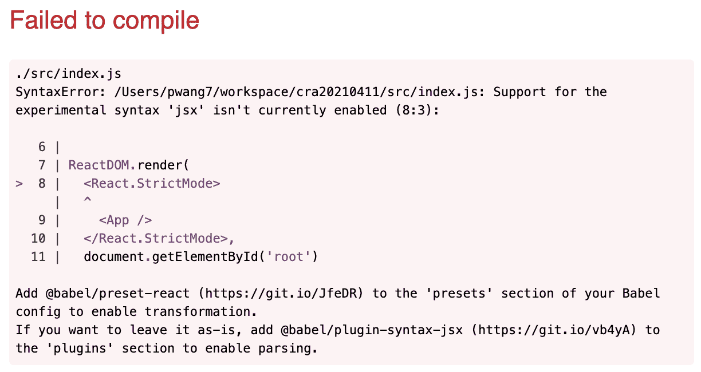

# 打包部署：你的应用是如何上线的？

从这节课开始，我们就进入了扩展篇的学习。通过基础篇和实战篇的学习，你应该对如何开发一个 React 应用已经心中有数了。但是我们也要知道，仅仅学会开发是不够的。在此基础之上，掌握打包部署、单元测试，以及了解 React 生态圈的一些常用项目，才能真正完成一个应用的开发。

所以在扩展篇我会对上述内容做一个整体的介绍，让你使用 React 进行开发时，没有知识盲区，能够完整应对应用的整个开发过程。

同时，我需要强调的是，我们在扩展篇的学习目标是**总体把握，消除知识盲区。**所以我会以介绍重要知识点为主，将我认为最重要或者最常用的概念、机制拎出来，让你有的放矢地进行学习。当然，每一篇的内容如果你想要深入学习，还需要去官方文档或者专门的教程去详细了解。

今天这节课，我将介绍最主流的打包工具 Webpack，通过了解它的基本概念和常用配置，让你能在完成 React 的应用开发之后，知道该怎么打包成可部署的应用。

## 为什么需要了解 Webpack？

我个人一直认为，每个前端开发者不一定要精通 Webpack，但有必要进行了解，至少要能看得懂一个 Webpack 的配置文件，以及遇到问题时能知道是 Webpack 的问题，还是自己代码的问题。

通常来说，我们都是通过脚手架工具创建一个应用，或者加入到一个已有的项目开发中。这个时候，我们并不需要知道该怎么配置 Webpack ，只要能开发业务逻辑就可以了。这与使用 Java、Swift 等等编程语言是有些类似的，我们不太需要关注源代码是通过什么编译器如何打包成最后的应用程序的，因为 IDE 已经帮我们把这些事情做好了。

所以说，我们可以不精通 Webpack，但要知道它是什么，帮我们做了哪些事情。这样的话，在遇到问题的时候，我们就能知道是哪个环节出了问题，以便进一步寻找解决问题的方案。

举个例子，在进行 React 开发时，如果遇到下面的错误，如果是你，会从哪里着手解决呢？



实际上，这是在 React 开发时经常遇到的一个错误。很多同学一遇到时，就不知该从哪里下手，这正是对应用的打包流程不够了解造成的。

我们仔细观察下错误提示，可以发现两个重要的信息：

1. **Failed to compile**：表示这是在编译阶段报的错误，也就是从你的源代码编译到可以由浏览器运行的代码。
   
2. **SyntaxError**：表明这个错误是个语法错误。要么是你的语法真的写错了，要么就是编译器没有正确配置，因此无法识别这样的代码。比如在这个例子中，错误提示其实已经很明确了，JSX 的语法没有启用。而 JSX 是由 babel-loader 处理的，因此你的着手点就应该确认 babel 有没有在 Webpack 中正确配置。
   

所以我们可以看到，只有了解代码的打包流程，才能在遇到问题时找到正确的解决方向。下面我们就来看下 Webpack 的基本工作原理，了解你的源代码最终是如何打包成最终在浏览器中运行的代码的。

## Webpack 的基本工作原理

Webpack 是目前最为主流的前端应用打包工具，它的**核心思路**是将源代码以及图片、样式文件等资源文件都视为模块，然后通过提供对不同类型资源的处理器，将它们进行统一处理，形成最终可在浏览器运行的代码。

下面这张图就显示了 Webpack 的工作机制：


Webpack 不仅是用于打包最终发布出去的应用程序，而且还能在开发时，为我们提供开发时服务器。它可以通过监测源代码的变化并实时编译，让我们能在代码发生变化时，及时看到运行的效果。

Webpack 对于开发环境和生产环境的配置会有所区别，但基本流程是一致的。总体来说，Webpack 的配置会分为下面三个部分。

1. 输入输出配置：定义你的应用程序的入口，以及打包结果输出的文件夹位置。
   
2. 配置对于每一类资源文件的处理器：比如说，对 JavaScript 是用 babel-loader 去编译；对 less 文件则是用 less-loader 去编译；图片则用 file-loader 去处理。你在项目中能使用哪些技术或者资源，完全取决于配置了哪些 loader。
   
3. 插件配置：除了核心的源代码编译和打包流程，Webpack 还支持插件扩展功能，可以通过插件生成额外的打包结果，或者进行一些其它的处理。比如打包过程生成 index.html，源代码分析报表，提取 CSS 到独立文件，代码压缩，等等。
   

为了方便你理解，这里给你举一个简单的例子，我们来看看一个标准的 Webpack 配置文件究竟长什么样：

``` jsx
const HtmlWebpackPlugin = require('html-webpack-plugin');  
const path = require('path');  
  
  
module.exports = {  
  entry: {  
    // 定义应用的入口点 src/app.js，并命名为 main  
    main: path.resolve(__dirname, './src/app.js'),  
  },  
  output: {  
    // 打包输出的文件名，这里将生成 main.bundle.js  
    filename: '[name].bundle.js',  
    // 定义打包结果的输出位置  
    path: path.resolve(__dirname, 'build'),  
  },  
  module: {  
    // 定义处理源文件的规则，rules 下会按顺序使用匹配的规则  
    rules: [  
      {  
        // 遇到 .js 结尾的文件则使用这个规则  
        test: /\.js$/,  
        // 忽略 node_modules 目录下的 js 文件  
        exclude: /node_modules/,  
        use: {  
          // 使用 babel-loader 处理 js  
          loader: 'babel-loader',  
          // babel-loader 的一些选项  
          options: {  
            presets: ['@babel/preset-env'],  
          },  
        },  
      },  
    ],  
  },  
  plugins: [  
    // 使用 HtmlWebpackPlugin 生成一个 index.html，其中自动引入 js  
    // 并配置了页面的 title  
    new HtmlWebpackPlugin({  
      title: 'Webpack Output',  
    }),  
  ],  
};
```

针对这段配置代码，我们一般会把它存储为 webpack.config.js 这样一个文件，这样在我们的项目下运行 webpack 命令，就会使用这个文件作为配置。

代码中其实已经很直观了，我们不仅定义了输入输出，还配置了 babel-loader，用于编译 JavaScript 文件到兼容主流浏览器的代码。同时，还为 babel-loader 设置了参数 presets，例子中这个参数的值 `@babel/preset-env` 可以确保 Babel 能够处理 JSX 等语法。最后，我们通过一个 HtmlWebpackPlugin，来自动生成 index.html。

在这几块配置中，主要的复杂度其实都集中在 loader 和 plugin。

## 理解 loader 和 plugin

loader 和 plugin 是 Webpack 最核心的两个概念，了解了这两个核心概念，我们就能掌握 Webpack 是如何处理你的代码，并最终生成打包结果。

为了理解它们的工作机制，我们来看一个 Less 文件处理的例子，看看要如何配置 Webpack，才能在项目中使用 Less 作为 Css 的预处理器。

Less 允许我们通过更强大的机制去写 Css，比如可以定义变量，允许嵌套的规则定义，等等。要让一个 Less 文件最终打包到目标文件中，并被浏览器运行，那么首先需要把 Less 代码转换成 Css，再通过 style 标记插入到浏览器中。

这个过程涉及到三个 loader，如下：

1. less-loader：用于将 Less 代码转换成 Css。
   
2. css-loader：用于处理 Css 中的 import、url 等语句，以便能分析出图片等静态资源打包到最终结果。
   
3. style-loader：会自动生成代码，并将打包后的 Css 插入到页面 style 标签。这个 loader 会将 Css 打包到 js 文件中，在应用运行时，自动生成的代码再把这些 css 应用到页面上。
   

从中可以看到，这个过程涉及到 loader 的一个重要机制：**链式使用**。**前面一个 loader 的输出结果，可以作为后一个 loader 的输入，这样的话，整个编译过程可以由各个独立的 loader 完成不同的步骤，一方面让每个步骤的任务更加明确，另外也可以让 loader 得以重用。**

比如说如果项目要支持 sass 作为 Css 预处理器，那么顺序就是 sass-loader -> css-loader -> style-loader。可以看到，我们只要替换 less-loader 为 sass-loader，后两个 loader 是完全一样的。

那么，支持 css loader 的 Webpack 配置就可以用如下代码来实现：

``` json
module.exports = {  
  // ...  
  module: {  
    rules: [  
      // ...  
      {  
        // 检测 less 文件  
        test: /\.less$/,  
        // 使用了三个 loader，注意执行顺序是数组的倒序  
        // 也就是先执行 less-loader  
        use: ['style-loader', 'css-loader', 'less-loader'],  
      },  
    ],  
  },  
  //...  
};
```

可以看到，在 module.rules 配置项中我们增加了一条规则，用于 Less 文件的处理。并使用了三个 loader ，用于将 less 代码最终打包到 JavaScript 文件中。

可能有同学会问了，为什么 CSS 代码会进入到 JavaScript 文件中呢？最终它是怎么应用到页面的呢？其实背后的过程主要是，生成的 CSS 代码会以字符串的形式作为一个模块打包到最终结果，然后在运行时由 style-loader 提供的一个函数 injectStylesIntoStyleTag ，来将这个模块加入到页面的 style 标签中，从而最终生效。

比如如下代码，就展示了 injectStylesIntoStyleTag 这个函数的核心部分：**创建 style 标签**。这里你不需要完全理解代码的内容，只需要知道它是用来动态使用 CSS 代码就可以了。

``` js
function insertStyleElement(options) {  
  var style = document.createElement('style');  
  var attributes = options.attributes || {};  
  
  if (typeof attributes.nonce === 'undefined') {  
    var nonce =  true ? __webpack_require__.nc : undefined;  
  
  
    if (nonce) {  
      attributes.nonce = nonce;  
    }  
  }  
  
  Object.keys(attributes).forEach(function (key) {  
    style.setAttribute(key, attributes[key]);  
  });  
  
  if (typeof options.insert === 'function') {  
    options.insert(style);  
  } else {  
    var target = getTarget(options.insert || 'head');  
  
    if (!target) {  
      throw new Error("Couldn't find a style target. This probably means that the value for the 'insert' parameter is invalid.");  
    }  
  
    target.appendChild(style);  
  }  
  
  return st
```

通过上面的例子，你应该已经能明白 loader 的工作原理了。想要在我们的项目中使用不同的语言，只需增加相应的 loader 就行了。比如要支持 typescript，就是配置 ts-loader，要支持 Vue 就是配置 vue-loader。

在这里，我们也看到 CSS 代码之所以能进入到最终的 JavaScript 包，是因为 style-loader 做了这个事情。那么如果我们想让生成的 CSS 文件和 JavaScript 文件分开，应该如何做呢？

这就需要使用到 plugin 了。同时呢，我们还要从 rules 中去掉 style-loader 这个配置，以避免 CSS 进入到 JavaScript 文件中。

实现提取 CSS 模块到单独 CSS 文件的 plugin 是 **mini-css-extract-plugin**，下面的代码就展示了这个 plugin 的用法：

``` json
const MiniCssExtractPlugin = require('mini-css-extract-plugin');  
  
module.exports = {  
  // ...  
  module: {  
    rules: [  
      // ...  
      {  
        test: /\.less$/,  
        // 去掉 style-loader  
        use: ['css-loader', 'less-loader'],  
      },  
    ],  
  },  
  plugins: [  
    // ...  
    // 引入提取 CSS 的插件以及参数  
    new MiniCssExtractPlugin({  
      filename: 'static/css/[name].[contenthash:8].css',  
    }),  
  ],  
};
```

这样，你只需要简单地引入 mini-css-extract-plugin 这个 plugin，就能识别到所有的 CSS 模块，完成 CSS 文件的生成了。

同时，通过刚才讲的例子，你应该也能看到 plugin 和 loader 的一个区别，就是 loader 主要用于处理不同类型的资源，将它们转换成模块；而 plugin 通常用于生成一些除了 JavaScript bundle 之外的一些打包结果，比如例子中的 index.html 和 css 文件。
