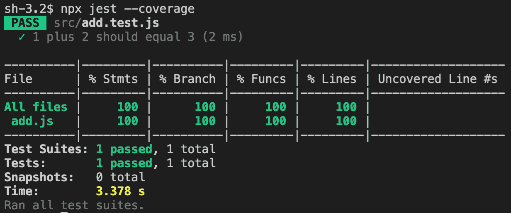

# 单元测试：自定义 Hooks 应该如何进行单元测试？

在课程的一开始，我想首先强调一下单元测试的重要性。因为我发现很多同学在实现业务功能的时候，干劲十足，非常感兴趣。但是一旦要去写测试用例，就顿时觉得枯燥和无趣。

产生这种现象的原因，正是因为**没有意识到测试的重要性**，以及测试能给你带来的好处。要知道，最终应用的质量和稳定性在很大程度上决定着项目的成败，而**为了保证软件的质量，唯一的途径其实就是测试**。

当然，测试带来的好处不仅体现在能够保证最终发布的应用的质量，更为重要的是，它能 ** 让你在开发新功能，或者修复 Bug 时，**对自己做的改动更有信心**。只要有足够的测试覆盖率，那么你就不用太担心自己的改动可能会破坏已有的功能。同时，单元测试还能够帮助你在开发过程中，更好地组织代码，追求模块的松耦合。

因为如果你时刻有意识地去思考自己的每一段代码该如何去测试，那么在实现代码时，就会自觉地去做模块的隔离，反过来提升了代码的质量。这也是为什么很多团队会推崇测试驱动开发的原因。

好了，测试的重要性就不多说了。接下来我们就进入正题，看看对于自定义 Hooks，应该怎么进行单元测试。课程的学习目标仍然是以总体把握为目标，更多地还是思考测试代码是如何运行的，以及测试框架提供了哪些能力帮助我们运行单元测试。

## 如何使用 Jest 和 React Testing Library 进行单元测试

工欲善其事，必先利其器。要开始单元测试，要做的第一件事就是**选择你的测试框架**。这其实包括两个部分的选择：

1. 一个是通用的 JavaScript 测试框架，用于组织和运行你的测试用例；
2. 另一个则是 React 的测试框架，用于在内存中渲染 React 组件并提供工具库用于验证测试的结果。

这两部分市面上其实都有挺多选择，比如通用的 JS 测试框架有 Mocha，Jasmine，Jest 等等；而测试 React 的框架有 Enzyme，Testing Library 等。

如果你已经有一些前端开发的基础，那么可能已经熟悉某些框架。但今天我们使用的则是 Jest 和 React Testing Library 这两个，原因很简单，因为他们是 React 官方推荐的框架，这也意味这它们是可靠而且稳定的。而且通过 create-react-app 创建的 React 项目，已经默认包含了这两个框架，并做好了配置，我们只要直接开始写测试用例就可以了。

当然，如果你更倾向于其他的选择也没关系，因为这节课我更多地是去介绍测试的原理。理解了这些原理，你就相当于拿到了使用框架的抓手，完全可以将原理用在其它框架上。

接下来，我就假设你已经使用 create-react-app 创建了项目，这样可以省去安装和配置的步骤。所以我们就直接来看看应该如何使用 Jest 和 Testing Library 进行单元测试。

### 使用 Jest 创建单元测试

Jest 是 Facebook 推出的 JavaScript 的单元测试框架，主要特点是开箱即用，零配置就能提供并发测试、测试覆盖率、Mock 工具、断言 API 等功能，非常易于上手。

要快速开始使用 Jest，主要需要了解以下三点：

1. Jest 从哪里寻找测试文件；
   
2. 如何创建一个测试用例，并用断言验证测试结果；
   
3. 如何运行测试。
   

我们可以通过一个简单的例子来了解这三点。首先，我们需要**在 src 目录下创建一个 add.js 文件**，包含如下内容：

``` js
export default (a, b) => a + b;
```

然后，再**在 src 目录下创建一个 add.test.js 文件**。因为咋爱默认设置中，Jest 会寻找 src 目录下所有的以 .test.js(ts, jsx, tsx 等） 结尾的文件，以及 **tests** 文件夹中的文件，并将其作为测试文件。

add.test.js 的文件内容如下：

``` js
import add from './add';  
  
// 通过 test 函数创建一个测试用例  
test('renders learn react link', () => {  
  // 执行 add 函数得到结果  
  const s = add(1, 2);  
  // 使用 Jest 提供的 expect 函数断言结果等于3  
  expect(s).toBe(3);  
});
```

如代码注释中所述，这里主要利用了 test 函数来创建一个测试用例，并用 expect 函数断言了执行的结果。expect 的功能其实非常强大，在例子中，我们仅仅演示了如何断言两个值相等。完整的 API 你可以参考官方文档。

再接着，创建完测试用例后，我们就可以**在项目根目录下通过命令 npx jest --coverage 来运行测试**。

实际执行的结果如下图所示：



可以看到，我们的测试用例运行成功。而且，我们通过给 jest 命令加上 --coverage 参数，还得到了自动生成的覆盖率报告。

就这样，我们用 Jest 完成了我们的第一个单元测试。但这仅仅是纯 JavaScript 逻辑的测试，对于 React 应用这样的需要浏览器环境的组件，就需要引入接下来为你介绍的 Test Library 了。

### 使用 React Testing Library 测试 React 组件

我们可以先想一下，要对一个 React 组件进行单元测试，需要提供什么样的运行环境去运行测试用例呢？其实主要可以分为下面三点：

1. **需要有一个浏览器运行环境**。这个主要通过 jsdom 这样一个 npm 的模块去实现。它可以在 nodejs 环境中提供一个虚拟的浏览器环境，包括了几乎所有的浏览器 API，比如 document, window 等等，从而你的组件可以在内存中运行。
   
2. **需要能够解析 JSX，以及**项目中用到的最新的 JavaScript 语法 **。这是通过在 Jest 配置 Babel 去完成的。
   
3. **需要能够方便地渲染一个 React 组件，并对结果进行验证**。这正是 Testing Library 可以提供的功能。
   

为了方便你理解 Testing Library 提供的功能，我们就看一下项目中自带的 App.test.js 的文件内容，其中就使用了 Testing Library：

``` js
// 引入 testing-library 提供的相关工具  
import { render, screen } from '@testing-library/react';  
// 引入要测试的组件  
import App from './App';  
  
  
// 创建一个测试用例  
test('renders learn react link', () => {  
  // 使用 render 方法渲染 App 组件  
  render(<App />);  
  // 通过 screen 提供的 getByText 找到页面上的 DOM 元素  
  const linkElement = screen.getByText(/learn react/i);  
  // 断言这个元素应该在页面上  
  expect(linkElement).toBeInTheDocument();  
});
```

这里用到了 Testing Library 提供的三个 React 相关的测试 API：

1. **render**：用于在内存中 render 一个 React 组件。
   
2. **screen**：提供了工具方法，用于获取屏幕上的元素。比如这里的 screen.getByText，就是用来根据文本获取 DOM 元素的。
   
3. **expect 扩展**：Testing Library 扩展了 expect 的功能，以方便对 UI 元素进行断言判断。比如例子中的 toBeInTheDocument ，就是用于断言 DOM 元素需要存在于 Document 中。
   

虽然这只是 Testing Library 最简单的用法，但通过这个例子，相信你能够理解 Testing Library 从哪些方面为 React 组件提供了单元测试机制，详细的 API 文档你可以参考官方文档。

## 如何对自定义 Hooks 进行单元测试

介绍完单元测试的框架 Jest 和 React Testing Library，你应该对在 React 中如何进行单元测试有大概的了解了。那下面我们就进入今天的主题：**如何对 React Hooks 进行单元测试**。

提到 Hooks 的单元测试，可能很多同学会觉得那很简单啊，Hooks 不就是普通的函数嘛，肯定要比组件的测试要容易多了。

事实上，虽然我在之前的课程中曾多次提到，我们要把 Hooks 看成普通函数，但这是有一个前提的：Hooks 只有在函数组件中使用时，我们才可以把它看成普通的函数。因为 Hooks 的使用是需要有 React 运行的上下文的。这也是 Hooks 的使用原则：**Hooks 只能在函数组件或者自定义 Hooks 中调用。**

所以，在单元测试的运行环境中，要想脱离函数组件，单独运行 Hooks 进行单元测试，那是不可行的。

到这里，你应该就能理解了。要对 Hooks 进行单元测试，我们还是要借助函数组件。

比如说，我们要对第 6 讲的 useCounter 这个自定义的计数器 Hook 进行单元测试，应该怎么去做呢？

首先，我们来回顾下 useCounter 的示意代码：

``` jsx
import { useState, useCallback } from 'react';  
  
export default function useCounter() {  
  const [count, setCount] = useState(0);  
  const increment = useCallback(() => setCount(c => c + 1), []);  
  const decrement = useCallback(() => setCount(c => c - 1), []);  
  
  return { count, increment, decrement };
```

可以看到，这个 Hook 就是管理了 count 这个变量，并提供了对其加一减一的方法。而我们要做的测试，就是要能够调用这两个方法，并检测 count 值是否能正确地发生变化。

为此，一个思路上比较直观的做法就是**创建一个测试组件**，**在这个测试组件内部使用这个 Hook**。因此对于 Hook 的测试，就可以转换为对组件的测试，那么实现的代码如下：

``` jsx
import { render, fireEvent, screen } from '@testing-library/react';  
import useCounter from './useCounter';  
  
test('useCounter', () => {  
  // 创建一个测试组件，使用 useCounter 的所有逻辑  
  const WrapperComponent = () => {  
    const { count, increment, decrement } = useCounter();  
    return (  
      <>  
        <button id="btnMinus" onClick={decrement}>-</button>  
        <span id="result">{count}</span>  
        <button id="btnAdd" onClick={increment}>+</button>  
      </>  
    );  
  };  
    
  // 渲染这个测试组件  
  render(<WrapperComponent />);  
  
  // 找到页面的三个 DOM 元素用于执行操作以及验证结果  
  const btnAdd = document.querySelector('#btnAdd');  
  const btnMinus = document.querySelector('#btnMinus');  
  const result = document.querySelector('#result');  
  
  // 模拟点击加一按钮  
  fireEvent.click(btnAdd);  
  // 验证结果是不是 1  
  expect(result).toHaveTextContent('1');  
  // 模拟点击减一按钮  
  fireEvent.click(btnMinus);  
  // 验证结果是不是 0  
  expect(result).toHaveTextContent('0');  
}
```

可以看到，通过创建一个测试组件来使用要测试的 Hooks，再通过测试组件的功能，我们可以间接完成对 Hooks 的测试。

但是呢，这样做的缺点也是显而易见的：我们需要写很多与 Hooks 测试本身无关的代码。比如页面上的这些 DOM 元素。

这么说来，我们能否更直接地操作 Hooks 的 API 呢？其实也是可以的。我们可以将 useCounter 这个 Hook 的返回值暴露到函数组件之外，然后由测试代码直接调用这些 API 并验证结果。下面的代码就演示了这种做法：

``` jsx
import { render, act } from '@testing-library/react';  
import useCounter from './useCounter';  
  
test('useCounter', () => {  
  const hookResult = {};  
  // 创建一个测试组件，仅运行 Hook，不产生任何 UI  
  const WrapperComponent = () => {  
    // 将 useCounter 的返回值复制给外部的 hookResult 对象  
    Object.assign(hookResult, useCounter());  
    return null;  
  };  
  // 渲染测试组件  
  render(<WrapperComponent />);  
    
  // 调用 hook 的 increment 方法  
  act(() => {  
    hookResult.increment();  
  });  
  // 验证结果为 1  
  expect(hookResult.count).toBe(1);  
  // 调用 hook 的 decrement 方法  
  act(() => {  
    hookResult.decrement();  
  });  
  // 验证结果为 0  
  expect(hookResult.count).toBe(0);  
});
```

从这段代码可以看到，我们把 Hook 的返回值暴露到了函数组件之外，这样就可以直接对 Hook 进行操作了。

这里需要注意的是，我们使用 了 act 这样一个函数来封装对 Hook 返回值的方法调用。这个其实是 React 提供的一个测试用的函数，用于模拟一个真实的 React 组件的执行步骤，从而保证在 act 的回调函数执行完成后，还会等 React 组件的生命周期都执行完毕，比如 useEffect。这样才能在随后对组件的渲染结果进行验证。

关于 act 的进一步说明，你也可以参考 React 的官方文档。

通过上面这种直接操作 Hooks API 的方式，我们简化了 Hooks 的测试逻辑，本质上其实也是利用了一个容器组件去使用 Hooks 来进行测试。但例子中的组件本身其实什么都没有做，只是调用了 useCounter 这个 Hook。

那么进一步来说，我们是不是能做成一个工具函数来专门测试 Hook 呢？答案是肯定的，而且这正是 Testing Library 提供的一个专门的 React Hooks 测试包：`@testing-library/react-hooks`。使用它的方式如下面代码所示：

``` js
import { renderHook, act } from '@testing-library/react-hooks';  
import useCounter from './useCounter';  
test('useCounter3', () => {  
  // 使用 renderHook API 来调用一个 Hook  
  const { result } = renderHook(() => useCounter());  
  // Hook 的返回值会存储在 result.current 中  
  // 调用加一方法  
  act(() => {  
    result.current.increment();  
  });  
  // 验证结果为 1  
  expect(result.current.count).toBe(1);  
  // 调用减一方法  
  act(() => {  
    result.current.decrement();  
  });  
  // 验证结果为 0  
  expect(result.current.count).toBe(0);  
});
```

可以说，有了 `@testing-library/react-hook`s 这个包，我们就能更加语义化地去创建自定义 Hooks 的单元测试。虽然使用这个包的原理还是通过一个组件去调用 Hooks，但是测试代码中，你就不需要自己创建多余的测试组件了。

最后，还需要强调一个问题，你应该也想到了：我们是否需要对每一个 Hook 都进行单元测试呢？

其实不然。在第 6 讲时，我们曾经学习过自定义 Hooks 的典型使用场景。其中有一个场景是拆分复杂组件，将一个复杂组件的逻辑用自定义 Hooks 的方式进行逻辑的隔离。那么这种场景下，自定义 Hooks 其实完全可以由对组件的单元测试去覆盖，而不用去单独测试。

总结来说，只有对那些可重用的 Hooks，才需要单独的单元测试。
