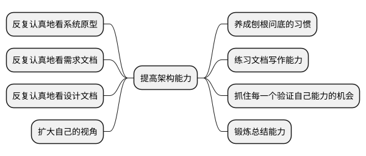
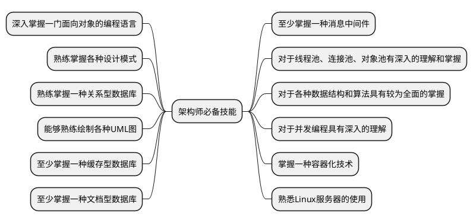

# 1. 如何规划自己的架构师职业生涯

要想成为一名架构师，要懂得规划自己的职业生涯。首先要能够明确区分架构师与程序员的区别，其次要高效地打磨架构设计能力，注重培养专业技能。有规划的工作与漫无目的的随意发展，结果是截然不同的。无论是在校大学生还是已经参加工作的程序员，都应该尽早地进行职业规划。

## 1.1 架构师与程序员的区别

一个程序员就算编码能力再强也只是一个人，一个大型的企业级项目往往需要多个团队的大量人员协作完成。

架构师的职责是怎样做好顶层抽象、系统功能架构、服务关系架构、服务部署架构、服务拆分、系统分层设计、划定边界、核心框架、技术选型等。架构师必须要做出精准的顶层架构设计，让一个抽
象的需求落地成为一个具体的系统。

因此，架构师的重要之处在于，将抽象的东西具体化，让复杂的事情简单化，让众多部门、人员清楚自己的职责，有序地实现各自部分的系统功能，最终形成一个大而完整的系统。架构师是一个人驱动众人，而一个编程强人，往往只能自己驱动自己或少数人，为企业带来的价值是有巨大差别的，这也是架构师属于高级职位的原因。

架构师与程序员的区别有很多，大家各司其职。高级开发工程师也同样具有巨大的价值，因此架构师与程序员没有绝对的高低优劣之分，只是发展方向和成长路径不同而已，架构师要求综合能力更强一些，而高级开发工程师要求专项技能更突出一些。

## 1.2 如何提升自己的架构能力

与编程技能一样，设计能力、架构能力也是可以经过不断地学习、锻炼而打磨出来的。

## 1.3 架构师的12项必备技能

每个开发人员都具有成为架构师的先天优势，因为开发人员每天都在编写各种各样的功能代码，接触各种各样的场景，阅读各种各样的文档，使用各种各样的数据库，研究各种各样的中间件。区别在于是否有人能够用心观察和总结，将这些琐碎的经验融会贯通。将不同的场景组合在一起、设计清楚、讲解明白就是架构师所要做的工作。

当然，以上列举的依然不够，不同的领域还有很多知识需要学习，如云计算、大数据、数据挖掘、物联网、人工智能等，各个领域都有各自重要的知识体系。架构师本身就是一个软硬技能的结合体，对于技术的掌握不仅要全面，而且要更加深入。往往底层的核心架构，重大问题攻关也是需要架构师来解决的。根据自己的行业特点，有策略、有选择性地学习，寻找自己的技术短板并不断补齐，是一种更加高效的学习策略。

## 1.4 写给程序员同行

作为一个已经工作了10年的“老程序员”，截至2021年已经34岁了，虽然依然混迹在IT行业这个圈子中，但是内心还是有很多的压力。 这些压力来自多个方面，有工作、有家庭、有孩子、有父母。
都说软件行业有35岁的天花板，当然这不是全部事实，但是确实与个人能力息息相关。统计一下阿里巴巴、腾讯、今日头条、百度、美团等各大互联网公司的员工年龄，平均年龄都在26岁左右，很多35岁以上的老员工，由于个人能力原因、公司成本原因，都被所谓的“公司结构优化”给“优化”了。 当然，这与国内整个行业的发展水平有关，短时间内是很难改变的，需要很长一段时间去优化。

作为这个行业的一分子都应该有一些危机感，要尽早规划自己的职业生涯，提升多维度竞争力，增加抵御风险的能力。除了编程能力，还要具有架构设计能力，一步步地走向系统架构师这个更高的目标。技术的本质是工具，使用的各种编程语言、各种编程框架、软件工具都是解决问题的手段而已。工具本身并不重要，解决问题的思想才更加重要。只有想到才能做到，这是有必然的因果关系的。

一个大型企业级互联网分布式系统，往往需要几百、上千人的研发团队。数十个、几百个子系统或微服务相互协作，面对这样一个庞然大物，我们确实就好像一个“搬砖”的“码农”，很多人认为自己不需要了解整个系统架构，也不关心整个系统能做什么，以及为什么要这样做，把分配给自己的功能做好就足够了。面向需求文档开发、面向设计文档开发、面向百度开发，这些工作方式会对个人的长远发展造成极大的负面影响。

互联网行业的新人都是站在巨人的肩膀上，后浪拍前浪是必然的结果。例如，10年前还没有这么火爆的人工智能，没有大数据，没有云计算，没有分布式，没有微服务，没有物联网。10年前自己还在写着JSP，用着jQuery和Servlet，安卓（Android）系统版本才1.0，最好的开源手机操作系统还是塞班。

现在的大学生、高中生就可以在互联网上轻松地接触到这些最前沿的技术，学习这些技术，站在一个更高的起点走向社会。虽然自己已经工作了10年，但是在这些新兴技术面前，可能还不如这些学生。无论是“80”后、“90”后，还是“00”后，每一代程序员都会面临这个问题，技术在不断地进步，后人总会站在前人的肩膀上。随着年龄的增长，不得不面对精力不足、时间不够的尴尬局面，会发现和年轻人拼体力越来越力不从心，每个程序员都应该重视自己的职业规划。增长的不能只是年龄，还应该有多维度的能力。每个人要做的都不是去抢年轻人的饭碗，而是凭借自己的经验，去做更多符合自己年龄和经验的事情。
