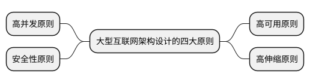
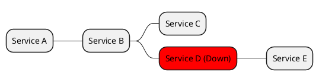
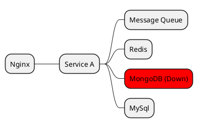
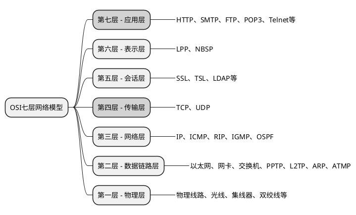
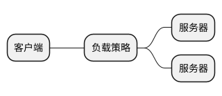

# 2. 大型互联网架构设计的四大原则(一)

在大数据和互联网时代，对于系统架构的先进性要求也越来越高，系统要能够承载海量的数据存储、超高并发的用户请求、各式各样的系统攻击，同时还要具有丰富的功能和极佳的用户体验。

大型互联网架构设计要遵循四大原则：



- **高可用原则**：系统应该最大程度地保证服务可用性，缩短服务因为各种故障而不可用的时间，具有极高的稳定性和容错性。

- **高伸缩原则**：系统的服务能力应该可以随时根据需要进行伸缩，具有较强的水平扩展能力。当服务压力较大时，能够提高计算能力、存储能力、传输能力等；当服务压力较小时，能够减小服务规模，减少资源的投入。

- **高并发原则**：系统应该具有承载超高并发请求的能力，在保证系统可用性的同时，具有更快的响应速度和更好的用户体验。

- **安全性原则**：系统要具有足够的安全防护能力，网络、服务器、存储、数据都要进行相应的安全设计，以应对各式各样的安全威胁。

## 2.1 大型互联网架构高可用设计

高可用（**High Availability，HA**）是指不间断提供服务的能力，无论是因为服务器宕机、网络异常，还是程序bug（漏洞）等任何原因所导致的故障，都应该尽量地将服务不可用的时间缩短到最小，将损失降到最低，这就是高可用设计的目的。

想要达到高可用也是有模式可循的，核心思想就是**冗余**、**容错**、**故障转移**和**系统监控**。

### 2.1.1 高可用指标

如何评价一个系统的可用性是高还是低呢？一般使用年度可用性指标来衡量，计算公式为(1 - 年度不可用小时/年度总小时)×100%=年度可用性指标。一年按365天，即8760小时计算。

例如，某系统一年内总停机时间53分钟［即53/60≈0.883(小时)］，则可用性指标=(1-0.883/8760)×100%≈99.99%，这就是所谓的可用性达到**4个9**。

同理，根据可用性指标，就能推算出每年的最短停机时长。例如，某系统的可用性达到4个9，也就是说，可用性达到99.99%。一年365天，每天24小时，因此服务不可用时间不能超过365×24×(1-99.99%)=0.876(小时)，即系统一年内不可用时长不能超过53分钟。这代表系统具有自我恢复能力，已经是较高的可用级别了。

如果某系统的可用性达到**5个9**，则系统一年内不可用时长不能超过5分钟。这代表系统具有极高的可用性了。

| **指标简称** | **年度可用指标** | **最大不可用时长** | **可用性级别**       |
|----------|--------------|----------------|------------------|
| **2个9**     | 99%          | 88小时(3.7天)  | 及格(基本可用)   |
| **3个9**     | 99.9%        | 9小时          | 中等(可用性较高) |
| **4个9**     | 99.99%       | 53分钟         | 优秀(可用性很高) |
| **5个9**     | 99.999%      | 5分钟          | 极佳(可用性极高) |

### 2.1.2 冗余设计

系统中某个单节点故障可能会引起级联故障。如下所示，当`D`服务因故障宕机时，就会造成`B`和`C`服务出现大量的交易失败和请求积压，问题会很快传遍所有依赖节点，造成大量业务功能无法使用甚至全面宕机。



如下图所示，服务`A`使用了**MQ**、**Redis**、**MongoDB**、**MySQL**多种中间件，都是单节点部署，当MongoDB节点因故障宕机后，就可能会导致服务A无法正常启动、核心功能丧失、失去服务能力。



由此可见，如果每个服务节点都只有一台服务器，那么任意节点发生故障，都会导致整个系统不可用，这就是所谓的单节点故障，对系统的可用性具有极高的威胁。冗余是高可用的核心思想，坚决避免服务出现单节点故障，做法就是增加备用节点，方案主要有两种：主备高可用和多活高可用。

- **主备高可用方案**：例如，某系统只有一台服务器A，如果宕机了就会引起服务不可用，那么就再准备一台服务器B，硬件配置、环境信息、应用部署都完全与服务器A保持一致。如果服务器A发生了故障，就立即把服务器B启动起来，顶替服务器A对外提供服务；看似简单，然而这也是一种高可用方案，同样是缩短了服务的不可用时长。

- **多活高可用方案**：为了避免单节点故障，可以部署多个同样的服务节点，同时提供服务。例如，使用的双卡双待的手机，一个电话卡欠费了，另一个还可用，两张卡是同时工作的。

做任何架构设计都不要拘泥于理论和技术，达到目标才最重要。

### 2.1.3 负载均衡架构设计

负载均衡架构是一种应用较为广泛的高可用手段，可以快速地为其他服务提供水平扩展能力。

#### 1.什么是负载均衡架构？

- 无冗余结构：
  ```plantuml
  @startmindmap
  + 客户端
  ++[#red] 服务器
  @endmindmap
  ```

- 负载均衡冗余结构
  ```plantuml
  @startmindmap
  + 客户端
  ++ 负载设备
  +++ 服务端
  +++[#red] 服务端
  @endmindmap
  ```

负载设备可以使用硬件或软件实现，因此负载均衡可以分为**硬负载**（硬件设备）和**软负载**（软件）两种。硬负载主要使用`F5`、`Radware`等硬件设备，软负载主要使用`Nginx`、`LVS`、`HAProxy`等软件。

硬负载具有性能高、稳定性强的特点，但是价格昂贵，而且不利于开发人员维护。软负载具有灵活性强，易于配置的特点，但是由于软负载工具运行在操作系统之上，所以性能和稳定性受操作系统限制，相较于硬负载要略差一些。

#### 2.负载均衡高可用方案

这种架构方式虽然解决了服务端的单节点风险，但是负载设备本身又变为了单节点。下面介绍几种常用的负载均衡高可用方案。

- **Nginx+Keepalive双机主备方案**

  当主节点存活时，请求将发送至主节点处理。当主节点宕机后，VIP会自动漂移到备份节点，由备机接管负载服务，成为新的主机，从而达到主备自动切换，具备自动故障转移的能力。当故障节点恢复后，这个新的主机自动变为备机使用。

  双机主备需要注意时刻保持主备Nginx的配置完全相同，避免发生系统切换后，服务无法正常使用的情况。

- **F5+LVS/HAProxy+Nginx多级负载方案**

  `Nginx+Keepalive`的方案虽然可以保证Nginx的高可用，但缺点是只能由一个节点对外服务，单个节点的Nginx连接数和服务能力有限，如果想对Nginx进行水平扩展就无法满足。

  可以使用开源免费的`LVS`或`HAProxy+Nginx`形成二级负载结构，从而让Nginx支持水平扩展，支持超高并发请求。LVS和HAProxy都可以使用Keepalive搭建双机主备高可用模式

  也可以使用`硬负载+LVS/HAProxy+Nginx`形成三级负载结构，从而让LVS/HAProxy也支持水平扩展，并发能力将再上升一个数量级。F5和Radware可以搭建双机主备模式，保证高可用。

#### 3.四层与七层负载

LVS和HAProxy的性能比Nginx强很多，因为LVS和HAProxy专门用于四层负载，而Nginx多用于七层负载（新版本Nginx可以通过添加Stream模块，支持四层负载）。 

LVS和HAProxy工作在第4层，而Nginx可以工作在第`4`层和第`7`层



`LVS`和`HAProxy`更接近于操作系统底层，使用IP加端口的方式进行路由负载，让客户端和上游服务器直接建立通信，通过TCP、UDP的请求报文头中的IP地址或MAC地址，来达到转发的目的，对网络性能几乎无损耗。

#### 4.既然LVS和HAProxy这么强大，为什么还要使用Nginx呢？

由于LVS和HAProxy工作在四层网络之上，功能也比较单一，只负责请求分发，因此流量本身并不穿过它们。不支持URL路径匹配，不能做动静分离，可配置性不强。由于更接近于操作系统和网络层面，所以一般开发人员难以配置，需要专门的运维人员负责。

Nginx工作在七层网络之上，可以作为静态资源服务器、文件服务器，支持POP、SMTP协议，支持HTTP缓存、URL路径匹配，在服务器配置较好的情况下，也能够承载单机2万以上的并发，稳定性很好，配置文件简单、语法友好，开发人员可以直接配置。同时，插件众多，社区活跃度较高，通过插件可支持TCP反向代理、访问限流等功能。基于以上原因，Nginx具有极高的市场覆盖率。当然，LVS、HAProxy、Nginx都在不断地发展，未来功能差异可能会进一步缩小。

F5、Radware等硬负载设备，也是工作在四层网络之上，借助独立硬件的能力，性能最为出众，但是价格也十分高昂。

#### 5.负载策略

客户端请求到达负载设备，需要根据一定的算法决定分发给哪一个上游服务器，这个分发算法就是负载策略，如下图所示。



对于不同的负载软件，支持的负载策略稍有差异，但是大体相同，有如下**10**种。

- **轮询策略**：请求被依次循环分发给上游服务器，一般属于默认策略，最常用。 

- **权重轮询策略**：可以设置权重，权重越大，分发的请求越多，配置高的服务器权重应该大一些，配置低的服务器权重应该小一些。例如，如果设置4:1的权重，则配置高的服务器会收到4次请求，配置低的服务器会收到1次请求。 

- **动态权重策略**：请求分发交由系统控制，负载均衡器会收集每个上游服务器的状态，如CPU、内存、磁盘I/O、繁忙程度等各项指标，从而计算出权重，给相对空闲的服务器分发更多请求，给繁忙的服务器分发少量请求。 

- **最小连接数策略**：由于所有的连接都经过负载设备，所以它可以统计出每个上游服务器的连接数情况，每次都将请求转发给连接数最小的服务器。 

- **最短响应时长策略**：将请求分发给响应时间最短的服务器。 

- **IP哈希策略**：将相同来源IP的请求转发到同一个上游服务器，可用于Session保持等场景。 

- **URL哈希策略**：与IP哈希策略类似，使用请求URL进行哈希计算，将相同哈希值的请求转发到相同的上游服务器。 

- **最小会话策略**：根据当前的Session保持情况，将请求分发给会话最小的服务器。 

- **趋势分析策略**：根据一段时间内的请求分发情况、连接数、会话、服务器状态等信息判断出每个上游服务器未来的流量上升和下降趋势，将请求转发给趋势上升的服务器。 

- **随机策略**：将请求随机分发给某一个上游服务器。

### 2.1.4 DNS轮询负载设计

**DNS（Domain Name System，域名系统）**是互联网的一种服务，它将域名和IP地址进行映射存储，当用户访问某个域名时能够快速找到对应的IP地址，使用户更加方便地访问互联网。

### 2.1.5 两地三中心容灾设计

两地三中心是一种容灾方案。在同一个城市或邻近的城市（如北京、天津）建立两个数据中心（Data Center，DC），由于距离较近，网络延迟低，因此数据几乎可以达到实时同步。当其中一个数据中心发生故障，如火灾、地震等毁灭性事故时，可以快速将服务切换到另外一个数据中心，保证服务可以短时间内恢复。

由于两个数据中心在邻近的城市，对于一些地震、洪水等不可抗力因素，可能会导致两个数据中心都不可用，因此可以在更远的位置再部署一个数据中心，只进行数据同步备份。

两地三中心容灾架构的特点是同一时间只有一个数据中心对外提供服务。

在日常工作中，任何的系统发布（代码发布、数据库DDL、服务器环境配置等）都需要在两个数据中心执行，目的是确保环境完全一致。

数据库采用主从模式进行数据同步，保证双方数据一致，但是跨地区的数据同步会出现较大延迟，可以增加专线降低延迟程度。

两地三中心模式，相当于做了一个数据中心级别的热备份；因为始终有一个数据中心处于闲置状态，无法充分利用，所以对成本存在极大的浪费。由于一个数据中心始终处于冷却状态（没有任何真实业务发生），当真正发生灾备切换时，并不一定能够正常运转起来，所以两地三中心只是看起来美好而已。

为了节省成本，可以只将核心业务做灾备，当发生灾难时优先保证企业或政府机构的核心业务可以正常运转。

### 2.1.6 异地多活架构设计

两地三中心容灾设计带来极大的浪费，并且没有解决访问效率问题。两个可用的数据中心都部署在同一个城市或相邻的城市，例如，服务器部署在北京，则只有华北、华中等周边地区访问速度较快，而华南地区、海外地区访问速度较慢。

因此，最好的架构应该是异地多活架构，就是全国乃至全球部署数据中心，这些数据中心同时对外提供服务，让不同地区的用户访问距离他们最近的数据中心。但是，部署成本极高，并且技术复杂，资金和人员投入巨大。

异地双活是异地多活的特例，是指在两个距离较远的城市建立IDC（Internet Data Center，互联网数据中心），同时对外提供服务。

异地多活架构主要存在以下两个问题。

- 跨数据中心访问，导致处理速度慢。用户的一次请求，对于分布式系统，可能在服务器发生数十次的调用，如果这些调用不能发生在同一个IDC内，延迟就会较高。

- 数据无法实时同步。由于各个IDC的距离较远，网络延迟是无法避免的，因此数据无法达到实时复制。如果不进行特殊的控制，则会产生很严重的不一致性问题。

为了解决数据同步延迟问题，最简单的方式就是数据库不拆分也不同步，都集中在一个IDC中，多个IDC中的服务共享一套数据源，即伪异地多活架构，

每个IDC中除数据库外均正常部署，所有服务都对一个数据源（并非一个数据库）进行读写。这样就保证了数据的一致性。这种方式部署实现相对简单，但是数据库压力过大，并且跨区访问时由于数据库远程访问，依然会造成交易效率很低。这种方案依然只适合多个IDC同城或邻城部署，因此通常作为异地多活的一种过渡方案。

真正的异地多活架构则是数据库都是完全独立拆分部署的，通过同步的方式进行数据同步，但是复制延迟是无法避免的，因此这个问题无须纠结（因为现代的通信技术还无法彻底解决长距离数据传输的延迟问题）。所以，异地多活架构并不是将所有业务都进行异地部署，对于一些账户余额、转账等一致性、实时性要求极高的业务并不适合，而且对于一些非常用的交易也没有必要进行异地多活设计。

### 2.1.7 MongoDB高可用架构

#### 1. MongoDB基础知识

`MongoDB` 是一个基于分布式文件存储的数据库，由C++语言编写，旨在为Web 应用提供可扩展的高性能数据存储解决方案。`MongoDB` 是一个介于关系型数据库和非关系型数据库之间的产品，是非关系型数据库中功能最丰富、最像关系型数据库的产品。

MongoDB并不是按照表（`Table`）存储的，而是按照文档（`Document`）存储的，将数据以JSON形式存储在数据库中，因此MongoDB也是一种**NoSQL数据库**，或者称之为**文档型数据库**。

MongoDB的优势在于使用JSON文档结构，适合整合复杂数据、整体查询的场景；自带主从模式、副本集模式和分片模式，可以很方便地进行读写分离、高可用和负载均衡，其他关系型数据库往往需要借助其他中间件才能做到，同时支持海量数据的存储和查询。

#### 2. MongoDB的3种高可用架构

为保证MongoDB的高可用，官方提供了3种模式，分别为主从模式、副本集模式和分片模式。其中主从模式官方不推荐使用，并且在MongoDB 3.6中彻底废弃。

**（1）主从模式。**

主从模式的第一种用法是用作备份，主库提供读写能力，从库不可以进行读写，数据实时地从主库备份到从库，从库只作为单纯的备份使用。从库无法分担主库的压力，只是避免了数据丢失的风险。

主从模式的第二种用法是实现读写分离，主库提供读写能力，从库只提供查询能力。从库除了可以起到数据备份的作用，还可以分担部分主库的压力。另外，也可以部署多个从节点，形成一主多从的架构，进一步分担查询压力。主从模式被废弃的原因是没有自动故障转移能力，当主库发生故障后，必须手动操作将从库切换为主库，应用程序也要修改连接信息

**（2）副本集模式。**

副本集模式是采用选举算法，在多个MongoDB节点中选举出一个主节点（也叫作Master节点），负责数据的读写操作，其余节点作为副本节点，从主节点同步数据，起到数据冗余、备份、服务高可用的目的，从节点也可以承担读操作进而减轻主库压力。

当主节点宕机或网络故障时，集群会根据选举算法重新推举出新的主节点，承担数据的读写操作，其他从节点将从该节点继续复制数据。当故障节点修复后，将重新作为整个集群中的从节点继续工作，以这种方式达到了故障自动转移的目的。

MongoDB集群的各个节点之间通过心跳机制进行检查，从而来判定节点是否可用，是否需要进行重新选举。

值得注意的是，在副本集模式下，每个节点都具有数据库的全量数据。由于副本集需要大量的存储空间，对性能也有较高要求，因此如果只是为了保证MongoDB的高可用，为了可以正常地 选举，则可以只部署仲裁节点，而不部署数据副本节点。仲裁节点只负责投票，选举出主节点，而不存储业务数据。

**（3）分片模式。**

主从模式、副本集模式中每个节点存储的依然是全量数据，存储量存在上限，随着数据量的增长，读写操作性能会急剧下降，因此主从模式、副本集模式更适用于中小型系统、数据量增长缓慢的系统，单个集合数据不超过千万条，可以不考虑分片。切记不要过度设计，此乃设计师的大忌。

MongoDB的分片模式，能够保证数据存储量可以无限增长，同时保证读写操作的性能，当然系统的复杂度也会进一步提升。

分片的目的是将数据切分存储。例如，1000万条数据如果拆分存储在5个分片节点中，则每个节点只需要存储200万条数据，每个分片节点都同时对外提供读写服务，从而提高了MongoDB的存储能力和服务性能，这与分库分表的理念是相同的。

### 2.1.8 Redis高可用架构

#### 1. Redis基础知识

**（1）Redis的概念。**

`Redis`（**Remote Dictionary Server，远程字典服务器**）是一个开源的、使用C语言编写、遵守BSD协议、支持网络、可基于内存、可持久化的Key-Value（键-值）数据库，并提供多种语言的API。由于Redis不使用SQL语句，因此它也被称为NoSQL数据库，与之类似的产品还有Memcached。

Redis支持丰富的数据类型，如string、list、set、zset（sorted set）、hash。

**（2）Redis的作用。**

由于Redis属于内存型数据库，所有数据都在内存中存储（也可以持久化磁盘中）和查询，因此其具有极高的存储和查询性能，远远超过关系型数据库。

Redis通常作为缓存中间件使用，减少对数据库的访问次数，从而减少磁盘的读写次数，提高服务性能。

**（3）Redis的基本使用流程。** 

当系统服务需要从数据库中查询数据时，并不是直接到数据库中查询数据，而是先到Redis中查询。Redis中查询不到，才到数据库中查询。

#### 2.持久化

Redis是一个内存型数据库，存储空间有限，同时数据容易丢失（重启丢失）。因此，Redis提供了持久化功能，将内存数据写入磁盘，在Redis启动时可以从磁盘加载，提供备份和恢复能力，这也属于高可用范畴。

Redis的持久化是异步进行的，主进程不阻塞并实时对外提供服务，同时异步写入磁盘，保证服务不间断的同时，达到了数据备份的效果。Redis的持久化有两种模式：RDB模式和AOF模式。

**（1）RDB模式。**

RDB模式是一种周期性备份模式，与定时批处理的原理相同，每隔一段时间备份一份快照文件，因此会产生多个备份文件，每个备份文件都代表某一时间点的数据。可以将RDB文件存储到外部设备或远程存储设备中，以保证数据的安全性，同时方便转移和存储。

RDB模式是在Redis的主进程上Fork（分叉）出一个子进程专门用于持久化，因此对于Redis的性能影响较低，使用RDB文件进行恢复和重启速度更快。

RDB模式的缺点是会造成数据丢失。

**（2）AOF模式。**

AOF模式是一种日志模式，对于每一条命令都以操作日志的形式记录。当Redis重启时，通过日志回放的方式进行数据恢复，因此AOF可以更好地降低数据丢失情况，可以利用AOF文件做更灵活的数据恢复。

AOF文件的写入有3种策略，可以在redis.conf配置文件中使用appendfysnc参数进行配置。

- **always**：代表每次写入操作完毕后，立即执行fsync操作，进行AOF文件写入。这种方式可以保证数据基本不丢失，但是对Redis的性能有较大影响，一般不采用。

- **no**：代表每次写入操作完毕后，不会执行fsync操作，而是由操作系统进行调度，性能最好，但是数据丢失风险最高，具有不可控性，一般不采用。

- **everysec**：每秒执行一次fsync操作，对性能影响不大，同时能够保证即使数据丢失也只丢失最近1秒的数据，推荐采用。

由于AOF采用操作日志的形式存储，因此相同数据量的AOF文件会比RDB文件大。为了解决AOF文件过大的问题，Redis提供了重写操作。例如，有连续100个重复的set操作，则可以合并为一条日志存储，从而减小AOF文件的体积。AOF采用日志回放的方式恢复，而RDB采用一次性整体恢复的方式，所以RDB的恢复速度会更快一些。

RDB和AOF模式各有优缺点，又相互补足。Redis支持同时开启两种持久化模式，所以推荐同时开启两种模式，用AOF保证数据完整性，用RDB作为冷备份补足。在恢复时优先采用AOF进行恢复，当AOF文件损坏无法使用时，再使用RDB文件恢复。

#### 3. Redis的3种高可用架构

缓存数据库是提高程序性能和承压能力的重要工具，如果缓存服务器宕机，则很容易引起雪崩问题，导致系统级联故障，甚至大面积宕机。因此，缓存服务器的可用性也是至关重要的。下面对企业中常用的Redis高可用架构进行分析讲解。

Redis的高可用也有3种模式：主从模式、哨兵模式和集群模式，原理与MongoDB基本相同，只是名称不同而已。

**Redis和MongoDB高可用架构的对比**

| **Redis**    | **MongoDB**    |
|----------|------------|
| 主从模式 | 主从模式   |
| 哨兵模式 | 副本集模式 |
| 集群模式 | 分片模式   |

**（1）主从模式。**

Redis的主从模式与MongoDB的主从模式基本相同，主库对外提供读写服务，从库可以只用于备份，而不对外提供服务，这就是主备模式（热备份）。如果从库对外提供查询服务，减轻主库的压力，则为读写分离模式。

主从模式主要有3种架构方式：

- **一主一从**
- **一主多从**
- **主从从**

无论采用哪种部署模式，主从模式的核心是如何将数据从主节点高效、准确地复制到从节点。

主从同步主要分为以下3种方式：

- 全量同步
- 增量同步
- 部分同步

Redis采用异步复制的方式，主从节点在数据同步的过程中依然可以对外提供服务。如果从节点正在进行数据同步，这时有查询请求，则从节点会以旧数据作为查询依据返回给客户端。如果担心用户查询到脏数据，则也可以配置为数据正在同步时给客户端返回错误。

在一主多从的模式下，如果数据量较大，则全量同步对主节点性能消耗极其严重。因此，如果有多个从节点，则应该逐一启动，间隔时间要长一些。

与MongoDB相同，Redis的主从模式最大的问题是无法自动故障转移，当主节点宕机后，必须手动设置从节点为主节点，才可以对外提供读写服务。虽然这个过程比复制RDB和AOF文件要快，但是依然不够理想。

**（2）哨兵模式。**

哨兵模式通过主动监控、主观下线、客观下线、Master选举保证了故障的自动转移，达到服务的高可用目的。

哨兵模式是在主从模式的基础上增加了额外的哨兵节点，多个哨兵节点组成一个“仲裁委员会”，它们负责监控主从节点的状态，从而判定其是否存活，进而决定是否将主节点下线，再通过选举算法决定将哪个从节点升级为主节点。

推荐至少采用3+3的结构部署，即3个哨兵节点+3个Redis节点。需要注意的是，哨兵节点并不存储实际的业务数据。

哨兵模式中每个Redis节点都存储着全量的业务数据，本质是在主从模式的基础上增加了高可用策略。因此，依然只有主节点能够对外提供读写服务，从节点只提供读服务，可以认为哨兵模式是一种高可用的读写分离架构。

**（3）集群模式。**

Redis集群模式是一个分布式系统，与MongoDB的分片模式类似，每个节点中都存储着部分数据，当部分节点不可用时，依然可以对外提供服务。

集群模式主要用在海量数据存储、高并发、高可用的场景，如果数据量不大，只有几吉字节，那么就没必要使用集群模式。

集群模式中有多个主节点，每个主节点都可以有多个从节点，当某个主节点发生故障时，从节点可以被选举为主节点，继续工作。这需要使用大量的服务器资源，相当于将多个主从集群连接在一起，为每个数据分片都提供了高可用能力，

### 2.1.9 Kafka高可用架构

#### 1.消息队列和Kafka基础知识

**（1）消息队列。**

消息队列（Message Queue，MQ）采用队列结构，用于在多个系统之间传递消息，可以支持**点对点模式**和**订阅模式**。

消息队列中有生产者和消费者两个角色。生产者负责生产消息，并将消息发送到消息队列中。消费者负责从消息队列中接收并处理消息，以这样的方式完成了系统之间的解耦。

- **① 点对点模式**：生产者发布消息到消息队列中，多个监听该队列的消费者中只有一个消费者可以消费该消息，这种模式就是点对点模式。

- **② 订阅模式**：生产者发布消息到消息队列的某个主题中，只要是订阅了这个主题的消费者都可以接收到该消息。

**（2）Kafka基础知识。**

与ActiveMQ、RabbitMQ、RocketMQ一样，Kafka是一款高性能的消息队列中间件，主要提供以下3个功能：发布和订阅消息；以容错的方式记录消息流；可以在消息发布时进行处理。

- **① Kafka的使用场景**：
    
  在系统或应用程序之间构建可靠的、用于传输实时数据的管道，提供消息队列功能。构建实时的流数据处理程序来变换或处理数据流，在大数据流式计算场景下应用比较广泛。

- **② Kafka的优势**：

  - **高吞吐量、低延迟**：Kafka每秒可以处理数十万条消息，延迟最低只有几毫秒，所以它是大型高并发互联网架构的首选消息中间件。 
  - **可用性、扩展性**：Kafka支持集群高可用模式，支持热扩展（不停机扩展）。 
  - **持久性、可靠性**：消息可被持久化到本地磁盘上，并且支持数据备份。 
  - **容错性**：集群中可以有部分节点故障，而不影响使用。 
  - **高并发**：支持数千个客户端同时读写。

#### 2. Kafka集群高可用设计

Kafka集群搭建要借助于`Zookeeper`来存储节点的元数据信息，从而达到消息代理（Broker）的高可用。

每个Kafka主题都可以设定指定数量的分区，消息会根据算法分配到不同的分区中，如果分区不可用，则会导致数据丢失。Kafka通过分区副本来保证分区的高可用。


### 2.1.10 数据库高可用架构

这里主要是指关系型数据库的高可用架构，主要采用的思想还是**冗余**和**故障转移**的设计思路。

关系型数据库一般都支持3种高可用架构：

- 主备架构
- 主从架构
- 互为主从架构

### 2.1.11 高并发访问限流设计

限流的目的是保证系统的可用性，虽然有些用户会遇到“系统繁忙，请稍后再试”的情况，但是最重要的是保证系统不宕机，让系统中的大多数核心功能是可用的，降低一些用户体验，以此来顾全大局。就像玩游戏一样，将游戏的画质调低，来保障操作的流畅性是一样的道理。

需要限流的场景有：系统资源有限，承载能力有限；大量并发访问导致系统性能下降甚至宕机，避免引起雪崩问题；系统某些接口遭受攻击导致整个系统无法访问。

访问限流需要在客户端、服务端、负载设备、网关、应用系统等多个服务节点做处理，涉及漏桶和令牌桶两种算法，目标就是减轻后端服务和数据库的访问压力，保证系统的可用性。

#### 1.倒金字塔限流原则

一次完整的客户端请求是，用户通过客户端发送请求到负载服务，负载服务将请求分发到网关服务集群，网关再将请求路由到某一个后端服务，后端服务再操作数据库，最终把操作结果原路返回给客户端。

限流的最终目的是保证后端服务、数据库不被压垮，因此流量应该从左到右逐层递减。遵循倒金字塔限流原则，可将一个完整的系统分为四层，分别是客户端层、负载层、服务层和数据层。越靠近上层事务处理压力越小，反而应对高并发能力越强；越靠近底层处理事务的能力越强，反而应对高并发能力越弱。

上层限流的目的是保护下层服务安全，使到达下层的请求不超过其处理能力范围，电商大促、秒杀等场景所使用的各种限流、熔断、降级、缓存、排队等手段，都是为了减轻后端服务和数据库的访问压力，避免系统崩溃。

**根据倒金字塔限流原则，越在上层的服务限流效果越好，控制范围越大。**

#### 2.客户端限流设计

客户端限流主要针对两种请求，一种来自真实用户的正常请求，另一种是攻击性请求。用户正常请求量突增，这种情况一般是由特殊的时间节点和事件导致的，如节假日、活动大促造成的请求量突增。99%的系统用户是不懂技术的，更不懂得如何进行服务攻击，而客户端限流主要针对的就是这个群体，因此具有投入低、效果好的特点。

客户端限流主要采用如下4种手段：**纯前端验证码、禁用按钮、调用限制和假排队**。

- **纯前端验证码**：如果某个用户的请求过于频繁，则自动弹出图片验证码，要求用户完成验证，如图2-52所示。这样做的目的是打断用户操作，验证当前属于人为操作还是机器操作，这个验证码可以完全由前端页面生成（如JavaScript生成），不需要考虑安全性问题。

- **禁用按钮**：当用户点击了页面内的按钮后，则立即禁用此按钮，直到收到服务端应答为止。这样做的目的是防止用户因为急躁而反复点击按钮，造成重复请求。

- **调用限制**：可以在客户端限制用户在1秒内可以发起请求的次数，从而限定用户的操作频率，减轻服务端压力。如果用户点击过于频繁，则可以提示“您的操作过于频繁，请您少安毋躁”。

- **假排队**：当用户发起的请求过于频繁时，弹出提示“当前业务繁忙，正在排队中...1/10人”或“当前业务繁忙，预计等待5秒...”。排队的人数及等待的秒数都是随机的，目的就是让请求不要过于集中在一个时间点，减少并发请求量。

客户端限流的特点是**不会真正向服务端发起请求**，而是完全由客户端进行自我控制。客户端限流的缺点是会降低用户体验，所以怎样在保证用户体验的同时，减轻服务端压力，这是对产品设计的一种考验。

#### 3.漏桶算法

漏桶算法的原理是：将服务器想象成一个大木桶，上方有一个水龙头，水（令牌Token）会以固定速度流入木桶中。那么，木桶的容量就是服务器的最大可处理能力。在木桶下方有一个漏孔，水（令牌Token）以固定速度流出，当流入速度大于流出速度时，木桶中的水就有可能被加满，这时再有水（令牌Token）流进来，水就会溢出（超出服务器处理能力）。

在桶的下方就是接收到的客户端请求，当请求到达后先进入请求队列中，客户端请求获取到桶中流出的令牌，则可以执行。如果获取不到，则无法出队列，即无法执行。

当请求量很小时，每个请求都可以得到令牌，都可以处理；当请求量巨大时，请求被阻塞到队列中等待执行。如果队列被放满了，则拒绝执行，客户端得到“系统繁忙，请稍后再试”的应答消息。因此，通过这种方式达到了限流的目的。

漏桶算法的缺点是无法处理突发请求。一般系统的请求量在白天会大于晚上，当白天有大量的请求到达时，也只能以固定速度处理，就算桶中还有大量的水（令牌Token），也依然只能以固定速度获得。为了应对突发请求，衍生出了令牌桶算法，这也是目前绝大多数限流技术所采用的算法。

#### 4.令牌桶算法

令牌桶算法的原理，依然将服务器想象成一个大木桶，同样桶上方的水龙头以固定速度向桶中流入令牌，当桶满了（超出服务器处理能力）之后依然溢出。桶下方依然有一个漏孔可以流出令牌，但区别是此令牌并不是以固定速度流出，而是只要桶中还有足够的剩余令牌就可以取出来，不需要以固定速度流出。

与漏桶算法相同，在桶的下方就是接收到的客户端请求，当请求到达后先进入请求队列中，客户端请求获取到桶中流出的令牌，则可以执行。如果获取不到，则无法出队列，即无法执行。

在夜间服务器并没有什么请求，因此可以积累大量的令牌在桶中，例如，已经积累了5万个令牌。在早上9点时突发了3万个请求，当任务到达后就可以直接从令牌桶中获得3万个令牌，然后再去执行任务。

客户端的请求永远是曲线的，总会有高有低，而不是直线。因此，令牌桶算法可以在请求量少时积累令牌，在请求量大时快速释放令牌，从而达到了动态限流的目的。

注意，**限流的目的是保证服务器的可用性，使请求压力不超过服务器的处理能力**。当然，同时客户端请求的处理速度要越快越好，因此令牌桶算法的适用性更好。

#### 5.服务端负载限流

服务端负载限流是指负载设备的限流，一般会采用F5进行硬负载，使用Nginx、LVS、HAProxy做软负载，这些负载设备既然是流量的入口，那么就可以对流量做限制，

例如，Nginx提供了`ngx_http_limit_req_module`和`ngx_http_limit_conn_module`两个模块来支持限流配置

#### 6.微服务网关限流

此处所说的网关是指微服务的网关，如`Zuul`、`Spring Cloud Gateway`、`自定义网关应用`等。网关限流需要进行自定义开发，这是一种`应用级别`的限流。

`Zuul`是Spring Cloud框架支持的第一代网关，推荐使用spring-cloud-zuul-ratelimit进行限流集成，其优点是集成简单方便，通过配置就可以实现限流功能。对于复杂的限流要求，只需要继承DefaultRateLimitKeyGenerator，实现自己的KeyGenerator即可。

`Spring Cloud Gateway`是Spring Cloud出品的第二代网关，具有限流功能，与Redis集成后通过简单的配置就可以支持访问限流。

当然，无论是`自定义网关`，还是`Zuul`、`Spring Cloud Gateway`等第三方网关，都可以自己按照`漏桶算法`、`令牌桶算法`去实现限流。避免重复造轮子，也可以使用`Google Guava RateLimiter`工具类进行开发实现。
