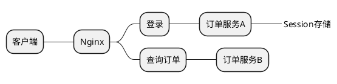
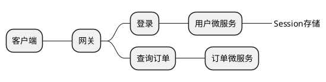

# 4.登录功能架构设计(二)

## 4.6 多端登录设计

现在人们都处在一个多端和多设备的世界中，首先要区分多端和多设备的概念。多端是指一个系统可能开发了PC端、App端、Pad端、微信端、小程序端、车载端等。多设备是指不同的硬件环境，如3个手机、2台计算机、2个Pad。

对于多端应用的开发可以采用混合开发模式和跨平台方案实现，否则就需要安卓、iOS、H5多种工程师共同介入开发。

### 4.6.1 多端应用的开发模式

#### 1.客户端开发模式

客户端需要面临H5、安卓、iOS、小程序、公众号等多种运行环境、多种开发语言，这就需要有不同技术方向和能力的工程师，人员成本和时间成本都比较高。因此，很多企业都采用混合开发模式和跨平台方案实现。

**（1）混合开发模式。**

混合开发是现在应用最广的模式，具有体验好、成本低、速度快的特点。

对于App的一级页面采用安卓和iOS原生开发，提升用户体验；对于App的二、三级页面采用H5开发，提高开发效率，便于后期维护和升级。

H5的开发比重大于原生，由于H5运行在不同的环境中，页面展现形式和功能都会存在一些差异，因此H5无法避免要进行环境信息判断。

安卓端、iOS端都要为H5提供统一的API进行信息封装，获取当前所处的环境信息，如操作系统、版本、机型、品牌等信息，对于用户的登录信息、业务信息也可以通过这种方式来进行传递。H5通过判断所处的环境信息不同，而进行不同的页面展示。

Pad端、微信端也是相同的原理，只是微信端是由腾讯的JSSDK提供API服务而已，本质都是相同的。

**（2）跨平台方案**

跨平台方案的目的是让开发人员只开发一次，打包出来的程序却可以运行在不同的环境中，达到一次开发到处运行的目的，同时带来接近原生的使用体验，类似的产品正在不断发展，下面介绍使用较多的两个框架。

- ① **Flutter框架**：Google的开源项目，可以让开发者使用一套代码高效地搭建多平台应用，支持移动端、Web端、桌面端和嵌入式。Flutter开源、免费，非常适合商业项目和个人项目。

- ② **uni-app框架**：主打一次开发，多端覆盖。使用Vue.js 开发所有前端应用的框架，开发一套代码可发布到iOS、安卓、H5、各种小程序（微信/支付宝/百度/头条/QQ/钉钉/淘宝）、快应用等多个平台。

#### 2.服务端开发模式

服务端开发模式有两种：独立服务端模式和整合服务端模式。

- 独立服务端模式：每种客户端都对应独立的服务端项目，缺点是大量的重复开发，复用性较差，但是能够很好地支持各端个性化需求，隔离性高，不会相互影响。例如，安卓端的服务故障，不会影响iOS端使用。

- 整合服务端模式：所有服务端聚合在一起，同时支持多端应用，优点是复用性强，降低开发量，缺点是各端个性化需求可能相互影响，增加实现的复杂度。

### 4.6.2 多端应用的会话保持

当使用Token模式替代传统Session时，过程如图4-24所示。客户端发起登录请求，服务端验证通过后，生成全局唯一的Token，绑定用户信息，并将Token作为Key存入Redis中。

对于多端应用，在设计时Token的存储需要进行隔离，否则在Redis中无法区分Token属于哪个应用，从而造成一些需求无法实现。

## 4.7 多设备登录设计

多端应用一般是允许同时登录的。例如，QQ的同一个账号可以同时登录PC端、手机端、Pad端。而相同端的不同设备则是不允许同时登录的。例如，同一个微信号在手机A上登录了，在手机B上再登录，则会自动把A设备踢出，这种设计更多的是出于安全性考虑。

设备授信设计主要有两种：一种是非联机授信，另一种是联机授信。

### 1.非联机授信
非联机授信主要依赖在设备上存储的授信文件，而不需要与服务端建立连接。首次授信与非首次授信存在一些区别，但是整体流程相同。

**（1）非联机授信，首次使用新设备流程。**

- ① 用户在某设备登录。

- ② 登录成功后，检查本地是否有特定的授信文件。授信文件以加密方式存储，文件中包含被授权的用户信息、设备信息、授信方式。

- ③ 如果本地没有授信文件，则弹出提示，询问用户是否信任该设备。如果用户信任该设备，并且完成授信认证流程，则会将用户信息、设备信息、授信方式进行加密存储为授信文件。下次再使用该设备时就可以不需要再次询问。

**（2）非联机授信，非首次使用流程。**

- ① 用户在某设备登录。

- ② 登录成功后，检查本地是否有特定的授信文件。

- ③ 如果本地有授信文件，则读取文件并解密，取出文件中的用户信息、设备信息、授权方式信息进行比对。如果比对无误，则可以正常使用。

C/S结构基于本地文件的授信，B/S结构可以将授信记录写入Cookie中。因此，非联机模式的缺点就是授信内容可以被删除，一旦删除就必须进行重新授信。

由于授信文件存储在客户端，所以也存在被破解和篡改的风险。因此，一定要采用较为复杂的加解密方式，如采用证书、动态秘钥等方式。

### 2.联机授信

联机授信需要有服务端的参与：

- 用户完成系统登录。

- 客户端提交设备信息、用户信息，向服务端查询设备授信情况。

- 服务端检查授信记录，发现用户没有信任过该设备，则返回无授信记录。

- 客户端询问用户，是否需要信任并使用该设备及授信方式是什么。

- 用户选择授信方式，完成授信认证流程，并提交客户端。

- 客户端将授信方式、用户信息、设备信息提交给服务端，服务端存储授信记录。

非联机授信的优点是实现简单，缺点是授信文件存储在设备上，存在被破解的风险，所以一定要使用加密和签名的手段，防止文件被篡改或伪造。联机授信的优点是授信记录存储在服务端，具有更高的安全性。

如果询问用户是否信任该设备，用户点击“信任”按钮，则完成授信。联机授信和非联机授信都必须完成授信认证流程。

当用户点击“信任”按钮时，服务端会向用户的注册手机发送短信验证码，只有用户输入正确的验证码，才可以添加信任设备。

这样就保证了如果用户账号和密码丢失，则在其他设备登录时也是不可以使用的。App端应用经常采用短信方式验证，而PC端则可以采用短信或邮件方式验证。

授信方式是用户对设备信任程度的选择，一般有永久授信、单次授信、区间授信和IP授信。

- **永久授信**：是指永远信任该设备，只要授信记录不丢失，无论重复登录多少次都不需要再次授信。

- **单次授信**：是指仅在本次信任该设备，退出后再次使用此设备登录，还需要再次授信。

- **区间授信**：是指用户可以指定一个时间段，如信任该设备1周、1个月。过了这个时间区间，依然需要再次授信。

- **IP授信**：是指信任同一个本地网络的所有设备。这样，用户就可以在同一个信任IP地址下的设备上登录账户。

多设备登录时，需要将客户端设备信息尽量完整地记录下来。因为很多的系统问题都是由兼容性问题引起的，便于排查问题。

## 4.8 集群/分布式架构基于Session的登录设计

Session是进行会话控制、用户追踪的重要手段。在单体架构中使用Session十分简便快捷，是登录权限控制的重要手段。但是，在集群架构、分布式架构中却会面临Session不一致的问题，可以通过Session同步、Session共享的方式来解决这个问题。

### 4.8.1 Session的工作原理

客户端的接口请求大体分为两类，一类需要用户登录后才可以访问，另一类不需要登录即可访问。对于第一类接口请求就需要服务端具有会话保持的能力，而Session就是一种常用的会话保持技术，Session会话保持原理如下：

1. 客户端登录，提交用户名和密码。
2. 服务端保存生成Session，并且将Session存储在内存中。
3. 服务端将session_id返回给客户端。
4. 客户端自动将session_id存储到Cookie中。
5. 客户端的所有后续请求均会携带Cookie。
6. 后端通过Cookie中的session_id获取Session信息，进而校验用户状态是否依然保持，并延长用户状态保持的有效期。

传统的Session方式的优点是实现简单，开发成本低，然而缺点也比较突出，可以总结为以下6点。

（1）基于服务器内存，难以水平扩展和集群化。

（2）高并发、用户使用量大时会导致Session大量占用内存，降低服务器性能。

（3）Cookie可能被禁用或被用户删除。

（4）Cookie安全性不够高，可以被截取和篡改。

（5）Cookie存储空间很小，长度和数量都有限制。

（6）Web浏览器的Cookie可以自动管理，原生端要自己实现Cookie管理。

Session模式比较适用于单体架构开发，用户量小、访问量小的内部系统使用，实现简单。下面将重点针对集群架构/分布式架构下的Session进行讲解。

#### 1. Cookie的概念

Cookie是一段不超过4kB的小型文本数据（不同浏览器有所区别，一般为4095~4097B），保存在浏览器中，经常用于存储用户相关信息、Token、SessionID等。不同浏览器对于每个域能存储的Cookie数量限制也不相同。例如，IE6浏览器每个域能存储30个Cookie，Chrome浏览器每个域能存储53个Cookie，而Safari浏览器则没有数量限制。

#### 2. Cookie的组成和格式

一个Cookie由六部分组成：名称、值、域、失效时间、路径和安全标志。

- **名称（name）**：一个唯一确定的Cookie的名称，不区分大小写。
- **值（value）**：数据字符串，最好加密存储。
- **域（domain）**：Cookie对于哪个域是有效的，如果没有设置，则默认为设置Cookie的那个域。
- **失效时间（expires）**：设定Cookie在什么时间失效，失效后即被删除。expires代表具体失效时间，Max-Age代表在多少秒之后Cookie失效，MaxAge的优先级大于expires。当Max-Age=-1时，代表永不失效。
- **路径（path）**：代表访问哪些域的路径会自动携带Cookie数据发送给服务端，“/”表示没有限制。
- **安全标志（secure）**：设置之后只有在使用SSL连接（HTTPS）时才会自动携带Cookie数据发送给服务端。

#### 3.如果存储的Cookie数量已经达到上限，继续存储会怎样？

Safari浏览器没有Cookie数量限制，因此不存在这个问题。

IE和Opera浏览器使用LRU（Least Recently Use，最近最少使用）算法，当Cookie达到上限后，自动删除最旧、使用最少的Cookie，从而给新Cookie留出空间。

Firefox浏览器保留最后设置的Cookie数据，随机删除Cookie数据，官方并没有明确说明删除算法。

### 4.8.2 集群/分布式架构下的Session设计

在集群架构和分布式架构下使用Session会引发哪些问题，这些问题是如何产生的，怎样才能够解决这些问题呢？

#### 1.在集群负载架构下Session会引发什么问题？

如下图所示，随着订单服务压力的上升，决定将原来的1个节点扩充为2个节点，以集群的方式对外提供服务，使用Nginx做反向代理（Nginx默认使用轮询策略）。

（1）用户登录时访问了订单服务A，登录成功后Session信息保存在A服务器的内存中。

（2）当用户查询自己的订单信息时，通过Nginx的轮询策略，请求转发给了订单服务B，但是B服务器中并没有存储用户的Session信息，所以认为用户还没有登录，直接跳转到登录页面。

#### 2.在分布式架构下是否也具有相同的问题？

在分布式架构下，用户登录时访问了用户微服务，登录成功后Session信息保存在用户微服务的内存中。当用户查询自己的订单信息时，会请求订单微服务，但是此服务的内存中并没有存储用户的Session信息，所以认为用户还没有登录，直接跳转到登录页面。可见，无论是在集群负载构架还是在分布式架构下，都面临着相同的问题。

这就是典型的Session迁移和Session共享问题，如果需要进行会话保持，就要保证每个服务器都能够获取用户的Session信息。

解决方案主要有4种：

- Session同步
- 负载控制
- 共享存储
- 抽象Session服务

**（1）Session同步。**

在集群架构下，用户登录成功后，订单服务A存储Session，并将Session同步给订单服务B和C，因此任意服务器上产生新的Session数据，都要通知给其他全部节点。如果有N个服务器，就要通知给N-1个节点。当服务节点非常多时，用户登录请求一旦增加，就会引发消息风暴，系统性能急剧下降，并且必须考虑Session同步过程中可能发生的各种网络问题。

因此，这种方案只适用于用户数量较少，2~3台的小型集群架构使用，多于3台时出现问题的概率就会急剧上升。

**（2）负载控制。**

集群架构只需要修改Nginx的分发策略，让同一个客户端的请求全部转发到同一个服务器即可，主要使用哈希策略，如IP哈希策略或其他基于用户标识的哈希策略。

IP哈希策略的目的是将相同IP来源的用户请求始终只转发到同一台服务器上。例如，用户首次访问系统时请求转发给了服务A，那么后续所有请求，只要客户端IP不变则全部转发到服务A中。这样就不需要进行Session同步，也可以与客户端保持会话。

但是，这种方案会导致比较严重的流量倾斜问题，可能存在大量的请求发往服务A，而只有少量请求发往服务B，从而导致服务A的性能急剧下降，而服务B却十分空闲。

另外，这种方案只适用于集群架构，而不适用于分布式架构。如果修改了网关的转发策略，让相同IP的请求始终转发给同一个微服务，由于每个服务端节点不具备全部的功能，从而无法达到要求。如图4-34所示，用户第一次查询订单的请求被转发到用户微服务，第二次查询订单的请求也被转发到用户微服务，而用户微服务并不具备查询订单的能力，因此无法提供服务。

**（3）共享存储。**

在集群架构下，用户登录时服务端可以将Session信息不存储到本机内存中，而是存储到关系型数据库（MySQL、Oracle等）或NoSQL数据库（Redis、Memcached等）中。当用户进行业务访问时，各个服务端节点就可以从这些共享存储设备中获取Session信息，从而完成会话保持。

在分布式架构下，用户登录时访问用户微服务，并将Session信息存储到共享设备中，当访问其他微服务时，就可以从共享设备中读取，也可以完成会话保持。

**（4）抽象Session服务。**

可以将Session共享存储设备替换为Session服务，由此服务统一提供Session的创建、保存、查询、对比服务。使用Session服务的好处是可以开发很多附加功能，如Session的可视化管理、Session的监控统计等。同时，支持单体架构、集群架构、微服务架构。

方案选型使用原则：对于小型系统，推荐采用方案（1）和（2）；对于大型系统，推荐采用方案（3）和（4）。
