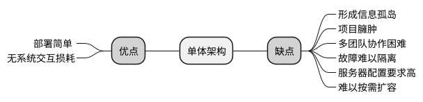
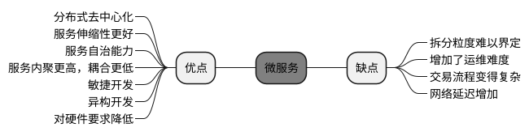
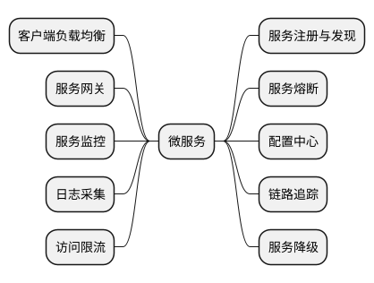
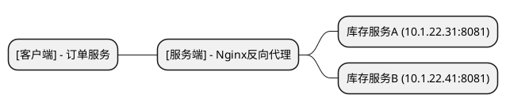

# 3. 分布式微服务架构设计(一)

分布式微服务架构是当下各大企业使用最为广泛的架构方式，如阿里巴巴、腾讯、京东、美团、百度等都在使用。微服务架构能够解决企业中的各种实际问题，提高系统开发效率，达到快速迭代的目的，因此备受青睐。

微服务架构是由单体架构、集群架构、SOA架构、ESB架构一步步地演变而 来的，是软件行业通过多年的经验总结而得出的一种解决方案。随着互联网行 业的蓬勃发展，微服务架构也逐渐走上了它的光辉时刻。 

微服务架构的实现涉及众多的组件，包括注册中心、配置中心、熔断机制、负载均衡、服务网关、服务监控、链路追踪、日志收集等。每种组件都有其重要作用，它们之间相互配合，使得微服务架构系统成为一种具有高度服务自治能力的系统。

本章将详细介绍架构的演变过程和原理，以及每个微服务组件的原理和功能。

## 3.1 单体架构

在软件行业发展初期，一般会将所有前后端程序都放在一个包中，没有太多分层的概念，运行在一个容器中，每个系统更像是一个单机软件。这种方式足够简单，安装部署方便。但是，程序越来越臃肿，牵一发而动全身，有些超大的单体架构系统启动一次甚至需要几十分钟，单体架构其实根本谈不上是一种架构。

MVC思想引入了视图(Model)、模型(View)、控制器(Controller)的 分层理论，随着Struts、Spring MVC等框架的演变，以及前后端分离技术的不 断发展，产生了一种全新的开发模式，使应用层次更加分明，降低了耦合度， 提高了重用性。但随着系统的规模和复杂度不断提升，代码不断加入，单体架构的维护依然十分困难。

### 1. 单体架构的优点

- 部署简单:分布式微服务架构需要部署大量的服务器节点，而单体 架构只需要启动几台服务器做负载集群架构即可。单体架构适合开发传统中小 型信息管理系统、工具类产品，可充分利用其开发速度快、实施简单的优势。

- 无系统交互损耗:由于单体架构不存在服务之间的相互调用，因此 不存在交互损耗，同等条件下具有更快的响应速度。

### 2. 单体架构的缺点

- 形成信息孤岛:单体架构也称为烟囱架构，大多数企业的早期系统 都是独立构建的，由多个厂商或团队负责开发，没有过多的长期规划，它们之 前没有相互联系，数据和服务无法共享，成为一个个信息孤岛，每个系统就像一根烟囱矗立在那里，相互之间没有任何关联。

- 项目臃肿:以Java项目为例，其往往将所有功能打包在一个WAR包 中，在一个JVM(Java虚拟机)进程上运行。随着功能的增加，代码量不断上升，WAR包甚至达到几百兆字节，启动速度缓慢。

- 多团队协作困难:不同的团队负责不同的功能模块，造成项目分支泛滥，代码冲突增加，每次系统发布都蕴含着极大的风险。

- 故障难以隔离:一个项目中包含所有业务模块，这些模块中有不经 常变动的核心功能，也有经常要修改的非核心功能。经常会因为一个小小的改动而导致整个系统故障。

- 服务器配置要求高:由于所有功能都聚合在一起，承载各种各样的 业务请求，随着业务的增长，系统功能也在不断地增多，因此对硬件资源的要求也在不断地提高。

- 难以按需扩容:一个系统内并非所有的模块都被频繁使用，例如， 在电商大促期间，订单服务、商品服务需要大量扩容，而用户信息管理、地址 管理并不需要扩容。而单体架构必须全部功能扩容，而且服务器配置要求较高，整体成本较高。

## 3.2 SOA架构

为了解决单体架构所带来的诸多问题，`SOA`(`Service-Oriented Architecture`，面向服务的架构)应运而生。SOA是一种粗粒度、松耦合的服务架构，可以有效地将各个系统联系起来，从而实现信息互通、数据共享，进 行有效的业务组合和编排，可以对外提供聚合服务，通过服务协作可以完成更 为复杂的业务流程，是一种天然的分布式架构。

SOA是一种极佳的架构模式，然而很多公司却在SOA落地过程中发生了偏差，尤其是ESB(Enterprise Service Bus，企业服务总线)的出现，导致了人们的思维固化，甚至将ESB和SOA架构画上了等号，认为ESB架构就是SOA的最佳实践，笔者对这种观点是持反对态度的。ESB极大地拉低了SOA的定位，阻碍了SOA架构的发展。
 
企业内的各个服务可能是由不同的公司、不同的团队开发的，可能使用了不同的开发语言、不同的部署模式，想要让这些系统可以更好地协作，就必须达到统一的交互标准。让所有系统都采用相同的传输协议，报文格式当然最好，对长远发展也十分有利，但是这样所有系统就都必须进行大量的改造，成本极高。

ESB架构的提出很好地解决了这个问题。ESB作为所有系统的中转中心，提供报文格式转换、协议转换、加解密、安全认证、日志记录、监控、统计、服务发现、服务路由等功能。

对于企业内的大多数系统由不同的供应商开发，均采用烟囱式架构的情况，为了避免所有系统都进行改造，采用ESB架构是一种成本更低、更加行之有效的改造方案。但需要注意的是，ESB架构不等同于SOA架构，ESB最大的问题是让原本去中心化的系统又变为了中心化的系统，一旦ESB出现故障就会导 致整个系统不可用，所以一定要对ESB进行冗余部署，避免出现单节点故障。

有些企业也将ESB系统称为开放平台，统一管理各个系统之间的开放API，起到了服务注册与发现的作用。

## 3.3 微服务架构

微服务架构是SOA架构的延伸，可以粗浅地认为微服务架构是更细粒度的SOA架构。SOA架构中一般将一个业务系统作为一个服务，粒度较粗，关注点在系统集成。而微服务架构的思想是将业务系统进行彻底的组件化和服务化，将一个业务系统拆分为多个相互协作、相互独立的应用，单独开放、单独部署，均可以对外提供服务，关注点在系统分离。

SOA架构经过更细粒度的服务拆分，将用户服务拆分为用户注册服务、用户登录服务，将订单服务拆分为订单创建服务、订单查询服务、订单支付服务，将库存服务拆分为入库服务、出库服务，将商品服务拆分为商品上架服务、商品下架服务，将积分服务拆分为积分计算服务、积分扣减服务。通过多个服务之间的相互协作完成业务流程。

服务拆分之后职责更加单一化、边界更小、耦合度更低、服务复用率更高，并且能够达到快速按需扩容的目的。例如，在电商大促期间，可以预估订单创建服务、商品上/下架服务、积分计算服务将成为热点服务(被频繁访问的服务)，那么就可以有针对性地对这些服务进行扩容，业务低峰期再将资源回收即可。

**微服务架构的优缺点**：

### 1. 微服务架构的优点

- 分布式去中心化:微服务是天然的去中心化分布式架构，具有分布式架构的优点，如易于开发、吞吐量高、易于扩展等。

- 服务伸缩性更好:去中心化可以有效地避免系统瓶颈，同时微服务采用无状态开发，具有良好的水平扩展能力，借助服务注册机制可以随时新增和删除节点，为系统带来更好的伸缩性。

- 服务自治能力:微服务能够通过服务注册与发现、配置中心、熔断、限流、负载、链路追踪等多种手段实现自我治理，根据服务的状态对自身架构动态调整，从而保证系统的可用性。

- 服务内聚更高，耦合更低:由于拆分粒度降低，因此服务更专注于某个领域的职能，边界更加清晰，服务之间相互协作完成复杂的业务，耦合性更低。

- 敏捷开发:服务更易于开发，开发人员更专注于某个具体的功能服务，不会陷入复杂的交易流程中，降低了开发的复杂度，项目迭代周期更短，是天然的敏捷开发架构。

- 异构开发:对于不同的业务场景可能需要使用不同的开发语言，如 Python、Go、Node.js等，也可能使用不同的数据库，如MySQL、Oracle、MongoDB等，根据不同的需求选用不同的技术，各个服务之间使用统一的交互方式即可。

- 对硬件要求降低:从原来的重服务变为了轻服务，负责的职能小而 单一，因此对服务器配置的要求降低，配合弹性伸缩扩容，可以有效地降低硬件投入成本。

### 2. 微服务架构的缺点

- 拆分粒度难以界定:服务到底应该拆到多细、按照什么原则去拆是没有统一的标准和原则的，尤其是对于数据库的拆分则更是难上加难，一旦拆分又会面临复杂的分布式数据问题。

- 增加了运维难度:原来的10个服务可能变为100个微服务，怎样发布、测试、运维就变得十分困难。随着DevOps、Docker容器化、持续集成技术的发展，这个问题已经有了较好的解决方案。

- 交易流程变得复杂:原来的一个业务请求只需要在一个服务内部完成(单体架构)，或者三四个服务协作完成(SOA架构)。而微服务架构可能需要更多的服务相互协作才能完成，由于交易链条变长，因此复杂度也随之升高。

- 网络延迟增加:微服务采用HTTP、RPC远程调用的方式，因此网络延迟增加。

微服务之间的通信方式主要分为**HTTP**和**RPC**，代表性框架分别是阿里巴巴`Dubbo`框架和`Spring Cloud`框架。

在分布式架构中有一个非常重要的概念是服务自治，要求服务必须具有一定的自我管控、自我治理的能力，应该能够自动发现新的服务、自动剔除故障服务、自动进行请求负载、自动熔断、自动降级保护、自动监控服务的健康状态等。一个完整的微服务必须包括以下十项重要设计：

## 3.4 服务注册与发现

服务注册与发现技术可以说是微服务架构核心中的核心，是服务自治的重中之重。为什么需要服务注册与发现呢?它是如何不断地演变来解决问题的呢?下面以互联网电商系统中的用户下单流程为例进行深入分析。

### 1. 服务注册与发现面临的问题

在互联网电商系统中，微服务架构下的用户下单流程如图3-11所示。用户完成一次下单动作需要订单服务、库存服务、支付服务、用户服务、商品服务相互协作完成，它们之间均可能存在相互的调用，而每个服务都有自己的IP地 址和端口，如果将每个服务的IP地址和端口都硬编码或放置在配置表中，一旦目标服务发生变化(修改IP地址或端口)，则其他服务也必须进行代码修改或配置变化，稍有不慎就会造成通信中断。

一旦用户服务的IP地址或端口发生变化 (10.1.22.34:8084变为10.1.22.36:8888)，则与之发生调用关系的库存服务、订单服务、支付服务、商品服务都必须及时修改，否则将会导致大量请求超时，造成系统级联故障。

首先想到的是可以使用Nginx进行反向代理解决IP地址和端口变化问题。将所有的服务地址都配置在Nginx上，各个服务之间的相互访问都通过Nginx进行交互，这种方式存在以下4个缺点。

- 当服务的IP地址或端口发生变化时，必须手动修改和刷新Nginx的配 置。

- 当增加和减少服务节点时，也要修改和刷新Nginx的配置。

- 这种方式会让服务产生中心化，Nginx必须保证高可用，多个节点的配置文件必须保持完全相同，每次节点发生增加、减少、修改就需要维护多个节点的配置文件。

- 所有的服务交互都多了一步Nginx的转发，对性能会有一定的损耗。

### 2. 注册中心的原理

微服务架构是如何使用服务注册与发现技术解决这个问题的呢?服务注册与发现的交互过程包括以下3个步骤。

- 注册中心是一个独立部署的微服务，专门负责服务注册与发现。将新启动的服务节点元数据保存到注册表中，将停止或异常的服务从注册表中剔除。

- 当订单服务、库存服务启动时，会将自己的元数据信息，包括服务名称(order-service、storage-service)、IP地址和端口都发送给注册中心。注册中心接收到请求后，会将服务名称、IP地址和端口都保存到服务注册表中(一般采用内存存储)，也可以持久化到数据库中。

- 当订单服务请求库存服务时，会先从注册中心获取注册表信息，查询到库存服务(storage-service)所对应的IP地址和端口 (10.1.22.31:8081)，然后订单服务会直接使用此IP地址和端口去访问库存服务，从而完成接口交互。

### 3. 微服务与注册中心之间的操作

微服务与注册中心之间存在**Register**(注册)、**Renew**(续约)、**Cancel**(下线)、**Get**(获取)几种交互。

- **Register(注册)**:微服务启动时将自身的元数据信息发送给注册中心进行存储。

- **Renew(续约)**:微服务要定时向注册中心发送续约请求，证明自己还存活，不要从注册表中剔除。

- **Cancel(下线)**:微服务主动要求下线，将自己从注册中心的注册表中剔除。

- **Get(获取)**:微服务从注册中心获取注册表信息。

### 4. 注册中心高可用

注册中心十分重要，它属于微服务的基础设施，存储着所有微服务节点的元数据信息，必须要有较高的可用性，一旦发生宕机将导致所有微服务节点受到影响，无法动态感知整个微服务的变化。注册中心一般采用负载均衡、节点 复制、选举策略保证高可用。

## 3.5 客户端负载均衡

在生产环境中，每个服务节点都必须保证高可用，因此需要对服务节点进行负载均衡处理。传统的负载均衡属于服务端负载均衡，利用负载硬件或软件实现，如Nginx、LVS、HAProxy都是部署在服务端，如下图所示。

在微服务架构下，负载均衡方式发生了明显的变化，库存服务部署了两个节点，分别位于10.1.22.31和10.1.22.41两台服务器上。当服务启动时，它们都会将自己的IP地址和端口信息发送给注册中心，因此注册表中就会存储两条库存服务的注册记录。

当订单服务请求库存服务时，从注册中心获取注册表信息时就会发现两个可用的库存服务(`10.1.22.31:8801`、`10.1.22.41:8801`)，订单服务选择其中一个IP地址和端口进行请求即可，每次请求都根据负载策略决定。

整个负载的过程发生在调用方(客户端)，因此称之为客户端负载均衡。 客户端负载均衡很好地避免了负载设备的引入，服务节点之间依然可以直接通信，极大地提高了微服务的交互性能，这也是其与Nginx等服务端负载技术的核心区别。

客户端负载均衡策略主要有以下8种。

- **轮询策略**: 依次向微服务发送请求，一般为默认策略。
- **最小并发数策略**: 选择一个最小并发请求数的服务。
- **最小连接数策略**: 选择一个连接数最小的服务进行调用。
- **可用性过滤策略**: 过滤那些不可用，或者被标记为已中断的服务。
- **响应时间权重策略**: 根据微服务响应的时长计算权重，将请求更多地发送至权重较大的服务上。
- **重试策略**: 使用重试机制，在选择目标服务失败时，重新尝试选择。
- **随机策略**: 随机选择一个微服务进行调用。
- **可用区域策略可用区域策略**: 判断微服务所在的区(一般一个区是一个数据中心)是否可用，只选择可用区的服务进行调用。

`Spring Cloud`框架中使用`Ribbon组件`实现负载均衡，默认使用`轮询策略`， 具体细节这里不再深入。

## 3.6 熔断机制

为了简单高效地理解什么是熔断机制，下面举两个例子进行形象的说明。

- 例1:在股市中有一个熔断机制，当天股市下跌5%时触发第一次熔断，暂停交易15分钟，让广大股票交易者冷静一下，15分钟之后恢复交易，如果股市继续下跌，达到10%则触发第二次熔断，全天不允许再交易，只能等第二天继续交易。这就是股市的熔断机制，是一种保护措施。

- 例2:家中的保险丝或空气开关，当电压过高或电路发生短路时会自动熔 断或跳闸，以保护家中的电器。

微服务架构中的熔断机制也是一种保护措施，避免服务出现雪崩问题。

微服务雪崩现象指的是：服务A、B依赖服务C，服务C依赖服务D， 服务D依赖服务E，当服务E发生故障之后就会导致服务D的请求不断积压，直至服务D发生故障。服务D发生故障之后又会导致服务C的压力过大，服务C宕机，以此类推，整个微服务都会发生故障，从而引起雪崩问题(形容系统中一个微小的问题，也可能会引发大面积的系统故障)。

当服务D多次调用服务E发生超时，并且超 时次数超过设定的阈值时，如30秒内超时了10次则触发熔断机制，将服务D与服务E之间的链路熔断(开启断路器)，服务D不再真实地向服务E发送请求，而是直接返回一个预先设置好的应答内容E，如“服务繁忙，请稍后再试”，从而保证整个交易链路依然可用，不会因为请求积压引发级联故障。

微服务断路器半开启和关闭状态是指：服务E访问超时，可能是由于宕机、网络不稳定、服务器性能下降等原因造成的，通过人为干预或积压任务消化之后就会恢复，此时服务D、E之间的断路器会进入半开启状态。后续有少量的请求(一般是1~2个真实的请求)到达服务E，如果服务E能够正常应答，则断路器变为关闭状态，这时所有的服务请求均可以正常到达服务E。

这就是通过断路器的开启、半开启、关闭状态的转换，从而使微服务具有了自动保护、自动恢复的能力。

断路器组件主要有`Hystrix`、`Sentinel`等，目前阿里巴巴的Sentinel组件 发展势头较好。Sentinel还具有流量管理、监控、可视化管理等功能，具体细节这里不再深入。
