# 4.登录功能架构设计(一)

现代系统的登录方式多种多样，如密码登录、手机验证码登录、动态令牌登录、语音验证码登录、本机号码一键登录、人脸识别登录、语音识别登录、指纹识别登录、多端登录、多设备登录、单点登录、扫码登录等。

登录功能几乎是每个系统的必备功能，它的作用是对用户身份进行验证，只有通过验证的用户才能够进行系统操作。由于它的多样性和不可缺失性，因此登录设计并不如想象的那么简单。

每种登录方式都有其特点，都需要采用不同的设计方式，并且涉及Session会话、Token令牌、OAuth 2.0、JWT等众多技术。单体架构、集群架构、微服务架构在登录设计上又有不同的方法。

因此，千万不要低估登录设计的难度，下面将系统化地对登录功能架构设计进行讲解。


## 4.1 登录设计的复杂性

登录的核心流程和功能十分简单明了，只不过是对用户身份进行验证，但是在性能、可靠性、安全性等方面却有着特别复杂的要求，要充分地认识到登录设计的复杂性，不要被其简单的表象所迷惑。

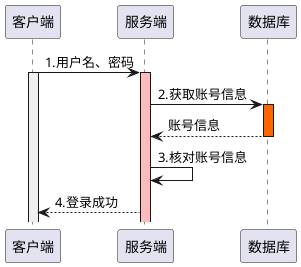

登录流程如上图所示，包含以下4个步骤。

1. 用户在客户端输入用户名和密码，点击“登录”按钮。
2. 服务端从数据库查询账号信息。
3. 服务端核对用户名和密码是否正确。
4. 如果用户名或密码错误，则返回错误提示；如果用户名和密码正确，则跳转进入用户首页。

登录流程看似简单，似乎没有什么需要设计的，那么请思考如下几个问题。

1. 怎样防止密码被暴力破解？
2. 怎样防止机器人模拟登录？
3. 高并发、海量用户场景下的登录如何顺畅？
4. 如果用户数量增长到上千万、上亿，登录还能否正常？
5. 密码怎样传输才能防止被网络抓包？
6. 密码复杂度怎样设计？怎样做过期策略和账号锁定策略？
7. 怎样支持手机、平板、PC等多设备登录？
8. 怎样支持安卓、iOS、小程序、公众号等多端登录？
9. 怎样做人脸识别、指纹识别、语音识别登录？
10. 单体架构、分布式架构、集群模式下登录有什么区别？
11. 手机号、邮箱、账号登录有什么区别？
12. 怎样做手机验证码登录？
13. 怎样做第三方授权登录？
14. 密码怎样存储才能不被开发人员窃取使用？

以上只是列举了部分问题，其实登录不仅不简单，而且极其复杂，由登录所衍生出的需求也非常多。例如，给用户发通知信息、记录用户登录轨迹、分析用户作息时间、分析登录行为等。

除了复杂性，登录功能的重要性也不可以忽视，其重要程度可以排在所有功能的第一位，登录设计为什么会如此重要，主要有以下4个方面的原因。

 - 一旦登录不可用，将会直接带来巨大的经济损失。如果淘宝由于技术故障，导致一天无法登录，那么直接损失将达到几百亿元。如果是“双11”这一天无法登录，那么损失的就是几千亿元。不仅对于互联网电商类系统是这样，对于企业内部系统依然如此，例如，如果资金收付系统、资金管理系统、财务系统无法登录，则可能导致一系列的财务问题。

  所以，某个系统功能出现问题并不可怕，无法登录才是真正的可怕。

- 登录是有权限类操作的大门，必须经过它的验证，才能够取得内部功能的使用权限。例如，如果无法登录支付宝，那么将无法使用它的转账、账单、基金、种树等功能，而大门一旦被人恶意攻破，后果将不堪设想，他人可以冒充你的身份进行转账、发虚假消息、购物等。 

- 登录承压巨大，对于淘宝、京东、微信等这一类2C的互联网产品，每天都达到几亿日活，就算去掉一些用户的免登录设置，其压力也是不可以忽视的。怎样在这种高并发、持续高压的状态下保持登录的可用性、稳定性，并不那么简单。

- 登录是系统的脸面，如果出现无法打开登录页面，无法登录或登录失败，则会给企业形象带来巨大影响。

做系统的架构设计，一定要懂得一个道理，小功能未必不重要，也未必简单。任何简单的功能，当其使用量达到一定使用量级之后，都会变为极其重要的功能。

经过一系列的提问，可以总结出设计登录功能要从多个维度去考虑问题，架构师也需要具备较强的产品设计能力，如下图所示，包括以下6点。

1. 存储方式：数据存储在哪里？存储的结构是什么？
2. 交互方式：怎样交互数据？采用什么样的传输协议？
3. 登录方式：系统的登录方式是什么？不同的登录方式，设计和实现流程不同。
4. 校验方式：怎样定义登录成功、失败还是异常？
5. 安全设计：怎样防止攻击，保证登录可靠性？
6. 衍生需求：登录可以产生哪些附加价值？

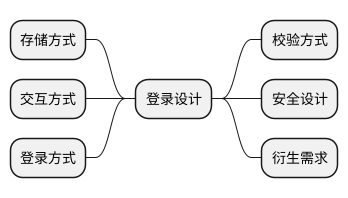

## 4.2 多类型账号密码登录设计

账号密码登录是最常用的登录形式，可以分为以下3种。

1. 用户名/账号/工号+密码登录：面向企业的互联网产品或内部管理系
统的常用设计。
2. 手机号+密码登录：面向个人的互联网产品的常用设计。
3. 邮箱+密码登录：面向企业和个人的PC端产品的常用设计 。密码怎样在传输过程中不被窃取、不被开发人员破解盗用？对于密码传输和存储的安全设计，可参见5.3.5小节。

密码登录具有多样性，为了方便用户的使用，很多系统在登录页面都可以选择录入账号、手机号、邮箱任意一种，系统会自动根据用户填写的信息进行登录判断，下图所示为App用户登录原型。

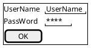

### 方案1：服务端匹配设计。

登录交互方式如下图所示，此种方案下客户端只向服务端提交用户名和密码两个字段。由服务端判断用户名和密码的正确性。

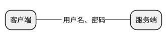

数据库用户表采用横向设计，将账号、手机号、邮箱分别存储在同一个表的不同字段中，如下表所示：

| 字段      | 说明                 |
|-----------|----------------------|
| id        | 主键                 |
| username  | 用户姓名             |
| accountno | 用户账号(唯一索引)   |
| mobile    | 用户手机号(唯一索引) |
| email     | 用户邮箱(唯一索引)   |
| password  | 用户密码             |
|           |                      |

服务端采用or语句进行匹配，SQL语句如下:

```sql
select * from t_user where (accountno=#{username} or mobile=#{mobile} or email=#{email}) and password=#{password}
```

- 优点是无须明确知道用户采用何种方式登录，统一由后端系统匹配。

- 缺点是使用多个or语句会导致SQL的执行性能急剧下降，如果系统中存在大量的用户，则会导致查询极其缓慢；对于一些小型的内部系统可以采用，但是对于用户数量较大，并且存在高并发访问的系统，会导致数据库的承压过重，因此不推荐此种设计。

### 方案2：客户端匹配设计。

登录交互方式如图4-5所示，此种方案下客户端需要向服务端多提交一个登录方式字段。例如， loginType=1（代表账号）或2（代表手机号）或3（代表邮箱）。由客户端根据正则表达式匹配出用户录入的登录信息为账号、邮箱，还是手机号。由于账号具有不确定性，因此前端需要先进行手机号、邮箱格式的匹配，如果两种都无法匹配，则认为用户录入的是账号。

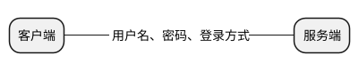

当然，正则匹配的过程也可以在服务端完成，这样登录接口可以少传入一个登录类型字段，但是依然建议采用客户端匹配的方式，可以减轻服务端的处理压力。

这样，服务端就可以根据不同的登录方式，执行不同的SQL语句。

```sql
select * from t_user where accountno=#{username} and password=#{password}
select * from t_user where mobile=#{mobile} and password=#{password}
select * from t_user where email=#{email} and password=#{password}
```

看似很小的改动，却可以带来性能成倍的增长，数据量越大，提升的效果越明显。对于任何涉及系统性能的设计，都要扩展到时间维度、数据量维度去思考。可能现在的系统只有几百个用户，但是随着时间和业务的增长，是否会出现几万、几十万、几百万个用户呢？

注意事项：对于以上两种设计方案，在账号、手机号、邮箱字段上一定要增加独立索引或复合索引来提高查询效率。

架构技巧：做设计时最忌讳的就是封闭思考，没有任何一个需求是孤立存在的，它一定和某些事物相关联。登录功能当然也符合这个原则，采用以上哪种登录方式往往与用户注册、找回密码、设置密码、绑定手机、绑定邮箱这5个功能关联。如果不进行统筹考虑，就可能造成功能缺失和设计缺陷。

## 4.3 三类验证码登录设计

常用的验证码登录方式有3种，分别是手机验证码登录、动态令牌登录和语音验证码登录。虽然邮箱也可以用于发送验证码，但是由于其在国内的普及度，以及需要登录邮箱之后再获取验证码，便捷性较低，所以使用较少。

不同的验证码登录使用的都是不同的实现技术，手机验证码登录涉及短信发送技术，动态令牌登录涉及动态密钥的计算技术，语音验证码登录涉及TTS（Text To Speech，从文本到语音）技术。

### 4.3.1 手机验证码登录注册设计

手机验证码登录注册方式是目前使用比较广泛的登录方式，界面原型如图4-6所示，其优势主要有两个：

（1）免去了用户的记忆成本，现在每个人都有各种系统账号和密码，很难记忆，如果设置为一样的，则又有很大的安全隐患；

（2）登录的同时完成快速注册，用户无须再填写密码、确认密码等其他信息。


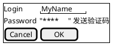

#### 手机验证码登录注册设计

手机验证码登录注册流程如下图所示，包含以下8个步骤：

1. 用户在客户端输入手机号，点击“获取验证码”按钮。
2. 客户端向服务端发送请求，获取短信验证码。 
3. 服务端向用户手机发送短信验证码。
4. 服务端生成Token并返回给客户端，目的是将验证码、手机号、Token绑定，增加安全校验，这一步也是被大多数设计者经常忽略的一步。
5. 用户将接收到的手机验证码录入页面中，点击“登录”按钮。
6. 客户端携带用户输入的短信验证码，以及Token请求服务端。
7. 服务端校验用户提交的验证码与Token所对应的验证码是否匹配并且有效。如果数据校验通过，则检查此手机号是否已经注册。如果没有注册，则直接生成默认的账户信息，待用户后续完善，同时记录用户登录的Session。
8. 服务端返回登录成功，客户端跳转页面，完成登录。

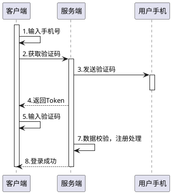

- **拓展思考1**：第1~2步，发送短信验证码的服务是开放式服务（无须登录即可调用），因此存在被攻击的风险，怎样防止攻击，可参见7.2节。

- **拓展思考2**：第3步，服务端发送短信验证码不可以使用MQ或异步发送方式，登录注册验证码短信的特点是实时性要求很高，用户点击“获取验证码”按钮必须在60秒内收到，否则用户就会重新发送，或者失去耐心。因此，对于验证码类短信要采用同步发送机制，并且需要将短信是否已发送的状态反馈给用户。

- **拓展思考3**：第4~7步，如果没有Token机制，那么会有什么风险？例如，在用户的手机上植入木马盗取短信信息，一旦获取到用户的验证码就可以直接在其他设备使用，而与具体的执行环境无关。Token机制要求短信验证码和Token必须一一对应，并且Token存储在获取手机验证码的设备上，这样即使用户的短信验证码泄露了，但是其他手机上并没有本验证码对应的Token，因此依然无法完成登录。

### 4.3.2 动态令牌登录设计

如果你开通银行的个人网银业务，就会得到一个动态令牌的设备，上面的密码每隔1分钟刷新一次，因此也叫作动态口令。在网上银行办理业务时需要录入上面的密码，通过校验才可以登录成功，或者在支付环节也需要输入。

动态令牌登录的核心思想是提供一个软件或设备，根据一定的算法，每隔60秒生成一组动态验证码，一般为6~8位数字，在用户登录时必须输入此动态验证码。

QQ安全中心、腾讯手机管家、网银动态口令、U盾都属于这种设计。动态验证码的好处是一次一密，无须记忆密码，无须发送短信，无须联网，没有任何其他成本，配合用户名和密码做二次校验，可以具有更高的安全性。

思考：银行下发的网银动态口令设备，不与任何服务器联网，而动态令牌每分钟刷新一次密码，服务器是如何验证它是否正确的呢？

动态令牌有一个唯一标识码，在银行办理网银业务时，会与客户的银行账户绑定。这样就完成了动态令牌、银行账户、银行系统三者之间的绑定。动态令牌与银行系统之间是通过银行账户而联系在一起的。


虽然存在绑定，但是设备并没有联网，服务器又是如何校验动态口令的正确性的呢？这就要了解`TOTP`（ Time-Based One-Time Password Algorithm，基于时间的一次性密码算法）技术。

动态令牌设备本身是有电源和芯片的，其中包含时钟设备，虽然与银行服务器无法保持百分之百的同步，但是差别不会很大。如图4-11所示，动态口令设备在制作时就写入了固定的密钥，每个用户的密钥均不相同，借助特定的哈希算法就可以计算出动态口令。因此，动态口令的计算公式可以简写为`Hash(设备时间+用户密钥)=动态口令`。

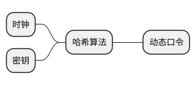

使用动态口令的登录流程如下图所示。

1. 用户在个人网银页面录入用户名、密码，点击“登录”按钮。
2. 银行服务器校验用户名和密码是否匹配。
3. 如果用户名和密码匹配，则返回验证通过，并要求用户录入动态口令。
4. 用户从动态口令设备上查看动态口令，并录入系统中提交。
5. 客户端将动态口令提交给银行服务器。
6. 这一步最为重要。服务器根据当前的用户信息，找到用户所绑定的设备唯一编码，取出设备密钥，并根据当前服务器的时间，通过哈希算法计算出动态口令，即Hash(服务器时间+用户密钥)=动态口令。使用服务器计算出的动态口令，与用户提交的动态口令进行比对，如果匹配，则流程继续。
7. 给客户端返回登录成功。

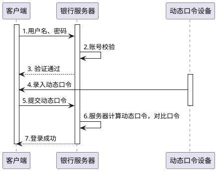

#### 注意

无论是电子口令设备还是服务器，都要保证在同一个时间窗口内计算的口令是相同的，这个时间窗口就是刷新时间，如1分钟。那么，在这1分钟之内，电子口令设备和服务器计算出的密钥都应该是相同的，这样两者才能够相互匹配。

因此，时间窗口越长，越便于用户录入，时间窗口越短则越安全，一般时间窗口设置为30秒或1分钟。

### 4.3.3 语音验证码登录注册设计

语音验证码登录是手机验证码的变种，为了解决验证码各种收不到而导致的用户体验问题，可以使用语音验证码作为补充手段。当短信验证码收不到时，用户可以选择使用语音验证码。

当用户录入完手机号，点击“语音验证码”按钮时，将会提示用户注意收听来自×××的电话，从而获取验证码。

语音验证码采用机器人主动拨打的方式，一般话术为“您本次业务办理的验证码为××××”，反复播放三次。

**思考：语音验证码是如何发送出去的呢？如何主动给用户拨打电话？**

下面通过阿里云的语音验证码服务来进行讲解。如下图所示，云通信是阿里云的语音通信产品。接入方将语音模板发送给云通信系统，云通信系统请求运营商完成语音呼叫，当用户接通电话时，通过TTS技术将文字内容转化为语音播放给用户。

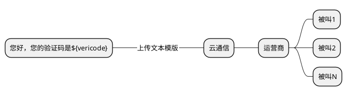

TTS是人机对话的一部分，也就是文字转语音技术。

语音模板“尊敬的阿里云用户您好，您的验证码是`${vericode}`。”，其中`${vericode}`为变量部分，由接入方系统生成并传入。

**思考：用户接听到语音验证码，然后将验证码录入App中，那么服务端是如何验证验证码的正确性呢？**

语音验证码登录注册的整个过程可以分为3个阶段：

- **语音验证码播报阶段**

  用户录入手机号，点击“语音验证码”按钮，App携带手机号请求服务端，服务端生成数字验证码，并将验证码和语音模板ID一同发送给语音服务商（模板一般是在第三方语音服务商平台上先行申请定义）。语音服务商将验证码与模板内容进行拼装，形成最终的话术。然后通过运营商给用户拨打电话，用户接通电话后，播放TTS语音。

- **验证码验证阶段**

  用户将收听到的语音验证码录入App中，提交给服务端，服务端与事先存储好的验证码进行比对，验证其有效性。如果有效，则完成登录/注册流程。

- **回执阶段**

  回执分为两种，一种是异步回执，另一种是同步回执。回执的目的是将语音播报的结果通知给服务端。回执信息包含用户电话号码、播报ID、播报状态（成功、失败）等。如果时效性要求较高，则应该使用同步回执，播报完毕后，语音服务商会主动回调服务端接口完成通知。
  
  异步回执主要是通过批处理定时回调通知，或者MQ通知的方式完成，主要目的是进行数据同步和订单对账。

## 4.4 本机号码一键登录注册设计

使用手机号加验证码的方式存在以下3个缺点。

- 注册登录流程长，在验证码录入正确的情况下需要10~30秒，一旦录入错误就需要更长的时间。

- 可能由于用户黑名单、软件拦截、运营商黑名单、短信系统故障等导致用户无法收到短信验证码，从而造成用户在注册阶段流失。

- 需要花费短信通道费用，并且短信验证码的发送存在被攻击的风险。

为了规避以上问题，可以使用一键登录注册的设计方式。

### 聚合服务解决方案

三大运营商都有自己的号码认证服务和SDK，不仅开发方式存在一定差异，而且单独一家无法完整支持三家的号码认证，造成开发复杂化，对接成本提升。因此，就出现了第三方聚合服务。

第三方聚合服务整合了三大运营商的认证能力，如下图所示，开发者可以使用一个SDK来支持不同运营商的号码认证，从而统一了开发方式，降低了开发难度。目前，阿里云、网易易盾均提供了号码认证服务及MobTech的秒验等。

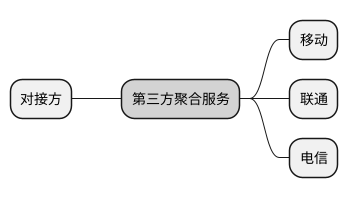

认证服务的计费方式为完成一次认证计费一次，与短信相同，价格也相差无几。但是，短信验证码存在发送多次的情况，所以理论上来讲，号码认证服务能够节约更多成本。

## 4.5 人脸/语音/指纹识别登录设计

随着人工智能、生物识别技术的进步，现在人脸识别、语音识别、指纹识别的使用场景越来越多，它们是如何运作的呢？所有的对比类事件都必须包含两个过程：数据采集和数据比对。仔细回想一下，无论是账号密码登录、手机号密码登录、邮箱密码登录、验证码登录，都需要先进行注册，注册的目的是采集和记录信息，先将账号信息和密码信息进行保存，当再次登录时进行数据比对，从而确定数据的合法性。所以，无论人脸识别、语音识别、指纹识别技术如何变化，都必须遵从这个原则。

人脸识别总体上也分为数据采集和数据比对两个阶段。例如，购买了一部具有人脸识别功能的手机，初次使用时需要先将自己的人脸数据采集到手机中进行存储，下次再使用时才可以进行人脸识别比对，如下图所示。


人脸识别登录分为人脸检测、人脸对齐、人脸编码和人脸匹配4个步骤。

- **人脸检测**：目的是确定影像中人脸的位置，标记人脸坐标，将影像从整个画面中剥离出来。

- **人脸对齐**：人脸识别时角度是不确定的，需要将不同角度的人脸图像进行对齐，形成一个标准。通俗来讲，就是通过各个角度的人脸模型，将眼睛、鼻子、嘴巴、耳朵、轮廓识别出来并标记清楚。

- **人脸编码**：将影像转化为特征向量，也叫作模板。最理想的情况下，同一个人的所有人脸都应该映射到相似的模板上。通俗来讲，就是将人脸影像转化为一串特征码，这串特征码就是人脸密码。

- **人脸匹配**：人脸匹配就是数据比对的过程，当用户进行人脸识别时，会先经过数据采集的3个过程得到人脸特征码，再和手机或服务器保存的特征码做比对，比对成功则进行登录。

人脸识别、语音识别、指纹识别的流程基本相同，从用户的人脸影像、语音文件、指纹图像中使用各种算法提取多个特征码进行存储。当用户登录时再次提取特征码，与已经保存的特征码进行比对。

语音识别在登录、校验等场景中应用的较少，主要是因为安全性较差。人脸识别可以进行活体检测，指纹识别可以进行真皮检测，从而确定是真实的人类，而语音识别无法确定。

### 注意

各大厂商的手机不同程度地支持人脸识别、指纹识别。因此，在开发App时可以直接使用。但是，要看厂商的开放程度，一般只会开放指纹和人脸比对功能，而不开放指纹和人脸的源数据。手机厂商不会将人脸数据、指纹数据直接暴露给开发者，而是提供校验API，当开发者调用时，只返回识别成功、识别失败或匹配率。

人脸识别、语音识别、指纹识别涉及人工智能、机器学习、神经网络等学科，这里不再进行深入探讨。
