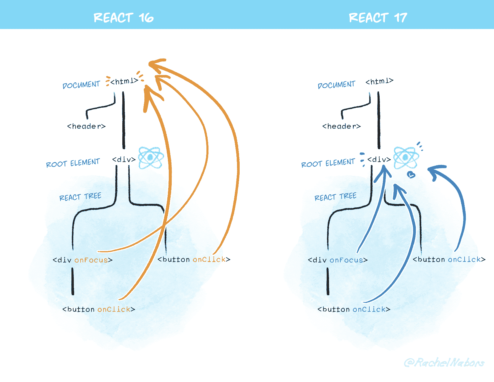

# 20. React 的未来：什么是服务器端组件？

React 自诞生到现在，已经有七八年的时间了，不知道你是不是和我有一样的疑惑。React 好像这么多年来就发布了一个 React Hooks，除此之外就没有什么其他新功能了。那么，React 团队到底在做哪些事情呢？其实我们只要仔细想一想，这个疑惑也挺容易解开。

一方面，React 的 API 足够稳定，这就让我们开发人员不太能感知到一些内部的优化。比如在 2017 年，React 就基于 Fiber 的架构重写了整个 React，优化了渲染的机制，为之后的 Suspense 等特性提供了基础。

另一方面，React 团队其实一直在探索一些新的前端开发方式，只是不到足够成熟就不会正式发布。比如 Suspense，作为一个试验特性，它已经推出有三年多了，但官方一直没有宣布正式可用。而最近提出的一个新的服务器端组件的概念，虽然让人眼前一亮，但同样也还处于探索和开发阶段。

不过，了解 React 17.0 版本，还是十分有必要的，能让我们对 React 的未来会有哪些新特性，做到心中有数。

所以今天这节课，我们就来看下 React 17.0 这个没有新特性的版本带来了什么新变化。然后再通过例子，去学习 Suspense 和服务器端组件，看看它们究竟是什么，试图去解决哪些问题。

## React 17.0：没有新特性的新版本

React 17.0 是一个非常特殊的版本，虽然大版本从 16 升到了 17，但是从开发的角度来看，却没有新特性。用 Facebook 官方的话来说，大版本升级主要是为以后的新功能作铺垫，核心的改变就在于提供了 React 逐步升级的可能性，同时，还提供了新的 JSX 编译的机制。

接下来我们就来看看这些新的变化。

### 渐进升级

框架的升级一直是软件开发的一大痛点。从业务角度来看，技术上的升级不仅会耗费巨大的工作量，而且对业务功能也没有什么帮助，甚至还会带来 Bug。而从技术角度来看，越晚升级，欠下的技术债务则越多。所以 React 17 这次带来的渐进升级，就提供了一种新的方案。

所谓渐进升级的支持，就是一个应用可以同时有多个 React 的版本。这样的话，升级 React 的过程可以更为平滑，不用一次性升级整个应用，而是某些新功能可以用新版本的 React，而旧的功能呢，则可以继续使用老版本。

### 新的事件模型

在第 11 讲，我们曾经看到，React 中所有的事件都是合成事件，实现的机制是在根节点上监听所有事件，然后 React 统一处理后，再将事件发送到虚拟 DOM 节点。

在 React 17 中，为了支持多版本 React 的共存，React 的事件模型做了一个修改。让我们不需要再通过 Document 去监听事件，而是在 React 组件树的根节点上去监听。这样的话，多个版本的 React 就不会有事件的冲突了。

下面这张来自官网的图，就描述了这个变化。



从技术上来说，过去是 document.addEventListener() 来监听事件，而现在则是 rootNode.addEventListener()。这一改变，不仅解决了多版本 React 的问题，而且还让 React 在和其它一些技术栈（比如 JQuery）一起使用时，降低事件冲突的可能性。

### 新的 JSX 编译机制

在过去，如果我们要在 React 组件中使用 JSX，那么就需要使用 import 语句引入 React。这么做的原因就在于，在编译时 JSX 会被翻译成 React.createElement 这样的 API，所以就需要引入 React。

比如下面的源代码：

``` jsx
import React from 'react';  
function App() {  
  return <h1>Hello World</h1>;  
}
```

在过去，会被翻译成如下所示的结果：

``` jsx
import React from 'react';  
function App() {  
  return React.createElement('h1', null, 'Hello world');  
}
```

而现在，JSX 采用了新的编译机制，因此我们的代码不需要再引入 React 了。比如：

``` jsx
function App() {  
  return <h1>Hello World</h1>;  
}
```

编译后的结果则是：

``` jsx
// 由编译器自动引入  
import {jsx as _jsx} from 'react/jsx-runtime';  
function App() {  
  return _jsx('h1', { children: 'Hello world' });  
}
```

虽然编译后的结果非常类似，但是 _jsx 这个函数的引入是由编译器自动完成的。所以从开发角度看，带来的最明显的好处就是**代码更直观了。**因为在这里 JSX 被看作一种真正的语法，因而在组件中就需要再引入 React 了。

## Suspense: 悬停渲染

Suspense，顾名思义，就是**挂起当前组件的渲染，直到异步操作完成**。虽然这是一个“旧特性”，毕竟早在 2018 年 10 月发布的 React 16.6 版本中就已经引入了，但是因为一直处于试验状态，**没有正式宣布可用**，所以很多同学其实一直都不太理解它究竟是做什么的。那接下来我就做一个简单的介绍。

我们都知道，**React 组件都是状态驱动的**，当状态发生变化时，整个组件树就会进行一次整体的刷新。这个过程是完全同步的。

也就是说，React 会将所有的 DOM 变化一次性渲染到浏览器中。这**在应用非常复杂的场景下，会成为一个潜在的性能瓶颈**。所以 React 就提出了 Suspense 这样一个概念，它允许组件暂时挂起刷新操作，让整个渲染过程可以被切分成一个个独立的部分，从而为优化性能提供了空间。

其实这是 React Fiber 带来的一个非常底层的技术基础，不过的确能带来很多用处，不仅仅是在性能方面。

就像现在我们看到的文档，其实大多是用来解决异步请求获取数据的问题。要知道，在过去，异步请求都是在副作用中完成，然后副作用去修改状态，再由状态驱动组件的刷新。

而现在有了 Suspense，异步的请求就不再需要由组件去触发。组件不仅可以作为状态的展现层，同时也能变成异步请求的展现层。

下面这张图显示了这样一个转换的过程：


所以，从解决什么问题的角度出发，我们可以看到，React 希望把异步处理逻辑独立出来，让它成为一个单独的业务逻辑，既不依赖于组件，也不依赖于 State。随后，组件在渲染的时候，通过判断异步过程的不同阶段，从而进行不同的渲染。

需要特别说明的是，这个异步逻辑，不仅仅局限于异步请求，还有可能是**按需加载的模块**等等。

那 Suspense 到底该怎么使用呢？下面我们以异步数据请求为例来讲解一下。

首先，我们要**按照 Suspense 的规范提供一个异步请求的实现**。比如：

``` jsx
function fetchData() {  
  let status = "pending";  
  let result;  
  // 发起请求获取数据，返回 suspender 这个 promise  
  let suspender = apiClicent.fetch('/topic/1').then(  
    (r) => {  
      status = "success";  
      result = r;  
    },  
    (e) => {  
      status = "error";  
      result = e;  
    }  
  );  
  // 无论何时调用 fetchTopic，都直接返回一个结果  
  return {  
    readTopic() {  
      if (status === "pending") {  
        // 如果还在请求中直接抛出一个 promise  
        throw suspender;  
      } else if (status === "error") {  
        // 如果请求出错，抛出 error  
        throw result;  
      } else if (status === "success") {  
        // 如果请求成功，返回数据  
        return result;  
      }  
    }  
  }  
}
```

就这样，我们实现了 fetchData 这样一个可供 Suspense 使用的 API。接着，我们来看看该如何在 Suspense 中使用这个 API。

``` jsx
import React, { Suspense } from "react";  
import fetchTopic from './fetchTopic';  
  
const data = fetchData();  
  
function TopicDetail() {  
  // 调用了 data.readTopic() 来获取数据  
  const topic = data.readTopic();  
  // 直接同步的返回了 JSX  
  return (  
    <div>  
      <h1>{topic.title}</h1>  
      <p>{topic.content}</p>  
    </div>  
  )  
}  
  
function TopicPage() {  
  return (  
    <Suspense  
      fallback={<h1>Loading...</h1>}  
    >  
      <TopicDetail />  
    </Suspense>  
  );
```

我们先来看 TopicDetail 这个组件的实现。这里有一点非常关键，那就是我们可以直接用同步的写法去获取异步请求的数据。

对于这种组件，在使用的时候，需要放在某个 Suspense 标记下面。通过给 Suspense 提供一个 fallback 的属性，用于渲染加载状态的界面。

结合 fetchData 这个 API 的实现，我们可以看到，请求在组件渲染之前就已经发生了，而不再是由组件的渲染触发的。这正是 Suspense 想要带来的效果，隔离了副作用和 UI 渲染的过程，让你能够用同步的写法去实现异步逻辑。

总体来说，Suspense 提供了一种实现异步逻辑管理的新的机制，可以替代很多框架提供的不同的副作用处理逻辑，比如 Redux、Saga 等。

遗憾的是，Suspense 目前并没有得以普及。一方面，是因为它还处于试验探索阶段，并没有正式发布。另一方面，它也需要一些第三方框架的支持，从而提供能兼容 Suspense 的异步 API，方便 Suspense 的使用。

目前来说，只有 React 的 GraphQL 的 Relay 客户端实现了完整的 Suspense 支持。所以，除非你把 Relay 作为客户端，那么我们暂时只要对 Suspense 作个了解即可，而不要将其用在正式项目中。等未来稳定后，可以再把它用在正式项目中。

## Server Components：服务器端 React 组件

自从 Hooks 之后，React 在 2020 年 12 月提出的 Server Components 这个提案，大概 React 是最为有趣的一个新特性了。虽然目前来说，Server Components 还处于探索和开发实现的阶段，但我们可以通过官方的介绍视频和一个示例项目去了解它的功能和使用方式，从而有一个直观了解。

Server Components 最明显的功能，就是能够在组件级别实现服务器端的渲染。也就是说，一个前端页面中，有些组件是客户端渲染的，而有的组件则可以是服务器端渲染的。为了帮助你加深理解，我们直接来看一段示意的代码。

比如说有这么三个组件，分别是 App.server.js、Article.server.js、Comments.client.js。我们可以通过后缀来区分哪个是 server 端的组件，哪个是 client 端的组件。那么 App.server.js 的示意代码如下所示：

``` jsx
import { Suspense } from 'react';  
import Article from 'Article.server.js';  
import Comments from 'Comments.client.js'; 

function App() {  
  // 从 URL 获取 articleId  
  const articleId = useSearchParams('articleId')  
  return (  
    <div>  
      <Suspense fallback={<>Loading...</>}>  
        <Article id={}  
      </Suspense>  
      <Comments articleId={articleId} />  
    </div>  
  );  
}
```

在这段代码里，我们使用的 App 和 Article 这两个组件是服务器端组件。在第一次渲染时，由服务器端返回到前端。而在随后的渲染中，比如 articleId 发生了变化，那么 Article 这个组件会通过服务器端去重新渲染。然后渲染的结果，再发送到浏览器端来展示。因为 Article 是一个需要异步渲染的组件，所以也会包含在上面提到的 Suspense 标记中。

那么 Server 端组件能够带来什么好处呢？其实通过 Article 这个组件，我们可以很直接的看到这样两个好处。

第一，Article 组件在服务器端运行，所以在代码中可以直接去读取文件系统、查询数据库等，数据逻辑会非常简单。

比如说，Article 的组件代码可能如下所示，其中就直接查询了数据库：

``` jsx
export default function Article({ articleId}) {  
  // 服务器端组件可以直接查询数据库  
  const article = db.query(  
    `select * from articles where id=${articleId}`  
  ).rows[0];  
    
  return (  
    <div>  
      <h1>{article.title}</h1>  
      <p>{article.content}</p>  
    </div>  
  );  
}
```

第二，Article 所需要的任何依赖只需要存在于服务器端。比如说，它依赖了 moment 这个 library 去做日期的格式化，那么 moment 就不需要打包到前端，只需要在服务器端存在就可以了，我们也就不再需要担心包的大小了。

所以，通过这两点其实可以看到，Server Components 为我们开发具有极致性能的前端应用，提供了一个良好的基础。一方面，它能够让我们通过用服务器端渲染更多的组件，把前端包的大小控制得很小，从而提升加载性能。

另一方面，**它能让页面中的一部分能够在服务器端渲染。**不但能够简化前端异步请求的逻辑，而且在组件内需要多个数据请求时，也会提升渲染速度。

不过看到这里，你可能又会问了，这个和以前的服务器端渲染（SSR）有什么区别呢？其实我们可以把 Server Components 看作 SSR 的进阶版本。传统的 SSR，每次只能 render 整个页面，而现在则可以在组件级别 render 了，大大提升了灵活性。

因而我们应该说，Server Components 是一个非常令人期待的特性，尤其是**对于电商页面这种对性能有极致需求的服务器端渲染的应用**，会带来极大的帮助。那么等到 Server Components 正式发布之后，社区中还会有哪些令人兴奋的框架级别支持呢？就让我们拭目以待吧。
